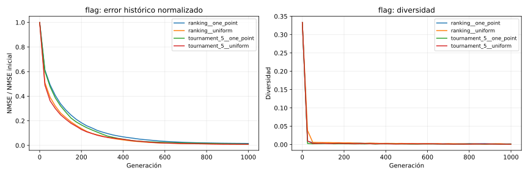
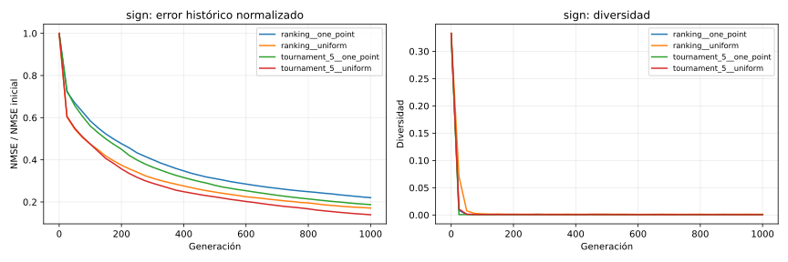
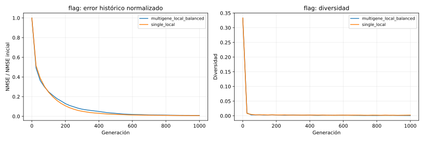
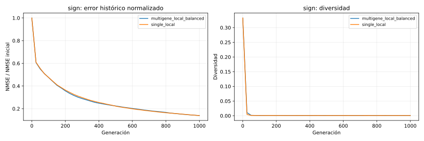
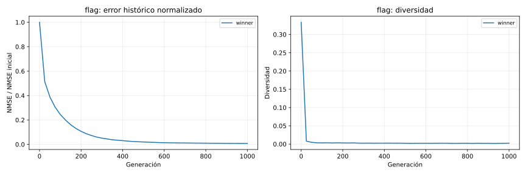
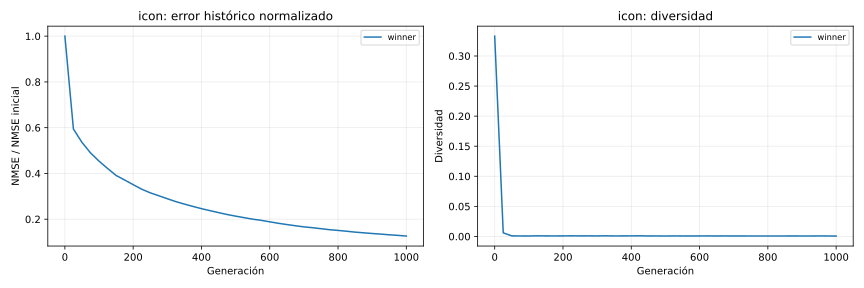
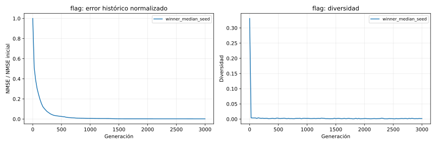
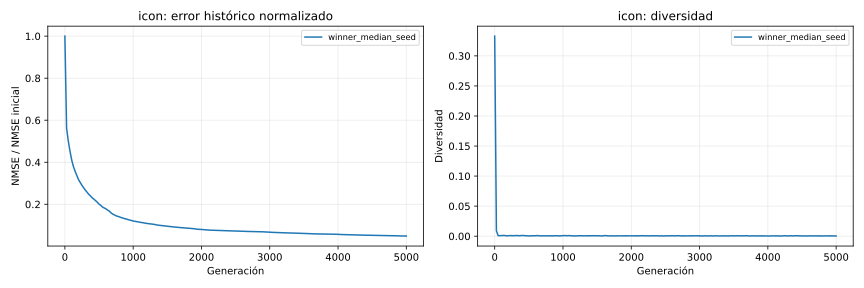
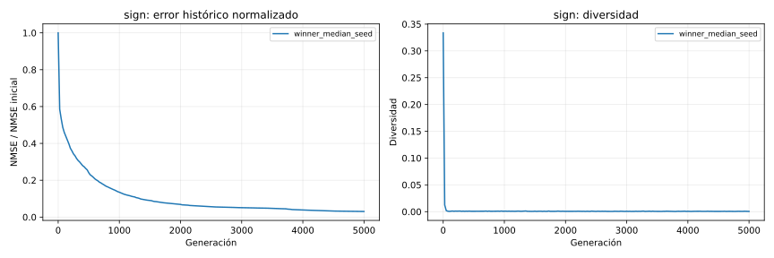

# TP2 — Informe comparativo de operadores

## Estado

Fases con resultados completos: **selection, crossover, mutation, validation, showcase**. Las secciones pendientes se mantienen visibles para que el informe no presente conclusiones antes de tener las cinco semillas por condición.

## Protocolo controlado

Todas las condiciones usan las semillas `101, 202, 303, 404, 505`. Se compara dentro del mismo objetivo y presupuesto; los NMSE absolutos de objetivos distintos no se comparan entre sí. Las curvas usan el mejor histórico.

## Selección de padres

**Resultado:** `ranking` obtuvo el menor NMSE mediano (0.001090). La interpretación debe contrastarlo con AUC y diversidad: presión alta no implica necesariamente mejor calidad final.

| Objetivo | Condición | NMSE mediano | IQR NMSE | AUC normalizada | Diversidad final | Éxitos 90 % |
| --- | --- | ---: | ---: | ---: | ---: | ---: |
| flag | boltzmann | 0.001341 | 0.000261 | 0.070685 | 0.014007 | 5/5 |
| flag | elite | 0.001355 | 0.000774 | 0.068959 | 0.010127 | 5/5 |
| flag | probabilistic_0_6 | 0.001413 | 0.000185 | 0.073340 | 0.014024 | 5/5 |
| flag | ranking | 0.001090 | 0.000239 | 0.066863 | 0.010352 | 5/5 |
| flag | roulette | 0.001479 | 0.000631 | 0.072759 | 0.014526 | 5/5 |
| flag | tournament_2 | 0.001392 | 0.000884 | 0.063159 | 0.009636 | 5/5 |
| flag | tournament_5 | 0.001606 | 0.000324 | 0.059987 | 0.006227 | 5/5 |
| flag | universal | 0.001690 | 0.000649 | 0.069442 | 0.010094 | 5/5 |

### Imágenes representativas

- `flag` — `boltzmann`, semilla mediana `505`: 
- `flag` — `elite`, semilla mediana `101`: 
- `flag` — `probabilistic_0_6`, semilla mediana `404`: 
- `flag` — `ranking`, semilla mediana `505`: 
- `flag` — `roulette`, semilla mediana `202`: 
- `flag` — `tournament_2`, semilla mediana `101`: 
- `flag` — `tournament_5`, semilla mediana `505`: 
- `flag` — `universal`, semilla mediana `404`: 

## Cruza

**Resultado:** la mejor condición de esta etapa fue `ranking__uniform` (NMSE mediano 0.001090).

| Objetivo | Condición | NMSE mediano | IQR NMSE | AUC normalizada | Diversidad final | Éxitos 90 % |
| --- | --- | ---: | ---: | ---: | ---: | ---: |
| flag | boltzmann__one_point | 0.002412 | 0.000941 | 0.102106 | 0.009707 | 5/5 |
| flag | boltzmann__uniform | 0.001341 | 0.000261 | 0.070685 | 0.014007 | 5/5 |
| flag | ranking__one_point | 0.002040 | 0.000460 | 0.099552 | 0.007605 | 5/5 |
| flag | ranking__uniform | 0.001090 | 0.000239 | 0.066863 | 0.010352 | 5/5 |
| sign | boltzmann__one_point | 0.016240 | 0.002329 | 0.256939 | 0.013538 | 0/5 |
| sign | boltzmann__uniform | 0.012471 | 0.002643 | 0.195697 | 0.016487 | 5/5 |
| sign | ranking__one_point | 0.017242 | 0.002511 | 0.246798 | 0.008892 | 0/5 |
| sign | ranking__uniform | 0.009050 | 0.003698 | 0.178639 | 0.010844 | 4/5 |

### Imágenes representativas

- `flag` — `boltzmann__one_point`, semilla mediana `303`: 
- `flag` — `boltzmann__uniform`, semilla mediana `505`: 
- `flag` — `ranking__one_point`, semilla mediana `303`: 
- `flag` — `ranking__uniform`, semilla mediana `505`: 
- `sign` — `boltzmann__one_point`, semilla mediana `505`: 
- `sign` — `boltzmann__uniform`, semilla mediana `505`: 
- `sign` — `ranking__one_point`, semilla mediana `404`: 
- `sign` — `ranking__uniform`, semilla mediana `101`: 

## Mutación y supervivencia

**Resultado:** la mejor condición de esta etapa fue `multigene_local__additive` (NMSE mediano 0.001090).

| Objetivo | Condición | NMSE mediano | IQR NMSE | AUC normalizada | Diversidad final | Éxitos 90 % |
| --- | --- | ---: | ---: | ---: | ---: | ---: |
| flag | multigene_local__additive | 0.001090 | 0.000239 | 0.066863 | 0.010352 | 5/5 |
| flag | single_global__additive | 0.002695 | 0.000983 | 0.111069 | 0.001779 | 5/5 |
| flag | single_global__exclusive | 0.004791 | 0.001421 | 0.145832 | 0.004136 | 5/5 |
| sign | multigene_local__additive | 0.009050 | 0.003698 | 0.178639 | 0.010844 | 4/5 |
| sign | single_global__additive | 0.017443 | 0.001774 | 0.263585 | 0.001706 | 0/5 |
| sign | single_global__exclusive | 0.022643 | 0.002076 | 0.299679 | 0.003593 | 0/5 |

### Imágenes representativas

- `flag` — `multigene_local__additive`, semilla mediana `505`: 
- `flag` — `single_global__additive`, semilla mediana `202`: 
- `flag` — `single_global__exclusive`, semilla mediana `404`: 
- `sign` — `multigene_local__additive`, semilla mediana `101`: 
- `sign` — `single_global__additive`, semilla mediana `202`: 
- `sign` — `single_global__exclusive`, semilla mediana `101`: 

## Validación final

**Resultado:** la mejor condición de esta etapa fue `winner` (NMSE mediano 0.001090).

| Objetivo | Condición | NMSE mediano | IQR NMSE | AUC normalizada | Diversidad final | Éxitos 90 % |
| --- | --- | ---: | ---: | ---: | ---: | ---: |
| flag | winner | 0.001090 | 0.000239 | 0.066863 | 0.010352 | 5/5 |
| icon | winner | 0.013324 | 0.002586 | 0.234067 | 0.008621 | 0/5 |
| sign | winner | 0.009050 | 0.003698 | 0.178639 | 0.010844 | 4/5 |

### Imágenes representativas

- `flag` — `winner`, semilla mediana `505`: 
- `icon` — `winner`, semilla mediana `303`: 
- `sign` — `winner`, semilla mediana `101`: 

## Demostraciones visuales extendidas

**Resultado:** la mejor condición de esta etapa fue `winner_median_seed` (NMSE mediano 0.000795).

| Objetivo | Condición | NMSE mediano | IQR NMSE | AUC normalizada | Diversidad final | Éxitos 90 % |
| --- | --- | ---: | ---: | ---: | ---: | ---: |
| flag | winner_median_seed | 0.000795 | 0.000000 | 0.026916 | 0.006240 | 1/1 |
| icon | winner_median_seed | 0.010379 | 0.000000 | 0.175373 | 0.007889 | 0/1 |
| sign | winner_median_seed | 0.005779 | 0.000000 | 0.118755 | 0.010314 | 1/1 |

### Imágenes representativas

- `flag` — `winner_median_seed`, semilla mediana `505`: 
- `icon` — `winner_median_seed`, semilla mediana `303`: 
- `sign` — `winner_median_seed`, semilla mediana `101`: 

## Limitaciones y lectura para la exposición

El NMSE se mide en la resolución de trabajo, por lo que una mejora numérica no demuestra fidelidad perfecta a tamaño original. Las imágenes representativas son la semilla mediana, no la mejor: muestran un caso típico. Las conclusiones finales deben distinguir velocidad (AUC), calidad (NMSE) y riesgo de convergencia prematura (diversidad).
