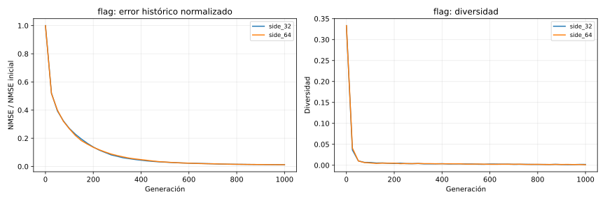
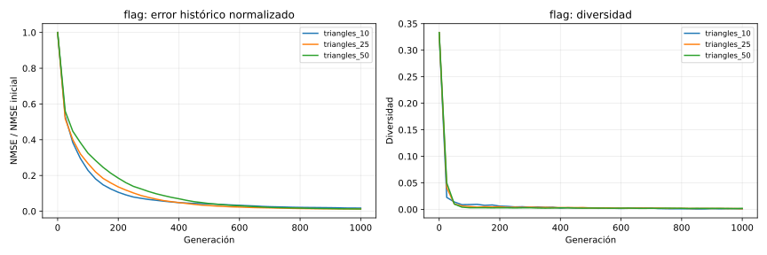
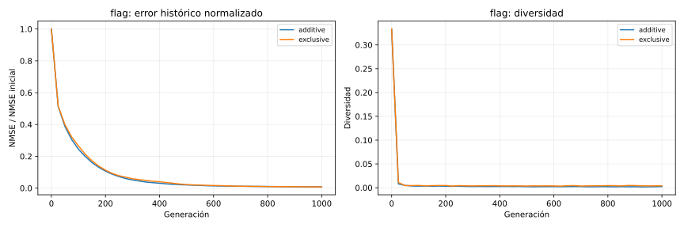
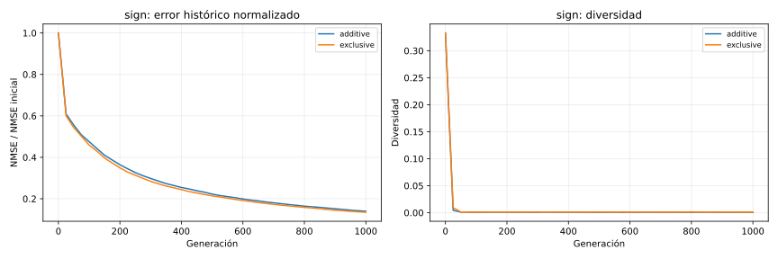

# TP2 — Informe comparativo de operadores

## Estado

Fases con resultados completos: **resolution, capacity, selection, crossover, mutation, survival, validation, showcase**. El protocolo planificado se completó en su totalidad.

## Protocolo controlado

Todas las condiciones usan las semillas `101, 202, 303, 404, 505`. Se compara dentro del mismo objetivo y presupuesto; los NMSE absolutos de objetivos distintos no se comparan entre sí. Las curvas usan el mejor histórico.

## Resolución de trabajo

**Resultado:** la mejor condición de esta etapa fue `side_64` (NMSE mediano 0.002182).

| Objetivo | Condición | NMSE mediano | IQR NMSE | AUC normalizada | Diversidad final | Éxitos 90 % |
| --- | --- | ---: | ---: | ---: | ---: | ---: |
| flag | side_32 | 0.002388 | 0.000212 | 0.107096 | 0.001627 | 5/5 |
| flag | side_64 | 0.002182 | 0.000653 | 0.109421 | 0.001178 | 5/5 |

### Imágenes representativas

- `flag` — `side_32`, semilla mediana `505`: 
- `flag` — `side_64`, semilla mediana `404`: 

## Cantidad de triángulos

**Resultado:** la mejor condición de esta etapa fue `triangles_25` (NMSE mediano 0.002182).

| Objetivo | Condición | NMSE mediano | IQR NMSE | AUC normalizada | Diversidad final | Éxitos 90 % |
| --- | --- | ---: | ---: | ---: | ---: | ---: |
| flag | triangles_10 | 0.003965 | 0.000633 | 0.104060 | 0.000347 | 5/5 |
| flag | triangles_25 | 0.002182 | 0.000653 | 0.109421 | 0.001178 | 5/5 |
| flag | triangles_50 | 0.002360 | 0.001015 | 0.119739 | 0.002242 | 5/5 |

### Imágenes representativas

- `flag` — `triangles_10`, semilla mediana `404`: 
- `flag` — `triangles_25`, semilla mediana `404`: 
- `flag` — `triangles_50`, semilla mediana `505`: 

## Selección de padres

**Resultado:** `tournament_5` obtuvo el menor NMSE mediano (0.001718). La interpretación debe contrastarlo con AUC y diversidad: presión alta no implica necesariamente mejor calidad final.

| Objetivo | Condición | NMSE mediano | IQR NMSE | AUC normalizada | Diversidad final | Éxitos 90 % |
| --- | --- | ---: | ---: | ---: | ---: | ---: |
| flag | boltzmann | 0.002043 | 0.000618 | 0.112963 | 0.002971 | 5/5 |
| flag | elite | 0.002034 | 0.000260 | 0.118802 | 0.002069 | 5/5 |
| flag | probabilistic_0_6 | 0.002382 | 0.001076 | 0.111895 | 0.002210 | 5/5 |
| flag | ranking | 0.001722 | 0.001418 | 0.101129 | 0.001593 | 5/5 |
| flag | roulette | 0.002985 | 0.000442 | 0.125012 | 0.003249 | 5/5 |
| flag | tournament_2 | 0.002182 | 0.000653 | 0.109421 | 0.001178 | 5/5 |
| flag | tournament_5 | 0.001718 | 0.000844 | 0.097548 | 0.000830 | 5/5 |
| flag | universal | 0.002630 | 0.000772 | 0.113603 | 0.001831 | 5/5 |

### Imágenes representativas

- `flag` — `boltzmann`, semilla mediana `202`: 
- `flag` — `elite`, semilla mediana `101`: 
- `flag` — `probabilistic_0_6`, semilla mediana `202`: 
- `flag` — `ranking`, semilla mediana `505`: 
- `flag` — `roulette`, semilla mediana `303`: 
- `flag` — `tournament_2`, semilla mediana `404`: 
- `flag` — `tournament_5`, semilla mediana `101`: 
- `flag` — `universal`, semilla mediana `101`: 

## Cruza

**Resultado:** `tournament_5__uniform` obtuvo el mejor ranking agregado después de ordenar las condiciones dentro de cada objetivo por calidad, AUC y diversidad.

| Objetivo | Condición | NMSE mediano | IQR NMSE | AUC normalizada | Diversidad final | Éxitos 90 % |
| --- | --- | ---: | ---: | ---: | ---: | ---: |
| flag | ranking__one_point | 0.003073 | 0.001244 | 0.126660 | 0.001732 | 5/5 |
| flag | ranking__uniform | 0.001722 | 0.001418 | 0.101129 | 0.001593 | 5/5 |
| flag | tournament_5__one_point | 0.002314 | 0.000536 | 0.115907 | 0.001091 | 5/5 |
| flag | tournament_5__uniform | 0.001718 | 0.000844 | 0.097548 | 0.000830 | 5/5 |
| sign | ranking__one_point | 0.035031 | 0.007009 | 0.372339 | 0.000672 | 0/5 |
| sign | ranking__uniform | 0.025112 | 0.001825 | 0.306547 | 0.001290 | 0/5 |
| sign | tournament_5__one_point | 0.028750 | 0.002139 | 0.345952 | 0.000551 | 0/5 |
| sign | tournament_5__uniform | 0.021563 | 0.002954 | 0.273073 | 0.000831 | 0/5 |

### Imágenes representativas

- `flag` — `ranking__one_point`, semilla mediana `202`: 
- `flag` — `ranking__uniform`, semilla mediana `505`: 
- `flag` — `tournament_5__one_point`, semilla mediana `303`: 
- `flag` — `tournament_5__uniform`, semilla mediana `101`: 
- `sign` — `ranking__one_point`, semilla mediana `101`: 
- `sign` — `ranking__uniform`, semilla mediana `101`: 
- `sign` — `tournament_5__one_point`, semilla mediana `404`: 
- `sign` — `tournament_5__uniform`, semilla mediana `303`: 

## Mutación

**Resultado:** `single_local` obtuvo el mejor ranking agregado después de ordenar las condiciones dentro de cada objetivo por calidad, AUC y diversidad.

| Objetivo | Condición | NMSE mediano | IQR NMSE | AUC normalizada | Diversidad final | Éxitos 90 % |
| --- | --- | ---: | ---: | ---: | ---: | ---: |
| flag | multigene_local_balanced | 0.001718 | 0.000844 | 0.097548 | 0.000830 | 5/5 |
| flag | single_local | 0.001481 | 0.000572 | 0.093298 | 0.002438 | 5/5 |
| sign | multigene_local_balanced | 0.021563 | 0.002954 | 0.273073 | 0.000831 | 0/5 |
| sign | single_local | 0.019957 | 0.003237 | 0.287260 | 0.000714 | 0/5 |

### Imágenes representativas

- `flag` — `multigene_local_balanced`, semilla mediana `101`: 
- `flag` — `single_local`, semilla mediana `404`: 
- `sign` — `multigene_local_balanced`, semilla mediana `303`: 
- `sign` — `single_local`, semilla mediana `303`: 

## Supervivencia

**Resultado:** `additive` obtuvo el mejor ranking agregado después de ordenar las condiciones dentro de cada objetivo por calidad, AUC y diversidad.

| Objetivo | Condición | NMSE mediano | IQR NMSE | AUC normalizada | Diversidad final | Éxitos 90 % |
| --- | --- | ---: | ---: | ---: | ---: | ---: |
| flag | additive | 0.001481 | 0.000572 | 0.093298 | 0.002438 | 5/5 |
| flag | exclusive | 0.001595 | 0.000559 | 0.100644 | 0.004006 | 5/5 |
| sign | additive | 0.019957 | 0.003237 | 0.287260 | 0.000714 | 0/5 |
| sign | exclusive | 0.020106 | 0.002199 | 0.265647 | 0.001043 | 0/5 |

### Imágenes representativas

- `flag` — `additive`, semilla mediana `404`: 
- `flag` — `exclusive`, semilla mediana `303`: 
- `sign` — `additive`, semilla mediana `303`: 
- `sign` — `exclusive`, semilla mediana `404`: 

## Validación final

**Resultado:** la configuración elegida se evaluó sobre los tres niveles de dificultad. Sus NMSE se interpretan dentro de cada objetivo, no como un ranking directo entre imágenes.

| Objetivo | Condición | NMSE mediano | IQR NMSE | AUC normalizada | Diversidad final | Éxitos 90 % |
| --- | --- | ---: | ---: | ---: | ---: | ---: |
| flag | winner | 0.001481 | 0.000572 | 0.093298 | 0.002438 | 5/5 |
| icon | winner | 0.015952 | 0.000273 | 0.264237 | 0.000642 | 0/5 |
| sign | winner | 0.019957 | 0.003237 | 0.287260 | 0.000714 | 0/5 |

### Imágenes representativas

- `flag` — `winner`, semilla mediana `404`: 
- `icon` — `winner`, semilla mediana `101`: 
- `sign` — `winner`, semilla mediana `303`: 

## Demostraciones visuales extendidas

**Resultado:** se extendió la semilla mediana de cada objetivo para obtener evidencia visual representativa; estas tres ejecuciones no forman una nueva comparación estadística.

| Objetivo | Condición | NMSE mediano | IQR NMSE | AUC normalizada | Diversidad final | Éxitos 90 % |
| --- | --- | ---: | ---: | ---: | ---: | ---: |
| flag | winner_median_seed | 0.000462 | 0.000000 | 0.033620 | 0.001879 | 1/1 |
| icon | winner_median_seed | 0.006481 | 0.000000 | 0.107614 | 0.000356 | 1/1 |
| sign | winner_median_seed | 0.004501 | 0.000000 | 0.104226 | 0.000464 | 1/1 |

### Imágenes representativas

- `flag` — `winner_median_seed`, semilla mediana `404`: 
- `icon` — `winner_median_seed`, semilla mediana `101`: 
- `sign` — `winner_median_seed`, semilla mediana `303`: 

## Limitaciones y lectura para la exposición

El NMSE se mide en la resolución de trabajo, por lo que una mejora numérica no demuestra fidelidad perfecta a tamaño original. Las imágenes representativas son la semilla mediana, no la mejor: muestran un caso típico. Las conclusiones finales deben distinguir velocidad (AUC), calidad (NMSE) y riesgo de convergencia prematura (diversidad).
