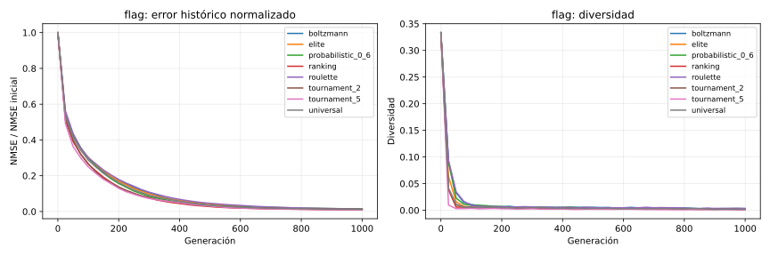

# TP2 — Informe comparativo de operadores

## Estado

Fases con resultados completos: **selection**. Las secciones pendientes se mantienen visibles para que el informe no presente conclusiones antes de tener las cinco semillas por condición.

## Protocolo controlado

Todas las condiciones usan las semillas `101, 202, 303, 404, 505`. Se compara dentro del mismo objetivo y presupuesto; los NMSE absolutos de objetivos distintos no se comparan entre sí. Las curvas usan el mejor histórico.

## Selección de padres

**Resultado:** `ranking` obtuvo el menor NMSE mediano (0.001090). La interpretación debe contrastarlo con AUC y diversidad: presión alta no implica necesariamente mejor calidad final.

| Objetivo | Condición | NMSE mediano | IQR NMSE | AUC normalizada | Diversidad final | Éxitos 90 % |
| --- | --- | ---: | ---: | ---: | ---: | ---: |
| flag | boltzmann | 0.001341 | 0.000261 | 0.070685 | 0.014007 | 5/5 |
| flag | elite | 0.001355 | 0.000774 | 0.068959 | 0.010127 | 5/5 |
| flag | probabilistic_0_6 | 0.001413 | 0.000185 | 0.073340 | 0.014024 | 5/5 |
| flag | ranking | 0.001090 | 0.000239 | 0.066863 | 0.010352 | 5/5 |
| flag | roulette | 0.001479 | 0.000631 | 0.072759 | 0.014526 | 5/5 |
| flag | tournament_2 | 0.001392 | 0.000884 | 0.063159 | 0.009636 | 5/5 |
| flag | tournament_5 | 0.001606 | 0.000324 | 0.059987 | 0.006227 | 5/5 |
| flag | universal | 0.001690 | 0.000649 | 0.069442 | 0.010094 | 5/5 |

### Imágenes representativas

- `flag` — `boltzmann`, semilla mediana `505`: 
- `flag` — `elite`, semilla mediana `101`: 
- `flag` — `probabilistic_0_6`, semilla mediana `404`: 
- `flag` — `ranking`, semilla mediana `505`: 
- `flag` — `roulette`, semilla mediana `202`: 
- `flag` — `tournament_2`, semilla mediana `101`: 
- `flag` — `tournament_5`, semilla mediana `505`: 
- `flag` — `universal`, semilla mediana `404`: 

## Cruza

**Pendiente:** esta fase aún no terminó sus cinco semillas por condición.

## Mutación y supervivencia

**Pendiente:** esta fase aún no terminó sus cinco semillas por condición.

## Validación final

**Pendiente:** esta fase aún no terminó sus cinco semillas por condición.

## Demostraciones visuales extendidas

**Pendiente:** esta fase aún no terminó sus cinco semillas por condición.

## Limitaciones y lectura para la exposición

El NMSE se mide en la resolución de trabajo, por lo que una mejora numérica no demuestra fidelidad perfecta a tamaño original. Las imágenes representativas son la semilla mediana, no la mejor: muestran un caso típico. Las conclusiones finales deben distinguir velocidad (AUC), calidad (NMSE) y riesgo de convergencia prematura (diversidad).
