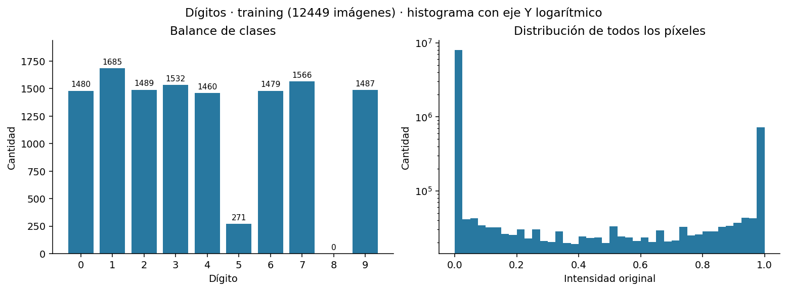

# Análisis exploratorio de los datasets

El análisis del punto 3 usa las **7500 transacciones de fraude** y **12449 imágenes
de `digits.csv`**. El hallazgo principal es que el conjunto de dígitos **no
contiene ejemplos de la clase 8** y tiene sólo **271 ejemplos de la clase 5**.
En fraude hay diferencias grandes de escala entre entradas. Estos resultados
orientan las decisiones siguientes; todavía no se aplicó preprocesamiento.

Los criterios utilizados y las dos decisiones confirmadas durante la revisión
están en [decisiones.md](decisiones.md#punto-3-análisis-de-training).
El [resumen reproducible](eda-training/resumen.md) reúne tablas y los seis
gráficos; [summary.json](eda-training/summary.json) conserva cifras completas,
configuración, versiones y hashes de los archivos fuente.

## Alcance y método

- En fraude se analiza el CSV completo, sin crear un split, porque la primera
  etapa del ejercicio 1 pide estudiar aprendizaje con todas las muestras. La
  separación temporal de validation y test corresponde al estudio posterior
  de generalización y no modifica estos estadísticos descriptivos.
- Fraude: los estadísticos, gráficos y conteos usan las 7500 filas; la lista
  completa está en [fraud-training-rows.csv](eda-training/fraud-training-rows.csv),
  con numeración física del CSV (encabezado = fila 1).
- Dígitos: todas las estadísticas y figuras usan solamente `digits.csv`.
  De `digits_test.csv` se leen exclusivamente los vectores de imagen para
  detectar coincidencias exactas con training; no se interpretan sus etiquetas
  ni se calculan distribuciones o métricas. No se abre `more_digits.csv`.
- `flagged_fraud` se utiliza sólo para el conteo descriptivo de clases.
  No participa de las entradas, del objetivo BigModel ni
  de la matriz de correlaciones.
- NumPy para los estadísticos y Matplotlib para las figuras. Los valores se
  conservan: no se eliminan filas/columnas, no se imputan faltantes, no se
  reescalan entradas ni se generan nuevos ejemplos.

Se calcularon mínimo, máximo, media, mediana, desvío descriptivo (`ddof=0`),
cuartiles, percentiles 1/99, valores distintos y conteos de faltantes/NaN e
infinitos. Las unidades y tipos documentados de fraude se incluyen en el CSV;
la conversión a `float64` para calcular estadísticos no cambia su significado.
Los píxeles se cargan como `float32`, siguiendo el loader existente.

La regla de outliers es `IQR = Q3 − Q1`: se señalan valores fuera de
`[Q1 − 1,5×IQR; Q3 + 1,5×IQR]`. Es un criterio descriptivo acordado, **no una
prueba de error del dato**. Las correlaciones de Pearson miden asociación
lineal, no causalidad ni toda relación posible.

## Fraude

### Calidad y significado

En las 7500 filas analizadas no aparecieron faltantes/NaN, infinitos, entradas
constantes ni entradas duplicadas exactas. Tampoco se detectaron alertas en
los chequeos semánticos implementados: valores negativos, cantidades o
resoluciones no positivas, fracciones en columnas documentadas como enteras,
o probabilidades fuera de `[0,1]`.

Esto verifica esos controles concretos, no garantiza que cada transacción
sea correcta ni que las etiquetas reflejen perfectamente el fraude real.
La unidad de `device_screen_resolution` es cantidad de píxeles (ancho × alto),
y `timestamp` es tiempo Unix; no representan magnitudes comparables con USD
o cantidades de productos. Fuente: documentación del dataset, páginas 1–2.

### Distribuciones y escalas

| Entrada | Rango observado | Desvío |
|---|---:|---:|
| `timestamp` | 1700001808–1731534222 s Unix | 9161851,17 |
| `amount_usd` | 1–2000 USD | 157,74 |
| `quantity_purchased` | 1–24 unidades | 4,14 |
| `device_screen_resolution` | 1006733–8310940 píxeles | 2681824,74 |
| `time_since_last_login_s` | 10–40160,8 s | 3565,01 |

El desvío de `timestamp` es aproximadamente 2,2 millones de veces el de
`quantity_purchased`. Además del desvío, el origen Unix aporta una magnitud
absoluta grande. Esto **justifica discutir escalado en el punto 4**; por sí
solo no decide entre estandarización y min-max ni demuestra que una variante
entrene mejor.

Los histogramas muestran colas hacia valores altos en monto, días desde la
última compra y tiempo desde el último login. El monto tiene mediana 63,49 USD,
media 109,07 y percentil 99 de 858,05. La resolución presenta varios grupos
de valores: tratarla como si tuviera una única distribución central puede
señalar como outliers dispositivos legítimos.

### Balance y objetivo de destilación

| Etiqueta real | Cantidad | Porcentaje |
|---|---:|---:|
| No fraude (0) | 6631 | 88,41 % |
| Fraude (1) | 869 | 11,59 % |

Hay desbalance en el dataset. Como referencia descriptiva, predecir siempre la
clase mayoritaria acertaría 88,41 % de estas etiquetas, sin detectar ningún
fraude. No es un resultado de un perceptrón ni una evaluación de test.

El objetivo de entrenamiento sigue siendo **la probabilidad de BigModel**:
rango `[0,000897; 1]`, mediana 0,357342 y media 0,422785. Esa media no es el
porcentaje real de fraude. No se eligió un umbral ni se evaluó la clasificación
de BigModel con la etiqueta real.

### Outliers y variables para revisar

| Variable | Candidatos IQR | Porcentaje del dataset |
|---|---:|---:|
| Resolución de pantalla | 1444 | 19,25 % |
| Monto | 560 | 7,47 % |
| Días desde última compra | 361 | 4,81 % |
| Tiempo desde último login | 355 | 4,73 % |
| Cantidad comprada | 331 | 4,41 % |
| Ítems vistos | 166 | 2,21 % |
| Duración de sesión | 5 | 0,07 % |

Los conteos son por columna y no se deben sumar como transacciones distintas.
Una compra grande o un dispositivo de alta resolución no son errores por
definición. No hay evidencia suficiente aquí para eliminar esas filas.

Las asociaciones lineales con BigModel de mayor magnitud son antigüedad de
cuenta (`r=-0,585`), cantidad comprada (`0,563`), monto (`0,557`) y duración
de sesión (`-0,514`). Timestamp (`0,001`), resolución (`0,025`) y tiempo
desde login (`0,002`) tienen correlación cercana a cero.

Esto permite señalar variables para estudiar, **no descartarlas**: una relación
no lineal o una interacción puede no reflejarse en Pearson. Entre las entradas,
el máximo `|r|` observado es 0,385 (cantidad comprada e ítems vistos); no se
encontró una pareja con dependencia lineal casi perfecta. No se estudió
redundancia no lineal.

## Dígitos

### Calidad y escala

Todas las filas tienen etiqueta válida entre 0 y 9 e imágenes de 784 píxeles
finitos. No hay imágenes duplicadas exactas, completamente vacías ni de
intensidad uniforme. El loader valida estructura y finitud antes del análisis;
ante una fila inválida abortaría, sin omitirla silenciosamente.

Tampoco hay imágenes exactamente repetidas entre `digits.csv` y
`digits_test.csv`. Para comprobarlo sólo se compararon los 784 píxeles; las
etiquetas de test no se interpretaron.

Los píxeles **ya vienen en `[0,1]`**, con 256 valores distintos. No se aplicó
esa transformación en este trabajo ni se presupone cómo fue realizada.
Volver a dividirlos por 255 reduciría innecesariamente la escala. La decisión
de mantener `[0,1]` o cambiar el rango se discutirá con la activación elegida.

### Balance: clase ausente y clase poco representada

| Dígito | Muestras | Dígito | Muestras |
|---|---:|---|---:|
| 0 | 1480 | 5 | **271** |
| 1 | 1685 | 6 | 1479 |
| 2 | 1489 | 7 | 1566 |
| 3 | 1532 | 8 | **0** |
| 4 | 1460 | 9 | 1487 |



El 5 representa 2,18 % de training, frente a aproximadamente 12–14 % para las
otras clases presentes. La clase 8 está ausente; el conteo se contrastó con
una lectura independiente de la columna `label` del CSV original.

**La red no dispondrá de ejemplos positivos del 8 para aprender esa clase.**
Esto limita la cobertura del conjunto de entrenamiento y no se resuelve por
sí solo aumentando épocas o neuronas. No permite calcular ahora la accuracy
de test ni afirmar cuánto mejorará al agregar datos: de test sólo se hizo el
control de inputs repetidos, sin interpretar etiquetas ni métricas; no se
inspeccionó `more_digits.csv`.

### Píxeles constantes y límite de la regla IQR

Hay **97 de 784 píxeles constantes**, todos en cero (12,37 %), principalmente
en los bordes. Son columnas sin variación en este training. Se decidió
conservar las 784 entradas: quitarlas exigiría mantener la misma selección
de columnas en cualquier evaluación posterior y aún no hay evidencia de que
esa reducción mejore el modelo.

El 81,27 % de todos los valores de píxel es cero. Por eso los cuartiles globales
Q1 y Q3 son ambos cero: la regla IQR marcaría los **1828063 píxeles no nulos**
como candidatos. En las imágenes representan los trazos del dígito; esta
regla **no sirve como filtro automático de píxeles**. Se deja el conteo para
mostrar por qué hace falta interpretar el significado de cada dato.

Los mapas de media/desvío/constantes y los ejemplos por clase están en el
resumen generado. Se muestran hasta tres ejemplos por clase, elegidos con
semilla 0, y sus filas quedan registradas. La clase 8 aparece como «Sin muestras».

## Decisiones resultantes y pendientes del punto 4

| Evidencia | Decisión o pendiente |
|---|---|
| Escalas muy diferentes en fraude | **Decisión posterior al EDA:** estandarizar las nueve entradas con parámetros calculados sólo con las muestras usadas para ajustar en cada protocolo |
| Píxeles ya en `[0,1]` | **Decisión posterior al EDA:** mantener el rango y evitar una segunda división por 255 |
| Candidatos IQR plausibles y sin errores semánticos detectados | **Decisión:** conservarlos; no hay evidencia para eliminar filas |
| 97 píxeles constantes y variables tabulares con poca asociación lineal | **Decisión:** mantener las nueve variables de fraude y los 784 píxeles como referencia inicial |
| Ausencia del 8 y escasez del 5 | Documentar el límite y estudiar resultados por clase al implementar métricas; el análisis de datos adicionales queda para su etapa |

El EDA no imputó, eliminó, balanceó ni transformó sus datos fuente. La
estandarización posterior está implementada en el loader de fraude y no cambia
los CSV originales. La decisión de conservar todas las entradas puede revisarse
después sólo si los experimentos aportan nueva evidencia. No se eligió modelo,
activación, umbral, optimizador ni regularización.

## Reproducción y controles

Desde `tp3/`, con el entorno activado:

```bash
pip install -e '.[dev,plot]'
python scripts/analyze_training.py --output output/eda-nueva
pytest -q
```

El destino debe ser una carpeta nueva o vacía. Para reproducir la evidencia
versionada se usó la semilla por defecto (`--seed 0`) para elegir los ejemplos
visuales de dígitos.
Los CSV incluyen estadísticos por cada uno de los 784 píxeles, verificaciones
semánticas, correlaciones, balances, filas seleccionadas y, sólo para dígitos,
el control de solapamiento exacto entre training y test. No se usan librerías de redes neuronales
ni se altera el motor de entrenamiento.

Los controles automatizados cubren el cálculo de cuartiles/faltantes, duplicados
con objetivos diferentes y el uso exclusivo de los inputs —sin etiquetas— en
el control de solapamiento entre training y test. Dos ejecuciones generaron
CSV, JSON y resumen Markdown idénticos; también se
verificó que los archivos fuente permanecieran intactos. Se inspeccionaron los
seis gráficos. Fuentes de criterio: consigna
página 4 y clase 12.2, páginas 32–35 y transcripción sobre EDA y desbalance.
