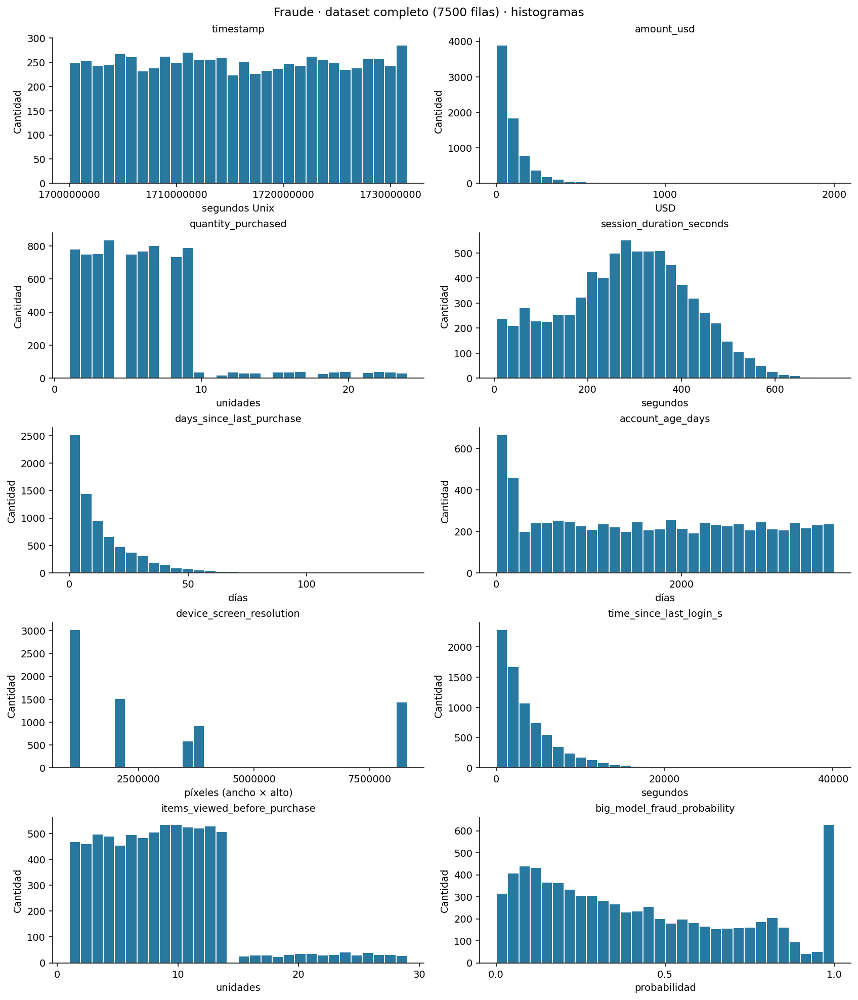
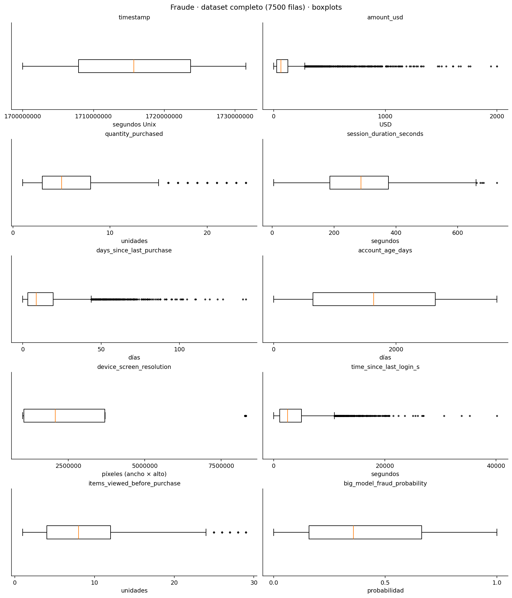
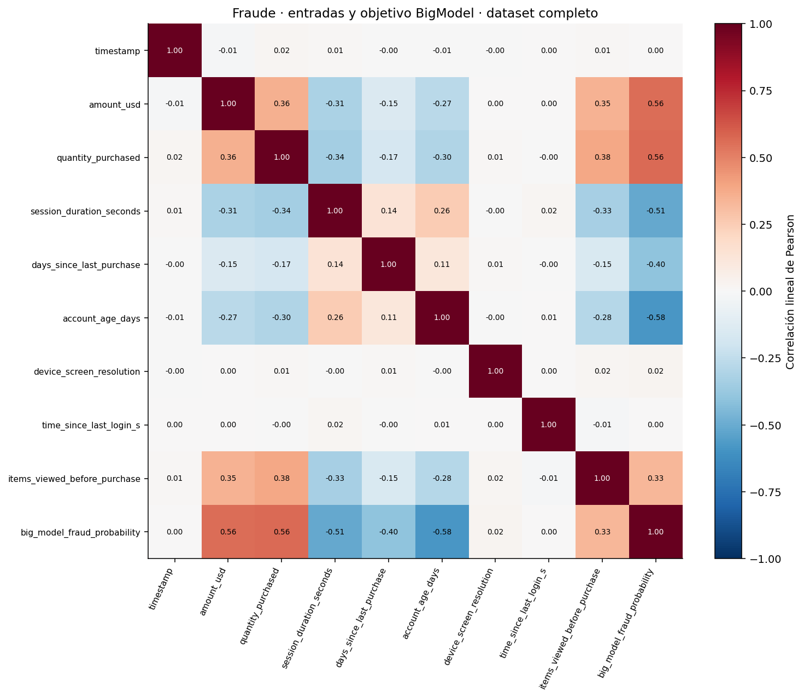
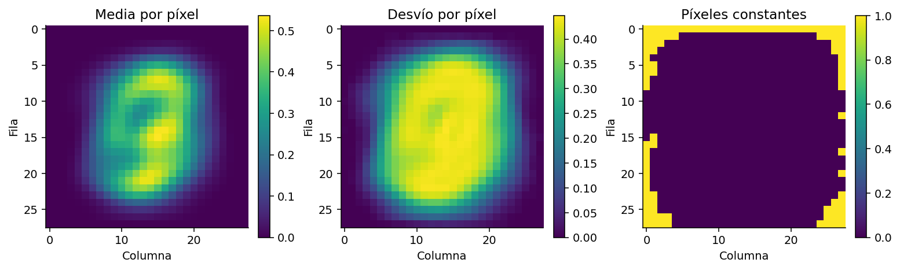
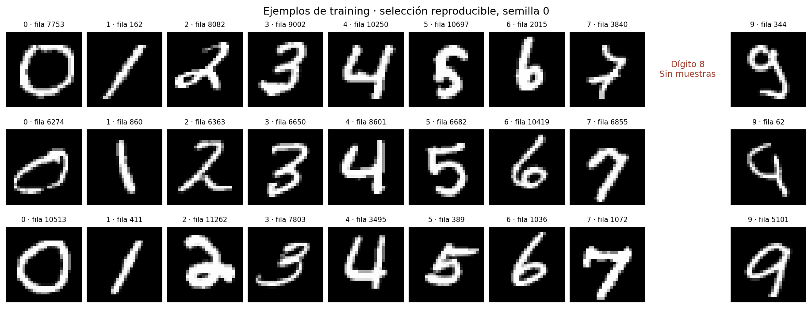

# EDA: resumen generado

Generado por `scripts/analyze_training.py`. No se entrenan modelos ni se transforman datos.

- Fraude: 7500 filas del dataset completo; sin split en esta etapa.
- Dígitos: 12449 imágenes de 784 píxeles.
- `digits_test.csv` se abre sólo para comparar imágenes exactas; no se interpretan sus etiquetas.
- No se abre `more_digits.csv`.
- En fraude se analiza el CSV completo, como pide la etapa inicial de aprendizaje del ejercicio 1.
- Estadísticos sobre valores finitos; faltantes/NaN e infinitos se cuentan por separado.
- Desvío descriptivo con ddof=0; cuartiles/percentiles con interpolación lineal de NumPy.
- Correlaciones por pares finitos; duplicados de fraude sólo entre filas numéricas completas.
- El loader de dígitos comprueba columnas, etiquetas 0..9 e imágenes finitas de 784 píxeles;
  interrumpe el análisis ante datos inválidos, sin corregirlos ni omitirlos.
- Histogramas: 30 intervalos para fraude, 40 para píxeles. Son opciones gráficas, no transformaciones.
- Regla IQR: candidatos fuera de Q1−1,5×IQR y Q3+1,5×IQR; no implica datos erróneos.
- Chequeos semánticos de fraude: no negativos; cantidades/resolución positivas; enteros según documentación;
  BigModel en [0,1]. Son alertas para revisar, no filtros aplicados.

## Fraude: distribución y escala

| Variable | Mínimo | Mediana | Máximo | Desvío | Faltantes/NaN | Infinitos | Candidatos IQR |
|---|---:|---:|---:|---:|---:|---:|---:|
| timestamp | 1.7e+09 | 1.71568e+09 | 1.73153e+09 | 9.16185e+06 | 0 | 0 | 0 |
| amount_usd | 1 | 63.49 | 2000 | 157.736 | 0 | 0 | 560 |
| quantity_purchased | 1 | 5 | 24 | 4.13952 | 0 | 0 | 331 |
| session_duration_seconds | 5 | 287 | 726.8 | 135.949 | 0 | 0 | 5 |
| days_since_last_purchase | 0 | 8.59 | 142.32 | 14.9258 | 0 | 0 | 361 |
| account_age_days | 1 | 1633.5 | 3649 | 1122.7 | 0 | 0 | 0 |
| device_screen_resolution | 1.00673e+06 | 2.07316e+06 | 8.31094e+06 | 2.68182e+06 | 0 | 0 | 1444 |
| time_since_last_login_s | 10 | 2477.7 | 40160.8 | 3565.01 | 0 | 0 | 355 |
| items_viewed_before_purchase | 1 | 8 | 29 | 5.39651 | 0 | 0 | 166 |
| big_model_fraud_probability | 0.000897 | 0.357341 | 1 | 0.302452 | 0 | 0 | 0 |

## Fraude: balance y duplicados

| Clase | Cantidad | Porcentaje |
|---|---:|---:|
| 0 | 6631 | 88.41% |
| 1 | 869 | 11.59% |

Entradas duplicadas: 0 grupos, 0 filas involucradas,
0 copias adicionales y 0 grupos con objetivos distintos.

## Dígitos: balance y duplicados

| Clase | Cantidad | Porcentaje |
|---|---:|---:|
| 0 | 1480 | 11.89% |
| 1 | 1685 | 13.54% |
| 2 | 1489 | 11.96% |
| 3 | 1532 | 12.31% |
| 4 | 1460 | 11.73% |
| 5 | 271 | 2.18% |
| 6 | 1479 | 11.88% |
| 7 | 1566 | 12.58% |
| 8 | 0 | 0.00% |
| 9 | 1487 | 11.94% |

Entradas duplicadas: 0 grupos, 0 filas involucradas,
0 copias adicionales y 0 grupos con objetivos distintos.
Solapamiento training/test: 0 grupos exactos;
0 filas de training y 0 de test involucradas.

Píxeles constantes: 97; constantes en cero: 97.
Clases ausentes en training: [8]. Píxeles en cero: 81.27%.
Imágenes con todos los píxeles iguales: 0; completamente en cero: 0.
Rango observado de píxeles: [0.0, 1.0].

## Gráficos

Los CSV conservan el detalle completo; `summary.json` registra configuración, versiones y hashes.
Las decisiones de tratamiento requieren revisar estos resultados; no se aplican automáticamente.
