# Ejercicio 1 — extensión del estudio de aprendizaje

Este documento amplía [ejercicio1.md](../ejercicio1.md) sin modificar sus  
resultados. Primero profundiza la etapa de **aprendizaje** y, desde la sección  
12, agrega un estudio separado de **generalización**.

El objetivo es responder con más evidencia una pregunta concreta:

> Cuando el MSE deja de bajar, ¿el perceptrón logístico alcanzó su límite  
> práctico o la configuración de entrenamiento no encontró mejores pesos?

Todos los números de este documento provienen de corridas reales ejecutadas por  
[`analyze_fraud_learning_capacity.py`](../../scripts/analyze_fraud_learning_capacity.py).  
Los resultados completos están en [`results/`](results/).

## 1. Punto de partida: lo que ya se había observado

La comparación original usa las 7500 transacciones para entrenar un perceptrón  
lineal y uno logístico. Las nueve entradas se estandarizan con la media y el  
desvío del conjunto completo y el objetivo es  
`big_model_fraud_probability`. `flagged_fraud` no se usa en el entrenamiento.

Los dos modelos tienen nueve pesos y un bias. Se mantienen iguales la  
inicialización, la mezcla, el tamaño de mini-batch, la cantidad de épocas y el  
learning rate; sólo cambia la activación:

$$
\text{lineal}(h)=h
$$

$$
\text{logística}(h)=\frac{1}{1+e^{-2h}}
$$

Con descenso básico, mini-batch 32 y 500 épocas se había medido:

| Learning rate | MSE final logístico | Interpretación                                 |
| ------------- | ------------------- | ---------------------------------------------- |
| 0,0001        | 0,037399            | No termina de converger                        |
| 0,001         | 0,010945            | Se acerca al mismo piso, pero lentamente       |
| 0,01          | 0,010868            | Converge de forma rápida y estable             |
| 0,1           | 0,010878            | Llega rápido, pero oscila alrededor del mínimo |

El modelo constante que siempre predice la media de BigModel tiene MSE  
`0,091477`. El logístico aprende una relación real, pero su curva se aplana  
alrededor de `0,010868`.

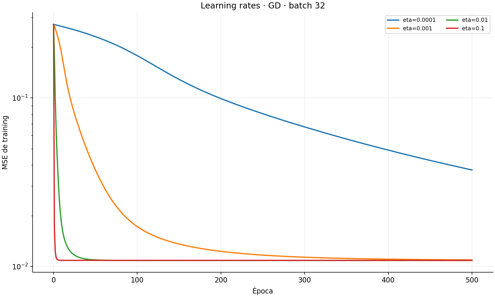

## 2. Qué significa «capacidad» y qué estamos comprobando

La **capacidad representacional** indica qué funciones puede expresar el  
modelo. En este ejercicio está limitada por:

- una sola neurona;
- nueve entradas;
- un único bias;
- la activación elegida.

Cambiar épocas, learning rate, batch, optimizador o semilla **no agrega**  
**capacidad**. Esas decisiones cambian cómo se buscan los pesos. Sin embargo,  
probarlas permite descartar una explicación alternativa: que el error se haya  
estancado porque el entrenamiento fue inadecuado y no porque el perceptrón haya  
agotado lo que puede aprender.

La lógica experimental es:

```text
otra estrategia obtiene un MSE claramente menor
        → la corrida anterior estaba limitada por optimización

estrategias diferentes llegan al mismo MSE
        → evidencia de un piso propio del modelo estudiado
```

No se cambia la arquitectura porque dejaría de ser el perceptrón simple pedido  
en el ejercicio. Tampoco se eliminan o agregan entradas: eso introduciría otra  
pregunta experimental.

## 3. Diseño experimental

### Condiciones fijas

| Elemento            | Valor                                  | Motivo                                              |
| ------------------- | -------------------------------------- | --------------------------------------------------- |
| Datos               | Las 7500 transacciones                 | La etapa de aprendizaje usa todas las muestras      |
| Entradas            | Las nueve variables estandarizadas     | Evitar que las escalas dominen los gradientes       |
| Objetivo            | Probabilidad de BigModel               | Es el objetivo de destilación de TinyModel          |
| Modelo              | Perceptrón logístico, β = 1            | Fue el seleccionado frente al lineal                |
| Error               | MSE de training                        | Se estudia ajuste y convergencia, no generalización |
| Inicialización base | Uniforme en `[-0,5; 0,5]`, bias 0      | Coincide con el estudio original                    |
| Mezcla              | Una permutación reproducible por época | Evitar un orden fijo de las muestras                |
| Corte anticipado    | Ninguno                                | Necesitamos observar la curva completa              |

### Bloques de comparación

No se hace el producto cartesiano de todos los valores. Eso produciría cientos  
de corridas difíciles de interpretar. Cada bloque cambia una sola dimensión:

1. Cuatro learning rates con descenso básico y mini-batch 32.
2. Cinco optimizadores, cada uno con una pequeña grilla apropiada de learning
  rates; luego se reejecuta su mejor tasa durante 500 épocas.
3. Seis tamaños de batch con descenso básico y `η=0,01`.
4. Cinco semillas que cambian pesos iniciales y orden de mezcla.
5. Una corrida de 1000 épocas para medir si seguir entrenando reduce el piso.

La elección de la mejor tasa dentro de esta extensión usa exclusivamente MSE  
de training. No se presenta como selección del modelo final: sólo busca dar a  
cada optimizador una oportunidad razonable de llegar a su mínimo.

### Cómo se define la meseta

Se informa la primera época a partir de la cual el MSE permanece siempre a  
menos de 1 % del mínimo de esa corrida. Exigir que permanezca dentro de la banda  
evita declarar convergencia por una entrada momentánea causada por ruido.

También se mide el rango del MSE durante el último 20 % de las épocas. Un rango  
pequeño indica una curva estable; uno grande indica oscilación o que todavía  
está bajando.

## 4. Learning rate

| η        | MSE final      | Menor MSE      | Época de meseta | Rango en el último 20 % |
| -------- | -------------- | -------------- | --------------- | ----------------------- |
| 0,0001   | 0,03739898     | 0,03739898     | 497             | 0,01164288              |
| 0,001    | 0,01094511     | 0,01094511     | 402             | 0,00011140              |
| **0,01** | **0,01086793** | **0,01086792** | **47**          | **0,00000011**          |
| 0,1      | 0,01087784     | 0,01086879     | 5               | 0,00002759              |

Los resultados separan tres fenómenos:

- `0,0001` no permite concluir nada sobre capacidad porque todavía está  
aprendiendo cuando termina la corrida.
- `0,001` se aproxima al mismo piso, pero necesita casi las 500 épocas.
- `0,01` y `0,1` encuentran prácticamente el mismo mínimo. La tasa `0,1`  
llega antes, pero oscila más; `0,01` es la referencia más estable.

El learning rate cambia cuánto tarda el modelo y cuánto oscila, pero los valores  
que efectivamente convergen no descubren un piso inferior.

## 5. Optimizadores

Se probaron descenso básico, Momentum, eta adaptativo, RMSProp y Adam con  
mini-batch 32 y semilla 0. Para no perjudicar a un método por usar una tasa  
pensada para otro, primero se exploraron:

- descenso, Momentum y eta adaptativo: `0,001`, `0,01`, `0,1`;
- RMSProp y Adam: `0,0001`, `0,001`, `0,01`.

Los parámetros restantes siguen las fórmulas implementadas de clase:  
Momentum `α=0,9`; RMSProp `γ=0,9`; Adam `β₁=0,9`, `β₂=0,999`; y epsilon  
`10⁻⁸`. Eta adaptativo espera diez épocas consistentes, suma `0,0001` cuando  
el error baja y reduce a la mitad cuando sube.

### Mejor variante encontrada de cada optimizador

| Optimizador     | η inicial | MSE final   | Menor MSE   | Época de meseta |
| --------------- | --------- | ----------- | ----------- | --------------- |
| Descenso básico | 0,01      | 0,010867933 | 0,010867919 | 47              |
| Momentum        | 0,001     | 0,010867948 | 0,010867919 | 46              |
| Eta adaptativo  | 0,01      | 0,010867938 | 0,010867920 | 46              |
| RMSProp         | 0,0001    | 0,010868062 | 0,010867954 | 52              |
| Adam            | 0,0001    | 0,010867968 | 0,010867925 | 63              |

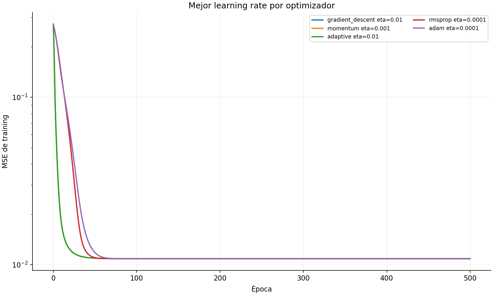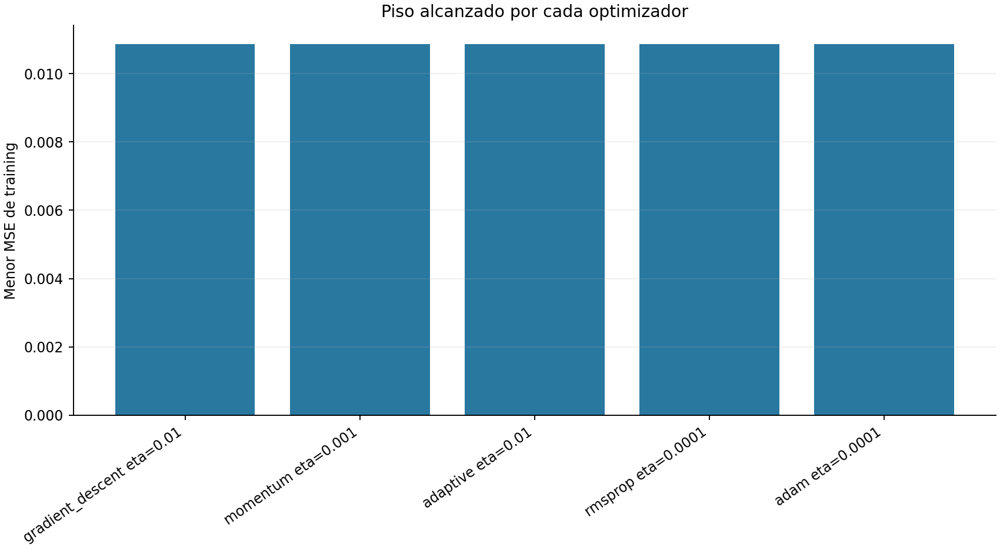

La diferencia entre el mejor y el peor de esos mínimos es menor que  
`4×10⁻⁸`. En la escala del problema son el mismo piso. Momentum y Adam cambian  
la trayectoria de actualización, pero no encuentran una solución con menor  
error que el descenso básico.

Este es el control más directo contra la hipótesis de «el gradiente descendente  
se quedó trabado»: métodos con memoria de primer y segundo momento terminan en  
el mismo lugar.

## 6. Tamaño de batch

En una época todas las variantes recorren las 7500 muestras, pero no realizan  
la misma cantidad de actualizaciones:

| Batch    | Actualizaciones aproximadas por época |
| -------- | ------------------------------------- |
| 1        | 7500                                  |
| 8        | 938                                   |
| 32       | 235                                   |
| 128      | 59                                    |
| 512      | 15                                    |
| Completo | 1                                     |

Por eso comparar solamente el MSE después de 300 épocas puede confundir una  
cantidad insuficiente de actualizaciones con un piso diferente.

| Batch    | Épocas | MSE final  | Menor MSE  | Lectura                                            |
| -------- | ------ | ---------- | ---------- | -------------------------------------------------- |
| 1        | 300    | 0,01091742 | 0,01087413 | Mucho ruido; visita el piso pero no permanece allí |
| 8        | 300    | 0,01086889 | 0,01086807 | Converge rápido y queda muy cerca                  |
| 32       | 300    | 0,01086798 | 0,01086792 | Converge de forma estable                          |
| 128      | 300    | 0,01087710 | 0,01087710 | Todavía está bajando                               |
| 512      | 300    | 0,01245904 | 0,01245904 | Todavía está bajando                               |
| Completo | 300    | 0,14869360 | 0,14869360 | Sólo hizo 300 actualizaciones                      |

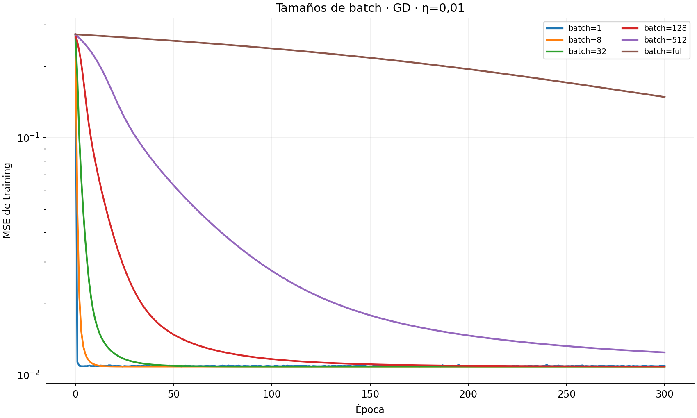

Se extendieron únicamente las variantes grandes:

| Batch    | Épocas extendidas | MSE final   |
| -------- | ----------------- | ----------- |
| 128      | 1000              | 0,010867919 |
| 512      | 2000              | 0,010868053 |
| Completo | 10000             | 0,011017238 |

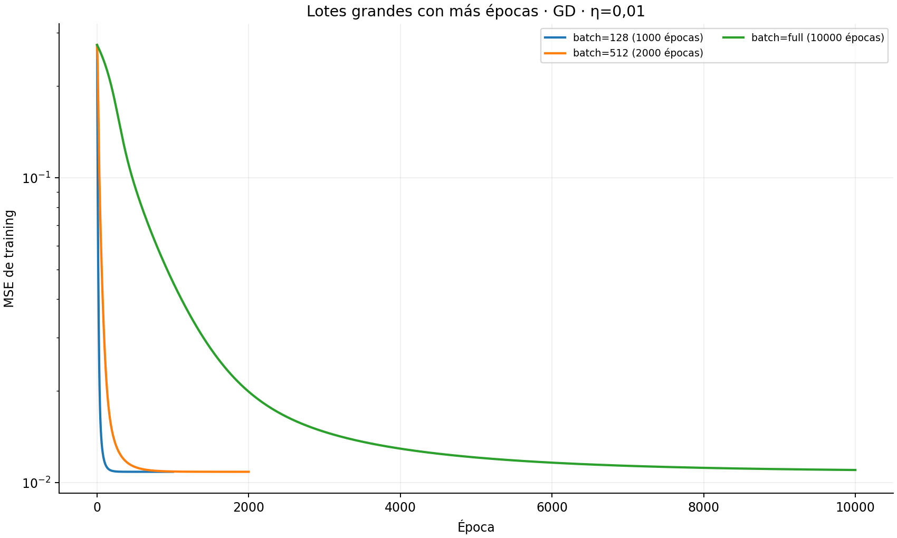

Batch 128 y 512 terminan en el mismo piso cuando reciben suficientes  
actualizaciones. El batch completo todavía converge lentamente incluso con  
10000 épocas, pero queda a aproximadamente 1,4 % del piso de referencia y su  
curva sigue descendiendo. No es evidencia de otra capacidad: es falta de  
convergencia debida a que realiza una sola actualización por época.

Batch 1 tampoco ofrece un mínimo mejor y mantiene más ruido. Mini-batch 32 no  
es especial por capacidad; es un compromiso eficiente y estable.

## 7. Inicialización y semillas

Cada semilla cambia simultáneamente los pesos iniciales y las permutaciones de  
las muestras. Se mantienen descenso básico, `η=0,01`, mini-batch 32 y 500  
épocas.

| Semilla | MSE final   | Menor MSE   | Época de meseta |
| ------- | ----------- | ----------- | --------------- |
| 0       | 0,010867933 | 0,010867919 | 47              |
| 1       | 0,010867939 | 0,010867916 | 33              |
| 2       | 0,010867924 | 0,010867919 | 45              |
| 3       | 0,010867936 | 0,010867917 | 46              |
| 4       | 0,010867936 | 0,010867919 | 42              |

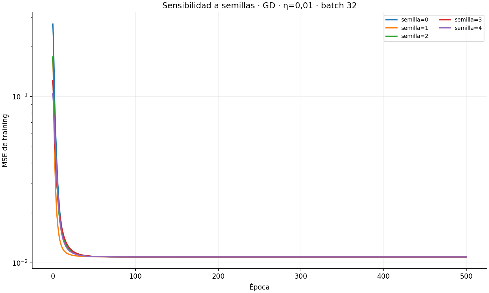

La diferencia entre el mayor y el menor MSE final es menor que `1,5×10⁻⁸`.  
Las semillas modifican algunos pasos de la trayectoria y la época de meseta,  
pero no el resultado. No hay evidencia de que la referencia dependa de una  
inicialización afortunada.

## 8. Cantidad de épocas

En lugar de ejecutar modelos distintos para cada cantidad de épocas, se hizo  
una única corrida de 1000 épocas y se observaron distintos puntos de la misma  
trayectoria. Esto evita atribuir a la cantidad de épocas diferencias provocadas  
por otra mezcla aleatoria.

| Época | MSE de training |
| ----- | --------------- |
| 0     | 0,27319324      |
| 10    | 0,01723788      |
| 25    | 0,01168532      |
| 50    | 0,01094478      |
| 100   | 0,01086910      |
| 250   | 0,01086794      |
| 500   | 0,01086793      |
| 750   | 0,01086795      |
| 1000  | 0,01086796      |

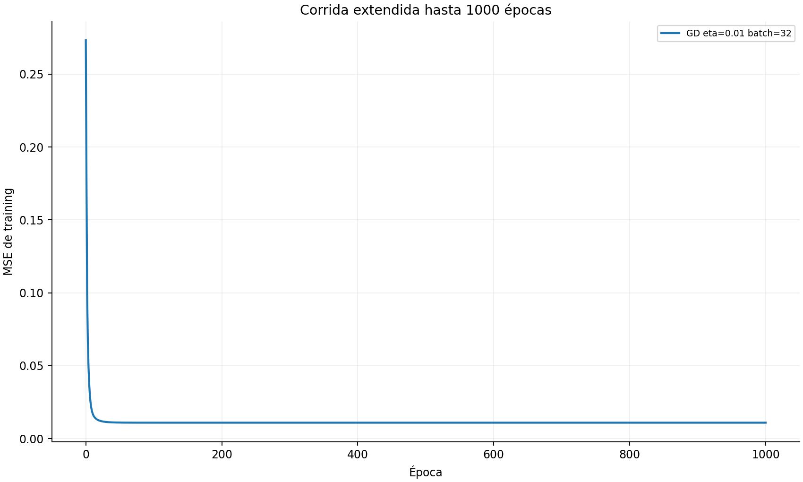

Entre las épocas 100 y 1000 la mejora es aproximadamente `0,00000114`, apenas  
un `0,01 %` del error. Después de la época 250 sólo quedan fluctuaciones del  
mini-batch; duplicar las épocas de 500 a 1000 no mejora el piso.

## 9. Visualización sobre la primera componente principal

El problema tiene nueve dimensiones y no puede representarse exactamente en  
un plano. Para obtener una vista interpretable se proyectan las entradas  
estandarizadas sobre PC1, la dirección que explica más variación.


- Los puntos son las probabilidades reales producidas por BigModel.
- Las curvas usan los pesos efectivamente aprendidos por los dos perceptrones  
con `η=0,01` y mini-batch 32.
- Para trazar cada curva se recorre PC1 dejando las otras ocho componentes en  
su media.
- PC1 explica 26,2 % de la variación de las entradas; por eso queda dispersión  
vertical y la figura no reemplaza las métricas calculadas en nueve dimensiones.

La recta puede superar 1, mientras que la logística permanece en `(0,1)` y  
acompaña mejor la tendencia. Aun así, una sola curva rígida no cubre toda la  
dispersión generada por las nueve entradas.

## 10. Conclusión: ¿está saturada la capacidad?

La evidencia empírica es fuerte:

1. Learning rates estables diferentes llegan al mismo MSE.
2. Cinco optimizadores llegan al mismo mínimo, con diferencias menores que
  `4×10⁻⁸`.
3. Batches distintos que alcanzan convergencia llegan al mismo piso; las
  excepciones se explican por ruido o por cantidad insuficiente de  
   actualizaciones.
4. Cinco inicializaciones terminan en el mismo resultado.
5. Extender el entrenamiento hasta 1000 épocas no reduce el error.

Por lo tanto, la formulación defendible es:

> Para el perceptrón simple logístico, con las nueve entradas disponibles, se  
> observa un piso reproducible cercano a MSE `0,010868`. Cambiar la estrategia  
> de optimización modifica la velocidad, el ruido y la estabilidad, pero no  
> encuentra un ajuste mejor. Esto es evidencia de saturación práctica de la  
> capacidad del modelo en la etapa de aprendizaje.

No es una demostración matemática del mínimo global. Tampoco demuestra por sí  
sola que cualquier red neuronal tendría underfitting. Confirmar que un modelo  
de mayor capacidad baja sustancialmente el error requeriría agregar neuronas o  
capas, pero eso dejaría de ser el perceptrón simple pedido en este ejercicio.

Dentro del alcance del ejercicio, sí permite defender que la meseta no parece  
ser consecuencia de una mala elección aislada de épocas, learning rate, batch,  
semilla u optimizador.

## 11. Reproducción

Desde `tp3/`, con el entorno activado:

```bash
python scripts/analyze_fraud_learning_capacity.py \
  --data data/fraud_dataset.csv \
  --output output/ejercicio1-capacidad
```

La carpeta de salida debe ser nueva o estar vacía. El script genera:

- `experiment.json`: grillas y parámetros declarados;
- `runs.csv`: resumen de cada corrida;
- `histories.csv`: MSE de cada época;
- `epoch-checkpoints.csv`: puntos de la corrida larga;
- `derived-values.json`: baseline constante y datos de PC1;
- los gráficos utilizados en este documento.

Las tablas completas permiten distinguir resultados finales de mínimos  
momentáneos y revisar cualquier conclusión sin volver a ejecutar el estudio.

## 12. Extensión del estudio de generalización

Esta parte responde con más evidencia el inciso c): **¿cuál es la mejor  
configuración del perceptrón logístico para presentar al cliente?** No cambia  
la arquitectura ni agrega capacidad. Compara distintas maneras de entrenar la  
misma neurona de nueve pesos y un bias.

Todos los resultados fueron generados por  
[`analyze_fraud_generalization_extension.py`](../../scripts/analyze_fraud_generalization_extension.py)  
y están en [`generalization-results/`](generalization-results/).

### 12.1 Protocolo sin data leakage

El protocolo separa explícitamente selección y evaluación final:

1. Se reservan 1500 transacciones estratificadas (20 %) como **test**.
2. Las 6000 restantes forman desarrollo y se dividen en cinco folds  
   estratificados de 1200 muestras.
3. En cada vuelta se entrena con 4800 y se valida con 1200. El estandarizador  
   se ajusta nuevamente usando sólo las 4800 de training del fold.
4. Todas las decisiones se toman con el MSE medio de validation. Test no se  
   evalúa durante la búsqueda.
5. Una vez cerrada la configuración se reentrena con las 6000 muestras, se  
   ajusta allí el estandarizador y se evalúa test una sola vez.

Este protocolo no se eligió porque k-fold sea universalmente superior. En este
problema evita depender de un único corte, mantiene 4800 filas para entrenar y
deja 1200 para validar con 139 fraudes en cada vuelta. Es un compromiso
razonable entre estabilidad y costo: un holdout usaría cada fila una sola vez,
mientras leave-one-out exigiría 6000 entrenamientos. Los resultados de las
vueltas y la justificación completa del inciso b están en
[el informe principal](../ejercicio1.md#b-qué-estrategia-se-utilizó-para-manipular-el-conjunto-de-datos).

La partición, los cinco folds y las 1500 filas reservadas quedaron registrados  
en `reserved-indices.npz`. `selection.json` se creó antes de que existiera  
`final-test.json`, de modo que la configuración final no depende del resultado  
de test.

### 12.2 Optimizadores y learning rates

Primero se mantuvieron fijos mini-batch 32, semilla 0 y 300 épocas. Para cada  
optimizador se eligió su mejor learning rate entre los valores razonables  
usados en el estudio de aprendizaje:

| Optimizador | Mejor η | Época estable | MSE validation medio | Desvío entre folds |
|---|---:|---:|---:|---:|
| Descenso básico | 0,1 | 300 | 0,0110240 | 0,0004972 |
| Momentum | 0,01 | 300 | 0,0110239 | 0,0004943 |
| Eta adaptativo | 0,1 | 300 | 0,0110240 | 0,0004972 |
| RMSProp | 0,0001 | 98 | 0,0110283 | 0,0004920 |
| Adam | 0,0001 | 116 | 0,0110281 | 0,0004900 |

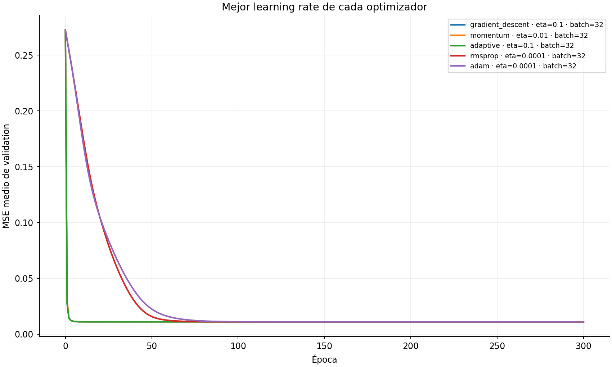

La diferencia máxima entre estos cinco MSE es menor que `0,000005`, unas cien  
veces menor que el desvío entre folds. Por eso los optimizadores son  
estadísticamente indistinguibles en calidad predictiva: cambian principalmente  
la velocidad y la estabilidad con que llegan al mismo piso.

Momentum con `η=0,01` y descenso básico con `η=0,1`, los dos mínimos brutos,  
pasaron a la comparación de batches.

### 12.3 Tamaños de batch y cantidad de épocas

Se probaron batches `1`, `8`, `32`, `128`, `512` y completo para esos dos  
optimizadores. No se usó el mismo máximo de épocas para todos porque una época  
online realiza 4800 actualizaciones por fold, mientras una época full batch  
realiza sólo una. Cada horizonte permitió observar convergencia sin ejecutar  
miles de actualizaciones inútiles en los batches pequeños.

| Configuración | Época estable | MSE validation | Oscilación final | Tiempo estimado hasta estabilizarse |
|---|---:|---:|---:|---:|
| GD, η=0,1, batch 1 | 60* | 0,0115619 | 0,0008722 | 21,46 s |
| GD, η=0,1, batch 8 | 100* | 0,0110593 | 0,0001564 | 4,60 s |
| GD, η=0,1, batch 32 | 300 | 0,0110240 | 0,0000239 | 3,66 s |
| **GD, η=0,1, batch 128** | **45** | **0,0110275** | **0,0000042** | **0,25 s** |
| GD, η=0,1, batch 512 | 168 | 0,0110281 | 0,0000044 | 0,43 s |
| GD, η=0,1, full batch | 1611 | 0,0110308 | 0,0000005 | 2,40 s |

\* Llegó al final del horizonte sin cumplir todavía el criterio estricto de  
estabilidad. Los resultados de Momentum muestran el mismo patrón y están en  
`cv-summaries.csv`.

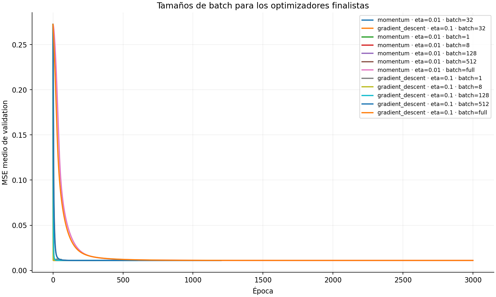

Batch 1 y 8 actualizan con más ruido y no alcanzan un resultado mejor. Batch  
completo es muy estable, pero necesita más de 1500 épocas porque actualiza una  
sola vez por época. Los batches 128 y 512 llegan a un MSE equivalente con  
curvas estables y menor costo que batch 32.

### 12.4 Semillas y configuraciones finalistas

Las cinco configuraciones elegibles se repitieron con semillas `0`, `1`, `2`,  
`3` y `4`. Cada semilla modifica los pesos iniciales y el orden de las muestras;  
cada resultado sigue siendo el promedio de los mismos cinco folds.

| Configuración | Época estable mediana | MSE validation | Desvío entre semillas | Desvío medio entre folds |
|---|---:|---:|---:|---:|
| Momentum, η=0,01, batch 32 | 300 | **0,0110229** | 0,00000130 | 0,0005064 |
| Momentum, η=0,01, batch 128 | 43 | 0,0110259 | 0,00000118 | 0,0004891 |
| **GD, η=0,1, batch 128** | **44** | **0,0110269** | **0,00000083** | **0,0004879** |
| GD, η=0,1, batch 512 | 165 | 0,0110275 | 0,00000041 | 0,0004897 |
| Momentum, η=0,01, batch 512 | 160 | 0,0110276 | 0,00000036 | 0,0004879 |

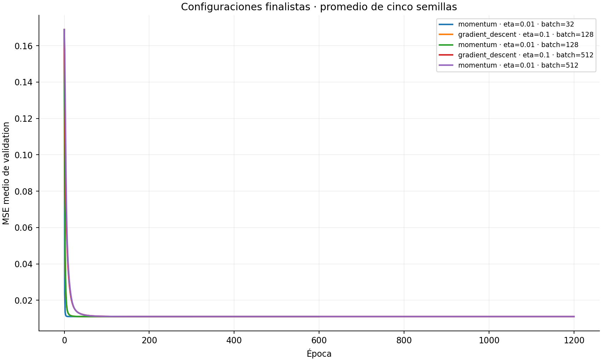

El mínimo bruto pertenece a Momentum con batch 32, pero su ventaja frente a  
GD con batch 128 es sólo `0,0000040`; el desvío entre folds es aproximadamente  
`0,00049`. Sería incorrecto interpretar esos cuatro millonésimos como una  
mejora real.

### 12.5 Regla de selección y configuración elegida

Se aplicó la **regla de un error estándar**: toda configuración cuyo MSE queda  
a menos de un error estándar del mínimo se considera equivalente. Entre las  
equivalentes se prioriza, en este orden:

1. menor tiempo estimado hasta la época estable;
2. menor oscilación al final de la curva;
3. menor variación entre semillas;
4. menor MSE medio de validation.

La configuración seleccionada antes de abrir test fue:

| Elemento | Elección |
|---|---|
| Modelo | Perceptrón logístico, β=1 |
| Optimizador | Descenso de gradiente básico |
| Learning rate | 0,1 |
| Batch | 128 |
| Épocas | 44 |
| MSE validation | 0,0110269 |
| Desvío entre semillas | 0,00000083 |

Esta configuración sacrifica una diferencia de MSE que no puede distinguirse  
del ruido de los folds y, a cambio, llega a la zona estable aproximadamente 18  
veces más rápido que Momentum con batch 32.

### 12.6 Elección del umbral antes de test

El MSE selecciona cuánto imita TinyModel la probabilidad de BigModel, pero no  
decide a partir de qué salida se declara fraude. Esa segunda decisión es el  
**umbral de clasificación**:

```text
salida de TinyModel < umbral   → legítima
salida de TinyModel ≥ umbral   → fraude
```

Cambiar el umbral no vuelve a entrenar el perceptrón ni modifica sus pesos.  
Sólo cambia el compromiso entre detectar más fraudes y generar más falsas  
alarmas.

#### Qué significa un fold

Las 6000 transacciones de desarrollo se dividieron en cinco bloques, llamados  
folds: A, B, C, D y E. En cada vuelta se entrenó con cuatro y se predijo el  
quinto:

```text
vuelta 1: entrena B+C+D+E → predice A
vuelta 2: entrena A+C+D+E → predice B
vuelta 3: entrena A+B+D+E → predice C
vuelta 4: entrena A+B+C+E → predice D
vuelta 5: entrena A+B+C+D → predice E
```

Al juntar las cinco vueltas, cada transacción posee exactamente una predicción  
**out-of-fold**: la produjo un modelo que no usó esa transacción para entrenar.  
Por eso estas predicciones permiten elegir el umbral sin memorizar las  
etiquetas y sin consultar test.

#### Búsqueda gruesa y control con cinco semillas

Primero se ejecutó la configuración ganadora —GD, `η=0,1`, batch 128 y 44  
épocas— sobre los cinco folds con semilla 0. Se probaron umbrales entre `0,01`  
y `0,99`, con paso `0,005`. El máximo inicial de F1 apareció en `0,885`.

Una vez localizada esa zona, se repitieron los cinco folds con las semillas  
`0`, `1`, `2`, `3` y `4`. En cada caso se exploró desde `0,855` hasta `0,915`  
con paso más fino de `0,001`.

| Semilla | Umbral con mayor F1 | F1 | Precision | Recall | FPR |
|---:|---:|---:|---:|---:|---:|
| 0 | 0,883 | 87,25 % | 88,35 % | 86,19 % | 1,49 % |
| 1 | 0,886 | 87,25 % | 88,35 % | 86,19 % | 1,49 % |
| 2 | 0,883 | 87,27 % | 88,24 % | 86,33 % | 1,51 % |
| 3 | 0,884 | 87,25 % | 88,35 % | 86,19 % | 1,49 % |
| 4 | 0,885 | 87,25 % | 88,35 % | 86,19 % | 1,49 % |

Los óptimos quedan entre `0,883` y `0,886`: la inicialización casi no afecta  
la decisión. Se congeló **umbral `0,884`**, que maximiza el F1 medio de las  
cinco semillas. El objetivo de negocio no especifica un costo distinto para  
fraudes omitidos y falsas alarmas; por eso F1 es un compromiso justificable  
entre precision y recall.

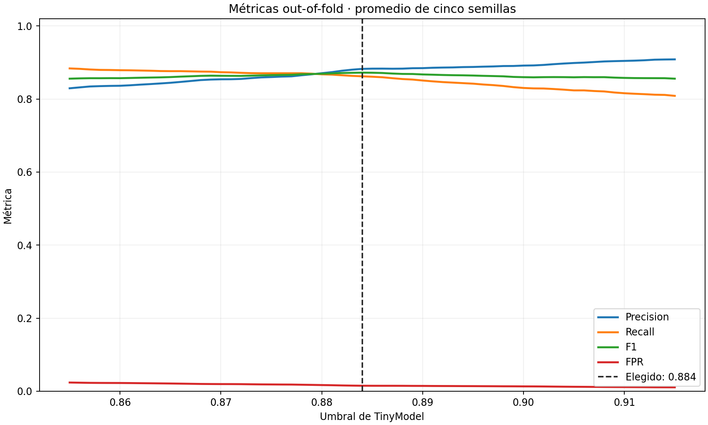

Con el umbral común `0,884`, el promedio sobre las cinco semillas es:

| Métrica de validation | Media | Desvío entre semillas |
|---|---:|---:|
| Accuracy | 97,07 % | 0,008 % |
| Precision | 88,25 % | 0,136 % |
| Recall / TPR | 86,22 % | 0,141 % |
| F1 | **87,22 %** | **0,033 %** |
| FPR | 1,50 % | 0,022 % |

La matriz de confusión out-of-fold de la semilla 0 permite leer los casos  
concretos sobre las 6000 transacciones:

| | Predicho legítima | Predicho fraude |
|---|---:|---:|
| **Real legítima** | 5226 | 79 |
| **Real fraude** | 97 | 598 |

Es decir: detecta 598 de 695 fraudes y genera 79 falsas alarmas entre 5305  
transacciones legítimas. El umbral, sus métricas y los óptimos por semilla se  
guardaron en `threshold-selection.json` antes de la evaluación final.

### 12.7 Reentrenamiento y evaluación final

Con modelo, hiperparámetros, épocas y umbral ya congelados, se ajustó un nuevo  
estandarizador con las 6000 transacciones de desarrollo y el perceptrón se  
entrenó desde cero durante 44 épocas. Recién entonces se transformaron y  
evaluaron las 1500 transacciones reservadas.

#### Imitación de la probabilidad de BigModel

| Conjunto | Muestras | MSE |
|---|---:|---:|
| Desarrollo completo | 6000 | 0,0109625 |
| Test reservado | 1500 | **0,0105284** |

Test no empeora frente a validation; de hecho, su MSE es levemente menor. No  
hay evidencia de overfitting ni de una brecha de generalización. Es compatible  
con que las 1500 transacciones reservadas sean algo más fáciles que el promedio  
de los folds.

#### Detección de fraude con umbral 0,884

| | Predicho legítima | Predicho fraude |
|---|---:|---:|
| **Real legítima** | 1303 | 23 |
| **Real fraude** | 22 | 152 |

| Métrica | TinyModel | BigModel con umbral 0,85 |
|---|---:|---:|
| Accuracy | 97,00 % | 100 % |
| Precision | 86,86 % | 100 % |
| Recall / TPR | 87,36 % | 100 % |
| F1 | **87,11 %** | **100 %** |
| FPR | 1,73 % | 0 % |

El comportamiento de test es coherente con validation: F1 pasa de 87,22 % a  
87,11 %, recall de 86,22 % a 87,36 % y FPR de 1,50 % a 1,73 %. TinyModel  
detecta 152 de los 174 fraudes y genera 23 falsas alarmas entre 1326 casos  
legítimos.

BigModel con umbral `0,85` coincide exactamente con `flagged_fraud` en estas  
1500 filas. TinyModel no logra imitarlo sin errores porque una única neurona  
logística no representa toda la relación: esto es consistente con el  
underfitting observado en la etapa de aprendizaje.

### 12.8 Conclusión de la extensión

Explorar optimizadores, learning rates, batches, épocas y semillas permitió  
encontrar un entrenamiento mucho más eficiente, pero no un MSE sustancialmente  
menor. La configuración elegida generaliza sin una brecha apreciable y el  
umbral también es estable frente a la inicialización.

La recomendación extendida para CompanyX es:

- perceptrón simple logístico con nueve entradas y bias;
- estandarización ajustada únicamente con los datos de desarrollo;
- descenso de gradiente, `η=0,1`, batch 128 y 44 épocas;
- umbral de fraude `0,884`;
- MSE esperado cercano a `0,011`;
- F1 esperado cercano a 87 %, con aproximadamente 1,5–1,7 % de falsas alarmas.

Este estudio tampoco elimina el underfitting: los hiperparámetros mejoran la  
eficiencia y estabilidad de la búsqueda de pesos, pero no agregan capacidad  
representacional al perceptrón simple.

### 12.9 Cómo reproducir las tres etapas

Desde `tp3/`, primero se buscan los hiperparámetros sin evaluar test:

```bash
python scripts/analyze_fraud_generalization_extension.py \
  --stage search \
  --data data/fraud_dataset.csv \
  --output output/ejercicio1-generalizacion
```

Después se generan predicciones out-of-fold y se congela el umbral:

```bash
python scripts/analyze_fraud_generalization_extension.py \
  --stage threshold \
  --data data/fraud_dataset.csv \
  --output output/ejercicio1-generalizacion
```

Por último se reentrena con development completo y se evalúa test:

```bash
python scripts/analyze_fraud_generalization_extension.py \
  --stage finalize \
  --data data/fraud_dataset.csv \
  --output output/ejercicio1-generalizacion
```

`finalize` exige que `threshold-selection.json` ya exista. Después crea  
`final-test.json`, las predicciones, el modelo y el estandarizador finales; si  
`final-test.json` ya existe, se niega a evaluar test nuevamente.
