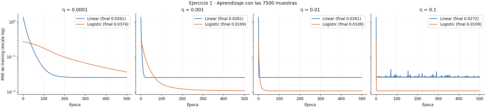
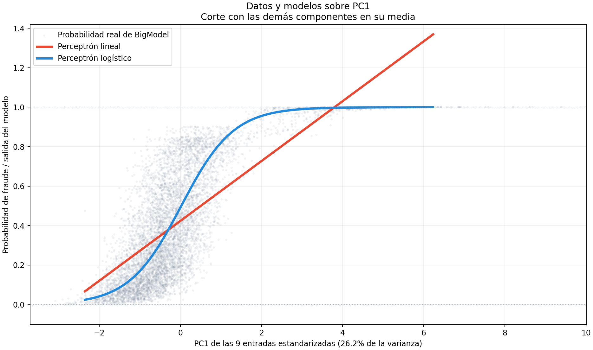
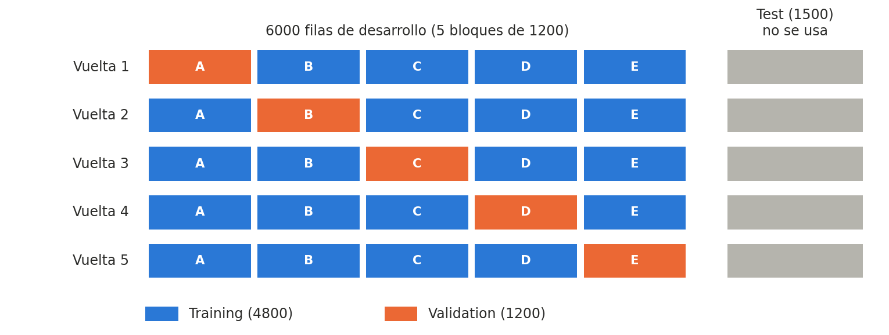
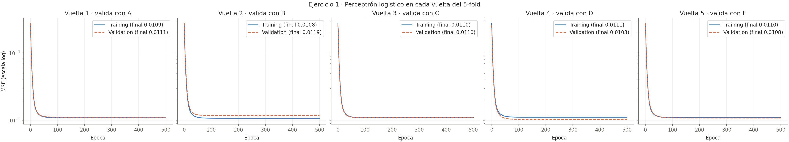
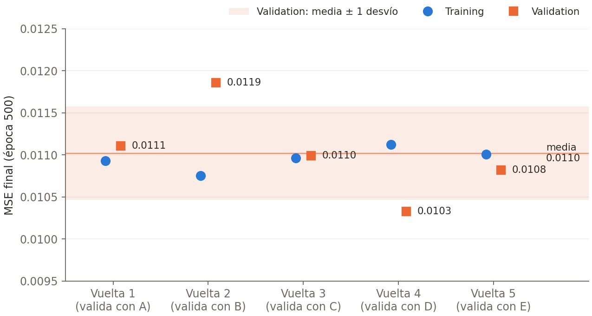
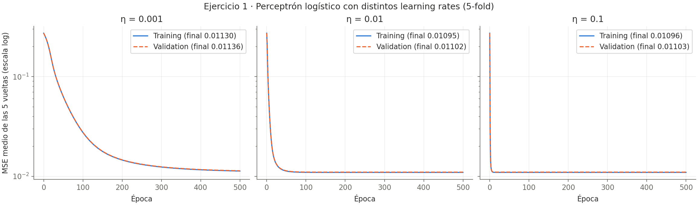
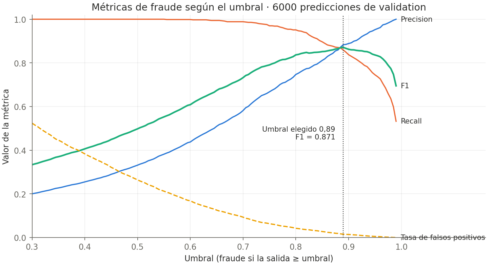
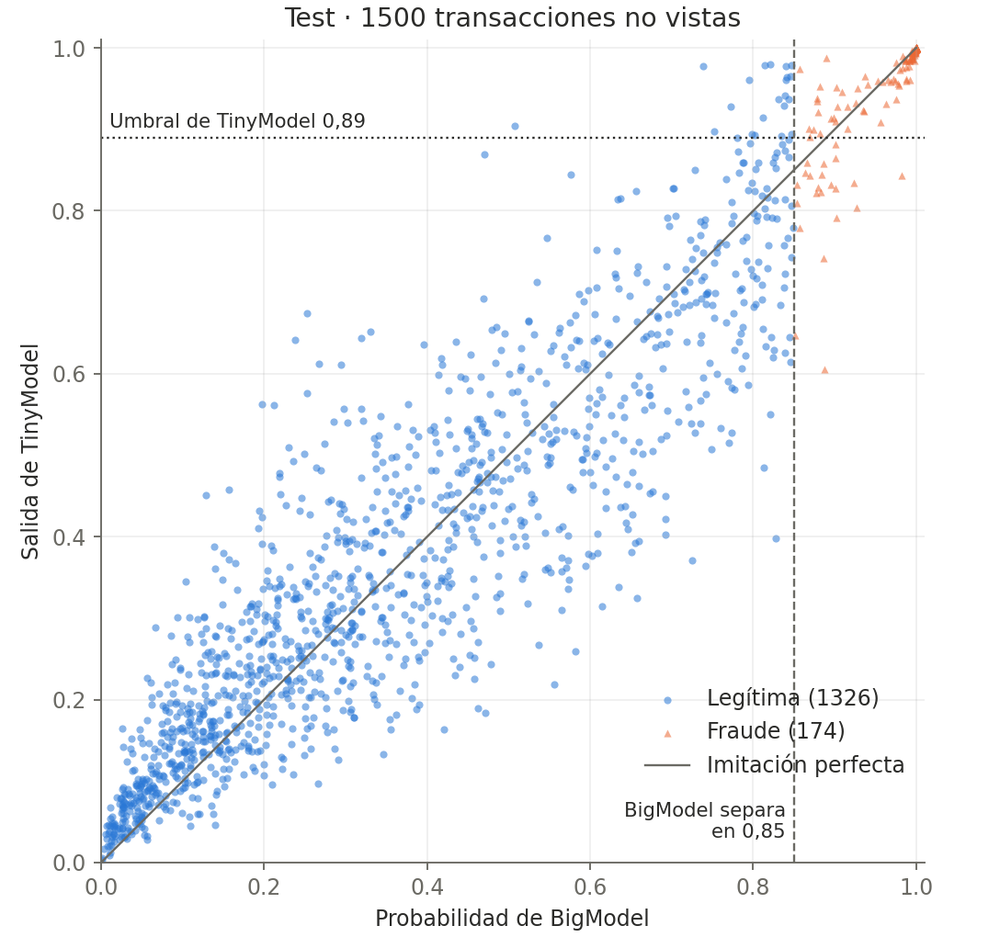

# Ejercicio 1: TinyModel para detección de fraude

Respuestas paso a paso del ejercicio 1. Todos los números provienen de corridas
reales.

## 1. Función de activación no lineal

Se usa la **logística** con β = 1, tal como se define en clase 10.2:

$$\theta(h) = \frac{1}{1 + e^{-2\beta h}}, \qquad \theta'(h) = 2\beta\,\theta(h)\,(1 - \theta(h))$$

Por qué:

- El objetivo es la probabilidad de fraude que estima BigModel
  (`big_model_fraud_probability`), que vive en `[0, 1]`. La imagen de la
  logística es `(0, 1)`, así que toda salida del modelo es una probabilidad
  válida y el objetivo se puede usar sin transformar.
- La alternativa vista en clase, `tanh`, tiene imagen `(-1, 1)`: habría que
  reescalar el objetivo a ese intervalo y deshacer la transformación en cada
  predicción. No aporta nada para este problema.
- El perceptrón lineal (`θ(h) = h`) no tiene cota: puede devolver valores
  negativos o mayores que uno, que no son probabilidades.

## 2. Hiperparámetros

Ambos perceptrones se entrenan en **exactamente las mismas condiciones**; la
única diferencia es la activación. Así, cualquier diferencia en el aprendizaje
se puede atribuir a la activación y no a la configuración.

| Hiperparámetro | Valor | Justificación |
|---|---|---|
| Datos | Las 7500 transacciones | La consigna aclara que la comparación de aprendizaje usa todas las muestras; no hay validation ni test en esta etapa |
| Entradas | Las 9 columnas, estandarizadas con media y desvío de las 7500 filas | Sus escalas difieren en varios órdenes de magnitud (ver [EDA](eda-training.md)); sin estandarizar, las variables grandes dominan la actualización de pesos |
| Objetivo | `big_model_fraud_probability`, sin transformar | Knowledge distillation: TinyModel aprende a imitar a BigModel. `flagged_fraud` no se usa para entrenar, según la documentación del dataset |
| Error | MSE contra la probabilidad de BigModel | Es el error de la regla delta vista en clase y mide directamente qué tan bien se imita la probabilidad |
| Optimizador | Descenso de gradiente básico | Es la actualización más simple; los optimizadores de clase 12.1 quedan para cuando este no alcance |
| Tamaño de lote | Mini-batch de 32 | Compromiso entre online (una actualización por muestra, más ruidosa) y batch (una sola actualización por época, más lenta) |
| Épocas | 500, sin corte anticipado (`target_mse = 0`) | Se quiere ver la curva completa para distinguir falta de convergencia de estancamiento |
| Inicialización | Pesos uniformes en `[-0,5; 0,5]`, bias en 0 | Mismo criterio que en el ejercicio de validación: pesos chicos y distintos de cero |
| Semillas | Pesos y mezcla con semilla 0; se mezclan las muestras en cada época | Ambos modelos parten de los mismos pesos y ven los datos en el mismo orden |
| Learning rate | 0,0001 / 0,001 / 0,01 / 0,1 | Una tasa por orden de magnitud para cubrir valores bajos, intermedios y altos; la elección se hace en la pregunta a) |

## a) ¿Se observa underfitting?

### Curvas de aprendizaje

Cada panel corresponde a un learning rate y superpone ambos perceptrones.
Los cuatro paneles comparten los ejes (MSE en escala logarítmica), así que las
alturas se pueden comparar directamente.

| η | MSE final lineal | MSE final logístico | Qué se observa |
|---:|---:|---:|---|
| 0,0001 | 0,0261 | 0,0374 | La logística sigue bajando a las 500 épocas: falta convergencia |
| 0,001 | 0,0261 | 0,0109 | Ambas llegan a una meseta; la logística tarda unas 400 épocas |
| 0,01 | 0,0261 | 0,0109 | Ambas llegan a la meseta: el lineal en ~3 épocas, la logística en ~47 |
| 0,1 | 0,0272 | 0,0109 | La logística es estable, pero el lineal oscila con picos |

"Llegar a la meseta" se mide como la primera época cuyo MSE queda a menos de
1 % del mínimo de la corrida.

### Elección del learning rate: η = 0,01

- Es el mayor valor con el que **ambos** modelos entrenan de forma estable.
  Con 0,1 el lineal oscila: su error final dependería del paso y no de su
  capacidad, y la comparación dejaría de ser justa.
- Con 0,001 se llega a la misma meseta, pero la logística tarda unas 400 de las
  500 épocas; con 0,0001 ni siquiera converge.
- Se usa la misma tasa para los dos modelos porque la comparación debe variar
  una sola cosa: la activación.

### ¿Hay underfitting?

Sí. Es claro en el perceptrón lineal y menor en el logístico.

Como referencia, un modelo que predijera siempre la probabilidad media de
BigModel tendría MSE 0,0915.

- **Lineal (MSE 0,0261):** mejora mucho respecto de la media, pero su error es
  2,4 veces el del logístico. Además devuelve valores entre −0,43 y 2,06:
  441 de las 7500 transacciones (5,9 %) reciben una "probabilidad" fuera de
  `[0, 1]`. Una recta no puede ajustar una salida acotada, así que el modelo es
  demasiado simple para el patrón que tiene que aprender.
- **Logístico (MSE 0,0109):** todas sus salidas quedan dentro de `(0, 1)` y el
  error baja un 88 % respecto de predecir la media. Aun así queda un error
  residual (RMSE ≈ 0,10, unos 10 puntos de probabilidad en promedio) que no
  desaparece aunque se cambie el learning rate.

### Vista de los modelos sobre la primera componente principal

Para visualizar el ajuste se proyectan las nueve entradas estandarizadas sobre
PC1, la dirección que concentra más variación, y se recorren los modelos
entrenados dejando las otras ocho componentes en su valor medio.

Los puntos grises son las probabilidades reales producidas por BigModel; la
recta y la curva usan los pesos efectivamente aprendidos por los perceptrones
con η = 0,01. El lineal no respeta el rango de una probabilidad y representa
peor la tendencia acotada. El logístico la acompaña mejor, pero una única curva
rígida no alcanza a cubrir toda la dispersión observada.

PC1 explica 26,2 % de la variación de las entradas, por lo que esta figura es
un corte interpretativo y no la representación completa de las predicciones en
nueve dimensiones. Por sí sola no demuestra underfitting; es evidencia visual
consistente con el error residual y la meseta de las curvas de aprendizaje.

La evidencia de que es underfitting y no falta de entrenamiento: con η = 0,001
y η = 0,01 cada modelo termina en **el mismo** MSE de training (y la logística
también con 0,1), y ese valor ya no baja con más épocas. Si el problema
fuera de optimización, cambiar η o entrenar más debería reducir el error.
El [estudio extendido](ejercicio1-extension/ejercicio1-extension.md) refuerza este diagnóstico:
cinco optimizadores, seis tamaños de batch y cinco semillas tampoco encuentran
un piso inferior para el logístico.

## b) ¿Se observa saturación de las capacidades?

Sí, en ambos perceptrones. En clase 12.2 se aclaró qué significa en este
ejercicio: la curva de training **se estanca y deja de variar** aunque se sigan
agregando épocas. Esto es distinto de que la curva todavía esté bajando, que
indica falta de convergencia.

Con η = 0,01, comparando el MSE de training entre la época 100 y la 500:

| Modelo | MSE en la época 100 | MSE en la época 500 | Mejora en 400 épocas |
|---|---:|---:|---:|
| Lineal | 0,026066 | 0,026080 | ninguna (sube 0,000014 por el ruido del mini-batch) |
| Logístico | 0,010869 | 0,010868 | 0,000001 |

Ambos modelos alcanzan su meseta muy temprano (el lineal en ~3 épocas y la
logística en ~47) y las siguientes 400 épocas no mejoran el error de forma
apreciable. Además, esa meseta no depende del learning rate: con η = 0,001 se
llega al mismo valor, sólo que más tarde.

Que la curva se estanque en un valor que no depende de η ni de la cantidad de
épocas indica que se alcanzó el **límite de lo que cada modelo puede
representar**, no un problema de entrenamiento. Un perceptrón simple tiene sólo
nueve pesos y un bias; una vez encontrados los mejores valores para ellos, no
hay más que aprender. La diferencia entre los modelos es **dónde** se saturan:
el lineal en 0,0261 y el logístico en 0,0109.

Esto se relaciona con la respuesta a): la saturación en un error todavía alto
es precisamente lo que caracteriza al underfitting.

## c) ¿Qué perceptrón se selecciona para el estudio de generalización?

Se selecciona el **perceptrón logístico**.

- **Mayor potencial de aprendizaje.** Se satura en un error 2,4 veces menor
  (0,0109 contra 0,0261): con los mismos datos y la misma configuración,
  aprende bastante más del patrón de BigModel.
- **Salidas válidas.** Todas sus predicciones son probabilidades en `(0, 1)`.
  El lineal devuelve valores fuera de `[0, 1]` en el 5,9 % de las
  transacciones, que no se pueden interpretar como probabilidad de fraude.
- **Mismo costo.** Ambos tienen diez parámetros (nueve pesos y un bias), así
  que ocupan lo mismo. La logística sólo agrega una exponencial por predicción,
  que es despreciable. No hay que resignar tamaño ni velocidad, que era el
  pedido de CompanyX para TinyModel.

El logístico todavía muestra algo de underfitting, pero la consigna limita este
ejercicio a perceptrones simples: entre las dos opciones es el que mejor
aprende. Su comportamiento con datos no vistos se estudia en la etapa de
generalización.

## Estudio de generalización

A partir de acá se trabaja sólo con el perceptrón logístico y la misma
configuración de la etapa de aprendizaje (η = 0,01, mini-batch de 32,
500 épocas, pesos iniciales en `[-0,5; 0,5]` y semilla 0). La diferencia es que
ahora el modelo se evalúa con transacciones que **no usó para entrenar**.

### a) ¿Qué métricas de evaluación se seleccionaron y por qué?

TinyModel tiene que cumplir dos cosas distintas, y cada una necesita su propia
métrica.

**1. Imitar a BigModel: MSE.** El modelo se entrena para reproducir
`big_model_fraud_probability`, así que la medida directa es el MSE entre su
salida y esa probabilidad, calculado sobre datos no vistos. Es la métrica que
se usa para comparar configuraciones.

**2. Detectar fraude: métricas de clasificación.** A CompanyX le interesa
decidir si una transacción es fraude. Para eso la salida se convierte en una
decisión con un umbral (fraude si la salida es mayor o igual al umbral) y se
compara contra `flagged_fraud`. Esa columna no se puede usar para entrenar,
pero sí para evaluar. Se usan las métricas vistas en clase 12.2:

| Métrica | Qué responde en este problema |
|---|---|
| Matriz de confusión | Cuántos fraudes pasan sin detectar y cuántas compras legítimas se bloquean |
| Recall (tasa de verdaderos positivos) | De los fraudes reales, qué porcentaje se detecta |
| Precision | De las alarmas, qué porcentaje es fraude de verdad |
| F1 | Resume precision y recall en un solo número |
| Tasa de falsos positivos | Qué porcentaje de clientes legítimos es molestado |
| Accuracy | Se informa, pero no se usa para decidir |

**Por qué accuracy no alcanza.** Accuracy es el porcentaje de transacciones
bien clasificadas, sin distinguir clases. El dataset está desbalanceado: sólo
869 de las 7500 transacciones (11,6 %) son fraude. Un "modelo" que responde
siempre "legítima" acierta las 6631 legítimas y obtiene 88,4 % de accuracy sin
detectar ni un solo fraude. Recall mira sólo los fraudes y la tasa de falsos
positivos mira sólo las legítimas, así que ninguna de las dos se deja engañar
por el desbalance.

**Referencia.** Las mismas métricas se calculan con las probabilidades de
BigModel, porque el objetivo es alcanzar su desempeño.

Las métricas de clasificación dependen del umbral, que se decide al final, en
la recomendación a CompanyX.

### b) ¿Qué estrategia se utilizó para manipular el conjunto de datos?

#### El problema de separar una sola vez

Para medir generalización hay que entrenar con una parte de los datos y
evaluar con otra que el modelo nunca vio. Si ese corte se hace **una sola
vez**, el resultado depende de qué filas cayeron de cada lado: por azar,
validation puede tener transacciones fáciles (el error sale bajo) o difíciles
(sale alto), y con un solo corte no hay forma de saberlo.

#### Estrategia: test reservado + k-fold cross-validation estratificado

Se usa la validación cruzada k-fold de clase 12.2, implementada a mano, con
k = 5:

1. **Test reservado.** Primero se separan 1500 transacciones (20 %) como test.
   No participan de ninguna decisión: se usan una única vez, al final, para
   evaluar el modelo elegido.
2. **Cinco bloques.** Las 6000 restantes se dividen en cinco bloques de 1200
   (A, B, C, D y E).
3. **Cinco vueltas.** Se entrena cinco veces. En cada vuelta un bloque distinto
   queda afuera como validation y los otros cuatro (4800 filas) se usan para
   entrenar. Así cada transacción se usa para evaluar exactamente una vez.
4. **Estratificado.** Cada bloque tiene la misma proporción de fraude que el
   total: 139 fraudes de 1200 (11,6 %). Así ninguna vuelta evalúa con un bloque
   que casi no tenga fraudes.
5. **Estandarización sin filtrar información.** En cada vuelta la media y el
   desvío se calculan sólo con los cuatro bloques de training y se aplican al
   bloque de validation. Si se estandarizara antes de separar, el modelo
   recibiría información de los datos con los que después se lo evalúa.

Se eligió k = 5 porque cada vuelta conserva 4800 filas para entrenar y 1200
para validar, suficientes para que las métricas de fraude se calculen con 139
casos positivos. Leave-one-out, la variante mencionada en clase, requeriría
6000 entrenamientos y cada validación tendría una sola transacción.

#### Resultados del k-fold

Curvas de training y validation en cada vuelta. Los cinco paneles comparten
los ejes:

MSE al final de las 500 épocas:

| Vuelta | Valida con | MSE training | MSE validation |
|---:|:---:|---:|---:|
| 1 | A | 0,01093 | 0,01111 |
| 2 | B | 0,01075 | 0,01186 |
| 3 | C | 0,01096 | 0,01099 |
| 4 | D | 0,01112 | 0,01033 |
| 5 | E | 0,01101 | 0,01082 |
| **Media ± desvío** | | **0,01095 ± 0,00014** | **0,01102 ± 0,00056** |

Qué muestran:

- **No hay overfitting.** En todas las vueltas la curva de validation baja
  junto con la de training y termina a la misma altura. El MSE medio de
  validation (0,01102) es prácticamente igual al de training (0,01095) y al
  que se obtuvo entrenando con las 7500 filas (0,0109). Con diez parámetros y
  4800 transacciones, el modelo no tiene capacidad para memorizar los datos.
- **La partición influye poco.** El MSE de training casi no cambia entre
  vueltas (desvío de 0,00014): cualquier combinación de cuatro bloques enseña
  lo mismo. El de validation varía más (entre 0,0103 y 0,0119), porque depende
  de qué transacciones tocaron en el bloque evaluado: el bloque B resultó el
  más difícil de predecir y el D el más fácil.
- **Por eso un único corte no alcanza.** Si se hubiera separado una sola vez,
  el error informado podría haber sido cualquiera entre 0,0103 y 0,0119
  según la suerte del corte. El promedio de las cinco vueltas es una
  estimación más confiable.

#### ¿Cómo se elige el mejor conjunto de entrenamiento?

El k-fold muestra que no hay un conjunto de entrenamiento que sea mejor que
los otros: los cinco llegan al mismo error de training y las diferencias de
validation se explican por el bloque evaluado, no por el bloque usado para
entrenar. Elegir la vuelta 4 por tener el menor MSE de validation sería elegir
el bloque más fácil, y ese número sería una estimación optimista.

El mejor conjunto de entrenamiento es entonces uno **representativo y lo más
grande posible**: estratificado, con la misma proporción de fraude que los
datos reales, y con todas las filas disponibles. Por eso el modelo final se
entrena con las 6000 transacciones de desarrollo, y el k-fold se usa para
estimar cuánto error esperar y verificar que la partición no sesga el
resultado. Recién después se evalúa una única vez con el test reservado.

### c) ¿Cuál es el mejor modelo para presentar al cliente?

#### Comparación de learning rates

Para elegir el modelo se comparan configuraciones con el mismo 5-fold y las
mismas vueltas. Sólo se varía el learning rate (η = 0,001, 0,01 y 0,1); el resto
queda fijo (mini-batch de 32, 500 épocas, descenso de gradiente sin
optimizadores). La métrica de selección es el MSE medio de validation de las
cinco vueltas.

| η | MSE training | MSE validation | Época en que se estabiliza | Oscilación de validation en las últimas 100 épocas |
|---:|---:|---:|---:|---:|
| 0,001 | 0,01130 ± 0,00015 | 0,01136 ± 0,00048 | ~457 | 0,0004 |
| **0,01** | **0,01095 ± 0,00014** | **0,01102 ± 0,00056** | **~68** | **0,000003** |
| 0,1 | 0,01096 ± 0,00014 | 0,01103 ± 0,00056 | ~8 | 0,0001 |

"Se estabiliza" es la primera época en que el MSE medio de validation queda a
menos de 1 % de su mínimo. La oscilación es la mayor diferencia entre el máximo
y el mínimo de validation en las últimas 100 épocas, entre las cinco vueltas.

- **η = 0,001 queda peor** porque apenas termina de converger dentro de las 500
  épocas.
- **η = 0,01 y η = 0,1 empatan**: su diferencia (0,00001) es mucho menor que
  la variación entre vueltas (0,00056). Se elige **η = 0,01** porque su curva
  queda prácticamente quieta al final, mientras que con 0,1 validation oscila
  unas 40 veces más. Converger en 68 épocas en lugar de 8 no es un costo
  relevante para un modelo de diez parámetros.
- **Robustez frente a la inicialización.** Con η = 0,01 se repitió el 5-fold con
  las semillas 1 y 2 y se obtuvo el mismo resultado (validation
  0,01102 ± 0,00056). El modelo no depende de los pesos iniciales.

Que los tres learning rates lleguen prácticamente al mismo error es coherente
con la saturación de la etapa de aprendizaje: η cambia cuánto tarda el modelo
en llegar a su límite, no cuál es ese límite.

#### Modelo final

Como se justificó en b), el modelo final se entrena con las **6000
transacciones de desarrollo**, con η = 0,01 y semilla 0. El estandarizador se
ajusta con esas mismas 6000 filas. MSE de training: 0,01096.

TinyModel queda formado por nueve pesos y un bias, más la media y el desvío de
cada entrada para estandarizar:

| Entrada | Peso |
|---|---:|
| `amount_usd` | 0,745 |
| `quantity_purchased` | 0,407 |
| `account_age_days` | −0,318 |
| `days_since_last_purchase` | −0,276 |
| `session_duration_seconds` | −0,227 |
| `items_viewed_before_purchase` | −0,069 |
| `device_screen_resolution` | 0,024 |
| `timestamp` | −0,006 |
| `time_since_last_login_s` | −0,0002 |
| bias | −0,019 |

Como las entradas están estandarizadas, los pesos son comparables entre sí. El
modelo asigna más probabilidad de fraude a compras de mayor monto y cantidad,
y a cuentas más nuevas, con sesiones más cortas y compras más recientes. La
resolución de pantalla, el timestamp y el tiempo desde el último login casi no
intervienen. Esto describe lo que aprendió el modelo para imitar a BigModel; no
demuestra relaciones causales.

## Recomendación del umbral de detección

El umbral se eligió **antes de abrir test**, usando las predicciones de
validation del 5-fold con η = 0,01: cada una de las 6000 transacciones recibe
la predicción del modelo que no la usó para entrenar. Así el umbral se elige
con datos no vistos y test no interviene en ninguna decisión.

Al subir el umbral el modelo marca menos transacciones como fraude: aumenta
precision y bajan recall y la tasa de falsos positivos.

| Umbral | Precision | Recall | F1 | Tasa de falsos positivos | Falsas alarmas | Fraudes omitidos |
|---:|---:|---:|---:|---:|---:|---:|
| 0,80 | 74,7 % | 95,1 % | 83,7 % | 4,2 % | 224 | 34 |
| 0,85 | 81,1 % | 89,6 % | 85,2 % | 2,7 % | 145 | 72 |
| **0,89** | **88,3 %** | **85,9 %** | **87,1 %** | **1,5 %** | **79** | **98** |
| 0,95 | 95,2 % | 74,5 % | 83,6 % | 0,5 % | 26 | 177 |

Sobre 6000 transacciones con 695 fraudes.

**Umbral recomendado: 0,89.** CompanyX no informó cuánto le cuesta un fraude no
detectado frente a bloquear una compra legítima, así que se eligió el umbral que
maximiza F1, que equilibra ambos errores. Se probaron umbrales de 0,01 a 0,99
cada 0,005.

Alternativas si el cliente define sus prioridades:

- **Si dejar pasar un fraude es mucho más caro:** 0,80 detecta el 95 % de los
  fraudes, a cambio de casi triplicar las falsas alarmas (4,2 % de los
  clientes legítimos).
- **Si molestar a clientes legítimos es más caro:** 0,95 reduce las falsas
  alarmas al 0,5 %, pero deja pasar uno de cada cuatro fraudes.

**Relación entre BigModel y `flagged_fraud`.** En las 6000 transacciones de
desarrollo, `flagged_fraud` coincide exactamente con "BigModel da 0,85 o más":
el fraude con menor probabilidad tiene 0,8501 y la legítima con mayor
probabilidad, 0,8499. Es decir, BigModel con umbral 0,85 clasifica
perfectamente estos datos. TinyModel necesita un umbral algo mayor (0,89)
porque su error de imitación se concentra justamente cerca de ese límite.

## Resultado final en test

Con el modelo, el estandarizador, η y el umbral ya congelados, se evaluaron una
única vez las 1500 transacciones de test (174 fraudes). No se cambió nada
después de ver estos resultados.

Cada punto es una transacción de test. Cuanto más cerca de la diagonal, mejor
imita TinyModel a BigModel. Los errores de clasificación son los puntos que
quedan del lado equivocado del umbral 0,89: legítimas por encima y fraudes por
debajo. Casi todos están cerca de la línea vertical de 0,85, donde BigModel
separa las clases: en 42 de los 44 errores BigModel asignó una probabilidad
entre 0,73 y 0,93.

**Imitación de BigModel:** MSE de test = **0,01053**. Está dentro de lo que
anticipaba el 5-fold (0,01102 ± 0,00056), lo que confirma que la estimación de
generalización era confiable.

**Detección de fraude con umbral 0,89:**

| | Predicho legítima | Predicho fraude |
|---|---:|---:|
| **Real legítima** | 1304 | 22 |
| **Real fraude** | 22 | 152 |

| Métrica | TinyModel (umbral 0,89) | BigModel (umbral 0,85) | BigModel (umbral 0,89) |
|---|---:|---:|---:|
| Accuracy | 97,1 % | 100 % | 98,5 % |
| Precision | 87,4 % | 100 % | 100 % |
| Recall | 87,4 % | 100 % | 86,8 % |
| F1 | 87,4 % | 100 % | 92,9 % |
| Tasa de falsos positivos | 1,7 % | 0 % | 0 % |

Responder siempre "legítima" daría 88,4 % de accuracy, así que el 97,1 % de
TinyModel sólo se interpreta junto con las demás métricas: detecta 152 de los
174 fraudes y molesta a 22 de 1326 clientes legítimos. Los valores de test son
muy parecidos a los de validation con el mismo umbral (F1 87,1 %, tasa de
falsos positivos 1,5 %).

### Modelo presentado a CompanyX

- **Modelo:** perceptrón simple logístico (β = 1) con nueve entradas
  estandarizadas; en total, diez parámetros.
- **Entrenamiento:** descenso de gradiente, η = 0,01, mini-batch de 32, 500
  épocas, con las 6000 transacciones de desarrollo.
- **Umbral recomendado:** 0,89 (máximo F1 en validation).
- **Desempeño esperado:** MSE ≈ 0,011 respecto de BigModel; detecta cerca del
  87 % de los fraudes con alrededor de 1,5 % de falsas alarmas.

TinyModel es mucho más chico y barato que BigModel: una predicción requiere
nueve multiplicaciones, una suma y una exponencial. Sin embargo, **no iguala su
desempeño**: BigModel clasifica perfecto estos datos y TinyModel falla en 44 de
1500 transacciones de test, casi todas cerca del límite de decisión. Esa
diferencia es el underfitting identificado en la etapa de aprendizaje: un
perceptrón simple no alcanza para reproducir exactamente a BigModel. No se midió
el costo real de inferencia de BigModel, así que no se cuantifica cuánto más
barato es TinyModel.
