# Ejercicio 2: clasificación de dígitos

## Alcance

Este documento define el protocolo antes de ejecutar experimentos. Las
arquitecturas y grillas son decisiones del equipo, no valores impuestos por la
cátedra. Los resultados y conclusiones se incorporarán después de correr cada
etapa; no se presentan hipótesis como observaciones.

El ejercicio debe responder:

1. cómo se evalúa el desempeño del sistema;
2. qué variantes se realizan para encontrar la solución.

Como mínimo, la consigna exige variantes de learning rate, arquitectura y
mecanismo de optimización. El equipo agrega batch size y cantidad de épocas
porque permiten analizar frecuencia de actualización, convergencia,
underfitting y overfitting.

## Parte (a): cómo se evaluará el desempeño

### Separación de los datos

`digits.csv` constituye development. Inicialmente se divide mediante un
holdout estratificado y reproducible:

```text
digits.csv
    ├── 80 % training: ajusta pesos y bias
    └── 20 % validation: selecciona hiperparámetros y épocas
```

`digits_test.csv` representa producción. El modo `search` no recibe su ruta y,
por lo tanto, no puede abrirlo accidentalmente. Después de congelar todas las
decisiones se implementará un modo `final` separado para reentrenar con todo
`digits.csv` y evaluar test una sola vez.

El holdout permite recorrer el embudo sin multiplicar por cinco todas las
corridas. Primero se mantienen fijos sus índices. Los finalistas se repiten con
cinco inicializaciones. Luego se estudia sensibilidad a la partición. K-fold se
reserva para los finalistas si cambia el ranking al cambiar el split, si los
resultados del dígito 5 son inestables o si las diferencias son menores que la
variación experimental. K-fold mejora la estimación; no corrige un modelo malo
ni crea muestras de una clase ausente.

En concreto, **fijar el split** significa usar `validation_seed=0` en todas las
corridas de búsqueda: exactamente las mismas muestras permanecen en training y
exactamente las mismas en validation. Las semillas `0,1,2,3,4` de los
finalistas cambian la inicialización de pesos y el orden de los mini-batches,
pero no cambian esa partición. Así, una diferencia entre optimizadores no puede
atribuirse a que uno haya recibido un validation más fácil. La sensibilidad al
split es una pregunta posterior y separada.

### Entradas, objetivos y predicción

Cada imagen conserva sus 784 píxeles en `[0,1]`. La red posee diez salidas,
una por cada dígito. Una etiqueta entera se codifica one-hot: el dígito 3 se
representa como `[0,0,0,1,0,0,0,0,0,0]`. La clase predicha es el índice de la
mayor salida (`argmax`).

Las capas ocultas usan `tanh`: introduce no linealidad y tiene una salida
centrada alrededor de cero. La salida usa logística porque los objetivos
one-hot están en `[0,1]`. Se mantiene MSE porque es la función de costo
presentada en clase e implementada y validada por el motor. Las diez logísticas
son activaciones independientes y no necesariamente suman uno; se interpretan
como scores, no como probabilidades calibradas.

Estas activaciones forman el baseline, no una afirmación de optimalidad
universal. Sólo se abre una comparación adicional si las curvas muestran que
la referencia no aprende o satura.

### Limitaciones conocidas del development

`digits.csv` no contiene ejemplos del 8 y sólo contiene 271 ejemplos del 5.
Se conservan diez salidas porque el problema real sigue teniendo diez clases.
En validation no puede estimarse recall del 8: no hay positivos. Aumentar
neuronas, épocas o folds no aporta la información ausente.

### Métricas

La medida primaria de selección es macro-F1 sobre las nueve clases presentes
en development (`0` a `7` y `9`). Da el mismo peso a cada clase evaluable y
evita que el escaso dígito 5 quede oculto detrás de la accuracy global.

También se registran:

- accuracy;
- macro-precision y macro-recall sobre clases presentes;
- precision, recall y F1 por clase;
- matriz de confusión de diez clases;
- MSE de training y validation;
- cantidad de parámetros;
- época y cantidad de actualizaciones;
- tiempo total.

Una configuración no se elige por el decimal máximo de una única corrida. Se
comparan media, dispersión, estabilidad, costo y simplicidad. Si la diferencia
es menor que la variación entre semillas, se prefiere la alternativa más
simple o barata.

### Convergencia, underfitting y overfitting

Se guardan por época MSE, accuracy, macro-precision, macro-recall y macro-F1 de
training y validation.

No se diagnostica underfitting sólo porque el resultado sea malo en una época
temprana. Primero se comprueba convergencia:

- si training y validation todavía mejoran al final, faltan épocas;
- si ambos quedan bajos y en meseta, existe evidencia de underfitting;
- si training mejora mientras validation se estanca o empeora y la brecha
  persiste, existe evidencia de overfitting;
- si las curvas oscilan o divergen, se revisan learning rate, optimizador y
  batch antes de atribuir el problema a la arquitectura.

Los gaps `training_macro_f1 - validation_macro_f1` y
`validation_mse - training_mse` se informan como evidencia, pero no se usa un
umbral automático para etiquetar una corrida. Importan su magnitud, persistencia
y forma a través de las épocas.

## Parte (b): variantes para encontrar la solución

No se realiza el producto cartesiano. Cada etapa conserva las mejores familias
de la anterior y cambia una dimensión interpretable.

### 0. Sanidad y learning rate

Referencia inicial:

```text
arquitectura       [784,32,10]
activaciones       tanh, logística
loss               MSE
optimizador        descenso básico
batch              64
épocas máximas     200
checkpoints        25, 50, 100, 200
semillas           0
```

Se comparan tasas `0.001`, `0.01` y `0.1`. Son una escala logarítmica gruesa,
no valores supuestamente óptimos. Se observa velocidad, oscilación, divergencia,
mejor validation y costo. Si la mejor queda en un extremo se amplía el rango;
si dos quedan cerca se hace una búsqueda local entre ellas.

### 1. Exploración conjunta inicial de batch y learning rate

Las primeras curvas mostraron variación entre épocas en la región de mejores
tasas. Como el batch modifica el ruido del gradiente, la cantidad de
actualizaciones y la tasa conveniente, no corresponde afinar eta manteniendo
batch 64 por decisión previa. Se comparan conjuntamente:

```text
batch = 32, 64, 128
eta   = 0.3, 1, 3
```

La arquitectura `[784,32,10]`, el descenso básico, el holdout y la semilla 0
permanecen fijos. Esta matriz de nueve corridas no busca todavía una diferencia
estadística: identifica pares prometedores y descarta combinaciones lentas o
inestables. Se comparan mejor macro-F1, época, gap train-validation, F1 del 5,
actualizaciones y tiempo.

Online y full batch no se incluyen en esta matriz porque requieren horizontes
y tasas propios. Batch 1 realiza aproximadamente diez mil actualizaciones por
época; full batch sólo una. Se analizarán después sin fingir que 200 épocas y
el mismo eta constituyen condiciones equivalentes.

### 2. Estabilidad de los pares batch–eta iniciales

Se eligen aproximadamente tres pares de la etapa 2 y se repiten con semillas
`0,1,2,3,4`, conservando el mismo split. Se comparan media, desvío, mínimo,
máximo, mediana de mejor época y costo. Esta etapa permite separar una mejora
sistemática de una inicialización o un orden de barajado afortunados.

### 3. Extensión hacia batches grandes y ajuste local de eta

La estabilidad de `eta=1` y la reducción del costo al pasar de batch 64 a 128
justifican explorar batches mayores antes de fijar la arquitectura. Batch y eta
se estudian juntos porque el tamaño del batch cambia la cantidad y el ruido de
las actualizaciones; no se supone que una tasa elegida con batch 64 siga siendo
óptima con batch 1024.

El primer barrido extendido es:

```text
batch = 256, 512, 1024
eta   = 0.5, 1, 2
```

`eta=1` conecta con la referencia estable; `0.5` comprueba si una tasa más
conservadora beneficia a los batches grandes, y `2` explora una aceleración sin
volver directamente al `eta=3` que produjo colapsos. No se agrega todavía cada
valor intermedio: primero se determina la región útil.

Para evitar que los batches grandes parezcan peores sólo por realizar menos
actualizaciones por época, se asignan horizontes de 300, 600 y 1200 épocas a
batch 256, 512 y 1024. Con 9.959 muestras de training esto equivale a unas
11.700–12.000 actualizaciones por corrida. La comparación informará también
épocas, ejemplos procesados y tiempo: igualar actualizaciones no iguala costo,
porque una actualización grande procesa más ejemplos.

Si batch 1024 queda en el borde y sigue siendo competitivo, se amplía a 2048.
Si el mejor eta queda en 0.5 o 2, se amplía o refina hacia ese lado. Después se
repiten sólo los pares finalistas con semillas `0,1,2,3,4`. Full batch se
mantiene separado porque requeriría un horizonte mucho mayor para alcanzar una
cantidad comparable de actualizaciones.

### 4. Arquitectura: ancho y profundidad

Con el par batch–eta estable se repite la comparación de ancho:

```text
[784,16,10]
[784,32,10]
[784,64,10]
```

Después se estudia profundidad:

Se comparan:

```text
[784,64,10]       50.890 parámetros
[784,64,16,10]    51.450 parámetros
```

El presupuesto casi igual permite estudiar el efecto de una segunda capa
oculta sin confundirlo con duplicar la cantidad de pesos. Se conserva la primera
capa de 64 elegida en el análisis de ancho; la segunda red introduce una
composición adicional y un cuello de botella de 16 unidades.

### 5. Mecanismo de optimización

Se fijan arquitectura `[784,64,10]`, batch 128, 200 épocas y el split
estratificado definido por `validation_seed=0`. Se comparan descenso básico,
Momentum, eta adaptativo, RMSProp y Adam. No se impone la misma tasa a todos:
Momentum acumula cambios y RMSProp/Adam reescalan el gradiente.

El protocolo ejecutado es:

1. búsqueda gruesa de learning rate específica para cada optimizador;
2. extensión del rango cuando el mejor resultado queda en un borde;
3. comparación de macro-F1, F1 del 5, curvas, mejor época, gap, tiempo y
   estabilidad;
4. descarte de tasas que divergen o dejan de reconocer alguna clase;
5. repetición de los finalistas con semillas `0,1,2,3,4`, sin cambiar el split.

Las grillas finalmente recorridas fueron GD `0.5,1,2,3`; Momentum
`0.01,0.02,0.05,0.1,0.2`; adaptativo `0.5,1,2`; RMSProp y Adam
`0.0001,0.001,0.01,0.03,0.1`. En el adaptativo se fijan incremento `0.1`,
reducción `0.5` y paciencia de cinco épocas; en Momentum, `alpha=0.9`; en
RMSProp, `gamma=0.9`; y en Adam, `beta1=0.9`, `beta2=0.999`. Estos parámetros
secundarios permanecen fijos para que la comparación sea interpretable.

### 6. Modalidades extremas de batch

Se comparan modalidades representativas:

```text
1       online
32      mini-batch pequeño
128     mini-batch grande
None    full batch
```

Los mini-batches 32, 64 y 128 ya se comparan junto con eta en las etapas 2 y 3.
Aquí se agregan online y full batch con learning rates y máximos de épocas
adecuados a su frecuencia de actualización.

Las épocas no contienen igual cantidad de actualizaciones: con batch 1 hay una
actualización por muestra y con full batch hay una actualización por época.
Por eso se comparan épocas, actualizaciones y tiempo; no sólo el número de
épocas.

### 7. Cantidad de épocas

Una corrida hasta 200 épocas se observa en checkpoints 25, 50, 100 y 200. No se
reentrena desde cero para cada horizonte: son detenciones de la misma
trayectoria. Si las dos curvas siguen mejorando en 200 se extiende a 400. Si
validation empeora antes, se registra la mejor época en vez de agregar épocas.

Para el reentrenamiento final se congela una cantidad de épocas derivada de las
mejores épocas de validation, por ejemplo su mediana entre las cinco semillas.

### 8. Finalistas y particiones

La etapa 3 ya mide cinco inicializaciones para los pares batch–eta. Los
finalistas completos vuelven a compararse si arquitectura u optimizador cambian.
Después se cambian semillas de partición si hace falta. K-fold sólo se ejecuta
si el ranking permanece incierto.

### 9. Congelamiento y test

Antes de test se fijan arquitectura, activaciones, loss, optimizador y sus
parámetros, learning rate, batch, épocas, inicialización y procesamiento. El
modelo se reentrena con todo `digits.csv`. El resultado de `digits_test.csv` no
se usa para volver a elegir ninguna de esas decisiones.

## Runner de búsqueda

El runner reutilizable está en `sia_tp3.digit_experiment`; esta carpeta contiene
la entrada local y la primera configuración. Desde `tp3/`:

```bash
python docs/ejercicio2/run_experiment.py \
  --config docs/ejercicio2/01-learning-rate.json \
  --data data/digits.csv \
  --output output/digits-learning-rate-01
```

La carpeta de salida debe ser nueva o estar vacía. Se guardan configuración,
hash del development, entorno, índices del split, historial, checkpoints,
modelos inicial/final/mejor, predicciones, métricas y resumen. El archivo de
fuente registra explícitamente `test_opened: false`.

La configuración inicial ejecuta la primera escala de learning rates. Las
configuraciones de arquitectura, optimización y batch se escriben después de
analizar la etapa anterior para no fingir que sus referencias ya fueron
seleccionadas.

## Resultados parciales: etapas 0 a 3

Las corridas de esta sección usan el mismo holdout estratificado 80/20, batch
64, descenso básico, inicialización y semillas 0. Son resultados de una única
partición e inicialización; permiten conducir el embudo, pero todavía no
constituyen la estimación final de variabilidad.

El control de sanidad confirmó que el pipeline aprende, que las métricas se
calculan y que las diez salidas producen clases válidas. No se conserva como
un resultado separado: queda integrado en la comparación de learning rate.

### Etapa 0: learning rate

La grilla inicial `0.001`, `0.01`, `0.1` dejó el mejor valor en el borde. Para
cerrar el rango se agregaron `0.3`, `1`, `3` y `10`, sin modificar ninguna otra
condición.

| Learning rate | Mejor época | Train macro-F1 | Validation macro-F1 | Validation accuracy | Validation MSE |
|---:|---:|---:|---:|---:|---:|
| 0,001 | 200 | 0,3810 | 0,3894 | 0,5293 | 0,06407 |
| 0,01 | 199 | 0,8093 | 0,7976 | 0,8888 | 0,01891 |
| 0,1 | 136 | 0,9527 | 0,9046 | 0,9285 | 0,01202 |
| 0,3 | 135 | 0,9770 | 0,9213 | 0,9418 | 0,01065 |
| 1 | 78 | 0,9808 | 0,9242 | 0,9430 | 0,01023 |
| 3 | 106 | 0,9799 | **0,9262** | **0,9454** | **0,00995** |
| 10 | 120 | 0,2219 | 0,2167 | 0,2614 | 0,07776 |


Interpretación:

- `0.001` y `0.01` continúan mejorando al final. Su desempeño bajo no prueba
  underfitting: todavía no convergieron en el horizonte observado.
- Entre `0.1` y `3` la convergencia es mucho más rápida y el desempeño de
  validation queda en una meseta cercana.
- `10` no produce una divergencia numérica, pero sus curvas son inestables y
  quedan en un desempeño muy bajo. Es evidencia de una tasa excesiva y de un
  problema de optimización, no de falta de capacidad de la arquitectura.
- `3` obtiene el mayor valor puntual, pero supera a `1` por sólo 0,0019 de
  macro-F1 con una única semilla y necesita más épocas para alcanzarlo. Esa
  diferencia todavía no permite afirmar que sea consistentemente mejor.

Para la etapa de arquitectura se fija provisionalmente `learning_rate=1`. Es
menos agresivo, alcanza su mejor validation en 78 épocas y resulta prácticamente
indistinguible de `3` en esta corrida. La comparación con varias semillas podrá
revisar esta decisión entre los finalistas.

El análisis por clase confirma la necesidad de macro-F1: con `eta=1`, la
accuracy es 0,9430, pero el dígito 5 alcanza recall 0,7037 y F1 0,7451. La
accuracy global oculta parcialmente esta debilidad.

### Evidencia reproducible

- Configuraciones: `01-learning-rate.json`,
  `01b-learning-rate-upper.json`, `01c-learning-rate-limit.json` y
  `02-architecture-width.json`.
- Resultados completos: `results/01-*` y `results/02-architecture-width/`.
- Tablas consolidadas y gráficos: `results/analysis-01-02/`.
- Regeneración: `python docs/ejercicio2/analyze_results.py` desde `tp3/`.

### Etapa 2: interacción entre batch y learning rate

Se ejecutaron las nueve combinaciones planificadas con arquitectura
`[784,32,10]`, descenso básico, split fijo y semilla 0.

| Batch | Eta | Mejor época | Validation macro-F1 | Validation accuracy |
|---:|---:|---:|---:|---:|
| 32 | 0,3 | 50 | 0,9204 | 0,9386 |
| 32 | 1 | 168 | **0,9338** | **0,9490** |
| 32 | 3 | 19 | 0,9253 | 0,9458 |
| 64 | 0,3 | 135 | 0,9213 | 0,9418 |
| 64 | 1 | 78 | 0,9242 | 0,9430 |
| 64 | 3 | 106 | 0,9262 | 0,9454 |
| 128 | 0,3 | 197 | 0,9152 | 0,9357 |
| 128 | 1 | 157 | 0,9239 | 0,9414 |
| 128 | 3 | 100 | 0,9274 | 0,9450 |


El resultado de semilla 0 muestra interacción: aumentar eta ayuda a batches
64 y 128 dentro del rango observado, mientras batch 32 alcanza su mejor valor
con eta 1 y empeora con 3. Batch 32/eta 1 obtiene el máximo puntual, pero
requiere 52.416 actualizaciones hasta su mejor época. Los máximos de una única
semilla son demasiado cercanos para elegir sólo con esta tabla.

Se seleccionó para repetición el mejor eta de cada batch: `(32,1)`, `(64,3)` y
`(128,3)`.

### Etapa 3: estabilidad entre semillas

Los tres pares se repitieron con semillas 0 a 4, manteniendo el mismo holdout.
Eta 3 produjo un fallo cualitativo en la semilla 2 con batch 64 y 128: el modelo
no predijo ningún 5, su F1 para esa clase fue cero y el macro-F1 cayó cerca de
0,84. Para no confundir efecto de batch con efecto de eta, se repitieron también
`(64,1)` y `(128,1)` con las mismas cinco semillas.

| Batch | Eta | Macro-F1 media ± desvío | Mínimo | Accuracy media | F1 medio del 5 | Mediana mejor época | Tiempo medio |
|---:|---:|---:|---:|---:|---:|---:|---:|
| 32 | 1 | **0,9254 ± 0,0086** | 0,9115 | **0,9444** | 0,7438 | 168 | 7,69 s |
| 64 | 3 | 0,9088 ± 0,0388 | 0,8395 | 0,9417 | 0,6087 | 84 | 6,03 s |
| 128 | 3 | 0,9056 ± 0,0400 | 0,8344 | 0,9390 | 0,6003 | 82 | 4,66 s |
| 64 | 1 | 0,9224 ± **0,0023** | 0,9192 | 0,9409 | 0,7476 | 63 | 6,05 s |
| 128 | 1 | 0,9219 ± 0,0033 | 0,9179 | 0,9397 | **0,7542** | 104 | **4,77 s** |


Para inspeccionar el ruido a través de las épocas se grafican también las cinco
trayectorias de cada configuración. Cada línea fina corresponde a una semilla
y la línea negra a su media. Se muestra desde la época 10 para que la escala
inicial no oculte las oscilaciones y separaciones posteriores.


Conclusiones parciales:

- El ruido observado no era sólo una irregularidad visual. Eta 3 es sensible a
  la inicialización y puede ignorar completamente la clase minoritaria.
- Eta 1 elimina esos colapsos en los tres mini-batches estudiados.
- Batch 32/eta 1 obtiene la mayor media, pero su ventaja sobre batch 64/eta 1 es
  0,0031, menor que su propio desvío de 0,0086, y requiere más tiempo y épocas.
- Batch 64/eta 1 presenta la menor variación y un costo intermedio. Batch
  128/eta 1 es el más rápido y logra el mejor F1 medio del 5, con macro-F1 casi
  idéntico al de batch 64.

En este punto se seleccionó provisionalmente `batch=64`, `eta=1`. Esa decisión
se revisa en las etapas siguientes con batches mayores y una refinación local
de eta; no se usa todavía para volver a estudiar arquitectura.

Este resultado corrige la lectura de una sola semilla: eta 3 parecía levemente
mejor, pero no es robusto para la clase 5. La selección se apoya en métricas por
clase y dispersión, no sólo en accuracy o en el máximo puntual.

### Etapa 4: batches grandes y cierre del rango de eta

Se extendió el barrido a batches 256, 512 y 1024. Para aproximar 12.000
actualizaciones por corrida se usaron respectivamente 300, 600 y 1200 épocas.
El conjunto de training contiene 9.959 ejemplos, por lo que cada época realiza
39, 20 y 10 actualizaciones. Todas las corridas mantienen arquitectura
`[784,32,10]`, descenso básico, split y semilla 0.

| Batch | Eta | Mejor época | Mejor macro-F1 | F1 del 5 | Tiempo total |
|---:|---:|---:|---:|---:|---:|
| 256 | 0,5 | 300 | 0,9158 | 0,7273 | 6,14 s |
| 256 | 1 | 170 | 0,9201 | 0,7255 | 6,10 s |
| 256 | 2 | 109 | 0,9201 | 0,7234 | 6,22 s |
| 512 | 0,5 | 578 | **0,9233** | 0,7234 | 11,45 s |
| 512 | 1 | 552 | 0,9184 | 0,7200 | 11,56 s |
| 512 | 2 | 589 | 0,9224 | **0,7551** | 11,70 s |
| 1024 | 0,5 | 1171 | 0,9226 | 0,7158 | 21,65 s |
| 1024 | 1 | 973 | 0,9217 | 0,7273 | 22,02 s |
| 1024 | 2 | 803 | 0,9166 | 0,7312 | 22,43 s |


La columna derecha del gráfico expresa las mismas trayectorias en cantidad de
actualizaciones. Esto evita interpretar como aprendizaje lento lo que sólo es
una consecuencia de realizar menos actualizaciones por época. La suavidad de
las curvas aumenta con el batch, pero el mejor macro-F1 no aumenta de forma
monótona: batch 1024 no supera a 512 y cuesta aproximadamente el doble.


Como `eta=0.5` quedó en el borde inferior para 512 y 1024, se agregó `eta=0.25`.
Obtuvo respectivamente 0,9056 y 0,9069 de macro-F1, cerrando el rango inferior.
No se extendió a batch 2048 porque batch 1024 no mejoró a 512. Los máximos de
semilla 0 seleccionaron `(512,0.5)`, `(512,2)` y `(1024,0.5)` para cinco
repeticiones.

| Batch | Eta | Macro-F1 media ± desvío | Mínimo | F1 medio del 5 | Mediana mejor época | Tiempo medio |
|---:|---:|---:|---:|---:|---:|---:|
| 512 | 0,5 | **0,9194 ± 0,0031** | 0,9161 | 0,7329 | 549 | 12,13 s |
| 512 | 2 | 0,9188 ± **0,0024** | 0,9166 | **0,7355** | 419 | 11,67 s |
| 1024 | 0,5 | 0,9191 ± 0,0027 | 0,9151 | 0,7279 | 1171 | 21,86 s |

La ventaja puntual de batch 512 desapareció al cambiar la semilla. Los tres
pares son estables, pero quedan por debajo de los resultados ya obtenidos con
batches 64 y 128. Por desempeño y costo no se justifica seguir aumentando el
batch.

### Etapa 5: refinación final entre batch 64 y 128

Faltaba estudiar `eta=2`, punto intermedio entre el `eta=1` estable y el
`eta=3` que había colapsado para algunas semillas. Se repitió con semillas 0 a
4 para batches 64 y 128. La comparación consolidada es:

| Batch | Eta | Macro-F1 media ± desvío | Mínimo | Accuracy media | F1 medio del 5 | Mediana mejor época | Tiempo medio |
|---:|---:|---:|---:|---:|---:|---:|---:|
| 32 | 1 | 0,9254 ± 0,0086 | 0,9115 | 0,9444 | 0,7438 | 168 | 7,69 s |
| 64 | 1 | 0,9224 ± 0,0023 | 0,9192 | 0,9409 | 0,7476 | 63 | 6,05 s |
| 64 | 2 | **0,9259 ± 0,0045** | 0,9218 | **0,9425** | **0,7697** | 61 | 6,14 s |
| 128 | 1 | 0,9219 ± 0,0033 | 0,9179 | 0,9397 | 0,7542 | 104 | 4,77 s |
| 128 | 2 | 0,9247 ± **0,0021** | 0,9213 | 0,9424 | 0,7575 | 153 | **4,73 s** |
| 512 | 0,5 | 0,9194 ± 0,0031 | 0,9161 | 0,9391 | 0,7329 | 549 | 12,13 s |
| 512 | 2 | 0,9188 ± 0,0024 | 0,9166 | 0,9383 | 0,7355 | 419 | 11,67 s |
| 1024 | 0,5 | 0,9191 ± 0,0027 | 0,9151 | 0,9393 | 0,7279 | 1171 | 21,86 s |


`batch=64, eta=2` tiene la mayor media y el mejor F1 del dígito 5, pero también
duplica el desvío de `batch=128, eta=2`. La diferencia de medias entre ambos es
0,0012, menor que la variación entre semillas. Batch 128 además reduce el tiempo
medio aproximadamente 23 %. Por lo tanto se fija **`batch=128, eta=2`** como
referencia para los próximos experimentos. `batch=64, eta=2` queda como
alternativa si una arquitectura posterior muestra una debilidad específica en
el dígito 5.

Esta elección no afirma que 128 sea universalmente óptimo. Es la mejor decisión
dentro del rango probado bajo el criterio declarado: macro-F1 alto, baja
dispersión, ausencia de colapsos, costo menor y buen comportamiento de la clase
minoritaria. La sensibilidad al split se evaluará más adelante con los
finalistas completos.

### Arquitectura preliminar: resultado exploratorio previo

Antes de fijar batch y eta se había realizado una comparación con `batch=64`,
`eta=1` y una única semilla. Se conserva como antecedente, pero no determina la
arquitectura. La comparación con la referencia `batch=128`, `eta=2` se presenta
en la etapa siguiente.

| Arquitectura | Parámetros | Mejor época | Train macro-F1 | Validation macro-F1 | Validation accuracy | F1 del 5 |
|---|---:|---:|---:|---:|---:|---:|
| `[784,16,10]` | 12.730 | 83 | 0,9742 | 0,9170 | 0,9329 | 0,7677 |
| `[784,32,10]` | 25.450 | 78 | 0,9808 | 0,9242 | 0,9430 | 0,7451 |
| `[784,64,10]` | 50.890 | 182 | 0,9844 | **0,9340** | **0,9474** | **0,8077** |


Las tres redes ajustaron training con macro-F1 mayor a 0,97, sin evidencia de
underfitting una vez alcanzada la convergencia. Hubo una brecha persistente de
aproximadamente 0,05–0,06 entre training y validation, compatible con
overfitting leve. La mejora observada con 64 neuronas es una hipótesis para la
nueva comparación, no una conclusión transferible al nuevo par batch–eta.

### Etapa 6: ancho con batch y eta seleccionados

Se repitió la comparación de ancho con `batch=128`, `eta=2`, descenso básico,
200 épocas, el mismo split y semilla 0. Sólo cambia la cantidad de neuronas de
la capa oculta.

| Arquitectura | Parámetros | Mejor época | Train macro-F1 | Validation macro-F1 | Gap | Validation accuracy | F1 del 5 | Tiempo |
|---|---:|---:|---:|---:|---:|---:|---:|---:|
| `[784,16,10]` | 12.730 | 88 | 0,9745 | 0,9109 | 0,0635 | 0,9285 | 0,7429 | 4,10 s |
| `[784,32,10]` | 25.450 | 181 | 0,9797 | 0,9244 | 0,0554 | 0,9418 | 0,7600 | 4,72 s |
| `[784,64,10]` | 50.890 | 71 | 0,9805 | **0,9307** | 0,0499 | 0,9434 | **0,8119** | 6,51 s |
| `[784,128,10]` | 101.770 | 196 | 0,9776 | 0,9295 | **0,0481** | **0,9498** | 0,7391 | 8,69 s |
| `[784,256,10]` | 203.530 | 194 | 0,5667 | 0,5504 | 0,0163 | 0,7036 | 0,0000 | 13,99 s |

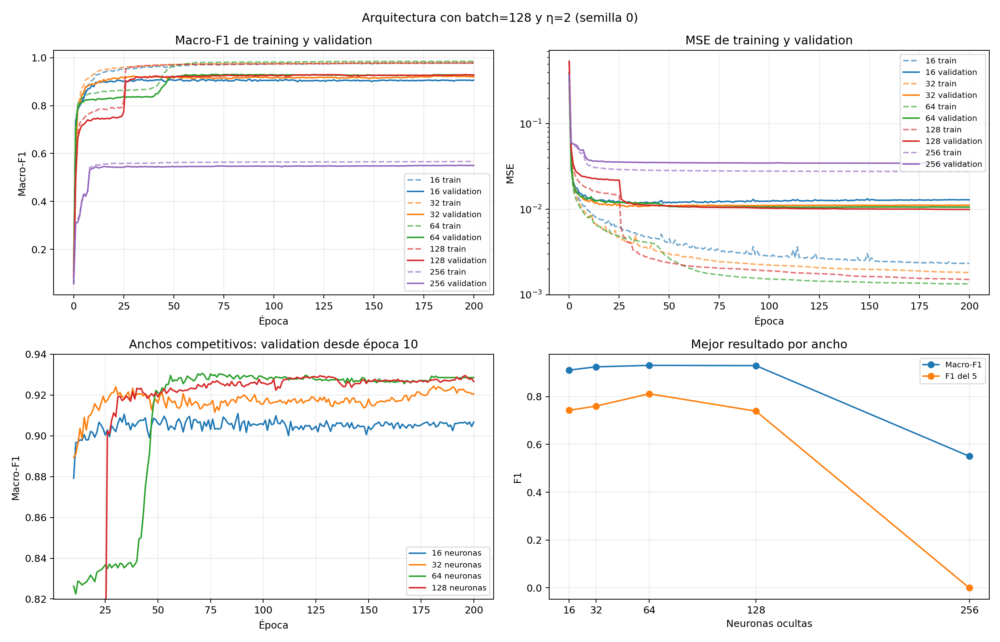

El resumen del mejor checkpoint se muestra tanto en escala completa como con un
zoom que conserva las diferencias entre los anchos competitivos:

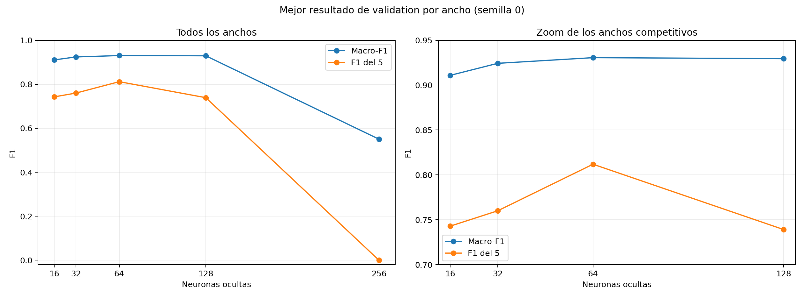

La mejora es monotónica hasta 64, pero presenta rendimientos decrecientes. Pasar
de 16 a 32 mejora 0,0134 de macro-F1; pasar de 32 a 64, que vuelve a duplicar
los parámetros, mejora 0,0063. Al pasar de 64 a 128 el macro-F1 disminuye
0,0011, aunque la accuracy aumenta 0,0064. Esa discrepancia se explica en parte
porque el F1 del 5 cae de 0,8119 a 0,7391: la accuracy favorece a 128 por su
resultado global, mientras macro-F1 penaliza su peor equilibrio entre clases.

Las redes de 16 a 128 no muestran underfitting clásico: todas superan 0,97 de
macro-F1 en training. En ellas, training continúa mejorando mientras validation
entra en meseta, lo que mantiene evidencia de overfitting leve. La red de 16 no
generaliza peor porque sea incapaz de ajustar training, sino porque su
representación produce una solución menos favorable sobre validation.

La red de 256 es cualitativamente distinta: training y validation quedan cerca
de 0,57 y 0,55, y el F1 del 5 es cero. Esto sí tiene la forma observacional de
underfitting, pero no se atribuye a falta de capacidad: es la red con más
parámetros. La explicación compatible con la evidencia es un problema de
optimización al combinar ese ancho con la inicialización fija y `eta=2`. Por lo
tanto, el resultado permite descartar 256 bajo la receta actual, pero no afirmar
que una red de 256 neuronas sea intrínsecamente peor.

Las curvas de 64 y 128 presentan transiciones abruptas: alrededor de la época
45 para 64 y de la 25 para 128. El historial agregado demuestra los saltos, pero
no permite atribuirlos a una clase determinada. El máximo de 128 es
prácticamente igual al de 64, pero requiere el doble de parámetros, tarda más y
obtiene un F1 del 5 considerablemente menor en esta semilla. Por ahora 64 queda
como mejor candidato, 32 como referencia de menor costo y 128 como alternativa
que debe contrastarse con más semillas antes de cerrar el ancho.

### Etapa 7: profundidad con presupuesto de parámetros comparable

Se comparó la red superficial `[784,64,10]` con `[784,64,16,10]`. La segunda
mantiene la primera capa de 64, agrega una capa oculta de 16 y aumenta la
cantidad de parámetros sólo 1,1 %. Se mantuvieron `batch=128`, `eta=2`, 200
épocas, split y semilla 0.

| Arquitectura | Parámetros | Mejor época | Train macro-F1 | Validation macro-F1 | Gap | Validation accuracy | F1 del 5 | Tiempo |
|---|---:|---:|---:|---:|---:|---:|---:|---:|
| `[784,64,10]` | 50.890 | 71 | 0,9805 | **0,9307** | **0,0499** | **0,9434** | **0,8119** | 6,18 s |
| `[784,64,16,10]` | 51.450 | 115 | **0,9905** | 0,9176 | 0,0728 | 0,9398 | 0,7071 | 6,61 s |
| `[784,64,32,10]` | 52.650 | 39 | 0,9857 | 0,9207 | 0,0650 | 0,9410 | 0,7255 | 6,98 s |
| `[784,64,64,10]` | 55.050 | 138 | 0,9840 | 0,9276 | 0,0563 | **0,9434** | 0,7800 | 7,96 s |

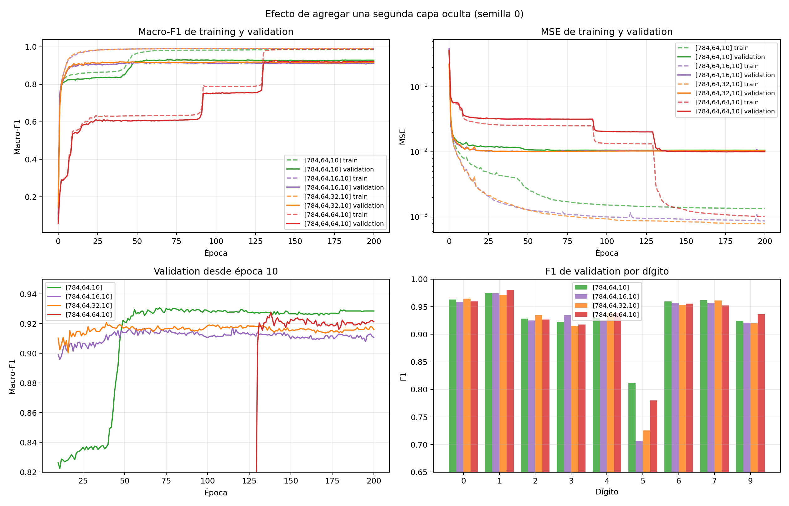

Las redes profundas mejoran el ajuste de training, pero no superan a la
superficial en validation. El cuello de 32 recupera 0,0030 de macro-F1 respecto
del cuello de 16, aunque todavía queda 0,0100 por debajo de la superficial y su
gap aumenta 0,0152. Al eliminar por completo el cuello con `[784,64,64,10]`, la
diferencia se reduce a 0,0030, pero todavía aumenta el gap, agrega 8,2 % de
parámetros y requiere más tiempo sin ofrecer una mejora de validation.

La diferencia global se concentra principalmente en el dígito 5. Su F1 pasa de
0,8119 en la superficial a 0,7071 con cuello de 16, 0,7255 con cuello de 32 y
0,7800 sin cuello; para las demás clases las diferencias son pequeñas.

El MSE de validation de los mejores checkpoints es casi idéntico —entre 0,01015
y 0,01059— aunque macro-F1 y F1 del 5 difieren. Esto vuelve a mostrar que
seleccionar únicamente por MSE o accuracy puede ocultar un deterioro en la
clase minoritaria.

La comparación sin cuello confirma que el deterioro grande de las primeras
redes profundas se debía en parte a la compresión, pero agregar profundidad no
produce una ganancia frente a la alternativa simple. La diferencia final de
0,0030 es pequeña y proviene de una única semilla; bajo el criterio declarado,
si dos alternativas son cercanas se conserva la más simple y barata. No se
justifica probar más capas ni otra grilla de profundidades. `[784,64,10]` queda
como candidato para la etapa de mecanismos de optimización; su estabilidad se
confirmará con semillas al comparar los finalistas completos.

### Evidencia reproducible de la extensión

- Configuraciones: `05-large-batch-learning-rate.json`,
  `05b-large-batch-learning-rate-lower.json`,
  `06-large-batch-finalists-seeds.json` y
  `06b-mid-batch-lr-2-seeds.json`; para arquitectura,
  `07-architecture-width-final.json`, `07b-architecture-width-upper.json` y
  `08-architecture-depth.json`, `08b-architecture-depth-wider.json` y
  `08c-architecture-depth-same-width.json`.
- Resultados completos: `results/05-*`, `results/05b-*`, `results/06-*` y
  `results/06b-*`; para arquitectura, `results/07-architecture-width-final/`
  `results/07b-architecture-width-upper/` y `results/08-architecture-depth/`.
  La extensión del cuello de botella está en
  `results/08b-architecture-depth-wider/`; la comparación sin cuello está en
  `results/08c-architecture-depth-same-width/`.
- Tablas y gráficos consolidados: `results/analysis-01-02/`.
- Regeneración: `python docs/ejercicio2/analyze_results.py` desde `tp3/`.

### Etapa 8: optimizadores y learning rate

Se fijaron `[784,64,10]`, batch 128, 200 épocas y el mismo holdout. En el
barrido inicial se utilizó la semilla 0 para aislar el efecto del optimizador y
su learning rate.

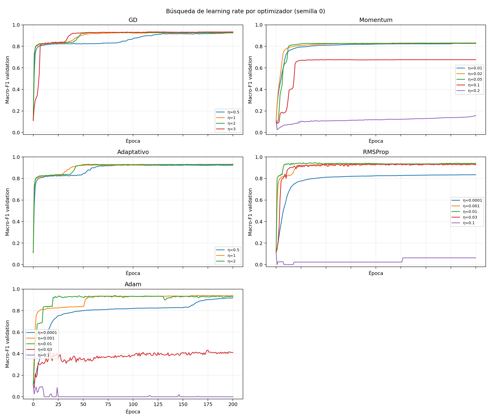

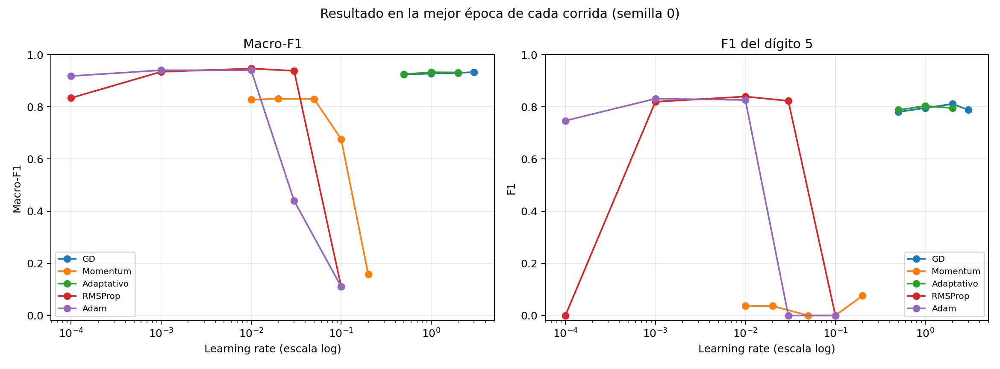

La expansión de los bordes fue necesaria. GD todavía mejoró de `eta=2` a
`eta=3` en la semilla 0. En cambio, RMSProp empeoró al pasar de `0.01` a `0.03`
y colapsó con `0.1`; Adam colapsó ya con `0.03`. Momentum no consiguió una
solución aceptable: incluso su mejor región prácticamente ignoró el dígito 5
(con `eta=0.02`, recall `0.0185` y F1 `0.0364`). Por este motivo Momentum se
descartó antes de la repetición con semillas.

Como GD `eta=2` y `eta=3`, y Adam `eta=0.001` y `eta=0.01`, no podían separarse
con seguridad a partir de una sola inicialización, se conservaron ambos valores
de cada familia. El adaptativo `eta0=1` y RMSProp `eta=0.01` completaron los seis
finalistas. Cada uno se repitió con cinco semillas, manteniendo fijo el split.

| Candidato | Macro-F1 media ± sd | Mínimo | F1 del 5 media ± sd | Corridas que ignoran el 5 | Mejor época media | Gap medio | Tiempo medio (s) |
|---|---:|---:|---:|---:|---:|---:|---:|
| GD `eta=2` | 0.9120 ± 0.0420 | 0.8372 | 0.6375 ± 0.3566 | 1/5 | 134.8 | 0.0484 | 6.26 |
| GD `eta=3` | 0.8817 ± 0.0714 | 0.7739 | 0.5884 ± 0.3349 | 1/5 | 123.8 | 0.0422 | 6.25 |
| Adaptativo `eta0=1` | 0.9332 ± 0.0030 | 0.9291 | 0.7921 ± 0.0351 | 0/5 | 151.0 | 0.0517 | 6.15 |
| RMSProp `eta=0.01` | **0.9472 ± 0.0029** | **0.9422** | **0.8438 ± 0.0175** | 0/5 | **66.0** | **0.0427** | 7.27 |
| Adam `eta=0.001` | 0.9368 ± 0.0031 | 0.9330 | 0.8009 ± 0.0249 | 0/5 | 180.8 | 0.0564 | 7.86 |
| Adam `eta=0.01` | 0.9413 ± 0.0042 | 0.9372 | 0.8155 ± 0.0248 | 0/5 | 99.8 | 0.0512 | 7.92 |

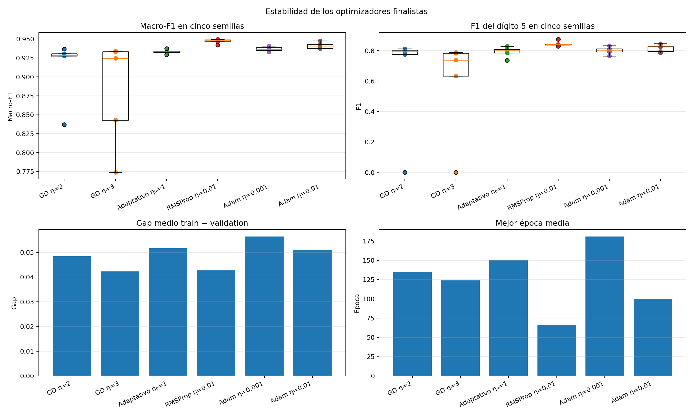

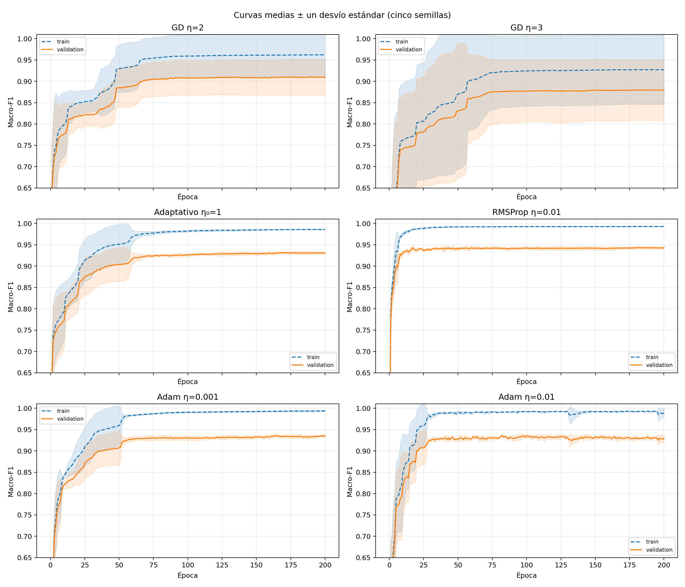

RMSProp con `eta=0.01` es el candidato provisional para la arquitectura de 64
neuronas. Obtiene la mayor media,
el mejor peor caso y el mejor F1 del dígito 5, con una dispersión pequeña. Su
tiempo total es alrededor de un segundo mayor que GD, pero llega al mejor
checkpoint en muchas menos épocas y evita sus fallos catastróficos. Adam con
`eta=0.01` queda como segunda alternativa; su macro-F1 medio es 0.0059 menor y
su F1 del 5 es 0.0283 menor.

Las curvas también muestran una brecha train-validation persistente en todos
los finalistas: hay algo de overfitting, no underfitting, una vez que el modelo
aprende. RMSProp alcanza rápidamente su meseta y continuar hasta 200 épocas no
aporta una mejora sistemática. Para el modelo final no se debe elegir “200” por
ser el máximo: la cantidad de épocas se fijará a partir de sus mejores épocas
entre semillas. La gran variación de esa época (`17` a `188`) aconseja basarse
en una regla robusta o validar early stopping antes de congelarla.

Evidencia reproducible:

- búsquedas: `09-optimizer-learning-rate.json` y
  `09b-optimizer-learning-rate-boundaries.json`;
- cinco semillas: `10-optimizer-finalists-seeds.json`;
- resultados completos: `results/09-*`, `results/09b-*` y `results/10-*`;
- tablas: `optimizer-learning-rate-summary.csv`,
  `optimizer-finalists-seeds.csv` y `optimizer-finalists-summary.csv` dentro de
  `results/analysis-01-02/`.

### Etapa 9: interacción entre arquitectura y optimizador

La selección secuencial de arquitectura y optimizador supone que su interacción
no cambia el ranking. Para comprobarlo sin ejecutar el producto cartesiano
completo, se fijaron batch 128, split, 200 épocas y semilla 0, y se cruzaron
cinco arquitecturas representativas con los tres mecanismos competitivos:
adaptativo (`eta0=1`), RMSProp (`eta=0.01`) y Adam (`eta=0.01`).

La tabla muestra `macro-F1 / F1 del 5` en el mejor checkpoint:

| Arquitectura | Adaptativo | RMSProp | Adam |
|---|---:|---:|---:|
| `[784,32,10]` | 0.9234 / 0.7525 | 0.9308 / 0.7664 | 0.9219 / 0.7429 |
| `[784,64,10]` | 0.9333 / 0.8039 | 0.9474 / 0.8400 | 0.9410 / 0.8269 |
| `[784,128,10]` | 0.9209 / 0.7191 | **0.9519 / 0.8440** | 0.8515 / 0.0000 |
| `[784,256,10]` | 0.6846 / 0.0000 | 0.6910 / 0.0000 | 0.5602 / 0.0000 |
| `[784,64,64,10]` | 0.9365 / 0.7755 | 0.7647 / 0.2848 | 0.9436 / 0.8235 |

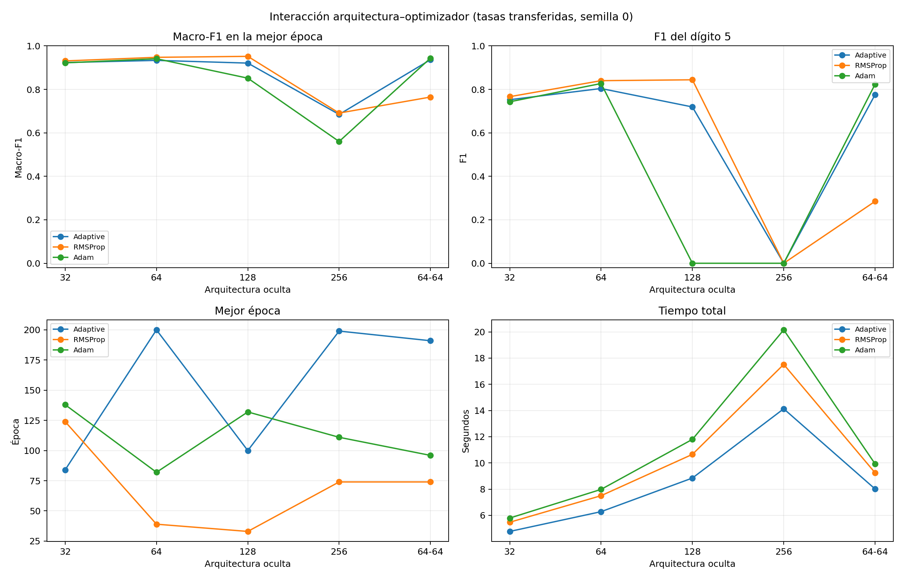

El ranking depende del optimizador: 128 mejora a 64 con RMSProp, mientras Adam
`eta=0.01` deja de reconocer el 5; la red profunda funciona con Adam y el
adaptativo, pero la misma tasa de RMSProp produce una solución deficiente. Por
eso, los resultados bajos de una celda no se atribuyeron inmediatamente a la
arquitectura.

Se ajustaron tasas sólo en las combinaciones problemáticas. Bajar Adam a
`eta=0.003` rescata la red de 128 y produce macro-F1 0.9524 y F1 del 5 0.8544.
RMSProp `eta=0.001` también rescata la red profunda hasta 0.9367, aunque no
supera a las superficiales. En 256, reducir las tasas mejora el macro-F1 hasta
0.8549, pero la mejor corrida continúa con F1 del 5 igual a cero; no se
justifica ampliar más esta rama.

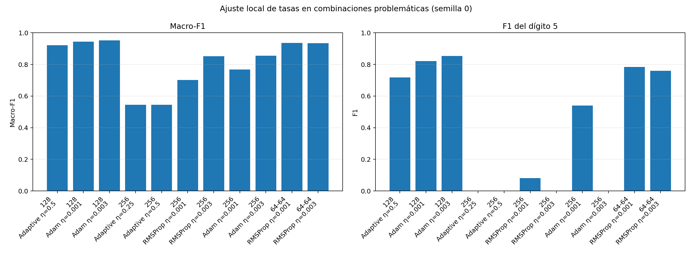

Los finalistas fueron 64 + RMSProp `0.01`, 128 + RMSProp `0.01`, 128 + Adam
`0.003` y la profunda 64-64 + Adam `0.01`. Se repitieron con cinco semillas; el
primer candidato reutiliza las cinco corridas de la etapa anterior.

| Combinación | Macro-F1 media ± sd | Mínimo | F1 del 5 media ± sd | Mejor época media | Gap medio | Tiempo medio (s) |
|---|---:|---:|---:|---:|---:|---:|
| 64 + RMSProp `0.01` | 0.9472 ± 0.0029 | 0.9422 | 0.8438 ± 0.0175 | 66.0 | 0.0427 | **7.27** |
| 128 + RMSProp `0.01` | 0.9010 ± 0.0757 | 0.7874 | 0.6578 ± 0.3513 | 69.6 | 0.0328 | 10.82 |
| 128 + Adam `0.003` | **0.9523 ± 0.0018** | **0.9503** | **0.8465 ± 0.0081** | 148.4 | 0.0426 | 12.10 |
| 64-64 + Adam `0.01` | 0.9330 ± 0.0271 | 0.8845 | 0.7522 ± 0.2180 | 113.0 | 0.0432 | 9.91 |

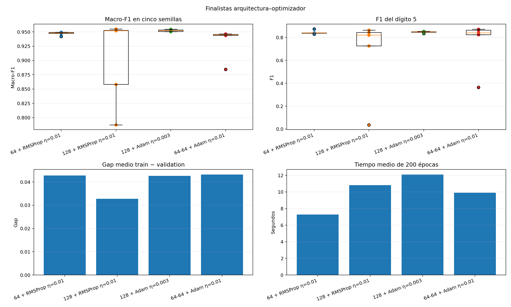

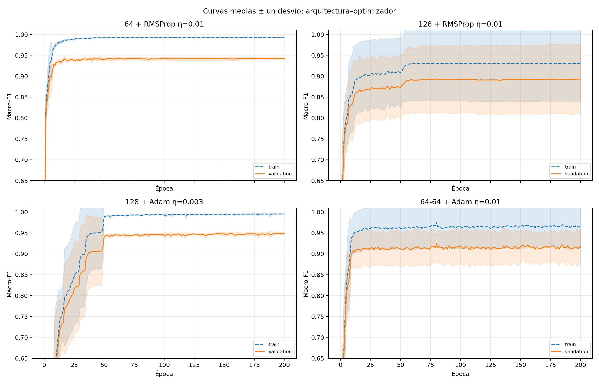

La interacción no era menor. La excelente corrida aislada de 128 + RMSProp no
es reproducible: dos semillas quedan atrapadas en soluciones pobres. La red
profunda también presenta una semilla deficiente. En cambio, 128 + Adam
`eta=0.003` obtiene el mayor macro-F1 en las cinco semillas, el mejor peor caso
y la menor dispersión. Su mejora pareada frente a 64 + RMSProp es positiva en
las cinco semillas: media 0.0050, con diferencias entre 0.0008 y 0.0110.

Por desempeño primario queda seleccionada provisionalmente la combinación
`[784,128,10]` + Adam `eta=0.003`. Duplica los parámetros de la red de 64 y
eleva el tiempo de 7.27 a 12.10 segundos; por eso 64 + RMSProp permanece como
alternativa de menor costo en el frente de Pareto. La siguiente etapa debe
revalidar batch alrededor de la combinación ganadora, porque batch 128 todavía
fue elegido originalmente con descenso básico.

Evidencia reproducible:

- matriz inicial: `11-architecture-optimizer-interaction.json`;
- ajuste local: `11b-architecture-optimizer-local-rates.json`;
- finalistas: `12-architecture-optimizer-finalists-seeds.json`;
- resultados: `results/11-*`, `results/11b-*` y `results/12-*`;
- tablas consolidadas: `architecture-optimizer-interaction.csv`,
  `architecture-optimizer-local-rates.csv`,
  `architecture-optimizer-finalists-seeds.csv` y
  `architecture-optimizer-finalists-summary.csv` en
  `results/analysis-01-02/`.

### Etapa 10: revalidación conjunta de batch y learning rate con Adam

Como batch 128 había sido elegido originalmente con descenso básico, se volvió
a estudiar después de seleccionar `[784,128,10]` y Adam. No se fijó
prematuramente `eta=0.003`: batch y tasa se cruzaron en una matriz de 15
corridas, con el mismo split, 200 épocas y semilla 0:

```text
batch = 32, 64, 128, 256, 512
eta   = 0.001, 0.003, 0.01
```

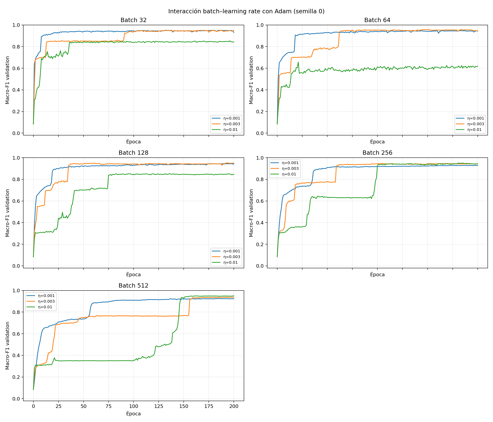

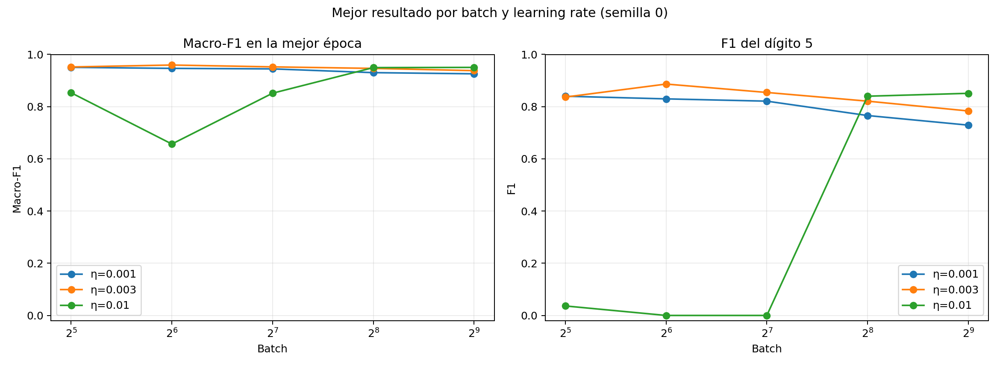

`eta=0.003` define la región útil para batches 32, 64 y 128. Batch 64 produjo
el mayor pico aislado, macro-F1 0.9595 y F1 del 5 0.8866. `eta=0.01` fue
demasiado agresivo para los batches pequeños y llegó a ignorar el dígito 5 en
varias combinaciones. En batch 512, en cambio, las tasas `0.003` y `0.01`
todavía mejoraban al llegar a la época 200, porque cada época contiene sólo
unas 20 actualizaciones.

Para no confundir falta de actualizaciones con peor generalización, sólo esos
dos casos de batch 512 se extendieron a 600 épocas. Esto lleva el presupuesto a
unas 12.000 actualizaciones, cercano a las 15.600 de batch 128 durante 200
épocas. Batch 512 + `eta=0.003` alcanzó 0.9443 en la época 406; con `eta=0.01`
alcanzó 0.9527 en la época 281. Ninguno siguió mejorando sistemáticamente hasta
600.

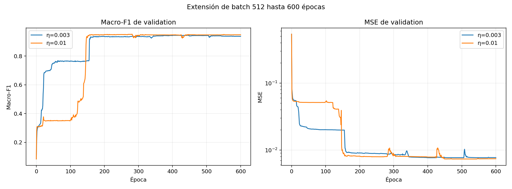

Se repitieron con cinco semillas batch 64 + `eta=0.003` y batch 512 +
`eta=0.01`. Para batch 128 + `eta=0.003` se reutilizaron las cinco semillas de
la etapa de interacción arquitectura–optimizador.

| Combinación | Macro-F1 media ± sd | Mínimo | F1 del 5 media ± sd | Mejor época media | Actualizaciones al mejor punto | Tiempo medio (s) |
|---|---:|---:|---:|---:|---:|---:|
| Batch 64, `eta=0.003` | **0.9541 ± 0.0035** | 0.9502 | **0.8489 ± 0.0294** | 146.6 | 23.057 | 17.53 |
| Batch 128, `eta=0.003` | 0.9523 ± **0.0018** | **0.9503** | 0.8465 ± **0.0081** | 148.4 | 11.575 | **12.10** |
| Batch 512, `eta=0.01` | 0.8779 ± 0.0717 | 0.7825 | 0.4795 ± 0.4009 | 441.8 | **8.836** | 24.12 |

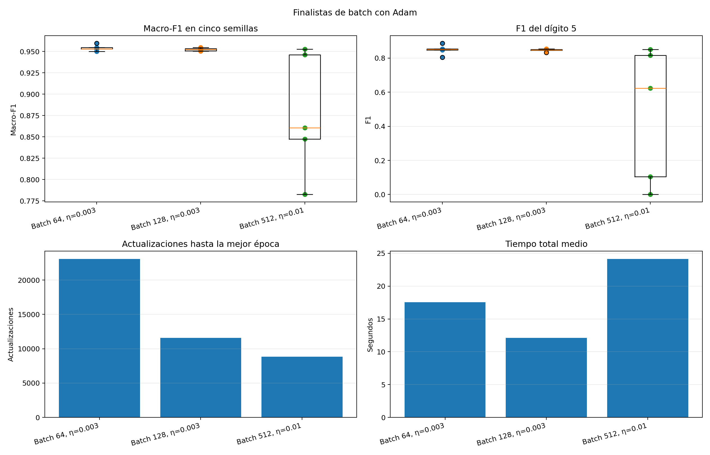

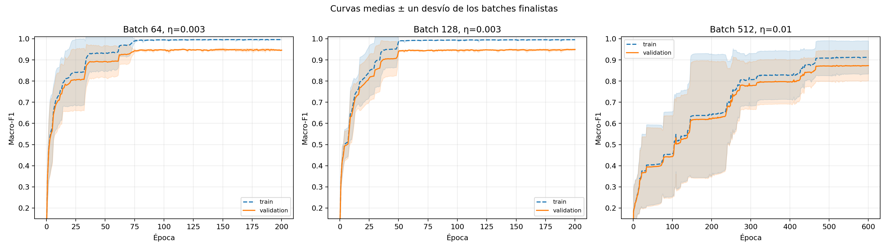

El pico de batch 64 no se traduce en una ventaja sistemática: su mejora media
frente a batch 128 es sólo 0.0018, cambia de signo según la semilla y es menor
que la dispersión experimental. Además, requiere el doble de actualizaciones,
tarda 45 % más y presenta mayor variación tanto en macro-F1 como en F1 del 5.
Batch 512 es cualitativamente inestable: una semilla no reconoce el 5 y otras
quedan atrapadas en soluciones pobres incluso con 600 épocas.

Se conserva **batch 128 con `eta=0.003`**. Por lo tanto, después de revalidar la
interacción, la combinación candidata completa sigue siendo
`[784,128,10]` + Adam `eta=0.003` + batch 128. La próxima etapa puede estudiar
las modalidades extremas online y full batch, con horizontes y tasas propios,
y luego congelar la cantidad de épocas.

Evidencia reproducible:

- matriz batch–tasa: `13-adam-batch-learning-rate.json`;
- extensión de batch 512: `13b-adam-batch-512-extension.json`;
- cinco semillas finalistas: `14-adam-batch-finalists-seeds.json`;
- resultados: `results/13-*`, `results/13b-*` y `results/14-*`;
- tablas consolidadas: `adam-batch-learning-rate-summary.csv`,
  `adam-batch-512-extension-summary.csv`, `adam-batch-finalists-seeds.csv` y
  `adam-batch-finalists-summary.csv` en `results/analysis-01-02/`.

### Etapa 11: modalidades online y full batch

Las modalidades extremas no se compararon con 200 épocas comunes. Con 9.959
muestras de training, una época online contiene 9.959 actualizaciones, una de
mini-batch 128 contiene 78 y una full batch contiene sólo una. Se asignaron
tasas y horizontes específicos:

- online: `eta=0.0001,0.0003,0.001,0.003`, inicialmente cinco épocas;
- full batch: `eta=0.003,0.01,0.03`, hasta 3.000 épocas;
- mini-batch 128: se reutiliza Adam `eta=0.003` hasta 200 épocas.

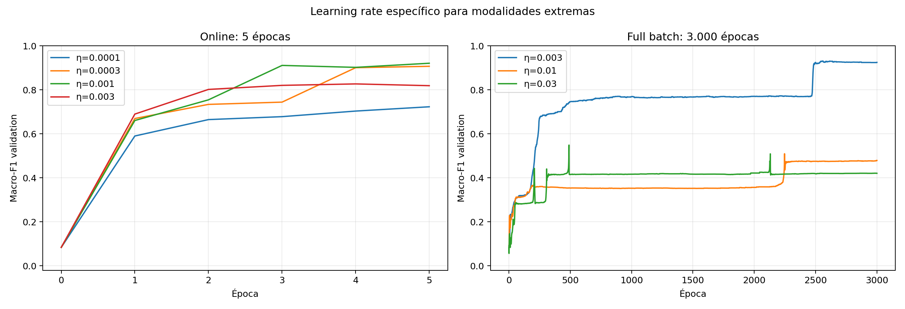

En online, `eta=0.001` fue la única tasa que combinó progreso rápido y una
trayectoria útil. Como todavía mejoraba en la época 5, se extendió primero a 15
y luego a 30. Su mejor checkpoint quedó en la época 16; desde allí las métricas
oscilaron sin una mejora sostenida. Las cinco semillas finalistas se limitaron
a 20 épocas, que cubren ese óptimo sin pagar diez épocas innecesarias.

En full batch, `eta=0.003` fue la mejor tasa. Presentó una transición muy tardía
y alcanzó macro-F1 0.9312 en la época 2.560; las últimas 500 épocas cambiaron el
resultado final en apenas 0.0002. `eta=0.01` y `0.03` quedaron en 0.5096 y
0.5490. Por distancia respecto del mini-batch y por costo, full batch se
descartó sin multiplicar otras 3.000 épocas por cinco semillas.

La comparación estable entre online y mini-batch es:

| Modalidad | Macro-F1 media ± sd | Mínimo | F1 del 5 media ± sd | Mejor época media | Actualizaciones al mejor punto | Tiempo total medio (s) |
|---|---:|---:|---:|---:|---:|---:|
| Online, `eta=0.001` | 0.9463 ± 0.0031 | 0.9423 | 0.8169 ± 0.0228 | 17.8 | 177.270 | 77.38 |
| Mini-batch 128, `eta=0.003` | **0.9523 ± 0.0018** | **0.9503** | **0.8465 ± 0.0081** | 148.4 | **11.575** | **12.10** |

Como referencia separada, full batch `eta=0.003` obtuvo macro-F1 0.9312, F1
del 5 0.7629 y gap 0.0575 en una corrida de 96.48 segundos. Su mejor época
equivale a 2.560 actualizaciones pero a aproximadamente 25,5 millones de
ejemplos procesados. Online procesa unos 177 mil ejemplos hasta su mejor punto;
mini-batch 128 procesa alrededor de 1,48 millones, pero aprovecha operaciones
vectorizadas y resulta más rápido en tiempo de pared.

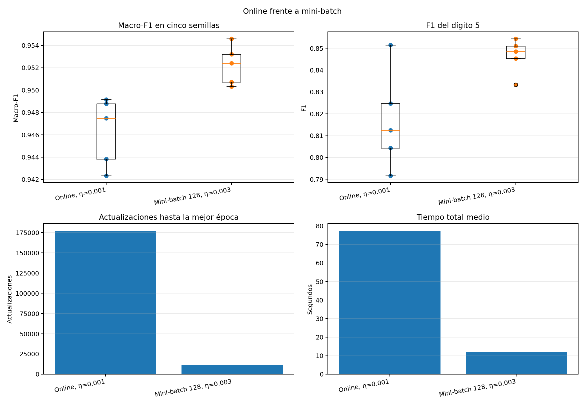

El siguiente gráfico usa actualizaciones en el eje horizontal, no épocas. Los
puntos online sólo se miden al terminar cada época; las líneas entre esos puntos
son interpolaciones visuales, no mediciones intermedias.

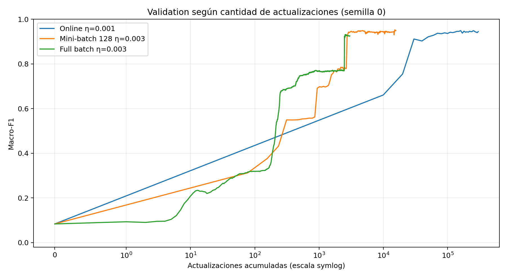

Mini-batch 128 domina a online en macro-F1, F1 del 5, dispersión y tiempo, y
supera ampliamente a full batch. Por lo tanto queda definitivamente fijado
**batch 128**.

No se abre una búsqueda adicional de cantidad de épocas. Las curvas existentes
son suficientes para responder si 200 alcanza: el MSE medio de validation es
0.00755 en la época 125, 0.00751 en la 150, 0.00744 en la 175 y 0.00742 en la
200. No es estrictamente monótono —por ejemplo sube a 0.00785 en la 180— y las
mejoras tardías son pequeñas frente a esas oscilaciones. Los mejores macro-F1
de las cinco semillas aparecen entre las épocas 87 y 193; ninguno necesita
superar 200. Training MSE todavía puede bajar porque la red continúa ajustando
training, pero eso no implica que validation siga mejorando.

Por lo tanto, **200 épocas es un horizonte suficiente para mostrar llegada a
una región estacionaria** y se conserva como máximo de entrenamiento. Los
checkpoints intermedios y el mejor punto de validation sirven para describir la
convergencia experimental, pero no se presenta la época como otro
hiperparámetro sometido a una grilla profunda.

Evidencia reproducible:

- piloto online: `15a-adam-online-pilot.json`;
- piloto full batch: `15b-adam-full-batch-pilot.json`;
- extensiones online: `15c-adam-online-extension.json` y
  `15d-adam-online-final-extension.json`;
- cinco semillas online: `16-adam-online-finalist-seeds.json`;
- resultados completos: `results/15a-*`, `results/15b-*`, `results/15c-*`,
  `results/15d-*` y `results/16-*`;
- tablas: `adam-extreme-modalities-pilots.csv`,
  `adam-extreme-modalities-seeds.csv` y
  `adam-extreme-modalities-summary.csv` en `results/analysis-01-02/`.

### Etapa 12: sensibilidad a la partición training–validation

Hasta esta etapa, la comparación principal se había hecho sobre una única
partición estratificada, definida por `validation_seed=0`. Para comprobar que
la elección no dependiera de qué ejemplos habían quedado en validation, se
compararon los dos candidatos finales sobre cinco particiones estratificadas
80/20 (`validation_seed=0,1,2,3,4`):

- candidato de mayor desempeño: `[784,128,10]` + Adam, `eta=0.003`, batch 128;
- alternativa de menor costo: `[784,64,10]` + RMSProp, `eta=0.01`, batch 128.

En esta prueba se cambió solamente la semilla de la partición. La
inicialización de pesos y el orden de barajado se mantuvieron en la semilla 0,
de modo que la variación observada corresponde principalmente al cambio de
los ejemplos asignados a training y validation. Para `validation_seed=0` se
reutilizaron corridas ya existentes; las otras cuatro particiones se
entrenaron durante 200 épocas.

| Candidato | Macro-F1 media ± sd | Mínimo | F1 del 5 media ± sd | Gap medio | Mejor época media |
|---|---:|---:|---:|---:|---:|
| 128 + Adam `0.003` | **0.9532 ± 0.0070** | 0.9470 | 0.8655 ± 0.0472 | 0.0413 | 126.8 |
| 64 + RMSProp `0.01` | 0.9523 ± **0.0046** | **0.9474** | **0.8789 ± 0.0381** | **0.0378** | 63.8 |

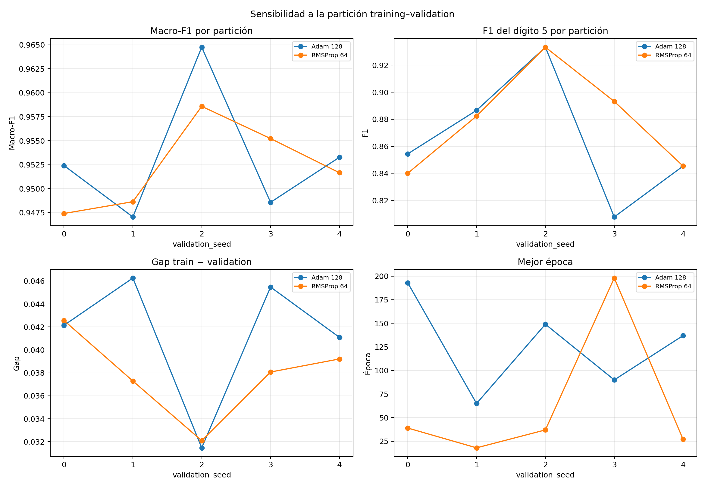

El orden entre los candidatos cambia según la partición. Adam obtiene mayor
macro-F1 en las particiones 0, 2 y 4, mientras que RMSProp gana en 1 y 3. La
diferencia pareada media a favor de Adam es apenas 0.0009, con un desvío de
0.0052: la ventaja media es mucho menor que su variación entre particiones.
En F1 del dígito 5, RMSProp obtiene una media 0.0134 mayor; también aquí existe
variación importante, incluida una diferencia aislada de 0.0855 a su favor en
la partición 3.

Por lo tanto, estas corridas no permiten afirmar que 128 + Adam sea superior
independientemente de la partición. Se cumplen los criterios definidos para
justificar una validación cruzada final: el ranking cambia, la diferencia
media es menor que la variación y el F1 de la clase difícil es sensible al
split. El paso siguiente no es abrir otra búsqueda de hiperparámetros, sino
realizar **5-fold cross-validation únicamente entre estos dos finalistas**.
Eso permite estimar el desempeño usando cada quinto del conjunto como
validation una vez, con pliegues idénticos para ambos candidatos. Recién con
ese resultado se congela el modelo final y se reserva el conjunto de test para
una única evaluación no usada en la selección.

Evidencia reproducible:

- particiones 1 a 4: `17a-partition-sensitivity-split-1.json` hasta
  `17d-partition-sensitivity-split-4.json`;
- resultados: `results/17a-*` hasta `results/17d-*`; la partición 0 se
  reutiliza de `results/12-*` y `results/10-*`;
- observaciones por partición: `partition-sensitivity-seeds.csv`;
- resumen y diferencias pareadas: `partition-sensitivity-summary.csv` y
  `partition-sensitivity-paired.csv`, en `results/analysis-01-02/`.

### Etapa 13: validación cruzada estratificada de los finalistas

La distribución multiclase motivó desde el comienzo el uso de particiones
estratificadas, pero no obligaba a multiplicar por cinco toda la búsqueda. El
holdout fijo permitió explorar learning rate, batch, arquitectura y
optimizador bajo condiciones comparables. La validación cruzada se reservó
para cuando la sensibilidad a la partición mostrara que el ranking final era
incierto, tal como ocurrió en la etapa anterior.

En lugar de repetir la grilla completa, se eligió una solución intermedia que
comprueba las dos arquitecturas y los dos optimizadores relevantes:

- `[784,64,10]` + Adam, `eta=0.01`;
- `[784,64,10]` + RMSProp, `eta=0.01`;
- `[784,128,10]` + Adam, `eta=0.003`;
- `[784,128,10]` + RMSProp, `eta=0.01`.

Se construyeron cinco folds estratificados, disjuntos y exhaustivos. Cada
muestra de `digits.csv` participa exactamente una vez en validation y cuatro
veces en training. Los cuatro candidatos usan los mismos índices en cada fold;
se fijaron batch 128, 200 épocas, inicialización 0 y semilla de barajado 0.
Así, las veinte corridas aíslan principalmente el efecto de la composición del
fold y de la configuración evaluada. El conjunto `digits_test.csv` permanece
sin abrir.

| Candidato | Macro-F1 media ± sd | Mínimo | F1 del 5 media ± sd | Gap medio | Mejor época media | Tiempo medio (s) | Parámetros |
|---|---:|---:|---:|---:|---:|---:|---:|
| 64 + Adam `0.01` | 0.9426 ± **0.0029** | 0.9376 | 0.8240 ± 0.0297 | 0.0473 | 147.8 | 7.89 | 50.890 |
| 64 + RMSProp `0.01` | 0.9512 ± 0.0066 | 0.9415 | **0.8660 ± 0.0286** | 0.0412 | **69.2** | **7.33** | **50.890** |
| 128 + Adam `0.003` | **0.9544 ± 0.0080** | **0.9437** | 0.8657 ± 0.0472 | 0.0406 | 146.0 | 11.61 | 101.770 |
| 128 + RMSProp `0.01` | 0.8990 ± 0.0550 | 0.8556 | 0.3729 ± 0.4653 | **0.0265** | 106.8 | 10.61 | 101.770 |

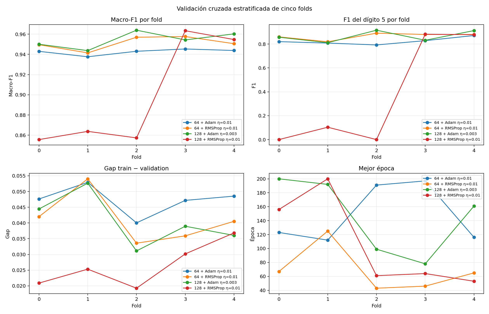

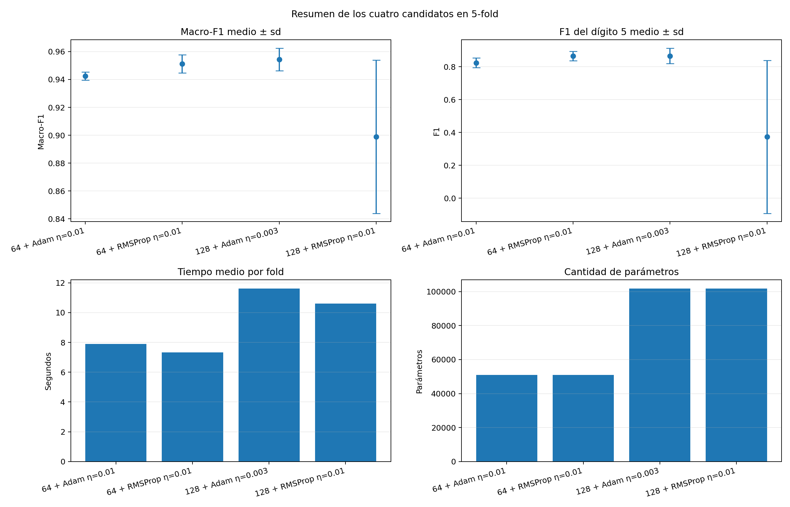

La comparación ampliada confirma que la interacción arquitectura–optimizador
es real. Con 64 neuronas, RMSProp supera a Adam en macro-F1 y F1 del 5 en los
cinco folds. En cambio, RMSProp no es confiable con 128 neuronas: en tres folds
queda cerca de 0.86 de macro-F1, ignora completamente el dígito 5 en dos de
ellos y sólo en dos folds alcanza la región de los mejores modelos. Su gap
pequeño no indica buena generalización, sino que training y validation quedan
simultáneamente en una solución pobre.

Los únicos finalistas consistentes son 128 + Adam y 64 + RMSProp. Adam gana
macro-F1 en cuatro de cinco folds, con una diferencia pareada media de 0.0032
y desvío 0.0052. Con sólo cinco observaciones, el intervalo aproximado del 95 %
para esa diferencia incluye cero (`[-0.0033, 0.0097]`), por lo que no hay
evidencia fuerte de una superioridad sistemática. Para el dígito 5, la
diferencia media es prácticamente nula: −0.0003 a favor de RMSProp. Adam tiene
un mínimo algo mayor y un gap marginalmente menor, pero duplica los parámetros
y tarda aproximadamente 58 % más por fold.

Los valores de 5-fold son consistentes con los protocolos 80/20 anteriores.
Con split fijo y cinco semillas, Adam-128 había obtenido macro-F1
`0.9523 ± 0.0018` y RMSProp-64 `0.9472 ± 0.0029`; al cambiar cinco veces la
partición 80/20, las medias fueron `0.9532 ± 0.0070` y `0.9523 ± 0.0046`.
En 5-fold resultaron `0.9544 ± 0.0080` y `0.9512 ± 0.0066`. Por lo tanto, el
cambio de protocolo no produce un salto de desempeño ni contradice el estudio
previo: Adam mantiene una ventaja pequeña en macro-F1 y ambos modelos quedan
prácticamente empatados en F1 del 5. La mayor dispersión al variar los datos de
validation confirma que una única partición subestimaba la incertidumbre, pero
no invalida las etapas exploratorias anteriores.

La validación cruzada no se aplicó sólo a Adam: se compararon las cuatro
combinaciones de 64/128 neuronas con Adam/RMSProp sobre exactamente los mismos
folds. Luego también se comprobaron variantes de batch para RMSProp. No se
repitió la grilla completa porque las etapas anteriores funcionaron como un
embudo: descartaron tasas, arquitecturas y modalidades claramente inferiores,
y 5-fold se reservó para confirmar las decisiones que seguían siendo
competitivas.

Como macro-F1 es la métrica primaria, se selecciona **`[784,128,10]` + Adam,
`eta=0.003`, batch 128 y máximo de 200 épocas**. Obtiene la mayor media, gana
cuatro de cinco folds y presenta el mejor mínimo. RMSProp-64 queda como
alternativa eficiente en el frente de Pareto: conserva un F1 del 5 equivalente
con la mitad de parámetros y menor tiempo, pero no se lo declara ganador por
costo cuando el criterio principal del ejercicio es desempeño predictivo.

Evidencia reproducible:

- configuraciones: `18a-cross-validation-fold-0.json` hasta
  `18e-cross-validation-fold-4.json`;
- resultados completos: `results/18a-*` hasta `results/18e-*`;
- métricas por fold: `cross-validation-folds.csv`;
- agregados y diferencias pareadas: `cross-validation-summary.csv` y
  `cross-validation-paired.csv`, en `results/analysis-01-02/`.

### Etapa 14: revalidación de batch para la alternativa RMSProp

Aunque Adam-128 queda seleccionado por desempeño, RMSProp-64 permanece muy
cerca y ofrece menor costo. Como su batch 128 había sido revalidado
principalmente con Adam, se comprobó si una interacción batch–tasa favorable
podía cambiar la comparación. Se realizó una última búsqueda dirigida sobre
`[784,64,10]`; no se repitieron arquitectura, profundidad ni todos los
optimizadores, porque esas interacciones ya habían sido estudiadas.

En el split estratificado fijo se cruzaron cinco batches y tres tasas, para un
total de quince corridas:

```text
batch = 32, 64, 128, 256, 512
eta   = 0.003, 0.01, 0.03
```

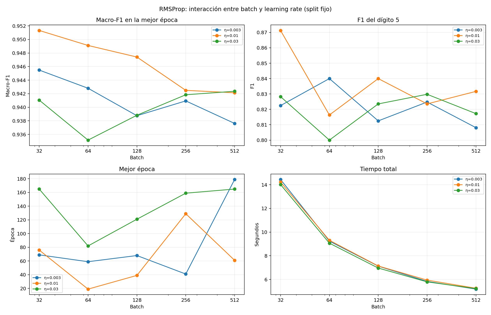

`eta=0.01` resultó la mejor tasa para los tres batches competitivos. En la
corrida exploratoria, batch 32 obtuvo macro-F1 0.9513, batch 64 obtuvo 0.9491 y
batch 128 obtuvo 0.9474. Los batches 256 y 512 no superaron aproximadamente
0.9425. Sus mejores puntos aparecieron dentro de las 200 épocas y las curvas
ya habían alcanzado la región de meseta, por lo que no se justificó extender
su horizonte.

El máximo aislado de batch 32 no se tomó como resultado definitivo. Se
confirmaron batch 32 y 64 con los mismos cinco folds de la etapa anterior, y
se reutilizaron las corridas ya existentes de RMSProp batch 128 y Adam-128:

| Candidato | Macro-F1 media ± sd | Mínimo | F1 del 5 media ± sd | Gap medio | Mejor época media | Tiempo medio (s) |
|---|---:|---:|---:|---:|---:|---:|
| RMSProp-64, batch 32 | 0.9512 ± 0.0085 | 0.9386 | 0.8563 ± 0.0381 | **0.0396** | 86.0 | 14.08 |
| RMSProp-64, batch 64 | 0.9501 ± 0.0090 | 0.9400 | 0.8611 ± 0.0509 | 0.0411 | **64.4** | 9.39 |
| RMSProp-64, batch 128 | 0.9512 ± 0.0066 | 0.9415 | **0.8660 ± 0.0286** | 0.0412 | 69.2 | **7.33** |
| **Adam-128, batch 128** | **0.9544 ± 0.0080** | **0.9437** | 0.8657 ± 0.0472 | 0.0406 | 146.0 | 11.61 |

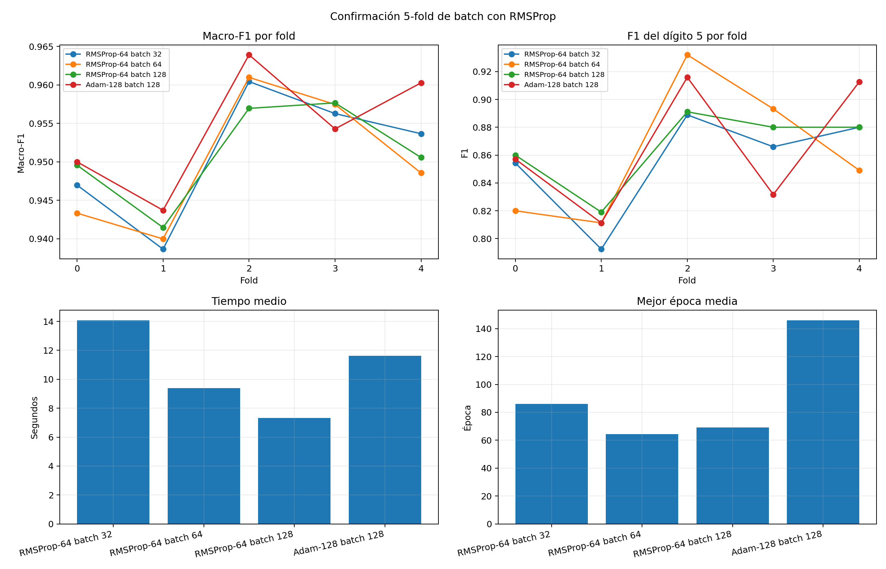

Batch 32 queda esencialmente empatado con batch 128 en macro-F1: la diferencia
pareada media es −0.00004 y cambia de signo entre folds. Sin embargo, no lo
supera en F1 del 5 en ningún fold —empata en uno y pierde en cuatro—, presenta
mayor dispersión y tarda 14.08 frente a 7.33 segundos. Batch 64 tiene una
diferencia media de −0.0012 en macro-F1 y sólo gana uno de cinco folds; tampoco
mejora el F1 del 5 ni el tiempo.

Por lo tanto, la revalidación específica para RMSProp conserva **batch 128**,
pero ninguna de sus variantes supera a Adam-128 en la métrica primaria. La
configuración final continúa siendo `[784,128,10]` + Adam `eta=0.003` + batch
128 + máximo de 200 épocas. El estudio dirigido fortalece la conclusión de que
RMSProp-64 es una alternativa de menor costo, no una configuración omitida que
cambie al ganador. El conjunto de test permanece reservado para la evaluación
única posterior al congelamiento.

Evidencia reproducible:

- matriz exploratoria: `19-rmsprop-batch-learning-rate.json` y
  `results/19-rmsprop-batch-learning-rate/`;
- confirmación: `20a-rmsprop-batch-finalists-fold-0.json` hasta
  `20e-rmsprop-batch-finalists-fold-4.json` y sus carpetas `results/20a-*`
  hasta `results/20e-*`;
- tablas: `rmsprop-batch-learning-rate.csv`,
  `rmsprop-batch-finalists-folds.csv`,
  `rmsprop-batch-finalists-summary.csv` y
  `rmsprop-batch-finalists-paired.csv`, en `results/analysis-01-02/`.

### Etapa 15: congelamiento y evaluación final en test

Antes de consultar las etiquetas de test se congeló la configuración completa:

```text
arquitectura      = [784, 128, 10]
activaciones      = tanh, logistic
loss              = MSE
inicialización    = uniforme, escala 0.5, semilla 0
optimizador       = Adam (beta1=0.9, beta2=0.999, epsilon=1e-8)
learning rate     = 0.003
batch             = 128
shuffle           = sí, semilla 0
épocas            = 200
```

Se eligieron 200 épocas porque, al promediar los cinco folds, validation no
mostraba deterioro entre las épocas 161 y 200: macro-F1 aumentaba de 0.9500 a
0.9524, MSE bajaba de 0.00695 a 0.00680 y el gap descendía de 0.0452 a 0.0433.
Luego se entrenó una red nueva con las 12.449 muestras completas de
`digits.csv`, sin validation ni selección de checkpoint. Sólo después de
finalizar ese entrenamiento se realizó una única evaluación predictiva sobre
las 2.497 muestras de `digits_test.csv`. Ningún resultado de test se utilizó
para modificar el modelo.

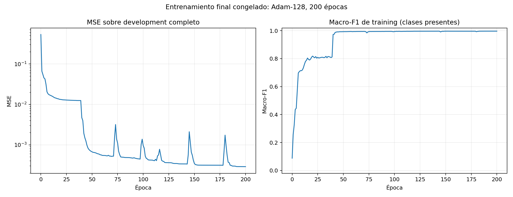

El modelo alcanza macro-F1 0.9968 sobre development completo y MSE 0.000289 al
terminar. El desempeño externo final es:

| Métrica | Test completo |
|---|---:|
| Accuracy | **0.8654** |
| Macro-F1, diez dígitos | **0.8193** |
| F1 del dígito 5 | **0.8796** |
| MSE | **0.01998** |

La diferencia principal respecto de validation es una limitación de cobertura
ya detectada en el EDA: `digits.csv` no contiene ningún 8, mientras que test
contiene 243. El modelo nunca predice la clase 8 y, por lo tanto, su recall y
F1 para esa clase son cero. Los ochos se reparten principalmente entre 3 (76),
2 (44), 9 (42), 4 (27) y 5 (18). Esto no es underfitting que pueda resolverse
con más épocas: falta por completo la señal supervisada necesaria para aprender
la clase.

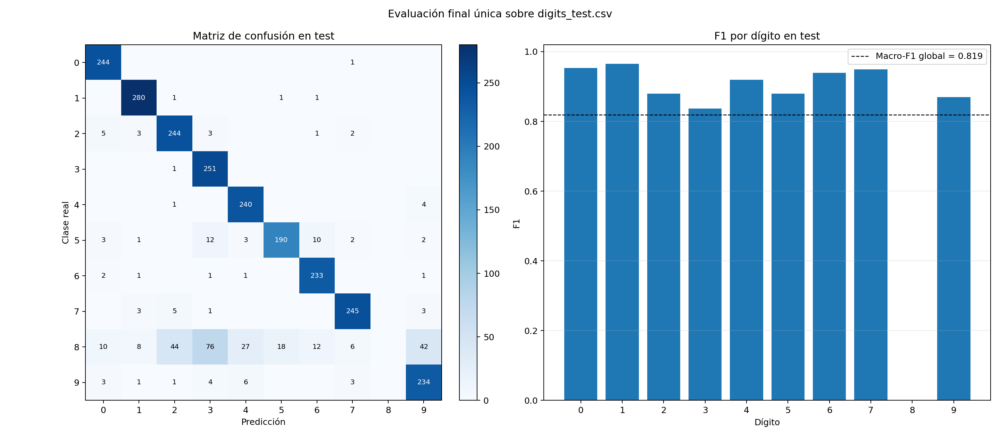

| Dígito | Precision | Recall | F1 | Soporte |
|---:|---:|---:|---:|---:|
| 0 | 0.9139 | 0.9959 | 0.9531 | 245 |
| 1 | 0.9428 | 0.9894 | 0.9655 | 283 |
| 2 | 0.8215 | 0.9457 | 0.8793 | 258 |
| 3 | 0.7213 | 0.9960 | 0.8367 | 252 |
| 4 | 0.8664 | 0.9796 | 0.9195 | 245 |
| 5 | 0.9091 | 0.8520 | 0.8796 | 223 |
| 6 | 0.9066 | 0.9749 | 0.9395 | 239 |
| 7 | 0.9459 | 0.9533 | 0.9496 | 257 |
| 8 | no definida | 0.0000 | 0.0000 | 243 |
| 9 | 0.8182 | 0.9286 | 0.8699 | 252 |

Como diagnóstico complementario —no como reemplazo de la métrica global—, al
excluir las filas cuya clase real es 8, accuracy es 0.9587 y macro-F1 sobre las
nueve clases aprendidas es 0.9103. Esto muestra que gran parte de la caída
global proviene de la clase ausente, aunque también existe una brecha respecto
de validation en las clases conocidas. Esa brecha es compatible con algo de
overfitting y/o con diferencias de distribución entre development y el mundo
real; test no permite distinguir ambas causas ni debe reutilizarse para ajustar
el modelo.

El resultado responde las preguntas del ejercicio: el desempeño se evalúa con
accuracy, macro-F1, métricas por clase, matriz de confusión, MSE y estabilidad;
las variantes de tasa, arquitectura, optimizador, batch y épocas se eligieron
exclusivamente con development. La evaluación final demuestra además por qué
accuracy sola sería insuficiente: 86.54 % oculta que el sistema tiene 0 % de
recall para un dígito completo. La incorporación de nuevos datos que incluyan
esa clase corresponde al ejercicio 3, no a una corrección retroactiva del
ejercicio 2.

Evidencia reproducible:

- configuración congelada: `21-final-adam-128.json`;
- runner final: `run_final_evaluation.py` y
  `sia_tp3.digit_final_evaluation`;
- modelo, historial, métricas y predicciones:
  `results/21-final-adam-128/`;
- tablas consolidadas: `final-test-summary.csv` y
  `final-test-per-class.csv`, en `results/analysis-01-02/`.

## Conclusión del ejercicio 2

El desempeño del sistema se evaluó combinando accuracy, macro-F1, métricas por
clase, matriz de confusión, MSE y curvas de aprendizaje. Macro-F1 se utilizó
como criterio principal porque `digits.csv` no está balanceado: el dígito 5
tiene muchas menos muestras que las otras clases presentes y el 8 está
completamente ausente. En este contexto, accuracy por sí sola podía esconder
que el modelo funcionara mal o ignorara una clase minoritaria.

La solución se construyó mediante un embudo experimental. Primero se
exploraron learning rates, anchos y profundidades, mecanismos de optimización,
tamaños y modalidades de batch y cantidad suficiente de épocas. Después se
estudiaron las interacciones relevantes —especialmente arquitectura con
optimizador y batch con learning rate— y se descartaron configuraciones que
divergían, ignoraban el 5 o presentaban resultados inestables. Las primeras
comparaciones utilizaron un holdout estratificado fijo para controlar el costo
y mantener condiciones comunes. Los finalistas se repitieron con distintas
inicializaciones y particiones, y finalmente se contrastaron mediante 5-fold
estratificado. Los resultados de validación cruzada fueron compatibles con los
obtenidos mediante 80/20, por lo que el estudio inicial siguió siendo útil para
descartar alternativas y el cambio de protocolo no alteró la conclusión
principal.

La configuración seleccionada fue una red `[784,128,10]`, con `tanh` en la
capa oculta, salida logística, MSE, Adam con `eta=0.003`, batch 128 y 200
épocas. En 5-fold alcanzó macro-F1 `0.9544 ± 0.0080`, ganó cuatro de cinco
folds frente al candidato RMSProp-64 y obtuvo un F1 del 5 equivalente. La
alternativa RMSProp requería aproximadamente la mitad de parámetros y menos
tiempo, pero no superó el desempeño primario de Adam incluso después de
revalidar sus batches. Por eso se la conserva como alternativa eficiente y no
como modelo final.

Las curvas no muestran underfitting: el modelo aprende casi por completo las
clases disponibles. Sí aparece una diferencia entre training y validation
compatible con overfitting moderado, pero extender el entrenamiento hasta 200
épocas no la agravó en promedio; validation MSE disminuyó y macro-F1 aumentó.
No se incorporaron regularizadores adicionales porque no había evidencia de
que su costo experimental mejorara la selección ya obtenida.

Después de congelar todas las decisiones, el modelo se reentrenó con las
12.449 muestras de `digits.csv` y se evaluó una sola vez sobre
`digits_test.csv`. El resultado final fue accuracy **0.8654**, macro-F1 global
**0.8193**, F1 del dígito 5 **0.8796** y MSE **0.01998**. La principal
limitación es estructural: test contiene 243 ochos, pero development no aporta
ningún ejemplo de esa clase. En consecuencia, el modelo nunca predice un 8 y
obtiene recall y F1 iguales a cero para ese dígito. Como diagnóstico, sobre las
nueve clases aprendidas la accuracy es 0.9587 y el macro-F1 0.9103, aunque las
métricas oficiales deben conservar las diez clases.

En síntesis, el procedimiento permitió encontrar una red estable y de buen
desempeño para la información disponible, y mostró que aumentar capacidad o
tiempo de entrenamiento no compensa la ausencia total de una clase. La mejora
necesaria no consiste en seguir ajustando el modelo con test, sino en incorporar
nuevos datos representativos —en particular ejemplos del dígito 8—, que es
precisamente el escenario planteado para el ejercicio 3.
