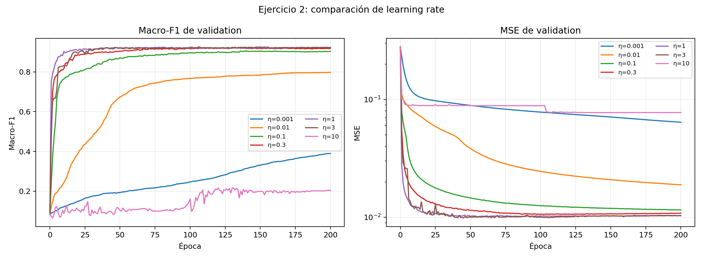
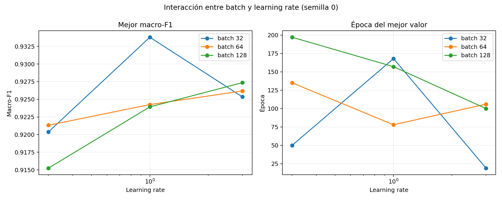
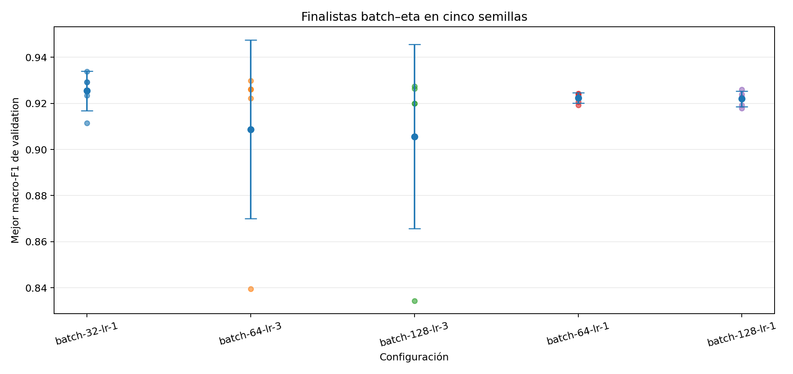
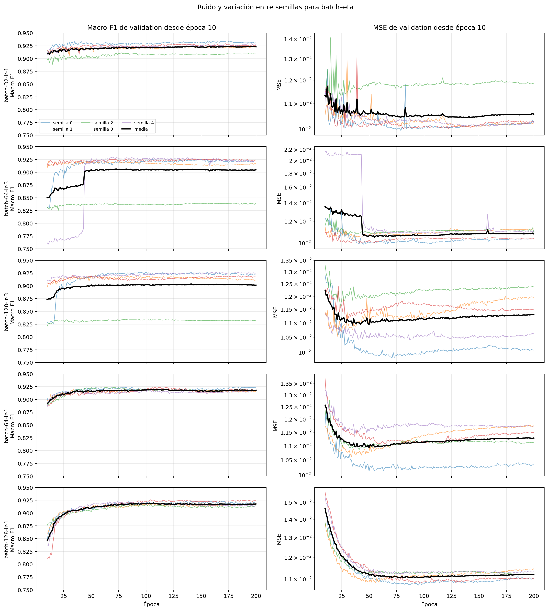
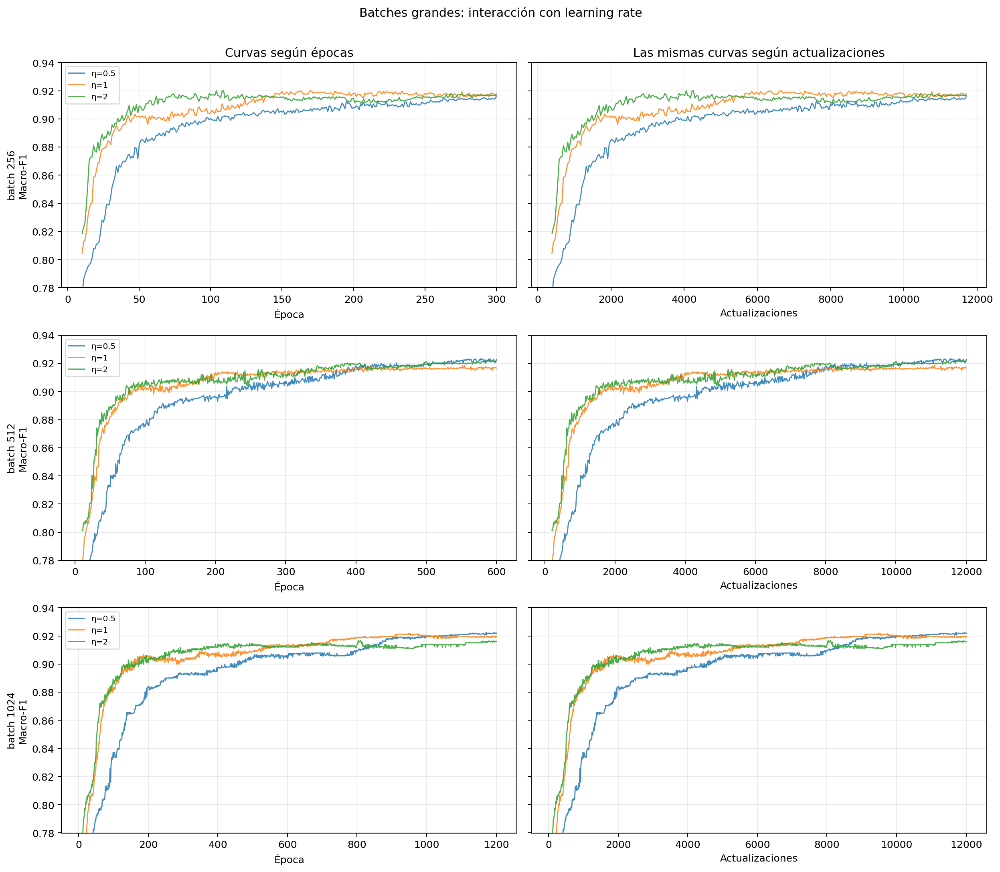
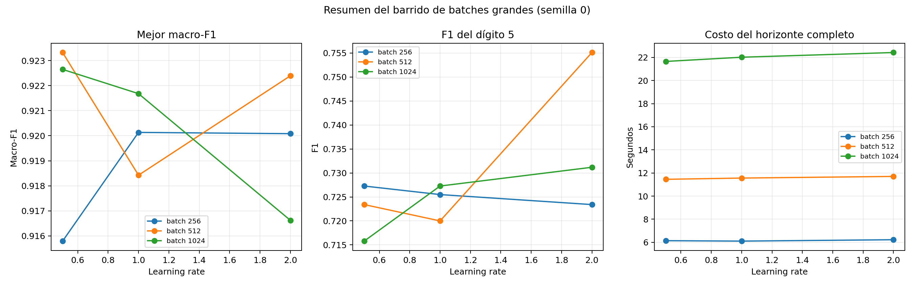
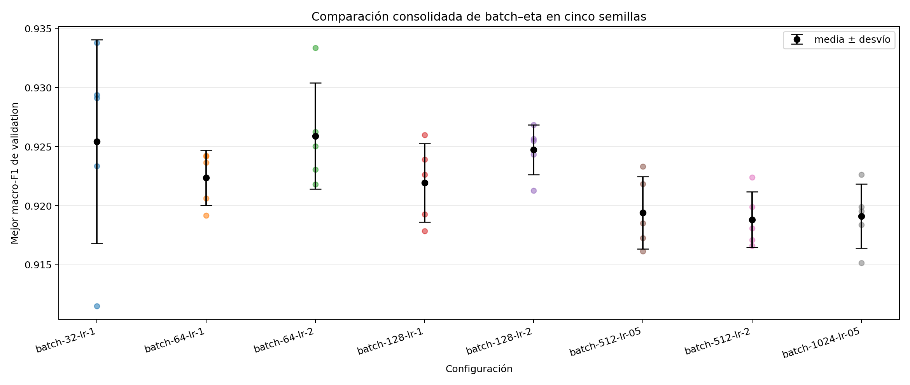
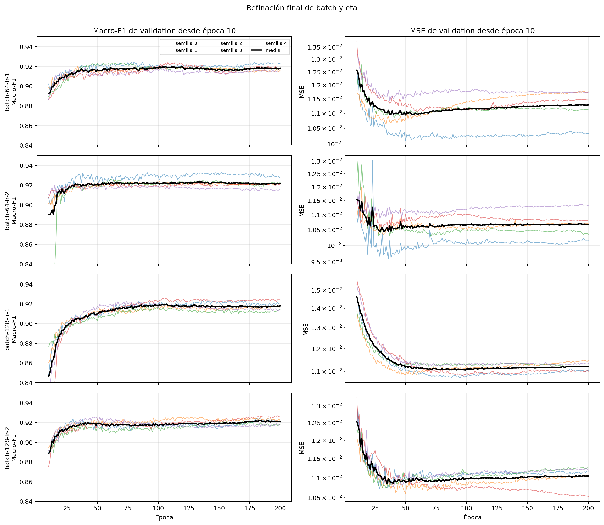
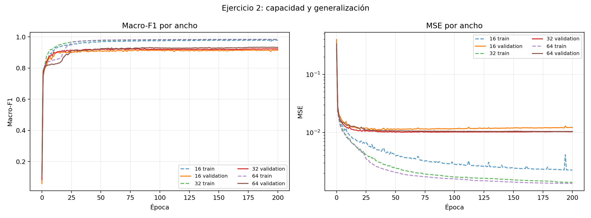

# Ejercicio 2: clasificación de dígitos

## Alcance

Este documento define el protocolo antes de ejecutar experimentos. Las
arquitecturas y grillas son decisiones del equipo, no valores impuestos por la
cátedra. Los resultados y conclusiones se incorporarán después de correr cada
etapa; no se presentan hipótesis como observaciones.

El ejercicio debe responder:

1. cómo se evalúa el desempeño del sistema;
2. qué variantes se realizan para encontrar la solución.

Como mínimo, la consigna exige variantes de learning rate, arquitectura y
mecanismo de optimización. El equipo agrega batch size y cantidad de épocas
porque permiten analizar frecuencia de actualización, convergencia,
underfitting y overfitting.

## Parte (a): cómo se evaluará el desempeño

### Separación de los datos

`digits.csv` constituye development. Inicialmente se divide mediante un
holdout estratificado y reproducible:

```text
digits.csv
    ├── 80 % training: ajusta pesos y bias
    └── 20 % validation: selecciona hiperparámetros y épocas
```

`digits_test.csv` representa producción. El modo `search` no recibe su ruta y,
por lo tanto, no puede abrirlo accidentalmente. Después de congelar todas las
decisiones se implementará un modo `final` separado para reentrenar con todo
`digits.csv` y evaluar test una sola vez.

El holdout permite recorrer el embudo sin multiplicar por cinco todas las
corridas. Primero se mantienen fijos sus índices. Los finalistas se repiten con
cinco inicializaciones. Luego se estudia sensibilidad a la partición. K-fold se
reserva para los finalistas si cambia el ranking al cambiar el split, si los
resultados del dígito 5 son inestables o si las diferencias son menores que la
variación experimental. K-fold mejora la estimación; no corrige un modelo malo
ni crea muestras de una clase ausente.

### Entradas, objetivos y predicción

Cada imagen conserva sus 784 píxeles en `[0,1]`. La red posee diez salidas,
una por cada dígito. Una etiqueta entera se codifica one-hot: el dígito 3 se
representa como `[0,0,0,1,0,0,0,0,0,0]`. La clase predicha es el índice de la
mayor salida (`argmax`).

Las capas ocultas usan `tanh`: introduce no linealidad y tiene una salida
centrada alrededor de cero. La salida usa logística porque los objetivos
one-hot están en `[0,1]`. Se mantiene MSE porque es la función de costo
presentada en clase e implementada y validada por el motor. Las diez logísticas
son activaciones independientes y no necesariamente suman uno; se interpretan
como scores, no como probabilidades calibradas.

Estas activaciones forman el baseline, no una afirmación de optimalidad
universal. Sólo se abre una comparación adicional si las curvas muestran que
la referencia no aprende o satura.

### Limitaciones conocidas del development

`digits.csv` no contiene ejemplos del 8 y sólo contiene 271 ejemplos del 5.
Se conservan diez salidas porque el problema real sigue teniendo diez clases.
En validation no puede estimarse recall del 8: no hay positivos. Aumentar
neuronas, épocas o folds no aporta la información ausente.

### Métricas

La medida primaria de selección es macro-F1 sobre las nueve clases presentes
en development (`0` a `7` y `9`). Da el mismo peso a cada clase evaluable y
evita que el escaso dígito 5 quede oculto detrás de la accuracy global.

También se registran:

- accuracy;
- macro-precision y macro-recall sobre clases presentes;
- precision, recall y F1 por clase;
- matriz de confusión de diez clases;
- MSE de training y validation;
- cantidad de parámetros;
- época y cantidad de actualizaciones;
- tiempo total.

Una configuración no se elige por el decimal máximo de una única corrida. Se
comparan media, dispersión, estabilidad, costo y simplicidad. Si la diferencia
es menor que la variación entre semillas, se prefiere la alternativa más
simple o barata.

### Convergencia, underfitting y overfitting

Se guardan por época MSE, accuracy, macro-precision, macro-recall y macro-F1 de
training y validation.

No se diagnostica underfitting sólo porque el resultado sea malo en una época
temprana. Primero se comprueba convergencia:

- si training y validation todavía mejoran al final, faltan épocas;
- si ambos quedan bajos y en meseta, existe evidencia de underfitting;
- si training mejora mientras validation se estanca o empeora y la brecha
  persiste, existe evidencia de overfitting;
- si las curvas oscilan o divergen, se revisan learning rate, optimizador y
  batch antes de atribuir el problema a la arquitectura.

Los gaps `training_macro_f1 - validation_macro_f1` y
`validation_mse - training_mse` se informan como evidencia, pero no se usa un
umbral automático para etiquetar una corrida. Importan su magnitud, persistencia
y forma a través de las épocas.

## Parte (b): variantes para encontrar la solución

No se realiza el producto cartesiano. Cada etapa conserva las mejores familias
de la anterior y cambia una dimensión interpretable.

### 0. Sanidad y learning rate

Referencia inicial:

```text
arquitectura       [784,32,10]
activaciones       tanh, logística
loss               MSE
optimizador        descenso básico
batch              64
épocas máximas     200
checkpoints        25, 50, 100, 200
semillas           0
```

Se comparan tasas `0.001`, `0.01` y `0.1`. Son una escala logarítmica gruesa,
no valores supuestamente óptimos. Se observa velocidad, oscilación, divergencia,
mejor validation y costo. Si la mejor queda en un extremo se amplía el rango;
si dos quedan cerca se hace una búsqueda local entre ellas.

### 1. Exploración conjunta inicial de batch y learning rate

Las primeras curvas mostraron variación entre épocas en la región de mejores
tasas. Como el batch modifica el ruido del gradiente, la cantidad de
actualizaciones y la tasa conveniente, no corresponde afinar eta manteniendo
batch 64 por decisión previa. Se comparan conjuntamente:

```text
batch = 32, 64, 128
eta   = 0.3, 1, 3
```

La arquitectura `[784,32,10]`, el descenso básico, el holdout y la semilla 0
permanecen fijos. Esta matriz de nueve corridas no busca todavía una diferencia
estadística: identifica pares prometedores y descarta combinaciones lentas o
inestables. Se comparan mejor macro-F1, época, gap train-validation, F1 del 5,
actualizaciones y tiempo.

Online y full batch no se incluyen en esta matriz porque requieren horizontes
y tasas propios. Batch 1 realiza aproximadamente diez mil actualizaciones por
época; full batch sólo una. Se analizarán después sin fingir que 200 épocas y
el mismo eta constituyen condiciones equivalentes.

### 2. Estabilidad de los pares batch–eta iniciales

Se eligen aproximadamente tres pares de la etapa 2 y se repiten con semillas
`0,1,2,3,4`, conservando el mismo split. Se comparan media, desvío, mínimo,
máximo, mediana de mejor época y costo. Esta etapa permite separar una mejora
sistemática de una inicialización o un orden de barajado afortunados.

### 3. Extensión hacia batches grandes y ajuste local de eta

La estabilidad de `eta=1` y la reducción del costo al pasar de batch 64 a 128
justifican explorar batches mayores antes de fijar la arquitectura. Batch y eta
se estudian juntos porque el tamaño del batch cambia la cantidad y el ruido de
las actualizaciones; no se supone que una tasa elegida con batch 64 siga siendo
óptima con batch 1024.

El primer barrido extendido es:

```text
batch = 256, 512, 1024
eta   = 0.5, 1, 2
```

`eta=1` conecta con la referencia estable; `0.5` comprueba si una tasa más
conservadora beneficia a los batches grandes, y `2` explora una aceleración sin
volver directamente al `eta=3` que produjo colapsos. No se agrega todavía cada
valor intermedio: primero se determina la región útil.

Para evitar que los batches grandes parezcan peores sólo por realizar menos
actualizaciones por época, se asignan horizontes de 300, 600 y 1200 épocas a
batch 256, 512 y 1024. Con 9.959 muestras de training esto equivale a unas
11.700–12.000 actualizaciones por corrida. La comparación informará también
épocas, ejemplos procesados y tiempo: igualar actualizaciones no iguala costo,
porque una actualización grande procesa más ejemplos.

Si batch 1024 queda en el borde y sigue siendo competitivo, se amplía a 2048.
Si el mejor eta queda en 0.5 o 2, se amplía o refina hacia ese lado. Después se
repiten sólo los pares finalistas con semillas `0,1,2,3,4`. Full batch se
mantiene separado porque requeriría un horizonte mucho mayor para alcanzar una
cantidad comparable de actualizaciones.

### 4. Arquitectura: ancho y profundidad

Con el par batch–eta estable se repite la comparación de ancho:

```text
[784,16,10]
[784,32,10]
[784,64,10]
```

Después se estudia profundidad:

Se comparan:

```text
[784,32,10]       25.450 parámetros
[784,32,16,10]    25.818 parámetros
```

El presupuesto casi igual permite estudiar el efecto de una segunda capa
oculta sin confundirlo con duplicar la cantidad de pesos. La segunda red
introduce una composición adicional y un cuello de botella de 16 unidades.

### 5. Mecanismo de optimización

Se comparan descenso básico, Momentum, eta adaptativo, RMSProp y Adam sobre una
o dos arquitecturas prometedoras. No se impone la misma tasa a todos: Momentum
acumula cambios y RMSProp/Adam reescalan el gradiente.

La exploración gruesa propuesta es:

- descenso y Momentum: `0.001`, `0.01`, `0.1`;
- RMSProp y Adam: `0.0001`, `0.001`, `0.01`;
- eta adaptativo: tasa inicial de la escala de descenso con incremento,
  reducción y paciencia explícitos.

Después sólo se ajusta localmente la tasa de los finalistas.

### 6. Modalidades extremas de batch

Se comparan modalidades representativas:

```text
1       online
32      mini-batch pequeño
128     mini-batch grande
None    full batch
```

Los mini-batches 32, 64 y 128 ya se comparan junto con eta en las etapas 2 y 3.
Aquí se agregan online y full batch con learning rates y máximos de épocas
adecuados a su frecuencia de actualización.

Las épocas no contienen igual cantidad de actualizaciones: con batch 1 hay una
actualización por muestra y con full batch hay una actualización por época.
Por eso se comparan épocas, actualizaciones y tiempo; no sólo el número de
épocas.

### 7. Cantidad de épocas

Una corrida hasta 200 épocas se observa en checkpoints 25, 50, 100 y 200. No se
reentrena desde cero para cada horizonte: son detenciones de la misma
trayectoria. Si las dos curvas siguen mejorando en 200 se extiende a 400. Si
validation empeora antes, se registra la mejor época en vez de agregar épocas.

Para el reentrenamiento final se congela una cantidad de épocas derivada de las
mejores épocas de validation, por ejemplo su mediana entre las cinco semillas.

### 8. Finalistas y particiones

La etapa 3 ya mide cinco inicializaciones para los pares batch–eta. Los
finalistas completos vuelven a compararse si arquitectura u optimizador cambian.
Después se cambian semillas de partición si hace falta. K-fold sólo se ejecuta
si el ranking permanece incierto.

### 9. Congelamiento y test

Antes de test se fijan arquitectura, activaciones, loss, optimizador y sus
parámetros, learning rate, batch, épocas, inicialización y procesamiento. El
modelo se reentrena con todo `digits.csv`. El resultado de `digits_test.csv` no
se usa para volver a elegir ninguna de esas decisiones.

## Runner de búsqueda

El runner reutilizable está en `sia_tp3.digit_experiment`; esta carpeta contiene
la entrada local y la primera configuración. Desde `tp3/`:

```bash
python docs/ejercicio2/run_experiment.py \
  --config docs/ejercicio2/01-learning-rate.json \
  --data data/digits.csv \
  --output output/digits-learning-rate-01
```

La carpeta de salida debe ser nueva o estar vacía. Se guardan configuración,
hash del development, entorno, índices del split, historial, checkpoints,
modelos inicial/final/mejor, predicciones, métricas y resumen. El archivo de
fuente registra explícitamente `test_opened: false`.

La configuración inicial ejecuta la primera escala de learning rates. Las
configuraciones de arquitectura, optimización y batch se escriben después de
analizar la etapa anterior para no fingir que sus referencias ya fueron
seleccionadas.

## Resultados parciales: etapas 0 a 3

Las corridas de esta sección usan el mismo holdout estratificado 80/20, batch
64, descenso básico, inicialización y semillas 0. Son resultados de una única
partición e inicialización; permiten conducir el embudo, pero todavía no
constituyen la estimación final de variabilidad.

El control de sanidad confirmó que el pipeline aprende, que las métricas se
calculan y que las diez salidas producen clases válidas. No se conserva como
un resultado separado: queda integrado en la comparación de learning rate.

### Etapa 0: learning rate

La grilla inicial `0.001`, `0.01`, `0.1` dejó el mejor valor en el borde. Para
cerrar el rango se agregaron `0.3`, `1`, `3` y `10`, sin modificar ninguna otra
condición.

| Learning rate | Mejor época | Train macro-F1 | Validation macro-F1 | Validation accuracy | Validation MSE |
|---:|---:|---:|---:|---:|---:|
| 0,001 | 200 | 0,3810 | 0,3894 | 0,5293 | 0,06407 |
| 0,01 | 199 | 0,8093 | 0,7976 | 0,8888 | 0,01891 |
| 0,1 | 136 | 0,9527 | 0,9046 | 0,9285 | 0,01202 |
| 0,3 | 135 | 0,9770 | 0,9213 | 0,9418 | 0,01065 |
| 1 | 78 | 0,9808 | 0,9242 | 0,9430 | 0,01023 |
| 3 | 106 | 0,9799 | **0,9262** | **0,9454** | **0,00995** |
| 10 | 120 | 0,2219 | 0,2167 | 0,2614 | 0,07776 |



Interpretación:

- `0.001` y `0.01` continúan mejorando al final. Su desempeño bajo no prueba
  underfitting: todavía no convergieron en el horizonte observado.
- Entre `0.1` y `3` la convergencia es mucho más rápida y el desempeño de
  validation queda en una meseta cercana.
- `10` no produce una divergencia numérica, pero sus curvas son inestables y
  quedan en un desempeño muy bajo. Es evidencia de una tasa excesiva y de un
  problema de optimización, no de falta de capacidad de la arquitectura.
- `3` obtiene el mayor valor puntual, pero supera a `1` por sólo 0,0019 de
  macro-F1 con una única semilla y necesita más épocas para alcanzarlo. Esa
  diferencia todavía no permite afirmar que sea consistentemente mejor.

Para la etapa de arquitectura se fija provisionalmente `learning_rate=1`. Es
menos agresivo, alcanza su mejor validation en 78 épocas y resulta prácticamente
indistinguible de `3` en esta corrida. La comparación con varias semillas podrá
revisar esta decisión entre los finalistas.

El análisis por clase confirma la necesidad de macro-F1: con `eta=1`, la
accuracy es 0,9430, pero el dígito 5 alcanza recall 0,7037 y F1 0,7451. La
accuracy global oculta parcialmente esta debilidad.

### Evidencia reproducible

- Configuraciones: `01-learning-rate.json`,
  `01b-learning-rate-upper.json`, `01c-learning-rate-limit.json` y
  `02-architecture-width.json`.
- Resultados completos: `results/01-*` y `results/02-architecture-width/`.
- Tablas consolidadas y gráficos: `results/analysis-01-02/`.
- Regeneración: `python docs/ejercicio2/analyze_results.py` desde `tp3/`.

### Etapa 2: interacción entre batch y learning rate

Se ejecutaron las nueve combinaciones planificadas con arquitectura
`[784,32,10]`, descenso básico, split fijo y semilla 0.

| Batch | Eta | Mejor época | Validation macro-F1 | Validation accuracy |
|---:|---:|---:|---:|---:|
| 32 | 0,3 | 50 | 0,9204 | 0,9386 |
| 32 | 1 | 168 | **0,9338** | **0,9490** |
| 32 | 3 | 19 | 0,9253 | 0,9458 |
| 64 | 0,3 | 135 | 0,9213 | 0,9418 |
| 64 | 1 | 78 | 0,9242 | 0,9430 |
| 64 | 3 | 106 | 0,9262 | 0,9454 |
| 128 | 0,3 | 197 | 0,9152 | 0,9357 |
| 128 | 1 | 157 | 0,9239 | 0,9414 |
| 128 | 3 | 100 | 0,9274 | 0,9450 |



El resultado de semilla 0 muestra interacción: aumentar eta ayuda a batches
64 y 128 dentro del rango observado, mientras batch 32 alcanza su mejor valor
con eta 1 y empeora con 3. Batch 32/eta 1 obtiene el máximo puntual, pero
requiere 52.416 actualizaciones hasta su mejor época. Los máximos de una única
semilla son demasiado cercanos para elegir sólo con esta tabla.

Se seleccionó para repetición el mejor eta de cada batch: `(32,1)`, `(64,3)` y
`(128,3)`.

### Etapa 3: estabilidad entre semillas

Los tres pares se repitieron con semillas 0 a 4, manteniendo el mismo holdout.
Eta 3 produjo un fallo cualitativo en la semilla 2 con batch 64 y 128: el modelo
no predijo ningún 5, su F1 para esa clase fue cero y el macro-F1 cayó cerca de
0,84. Para no confundir efecto de batch con efecto de eta, se repitieron también
`(64,1)` y `(128,1)` con las mismas cinco semillas.

| Batch | Eta | Macro-F1 media ± desvío | Mínimo | Accuracy media | F1 medio del 5 | Mediana mejor época | Tiempo medio |
|---:|---:|---:|---:|---:|---:|---:|---:|
| 32 | 1 | **0,9254 ± 0,0086** | 0,9115 | **0,9444** | 0,7438 | 168 | 7,69 s |
| 64 | 3 | 0,9088 ± 0,0388 | 0,8395 | 0,9417 | 0,6087 | 84 | 6,03 s |
| 128 | 3 | 0,9056 ± 0,0400 | 0,8344 | 0,9390 | 0,6003 | 82 | 4,66 s |
| 64 | 1 | 0,9224 ± **0,0023** | 0,9192 | 0,9409 | 0,7476 | 63 | 6,05 s |
| 128 | 1 | 0,9219 ± 0,0033 | 0,9179 | 0,9397 | **0,7542** | 104 | **4,77 s** |



Para inspeccionar el ruido a través de las épocas se grafican también las cinco
trayectorias de cada configuración. Cada línea fina corresponde a una semilla
y la línea negra a su media. Se muestra desde la época 10 para que la escala
inicial no oculte las oscilaciones y separaciones posteriores.



Conclusiones parciales:

- El ruido observado no era sólo una irregularidad visual. Eta 3 es sensible a
  la inicialización y puede ignorar completamente la clase minoritaria.
- Eta 1 elimina esos colapsos en los tres mini-batches estudiados.
- Batch 32/eta 1 obtiene la mayor media, pero su ventaja sobre batch 64/eta 1 es
  0,0031, menor que su propio desvío de 0,0086, y requiere más tiempo y épocas.
- Batch 64/eta 1 presenta la menor variación y un costo intermedio. Batch
  128/eta 1 es el más rápido y logra el mejor F1 medio del 5, con macro-F1 casi
  idéntico al de batch 64.

En este punto se seleccionó provisionalmente `batch=64`, `eta=1`. Esa decisión
se revisa en las etapas siguientes con batches mayores y una refinación local
de eta; no se usa todavía para volver a estudiar arquitectura.

Este resultado corrige la lectura de una sola semilla: eta 3 parecía levemente
mejor, pero no es robusto para la clase 5. La selección se apoya en métricas por
clase y dispersión, no sólo en accuracy o en el máximo puntual.

### Etapa 4: batches grandes y cierre del rango de eta

Se extendió el barrido a batches 256, 512 y 1024. Para aproximar 12.000
actualizaciones por corrida se usaron respectivamente 300, 600 y 1200 épocas.
El conjunto de training contiene 9.959 ejemplos, por lo que cada época realiza
39, 20 y 10 actualizaciones. Todas las corridas mantienen arquitectura
`[784,32,10]`, descenso básico, split y semilla 0.

| Batch | Eta | Mejor época | Mejor macro-F1 | F1 del 5 | Tiempo total |
|---:|---:|---:|---:|---:|---:|
| 256 | 0,5 | 300 | 0,9158 | 0,7273 | 6,14 s |
| 256 | 1 | 170 | 0,9201 | 0,7255 | 6,10 s |
| 256 | 2 | 109 | 0,9201 | 0,7234 | 6,22 s |
| 512 | 0,5 | 578 | **0,9233** | 0,7234 | 11,45 s |
| 512 | 1 | 552 | 0,9184 | 0,7200 | 11,56 s |
| 512 | 2 | 589 | 0,9224 | **0,7551** | 11,70 s |
| 1024 | 0,5 | 1171 | 0,9226 | 0,7158 | 21,65 s |
| 1024 | 1 | 973 | 0,9217 | 0,7273 | 22,02 s |
| 1024 | 2 | 803 | 0,9166 | 0,7312 | 22,43 s |



La columna derecha del gráfico expresa las mismas trayectorias en cantidad de
actualizaciones. Esto evita interpretar como aprendizaje lento lo que sólo es
una consecuencia de realizar menos actualizaciones por época. La suavidad de
las curvas aumenta con el batch, pero el mejor macro-F1 no aumenta de forma
monótona: batch 1024 no supera a 512 y cuesta aproximadamente el doble.



Como `eta=0.5` quedó en el borde inferior para 512 y 1024, se agregó `eta=0.25`.
Obtuvo respectivamente 0,9056 y 0,9069 de macro-F1, cerrando el rango inferior.
No se extendió a batch 2048 porque batch 1024 no mejoró a 512. Los máximos de
semilla 0 seleccionaron `(512,0.5)`, `(512,2)` y `(1024,0.5)` para cinco
repeticiones.

| Batch | Eta | Macro-F1 media ± desvío | Mínimo | F1 medio del 5 | Mediana mejor época | Tiempo medio |
|---:|---:|---:|---:|---:|---:|---:|
| 512 | 0,5 | **0,9194 ± 0,0031** | 0,9161 | 0,7329 | 549 | 12,13 s |
| 512 | 2 | 0,9188 ± **0,0024** | 0,9166 | **0,7355** | 419 | 11,67 s |
| 1024 | 0,5 | 0,9191 ± 0,0027 | 0,9151 | 0,7279 | 1171 | 21,86 s |

La ventaja puntual de batch 512 desapareció al cambiar la semilla. Los tres
pares son estables, pero quedan por debajo de los resultados ya obtenidos con
batches 64 y 128. Por desempeño y costo no se justifica seguir aumentando el
batch.

### Etapa 5: refinación final entre batch 64 y 128

Faltaba estudiar `eta=2`, punto intermedio entre el `eta=1` estable y el
`eta=3` que había colapsado para algunas semillas. Se repitió con semillas 0 a
4 para batches 64 y 128. La comparación consolidada es:

| Batch | Eta | Macro-F1 media ± desvío | Mínimo | Accuracy media | F1 medio del 5 | Mediana mejor época | Tiempo medio |
|---:|---:|---:|---:|---:|---:|---:|---:|
| 32 | 1 | 0,9254 ± 0,0086 | 0,9115 | 0,9444 | 0,7438 | 168 | 7,69 s |
| 64 | 1 | 0,9224 ± 0,0023 | 0,9192 | 0,9409 | 0,7476 | 63 | 6,05 s |
| 64 | 2 | **0,9259 ± 0,0045** | 0,9218 | **0,9425** | **0,7697** | 61 | 6,14 s |
| 128 | 1 | 0,9219 ± 0,0033 | 0,9179 | 0,9397 | 0,7542 | 104 | 4,77 s |
| 128 | 2 | 0,9247 ± **0,0021** | 0,9213 | 0,9424 | 0,7575 | 153 | **4,73 s** |
| 512 | 0,5 | 0,9194 ± 0,0031 | 0,9161 | 0,9391 | 0,7329 | 549 | 12,13 s |
| 512 | 2 | 0,9188 ± 0,0024 | 0,9166 | 0,9383 | 0,7355 | 419 | 11,67 s |
| 1024 | 0,5 | 0,9191 ± 0,0027 | 0,9151 | 0,9393 | 0,7279 | 1171 | 21,86 s |





`batch=64, eta=2` tiene la mayor media y el mejor F1 del dígito 5, pero también
duplica el desvío de `batch=128, eta=2`. La diferencia de medias entre ambos es
0,0012, menor que la variación entre semillas. Batch 128 además reduce el tiempo
medio aproximadamente 23 %. Por lo tanto se fija **`batch=128, eta=2`** como
referencia para los próximos experimentos. `batch=64, eta=2` queda como
alternativa si una arquitectura posterior muestra una debilidad específica en
el dígito 5.

Esta elección no afirma que 128 sea universalmente óptimo. Es la mejor decisión
dentro del rango probado bajo el criterio declarado: macro-F1 alto, baja
dispersión, ausencia de colapsos, costo menor y buen comportamiento de la clase
minoritaria. La sensibilidad al split se evaluará más adelante con los
finalistas completos.

### Arquitectura preliminar: resultado exploratorio previo

Antes de fijar batch y eta se había realizado una comparación con `batch=64`,
`eta=1` y una única semilla. Se conserva como antecedente, pero no determina la
arquitectura. Ahora deberá repetirse con la referencia `batch=128`, `eta=2`.

| Arquitectura | Parámetros | Mejor época | Train macro-F1 | Validation macro-F1 | Validation accuracy | F1 del 5 |
|---|---:|---:|---:|---:|---:|---:|
| `[784,16,10]` | 12.730 | 83 | 0,9742 | 0,9170 | 0,9329 | 0,7677 |
| `[784,32,10]` | 25.450 | 78 | 0,9808 | 0,9242 | 0,9430 | 0,7451 |
| `[784,64,10]` | 50.890 | 182 | 0,9844 | **0,9340** | **0,9474** | **0,8077** |



Las tres redes ajustaron training con macro-F1 mayor a 0,97, sin evidencia de
underfitting una vez alcanzada la convergencia. Hubo una brecha persistente de
aproximadamente 0,05–0,06 entre training y validation, compatible con
overfitting leve. La mejora observada con 64 neuronas es una hipótesis para la
nueva comparación, no una conclusión transferible al nuevo par batch–eta.

### Evidencia reproducible de la extensión

- Configuraciones: `05-large-batch-learning-rate.json`,
  `05b-large-batch-learning-rate-lower.json`,
  `06-large-batch-finalists-seeds.json` y
  `06b-mid-batch-lr-2-seeds.json`.
- Resultados completos: `results/05-*`, `results/05b-*`, `results/06-*` y
  `results/06b-*`.
- Tablas y gráficos consolidados: `results/analysis-01-02/`.
- Regeneración: `python docs/ejercicio2/analyze_results.py` desde `tp3/`.
