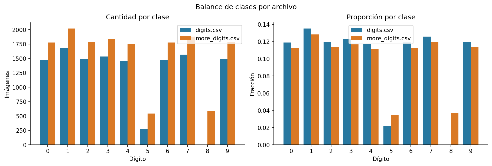
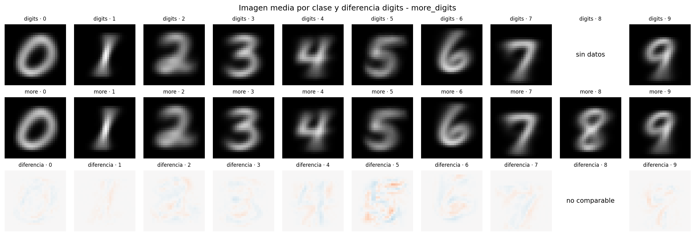
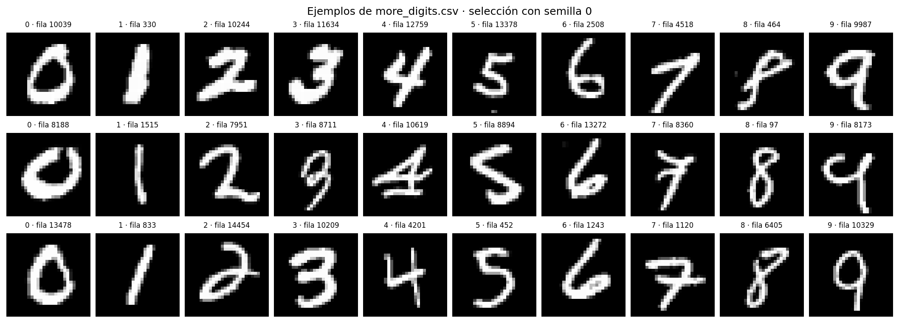

# EDA de `more_digits.csv`

## Objetivo y alcance

Este análisis describe `more_digits.csv`, lo compara con `digits.csv` y
comprueba solapamientos exactos. No entrena modelos ni modifica los datos.

`digits_test.csv` se utiliza únicamente para leer los 784 píxeles de cada
imagen y verificar que no haya copias exactas. Sus etiquetas no se interpretan
ni se utilizan para tomar decisiones.

El análisis es reproducible mediante:

```bash
PYTHONPATH=src MPLCONFIGDIR=/tmp/tp3-matplotlib \
python3 docs/ejercicio3/analyze_more_digits.py \
  --data data \
  --output /tmp/tp3-ejercicio3-eda
```

La carpeta de salida debe ser nueva o estar vacía, para no mezclar resultados
de ejecuciones diferentes.

## 1. Integridad y escala

Ambos archivos tienen el formato esperado: una etiqueta entre 0 y 9 y una
imagen de 784 píxeles. Los loaders interrumpen el análisis ante columnas
incorrectas, etiquetas fuera de rango, imágenes con otra forma o valores no
finitos; ninguno de esos problemas apareció.

| Propiedad | `digits.csv` | `more_digits.csv` |
|---|---:|---:|
| Imágenes | 12.449 | 15.741 |
| Píxeles por imagen | 784 | 784 |
| Mínimo | 0 | 0 |
| Máximo | 1 | 1 |
| Valores distintos de píxel | 256 | 256 |
| Intensidad media | 0,12857 | 0,12926 |
| Desvío de intensidades | 0,30644 | 0,30700 |
| Píxeles en cero | 81,27 % | 81,14 % |
| Imágenes completamente negras | 0 | 0 |
| Imágenes constantes | 0 | 0 |
| Píxeles constantes | 97 | 93 |

Las escalas y estadísticas globales son prácticamente iguales. Los nuevos
datos siguen usando intensidades en `[0,1]`; no corresponde dividirlos por 255.

## 2. Balance de clases

`more_digits.csv` contiene las diez clases. Su aporte fundamental es incluir
585 ejemplos del dígito 8, que estaba completamente ausente de `digits.csv`, y
duplicar la cantidad total disponible del dígito 5 antes de eliminar
solapamientos.

| Dígito | `digits.csv` | `more_digits.csv` |
|---:|---:|---:|
| 0 | 1.480 | 1.776 |
| 1 | 1.685 | 2.022 |
| 2 | 1.489 | 1.787 |
| 3 | 1.532 | 1.839 |
| 4 | 1.460 | 1.752 |
| 5 | 271 | 542 |
| 6 | 1.479 | 1.775 |
| 7 | 1.566 | 1.879 |
| 8 | 0 | 585 |
| 9 | 1.487 | 1.784 |



El problema de cobertura del 8 queda resuelto, pero el conjunto todavía está
desbalanceado: 5 y 8 continúan siendo mucho menos frecuentes que el resto. Por
eso accuracy debe acompañarse con macro-F1 y métricas por clase.

## 3. Duplicados y solapamiento entre archivos

No hay imágenes repetidas dentro de `digits.csv` ni dentro de
`more_digits.csv`. Entre ambos archivos sí existen 3.689 imágenes idénticas:

| Medida | Resultado |
|---|---:|
| Filas si se concatenan sin control | 28.190 |
| Grupos compartidos entre fuentes | 3.689 |
| Conflictos de etiqueta en grupos compartidos | 0 |
| Imágenes únicas en la unión | **24.501** |
| Copias adicionales si se concatena | 3.689 |

Todas las coincidencias son uno a uno y tienen la misma etiqueta. Por lo
tanto, la unión puede deduplicarse sin tener que resolver etiquetas
contradictorias.

La composición por clase de la unión deduplicada es:

| Dígito | Sólo `digits` | Compartidas | Sólo `more_digits` | Unión única |
|---:|---:|---:|---:|---:|
| 0 | 1.019 | 461 | 1.315 | 2.795 |
| 1 | 1.190 | 495 | 1.527 | 3.212 |
| 2 | 1.030 | 459 | 1.328 | 2.817 |
| 3 | 1.056 | 476 | 1.363 | 2.895 |
| 4 | 1.036 | 424 | 1.328 | 2.788 |
| 5 | 243 | 28 | 514 | 785 |
| 6 | 1.050 | 429 | 1.346 | 2.825 |
| 7 | 1.090 | 476 | 1.403 | 2.969 |
| 8 | 0 | 0 | 585 | 585 |
| 9 | 1.046 | 441 | 1.343 | 2.830 |

En la unión, el 5 representa 3,20 % y el 8 representa 2,39 %. Esto confirma que
los dos dígitos requieren seguimiento individual durante validation.

## 4. Relación con el test externo

No se encontró ninguna imagen exacta de `digits_test.csv` en:

- `digits.csv`;
- `more_digits.csv`;
- la unión deduplicada de ambos archivos.

Este control sólo utilizó píxeles. No se leyeron las etiquetas de test. El
resultado descarta fuga por copias exactas, pero no demuestra por sí solo que
training y test provengan de la misma distribución.

## 5. Comparación visual y estadística entre fuentes

Las imágenes medias por clase tienen formas muy similares entre archivos. La
raíz del error cuadrático medio entre imágenes promedio se encuentra entre
0,00395 y 0,01569 para las nueve clases comparables. La mayor diferencia
aparece en el 5, que también es la clase con menos ejemplos en `digits.csv`;
esto no alcanza por sí solo para afirmar un cambio de distribución.

El 8 no puede compararse entre fuentes porque no existe en `digits.csv`.



Una selección visual reproducible muestra trazos plausibles y diversidad de
escritura en las diez clases, sin anomalías obvias que justifiquen eliminar
filas automáticamente.



## 6. Conclusiones para el experimento

1. `more_digits.csv` es estructuralmente compatible con `digits.csv`: misma
   forma, rango y resolución de intensidades.
2. Incorpora la clase 8 y más ejemplos del 5, por lo que corrige el principal
   problema de cobertura del ejercicio 2.
3. Concatenar ambos archivos sin control dejaría 3.689 copias adicionales y
   podría ubicar una copia en training y otra en validation.
4. La opción recomendada es trabajar con la unión de **24.501 imágenes
   únicas**, conservando una sola copia de cada imagen compartida.
5. El split debe continuar siendo estratificado. Si alguna etapa conserva
   duplicados por razones experimentales, además debe agrupar por imagen para
   impedir fuga entre training y validation.
6. El 5 y el 8 siguen siendo minoritarios, de modo que el objetivo de 98 % de
   accuracy no reemplaza macro-F1, recall y F1 por clase.
7. No hay evidencia en este EDA que justifique normalización adicional,
   eliminación de píxeles, descarte de imágenes o data augmentation antes de
   observar el baseline.

## Archivos reproducibles

- `summary.json`: resultados completos, versiones y SHA-256 de las fuentes.
- `dataset-quality.csv`: integridad y estadísticas globales.
- `class-balance.csv`: balance de cada archivo.
- `union-class-balance.csv`: origen y balance de la unión deduplicada.
- `duplicate-summary.csv`: duplicados internos y entre fuentes.
- `test-input-overlap.csv`: control de copias exactas contra test.
- `class-mean-comparison.csv`: diferencias entre imágenes promedio por clase.
- `example-rows.csv`: filas utilizadas en la muestra visual reproducible.
