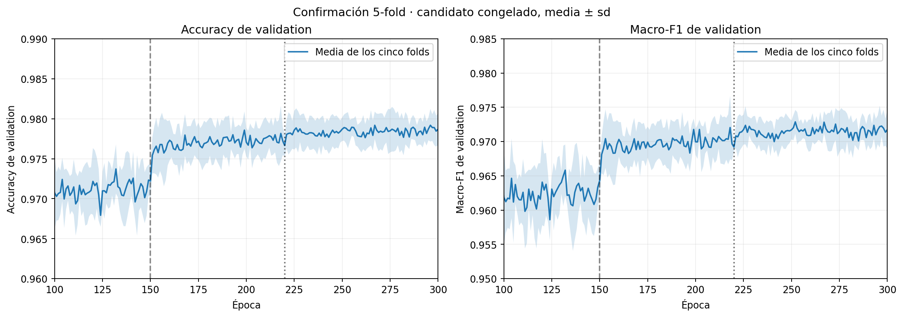
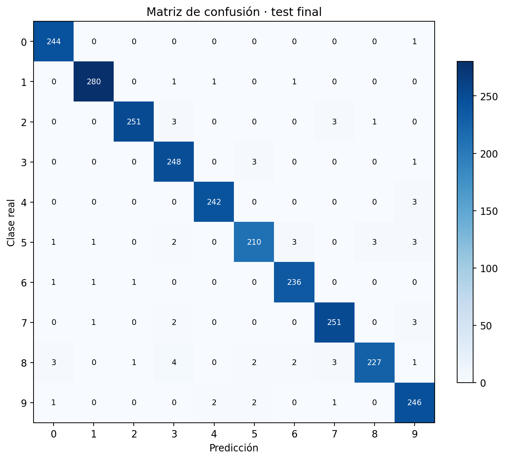

# Ejercicio 3: resumen y guion para la presentación

Esta es una versión breve del desarrollo. El detalle de cada búsqueda, las
configuraciones, las cinco semillas, los resultados por clase y los gráficos
completos se encuentran en [`ejercicio3.md`](ejercicio3.md).

## 1. Problema inicial

El objetivo era mejorar el clasificador del ejercicio 2 utilizando
`more_digits.csv` y alcanzar una accuracy mayor o igual a 98 %. El modelo
anterior había obtenido 86,54 % de accuracy y macro-F1 0,8193 sobre test. El
principal problema era el dígito 8: no había ningún 8 en `digits.csv`, aunque
el test contenía 243, por lo que el modelo nunca predijo esa clase y obtuvo F1
igual a 0.

El hilo del trabajo fue entonces:

> primero corregir la información disponible, después mejorar el modelo de
> forma controlada y, finalmente, comprobar que el resultado generalizara sin
> utilizar test para tomar decisiones.

## 2. Qué encontramos en los datos nuevos

`more_digits.csv` contiene 15.741 filas e incorpora las diez clases, incluyendo
585 ochos y 542 cincos. No podía concatenarse directamente con `digits.csv`
porque ambos archivos compartían 3.689 imágenes exactas.

Se construyó una unión deduplicada de **24.501 imágenes únicas**. No se
encontraron conflictos de etiquetas ni imágenes vacías, y los píxeles ya
estaban normalizados en `[0,1]`. Durante la experimentación se utilizó un split
estratificado sin imágenes repetidas entre training y validation.

Este análisis fue importante por dos motivos:

- evitó una fuga de información por duplicados;
- mostró que parte de la mejora esperada no dependía del modelo, sino de contar
  por primera vez con ejemplos del 8 y con más ejemplos del 5.

## 3. Protocolo experimental

Todas las decisiones se tomaron con development. `digits_test.csv` se trató
como una simulación de producción y se evaluó una sola vez al final.

El procedimiento fue:

1. reutilizar la configuración del ejercicio 2 como baseline;
2. modificar un componente por vez;
3. repetir los candidatos con cinco semillas;
4. comparar estados de época fija y no solamente el mejor pico;
5. confirmar el candidato congelado mediante 5-fold;
6. reentrenar con todo development y recién entonces abrir test.

## 4. Cómo evolucionó el modelo

| Etapa | Accuracy media de validation | Decisión |
|---|---:|---|
| Baseline con MSE | 0,9547 | Inestable: 3 de 5 semillas no aprendían el 8 |
| Softmax + entropía cruzada | 0,9642 | Se conserva; las 5 semillas aprenden el 8 |
| Traslaciones de 1 píxel | 0,9754 | Se conserva |
| Schedule, época 300 fija | 0,9782 | Se conserva; reduce fuertemente el ruido |
| Rotaciones `±4°` | 0,9793 | Se conserva como candidato final |
| Confirmación 5-fold | 0,9787 | Resultado estable, aunque menor a 98 % |

### Cambios que sí ayudaron

- **Softmax con entropía cruzada:** formuló correctamente la clasificación
  multiclase y eliminó las corridas que ignoraban el 8.
- **Búsqueda de learning rate:** se seleccionó `0,01` como tasa inicial.
- **Data augmentation online:** traslaciones de un píxel y rotaciones de hasta
  `±4°`, cada una con probabilidad 0,5 y sólo sobre training.
- **Schedule:** tasa `0,01` hasta la época 150, `0,003` hasta la 220 y `0,001`
  desde la 221. Redujo entre 66 % y 79 % la fluctuación de las métricas.

### Cambios que se probaron y descartaron

- L2 redujo el loss, pero no mejoró consistentemente accuracy ni macro-F1.
- Capas de 192 y 256 neuronas y una arquitectura `[784,128,64,10]` rindieron
  peor que una sola capa de 128 neuronas.
- Batches 64 y 256 no superaron al batch 128.
- Extender las épocas sin modificar el schedule no produjo una mejora estable.

Estas pruebas negativas también son parte del resultado: permitieron elegir la
configuración final por evidencia y no sólo por complejidad.

## 5. Modelo congelado

La configuración final fue:

```text
arquitectura       [784, 128, 10]
activaciones       tanh + softmax
loss               entropía cruzada
optimizador        Adam
batch              128
épocas             300
learning rate      0.01 → 0.003 → 0.001
L2                 no utilizada
augmentation       traslación 1 px y rotación ±4°, p=0.5
semilla final      0
```

Antes de abrir test se realizó una confirmación 5-fold. La accuracy out-of-fold
fue **97,87 %**, con una desviación entre folds de 0,20 puntos porcentuales.
Esto descartó un sobreajuste grave al split original, pero también mostró que
el 98 % todavía no era un resultado robusto.



## 6. Resultado final

El modelo se entrenó desde cero con las 24.501 imágenes únicas. Se guardó su
estado de época 300 y se evaluó una sola vez sobre las 2.497 imágenes de test.

| Métrica | Ejercicio 2 | Ejercicio 3 |
|---|---:|---:|
| Accuracy | 0,8654 | **0,9752** |
| Macro-F1 | 0,8193 | **0,9747** |
| F1 del 5 | 0,8796 | **0,9545** |
| F1 del 8 | 0,0000 | **0,9578** |

El modelo acertó 2.435 imágenes y falló 62. La accuracy fue **97,52 %**: mejoró
10,97 puntos porcentuales frente al ejercicio 2, pero no alcanzó el objetivo de
98 %. Habrían sido necesarios 13 aciertos adicionales.



## 7. Respuestas breves a la consigna

### (a) ¿Cuál fue el mejor resultado?

El mejor resultado válido fue 97,52 % de accuracy y macro-F1 0,9747 sobre el
test externo. El F1 del 5 fue 0,9545 y el del 8, 0,9578. Aunque representa una
mejora grande frente al ejercicio 2, no se alcanzó el 98 % solicitado.

### (b) ¿Qué técnicas utilizamos?

Se reemplazó la salida logística con MSE por softmax con entropía cruzada, se
buscó el learning rate, se incorporó un schedule decreciente y se aplicó data
augmentation mediante traslaciones y rotaciones pequeñas. Las decisiones se
compararon con varias semillas y se confirmaron mediante 5-fold. También se
probaron L2, arquitecturas más grandes, una red más profunda y otros tamaños de
batch, pero se descartaron porque no mejoraron consistentemente.

### (c) ¿Qué otros factores influyeron?

La mejora no se debió únicamente al modelado. El development casi duplicó su
tamaño y pasó a incluir ejemplos del 8, clase totalmente ausente en el
ejercicio 2, además de más ejemplos del 5. También influyeron la composición de
cada partición y la inicialización aleatoria. La deduplicación de 3.689 imágenes
compartidas fue necesaria para que la mejora proviniera de información nueva y
no de repeticiones o fugas entre training y validation.

## 8. Cierre para la exposición

La conclusión principal no es solamente que la accuracy aumentó. El ejercicio
mostró que un problema aparentemente atribuible al modelo era, en gran parte,
un problema de cobertura de datos: no era posible aprender una clase que nunca
aparecía en training. Una vez corregido eso, softmax, entropía cruzada,
augmentation y el schedule permitieron mejorar y estabilizar el aprendizaje.

El resultado final quedó por debajo del objetivo comercial, pero el proceso
fue metodológicamente válido: se controlaron duplicados, se separó selección de
evaluación, se midió variabilidad y se informó el único resultado externo sin
ajustar el modelo posteriormente.
