# Ejercicio 3: informe extenso

## Qué pide la consigna

CompanyX incorpora `more_digits.csv` y fija un objetivo explícito: alcanzar una
**accuracy mayor o igual a 98 %**. La respuesta debe cubrir tres puntos:

1. cuál fue el mejor resultado obtenido con los nuevos datos;
2. qué técnicas propias permitieron mejorar respecto del ejercicio 2;
3. qué otros factores, ajenos a esas técnicas, explican el cambio de
   rendimiento.

Los experimentos se realizaron utilizando únicamente particiones internas de
development para elegir la configuración. Después de congelarla se entrenó con
todo el development único y se evaluó `digits_test.csv` una sola vez.

## Respuestas finales a la consigna

### (a) Mejor resultado obtenido

El mejor resultado válido es el de la evaluación externa final, no el máximo
aislado observado durante la búsqueda. Después de seleccionar la configuración
con validation y auditarla mediante 5-fold, el modelo se reentrenó desde cero
con las 24.501 imágenes únicas de `digits.csv` y `more_digits.csv`. En las 2.497
imágenes de `digits_test.csv` obtuvo **accuracy 0,97517**, **macro-F1 0,97473**,
F1 `0,95455` para el 5 y F1 `0,95781` para el 8. Clasificó correctamente 2.435
casos y se equivocó en 62.

Por lo tanto, el mejor resultado final fue **97,52 % de accuracy**. Representa
una mejora de 10,97 puntos porcentuales respecto del 86,54 % del ejercicio 2,
pero no alcanza el objetivo solicitado de 98 %: faltaron 13 predicciones
correctas. La estimación previa out-of-fold había sido 97,87 %, por lo que el
resultado externo quedó 0,35 puntos porcentuales por debajo de esa estimación.

### (b) Técnicas utilizadas

La mejora se construyó mediante cambios controlados, modificando un componente
por vez y conservando el test fuera de la selección:

1. Se formó un development reproducible con la unión de ambos CSV y se
   eliminaron 3.689 imágenes repetidas, evitando fuga entre training y
   validation.
2. Se ejecutó como baseline la configuración final del ejercicio 2: una red
   `[784,128,10]`, `tanh`, salida logística, MSE y Adam. En cinco semillas
   obtuvo accuracy media `0,9547`, macro-F1 `0,8955` y F1 medio del 8 `0,3469`;
   tres semillas directamente no aprendieron esa clase.
3. Se reemplazó la salida por `softmax` y MSE por entropía cruzada, formulación
   más apropiada para clasificación multiclase. Se buscaron tasas entre
   `0,0001` y `0,01`; con `0,01`, las cinco semillas aprendieron el 8 y la
   accuracy media subió a `0,9642`.
4. Se implementó L2 y se probaron distintos valores de `λ`. Como no produjo una
   mejora consistente de accuracy o macro-F1, se descartó y el modelo final se
   entrenó sin L2.
5. Se agregó data augmentation online únicamente sobre training. Las
   traslaciones de un píxel con probabilidad 0,5 elevaron la accuracy media a
   `0,9754`. Luego se incorporaron rotaciones de hasta `±4°`, también con
   probabilidad 0,5.
6. Para estabilizar la convergencia se utilizó un schedule de learning rate:
   `0,01` hasta la época 150, `0,003` entre las épocas 151 y 220, y `0,001`
   desde la 221. Con época 300 fija redujo entre 66 % y 79 % la fluctuación de
   las métricas y llevó la accuracy media a `0,9782`; al sumar las rotaciones
   llegó a `0,9793` en el split de desarrollo.
7. También se probaron capas de 192 y 256 neuronas, una red profunda
   `[784,128,64,10]`, batches 64 y 256 y más épocas. Ninguna alternativa mejoró
   consistentemente al modelo de 128 neuronas y batch 128, por lo que se
   conservaron estos valores.
8. Las decisiones se confirmaron con cinco semillas y finalmente con 5-fold.
   Los mejores checkpoints se usaron sólo como diagnóstico; las comparaciones
   finales se hicieron en la época 300 fija para no seleccionar picos.

La configuración congelada fue `[784,128,10]`, `tanh` y `softmax`, entropía
cruzada, Adam, batch 128, 300 épocas, el schedule anterior, sin L2 y con
traslaciones y rotaciones pequeñas.

## Punto de partida: ejercicio 2

El baseline congelado es:

```text
arquitectura       [784, 128, 10]
activaciones       tanh y logística
loss               MSE
optimizador        Adam
learning rate      0.003
batch              128
épocas             200
```

En `digits_test.csv` obtuvo:

| Métrica | Ejercicio 2 |
|---|---:|
| Accuracy | 0.8654 |
| Macro-F1 | 0.8193 |
| F1 del 5 | 0.8796 |

La caída se explicó principalmente por la ausencia total del dígito 8 en
`digits.csv`: el test contiene 243 ochos y el modelo nunca predijo esa clase.
Sobre las nueve clases conocidas, la accuracy diagnóstica fue 0.9587. Por eso
el primer cambio que debe medirse no es una red nueva, sino la incorporación de
ejemplos del 8.

## 1. Antes de entrenar: analizar los datos nuevos

**Estado: completado.** El informe y los artefactos reproducibles están en
[`eda/resumen.md`](eda/resumen.md).

`more_digits.csv` contiene 15.741 imágenes y las diez clases. En particular,
aporta 585 ochos y 542 cincos. Sin embargo, no es simplemente un bloque
independiente: existen **3.689 filas exactamente repetidas** entre
`digits.csv` y `more_digits.csv`.

### Resumen del EDA

- Ambos archivos tienen imágenes válidas de 784 píxeles, intensidades en
  `[0,1]`, sin imágenes vacías ni valores no finitos.
- Las estadísticas globales y las imágenes promedio por clase son muy
  similares entre fuentes. No hace falta volver a dividir los píxeles por 255.
- No hay duplicados internos ni conflictos de etiqueta.
- Hay 3.689 imágenes compartidas entre los dos archivos; concatenarlos sin
  control produciría copias y posible fuga entre training y validation.
- La unión limpia contiene 24.501 imágenes únicas.
- No se encontraron copias exactas de esas imágenes en `digits_test.csv`; para
  este control sólo se leyeron los píxeles, no sus etiquetas.
- El nuevo archivo incorpora el 8, ausente en el ejercicio 2, y más ejemplos
  del 5. Aun así, ambos siguen siendo minoritarios en la unión: 585 ochos
  (2,39 %) y 785 cincos (3,20 %).
- El EDA no justifica por ahora eliminar píxeles, descartar imágenes, aplicar
  otra normalización ni introducir augmentation antes de medir el baseline.

### Cómo construir development

La opción recomendada es formar la unión de `digits.csv` y `more_digits.csv` y
eliminar repeticiones exactas. El EDA confirmó que las 3.689 coincidencias son
solapamientos uno a uno, sin conflictos de etiqueta, y que quedan **24.501
imágenes únicas**.

Además, el split debe ser **estratificado y agrupado por imagen**: dos copias de
los mismos 784 píxeles nunca pueden quedar una en training y otra en
validation. De lo contrario, validation mediría memorización y produciría una
estimación demasiado optimista. No aparecieron imágenes iguales con etiquetas
distintas; el agrupamiento sigue siendo una protección necesaria para
cualquier variante que conserve copias.

Esta construcción es preferible a concatenar sin control, que asignaría más
peso a las filas repetidas, y a usar solamente `more_digits.csv`, que
descartaría imágenes únicas del conjunto anterior.

## 2. Primer experimento: medir solamente el efecto de los datos

**Development preparado.** La unión deduplicada y el holdout 80/20 están
registrados en [`development/README.md`](development/README.md): 19.601
imágenes para training y 4.900 para validation, con semilla 0 y sin abrir test.

### Materialización de la decisión

La decisión no quedó sólo documentada: se implementó una construcción
reproducible que identifica cada imagen por sus 784 valores, conserva una sola
copia y detiene el proceso si una imagen idéntica posee etiquetas distintas.
Luego genera un split estratificado y persiste:

- los índices exactos de training y validation;
- un manifiesto con etiqueta, partición, filas de origen y hash de cada imagen;
- el balance por clase y los hashes de los dos CSV fuente.

El split contiene las 24.501 imágenes exactamente una vez y no tiene imágenes
compartidas entre particiones. Para las clases minoritarias quedaron 628 cincos
y 468 ochos en training, y 157 cincos y 117 ochos en validation. El runner
puede reconstruir este mismo conjunto directamente desde ambos CSV mediante
`--additional-data` y `--deduplicate-inputs`, sin generar un tercer CSV gigante.

La primera corrida debe reutilizar **sin cambios** la receta final del
ejercicio 2 y entrenarla sobre el nuevo development. Se mantienen arquitectura,
activaciones, loss, optimizador, learning rate, batch, épocas e inicialización.

### Resultado del baseline

La corrida se ejecutó con esa receta exacta y sin abrir `digits_test.csv`. El
runner reconstruyó la unión deduplicada y produjo exactamente los mismos
índices registrados en `development/split-indices.npz`.

| Métrica | Mejor checkpoint de validation |
|---|---:|
| Época | **101** |
| Accuracy | **0,9663** |
| Macro-F1 | **0,9540** |
| MSE | 0,00671 |
| F1 del 5 | 0,9073 |
| Recall del 5 | 0,8726 |
| F1 del 8 | 0,8678 |
| Recall del 8 | 0,8974 |

#### ¿Por qué se informa la época 101?

El runner evalúa validation al terminar cada época. El checkpoint se selecciona
con una regla definida antes de mirar test: **mayor macro-F1 de validation** y,
si hay empate, menor MSE de validation. Con esa regla, la época 101 fue la mejor
de esta corrida. No se eligió por accuracy ni por su desempeño en test.

Reportar el mejor checkpoint es correcto cuando validation se usa como criterio
de early stopping o selección. No obstante, mostrar solamente ese valor puede
ocultar cuánto dependió la conclusión de elegir la época. Por eso conservamos
la curva completa y comparamos también la última época fijada originalmente:

| Checkpoint | Accuracy train | Accuracy validation | Macro-F1 train | Macro-F1 validation | MSE validation |
|---|---:|---:|---:|---:|---:|
| Seleccionado, época 101 | 0,9954 | **0,9663** | 0,9932 | **0,9540** | **0,00671** |
| Final fijo, época 200 | 0,9963 | 0,9622 | 0,9948 | 0,9494 | 0,00715 |

La diferencia es pequeña pero consistente: seguir entrenando mejora levemente
training mientras empeora validation. En experimentos futuros se debe aplicar
la misma regla a todas las configuraciones y confirmar finalistas con varias
semillas o folds. El test se reserva para el modelo definitivamente congelado.

La accuracy queda 1,37 puntos porcentuales por debajo del objetivo de 98 %.
El cambio más importante respecto de la limitación del ejercicio 2 es que el
modelo ahora sí aprende el 8: clasificó correctamente 105 de sus 117 ejemplos
de validation. El 8 y el 5 siguen siendo las clases de menor F1, coherentemente
con su menor cantidad de muestras.

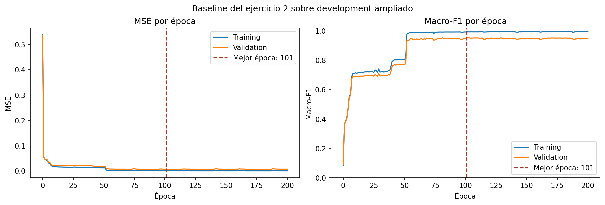

Training llegó a accuracy 0,9954 y macro-F1 0,9932 en el checkpoint elegido,
mientras validation quedó en 0,9663 y 0,9540. La brecha y la estabilización de
validation mientras training permanece casi perfecto son compatibles con
overfitting moderado. Después de la época 101 no apareció una mejora sostenida:
en la época 200 el macro-F1 de validation era 0,9494.

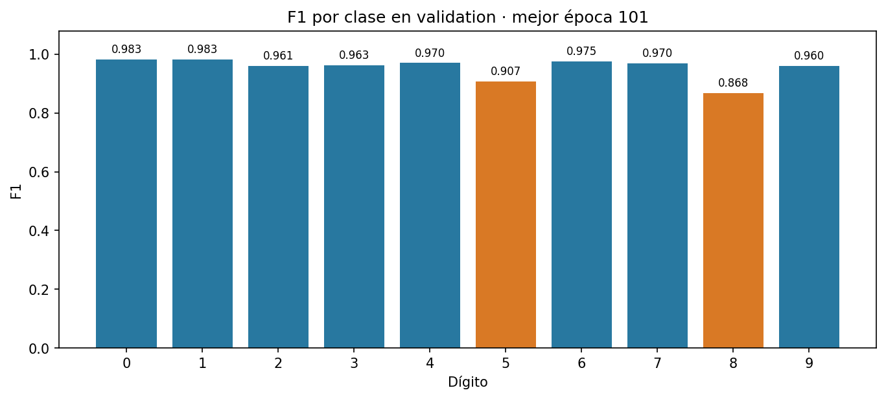

Las métricas detalladas de las clases minoritarias en el checkpoint elegido
fueron:

| Dígito | Soporte | Precision | Recall | F1 |
|---:|---:|---:|---:|---:|
| 5 | 157 | 0,9448 | 0,8726 | 0,9073 |
| 8 | 117 | 0,8400 | 0,8974 | 0,8678 |

La matriz de confusión permite ver los errores que las métricas agregadas no
muestran. El modelo acertó 4.735 de 4.900 imágenes. En el 5 acertó 137 de 157;
en el 8, 105 de 117. Aunque el recall del 8 ya es alto, su precision de 0,84
indica que otras clases todavía son confundidas con 8.

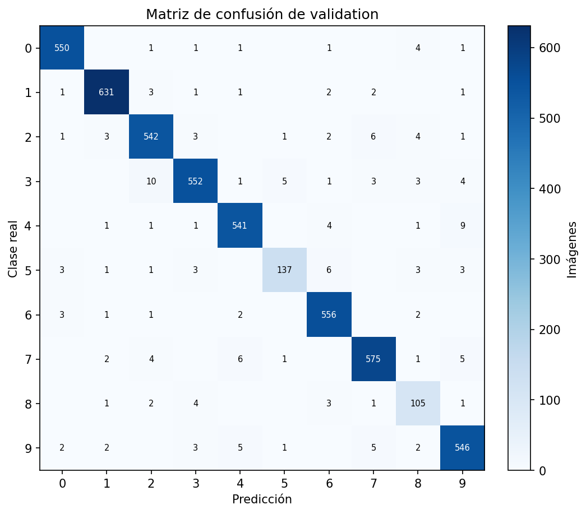

En síntesis, para este baseline ya se midieron y conservaron accuracy,
macro-F1, MSE, precision/recall/F1 por clase, métricas específicas de 5 y 8,
matriz de confusión y curvas completas de training y validation.

Este resultado demuestra que la receta anterior puede aprender las diez clases
cuando recibe ejemplos del 8, pero por sí solo no cuantifica causalmente toda
la mejora frente al ejercicio 2: los conjuntos de validation no son idénticos.
Para una atribución estricta todavía corresponde realizar el control con el
mismo validation fijo que se describe a continuación.

Este experimento responde una pregunta concreta:

> ¿Cuánto mejora el modelo por disponer de mayor cantidad y mejor cobertura de
> clases, sin atribuir esa mejora a una técnica nueva?

Para hacer una atribución más rigurosa conviene armar también una comparación
con un mismo conjunto fijo de validation:

| Modelo | Training | Validation | Configuración |
|---|---|---|---|
| Control | sólo datos originales disponibles para training | mismo validation fijo de diez clases | receta del ejercicio 2 |
| Más datos | originales + nuevos, sin duplicados | el mismo validation fijo | receta del ejercicio 2 |

Las imágenes de validation, y cualquier copia de ellas, deben excluirse de
ambos trainings. Así, la principal diferencia entre las corridas es la
información adicional. Es esperable que el segundo modelo mejore especialmente
el recall y el F1 del 8, pero eso debe comprobarse y no darse por hecho.

## 3. Métricas y diagnóstico

En este ejercicio la accuracy es central porque el cliente fijó el umbral de
98 %. Aun así, no alcanza por sí sola. Hay que conservar:

- accuracy;
- macro-F1 sobre las diez clases;
- precision, recall y F1 por clase, especialmente para 5 y 8;
- matriz de confusión;
- MSE y curvas de training/validation por época;
- media y dispersión entre semillas o folds;
- tiempo y cantidad de parámetros.

Las curvas determinan el siguiente paso:

- si training y validation todavía mejoran al final, faltan épocas o una mejor
  estrategia de optimización;
- si ambos se estabilizan en valores insuficientes, hay underfitting;
- si training mejora mientras validation se estanca o empeora, hay
  overfitting;
- si cambia mucho entre semillas o particiones, falta estabilidad y no se debe
  defender la mejor corrida aislada.

## 4. Mejoras técnicas: un embudo, no todas juntas

Si el baseline con los nuevos datos no llega al objetivo, las variantes deben
probarse por etapas y contra el mismo validation. El diagnóstico determina qué
cambios tienen sentido y en qué orden.

### Diagnóstico que deja el baseline

El baseline no llegó al 98 %: obtuvo 96,63 % en su mejor checkpoint. No hay
evidencia de underfitting, porque training alcanzó 99,54 % de accuracy. Tampoco
parece útil aumentar ciegamente las épocas: validation fue mejor en la 101 que
en la 200, mientras training siguió mejorando. El problema actual combina una
brecha de generalización moderada con errores concentrados en las clases 5 y 8.

La selección del checkpoint 101 ya constituye una forma retrospectiva de
early stopping. Por eso “agregar early stopping” no debe presentarse como una
técnica nueva que produjo el 96,63 %. Una mejora válida sería definir de
antemano una regla de paciencia, aplicarla de igual manera a todas las corridas
y demostrar que mantiene o mejora el resultado fuera de la corrida usada para
elegirla.

### Orden de experimentación propuesto

1. **Medir estabilidad del baseline. Completado.** Se repitió la misma
   configuración y el mismo split con cinco semillas, sin seleccionar la mejor
   como resultado representativo.
2. **Mejorar la formulación multiclase. Completado.** Se implementó `softmax`
   con entropía cruzada, se buscó el learning rate y se repitieron las tasas
   finalistas con las mismas cinco semillas. Se seleccionó `0,01` porque obtuvo
   mejores media y peor caso, y las cinco corridas aprendieron el 8.
3. **Revisar capacidad sólo si el nuevo modelo queda corto también en
   training.** Probar anchos o una segunda capa no es la primera respuesta al
   baseline actual, porque training ya es casi perfecto.
4. **Atacar generalización. En curso.** Se implementó y evaluó L2 con cinco
   semillas. Redujo la entropía cruzada y la variación, pero empeoró levemente
   accuracy, macro-F1 y F1 del 5, por lo que se descarta para el modelo final.
5. **Data augmentation. Completado para traslaciones.** Se implementaron
   traslaciones online con padding en cero y validation intacto. La variante de
   un píxel con probabilidad 0,5 mejoró las cinco semillas y elevó la accuracy
   media de 96,42 % a 97,54 %.

Sólo pasan de etapa configuraciones que mejoren validation de forma estable,
incluidas macro-F1 y las métricas del 5 y del 8. `digits_test.csv` permanece
cerrado hasta congelar el nuevo finalista.

Cada técnica debe tener una comparación donde el resto permanezca fijo. Los
finalistas se repiten con varias semillas y, si el costo lo permite, se
confirman con folds estratificados agrupados. El criterio de selección será
accuracy media, con macro-F1, peor clase, variación y costo como controles.

### Estabilidad del baseline con cinco semillas

Las cinco corridas usaron el mismo training y validation. Sólo cambiaron la
inicialización del modelo y el orden de barajado, ambos con la semilla indicada.
Cada fila informa su mejor checkpoint según macro-F1 de validation.

| Semilla | Mejor época | Accuracy | Macro-F1 | F1 del 5 | F1 del 8 |
|---:|---:|---:|---:|---:|---:|
| 0 | 101 | **0,9663** | **0,9540** | **0,9073** | 0,8678 |
| 1 | 147 | 0,9492 | 0,8595 | 0,8932 | **0,0000** |
| 2 | 182 | 0,9480 | 0,8587 | 0,8968 | **0,0000** |
| 3 | 164 | 0,9486 | 0,8585 | 0,8847 | **0,0000** |
| 4 | 182 | 0,9616 | 0,9470 | 0,8684 | 0,8670 |
| **Media ± sd** | **155,2 ± 33,6** | **0,9547 ± 0,0086** | **0,8955 ± 0,0503** | **0,8901 ± 0,0146** | **0,3469 ± 0,4751** |

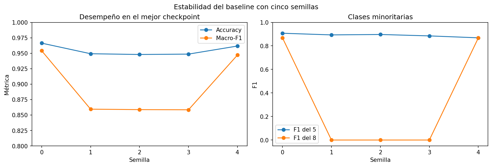

La corrida inicial con semilla 0 era favorable, no representativa por sí sola.
Aunque la accuracy varía relativamente poco, macro-F1 revela una falla grave:
tres de cinco inicializaciones nunca predicen correctamente la clase 8. Como
el 8 representa sólo 2,39 % de development, accuracy oculta parcialmente este
colapso. Esto confirma por qué se mantienen macro-F1 y métricas por clase.

#### ¿Por qué falla el 8 si ahora hay ejemplos?

Los datos nuevos resuelven la ausencia total del 8, pero no el desbalance. En
training hay 468 ochos entre 19.601 imágenes: por cada ejemplo positivo para la
salida 8 hay aproximadamente 41 imágenes cuyo objetivo para esa salida es cero.
En un mini-batch de 128 aparecen, en promedio, sólo tres ochos.

La red actual trata las diez salidas como sigmoides independientes y minimiza
MSE sin pesos de clase. Para la neurona del 8, la mayoría de las contribuciones
al error le piden producir cero. Además, el gradiente de esa salida multiplica
el error por la derivada logística `2·o·(1-o)`. Si una inicialización lleva su
salida cerca de cero, la derivada también se vuelve pequeña y puede quedar en
una región donde nunca alcanza a competir con las otras nueve salidas. Eso es
lo observado en las semillas 1, 2 y 3: el modelo obtuvo buena accuracy global,
pero no predijo ningún 8 y confundió sus 117 ejemplos de validation con las
otras clases.

No se trata de que 585 ejemplos totales sean necesariamente insuficientes: las
semillas 0 y 4 alcanzaron F1 del 8 cercano a 0,87 con exactamente los mismos
datos. La evidencia indica que la señal existe, pero la optimización actual es
sensible a la inicialización y no la aprovecha de forma confiable.

Esta es la motivación concreta para probar softmax con entropía cruzada. Softmax
hace competir directamente a las diez clases y, combinado con entropía
cruzada, evita multiplicar el gradiente de salida por la derivada sigmoidea que
puede saturarse. Si eso todavía no estabiliza el 8, las alternativas siguientes
son ponderar clases, usar batches balanceados u oversampling, y luego
augmentation válido; deben probarse por separado para identificar su efecto.

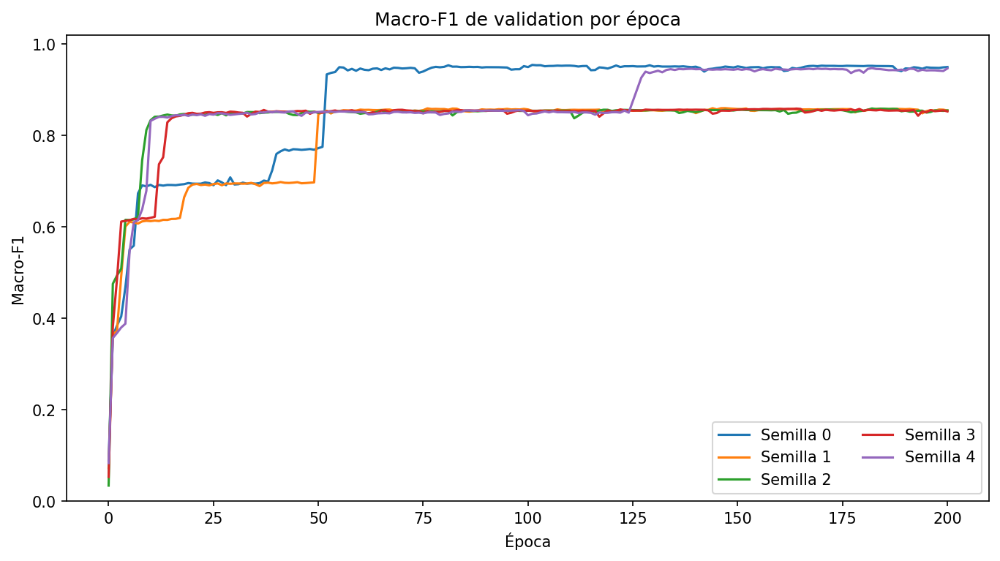

Las mejores épocas van de 101 a 182. En particular, la semilla 4 permanece en
una meseta de macro-F1 cercana a 0,85 hasta aproximadamente la época 125 y
recién entonces salta a una región cercana a 0,95 al aprender la clase que
faltaba. Una regla de early stopping con paciencia corta habría detenido esa
corrida demasiado pronto y conservado un modelo sin capacidad de reconocer el
8. Por lo tanto, early stopping sigue siendo una herramienta válida, pero **no
es la primera corrección** para este baseline: antes hace falta una formulación
u optimización que aprenda las clases minoritarias de manera consistente.

Este diagnóstico motivó comparar la formulación actual —diez salidas logísticas
con MSE— contra softmax con entropía cruzada. La nueva formulación se implementó
y su búsqueda inicial se documenta más abajo; la comparación definitiva todavía
debe repetirse con las mismas cinco semillas.

La configuración reproducible está en `02-baseline-five-seeds.json` y las
tablas y figuras consolidadas en `results/analysis-02/`.

### Implementación de softmax y entropía cruzada

**Punto 1 completado.** Se incorporó la nueva formulación al motor manteniendo
MSE como comportamiento predeterminado, de modo que los experimentos anteriores
continúan siendo reproducibles.

La implementación incluye:

- softmax numéricamente estable, restando el máximo de cada fila antes de
  exponenciar;
- entropía cruzada categórica promediada por muestra;
- validación de objetivos one-hot o distribuciones que sumen uno;
- delta de salida simplificado `probabilidades - objetivo`;
- persistencia de la loss al guardar y cargar modelos;
- registro separado de `loss`, `validation_loss`, MSE y MSE de validation;
- soporte explícito en las configuraciones del runner mediante
  `loss: "categorical_cross_entropy"` y salida `softmax`.

Se decidió exigir la pareja softmax + entropía cruzada: el motor rechaza una
de ellas sin la otra. Esto evita introducir combinaciones que no forman parte
del experimento acordado.

La validación automatizada comprobó:

1. que las diez probabilidades son finitas y suman uno incluso con valores
   internos extremos;
2. que la entropía cruzada coincide con valores calculables manualmente;
3. que todos los gradientes analíticos coinciden con diferencias finitas;
4. que una red pequeña aprende un problema multiclase;
5. que guardar y cargar conserva loss y predicciones;
6. que una configuración softmax + entropía cruzada es aceptada y las
   combinaciones incompatibles se rechazan.

La suite completa quedó en 108 tests correctos. Esta etapa no consultó test.

### Búsqueda de learning rate para softmax + entropía cruzada

El learning rate no modifica ni selecciona los datos: controla el tamaño de
cada actualización de los pesos. Una tasa demasiado baja aprende lentamente y
puede no llegar a una buena solución en las 200 épocas; una demasiado alta
puede oscilar, sobrepasar buenas regiones o producir predicciones demasiado
extremas. Por eso se buscó de nuevo al cambiar la función de pérdida: la escala
de los gradientes de entropía cruzada no es la misma que la de MSE.

Se mantuvieron fijos el split deduplicado, la arquitectura `[784, 128, 10]`,
Adam, batch 128, 200 épocas y la semilla 0. La única variable fue la tasa. Cada
fila corresponde al checkpoint con mayor macro-F1 de validation de su corrida:

| Learning rate | Mejor época | Accuracy | Macro-F1 | F1 del 5 | F1 del 8 |
|---:|---:|---:|---:|---:|---:|
| 0,0001 | 190 | 0,9571 | 0,9375 | 0,8562 | 0,8066 |
| 0,0003 | 192 | 0,9622 | 0,9476 | 0,8816 | 0,8559 |
| 0,0010 | 171 | 0,9635 | 0,9499 | 0,8874 | 0,8670 |
| 0,0030 | 191 | 0,9645 | 0,9539 | 0,9007 | **0,8927** |
| 0,0100 | 143 | **0,9653** | **0,9545** | **0,9221** | 0,8722 |

Las cinco tasas aprendieron el 8 en esta corrida, a diferencia de las tres
semillas colapsadas del baseline con sigmoides y MSE. Esto es evidencia a favor
de la nueva formulación, pero una sola semilla todavía no demuestra estabilidad.
`0,0001` converge más lentamente y queda claramente por debajo. `0,003` y
`0,01` son las dos finalistas: la segunda tiene una ventaja mínima en accuracy,
macro-F1 y F1 del 5, mientras la primera obtiene el mejor F1 del 8.

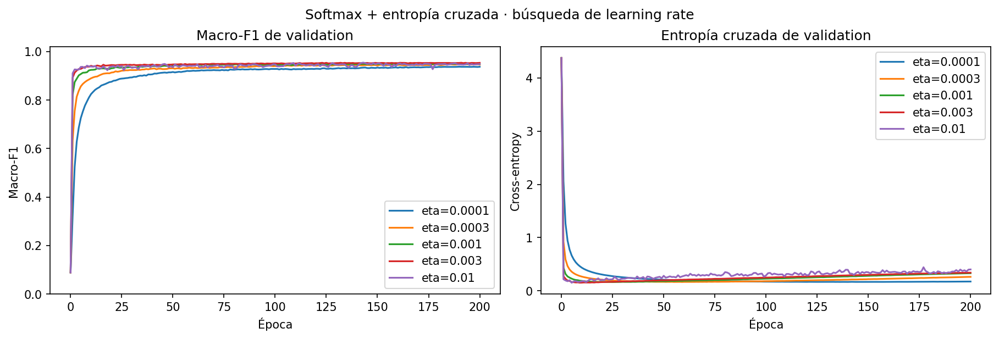

La entropía cruzada de validation vuelve a crecer para las tasas rápidas aunque
macro-F1 se mantenga alto. No es una contradicción: macro-F1 sólo depende de la
clase elegida, mientras que la entropía cruzada también penaliza la confianza.
El modelo puede seguir acertando casi las mismas imágenes, pero asignar una
probabilidad cada vez más extrema a los pocos errores restantes. Esto sugiere
cierta sobreconfianza y deja abierta la evaluación posterior de early stopping
o regularización; no justifica elegir ahora por la menor entropía aislada.

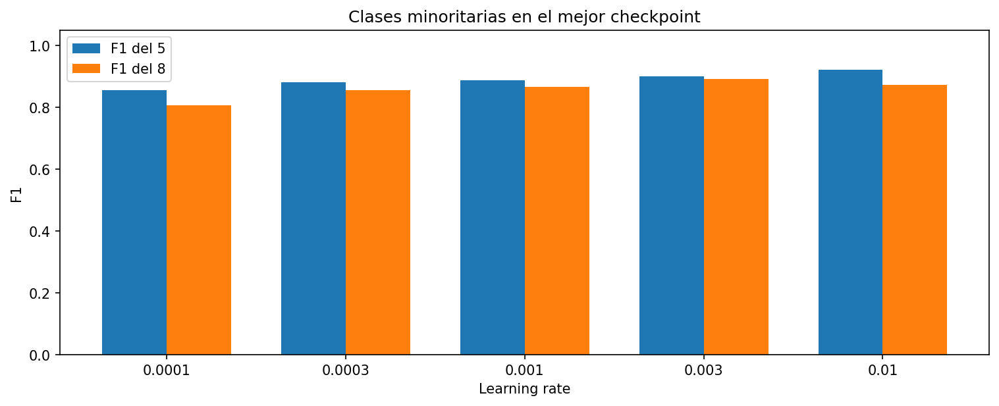

La configuración de la búsqueda está en `03-softmax-learning-rate.json`; la
tabla reproducible y las figuras, en `results/analysis-03/`. `digits_test.csv`
permaneció cerrado durante toda la búsqueda.

### Estabilidad de las dos tasas finalistas

Se repitieron `0,003` y `0,01` con las semillas 0 a 4. Para que la comparación
fuera pareada, cada semilla controló tanto la inicialización como el orden de
los mini-batches y se mantuvo el mismo split de development. Cada fila informa
el checkpoint de mayor macro-F1 de validation de esa corrida.

| Tasa | Semilla | Época | Accuracy | Macro-F1 | F1 del 5 | F1 del 8 |
|---:|---:|---:|---:|---:|---:|---:|
| 0,003 | 0 | 191 | 0,9645 | 0,9539 | 0,9007 | 0,8927 |
| 0,003 | 1 | 57  | 0,9629 | 0,9474 | 0,8874 | 0,8412 |
| 0,003 | 2 | 131 | 0,9606 | 0,9476 | 0,8911 | 0,8646 |
| 0,003 | 3 | 63  | 0,9624 | 0,9490 | 0,8932 | 0,8596 |
| 0,003 | 4 | 101 | 0,9635 | 0,9512 | 0,9024 | 0,8696 |
| 0,01 | 0 | 143 | 0,9653 | 0,9545 | 0,9221 | 0,8722 |
| 0,01 | 1 | 173 | 0,9641 | 0,9520 | 0,9007 | 0,8714 |
| 0,01 | 2 | 88  | 0,9618 | 0,9518 | 0,9109 | 0,8861 |
| 0,01 | 3 | 192 | 0,9671 | 0,9582 | 0,9295 | 0,8917 |
| 0,01 | 4 | 59  | 0,9624 | 0,9526 | 0,9026 | 0,8963 |

El resumen entre semillas es:

| Tasa | Accuracy media ± sd | Peor accuracy | Macro-F1 medio ± sd | Peor macro-F1 | F1 del 8 medio ± sd | Peor F1 del 8 |
|---:|---:|---:|---:|---:|---:|---:|
| 0,003 | 0,9628 ± 0,0014 | 0,9606 | 0,9498 ± 0,0027 | 0,9474 | 0,8655 ± 0,0186 | 0,8412 |
| **0,01** | **0,9642 ± 0,0022** | **0,9618** | **0,9538 ± 0,0027** | **0,9518** | **0,8835 ± 0,0113** | **0,8714** |

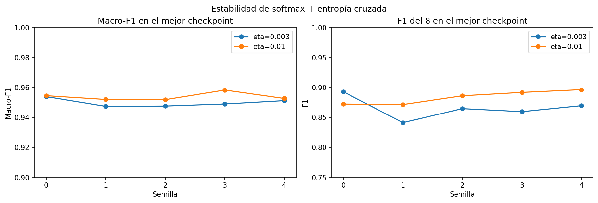

Las diez corridas aprendieron el 8: ninguna tuvo F1 igual a cero. Por lo tanto,
softmax con entropía cruzada resolvió la inestabilidad cualitativa observada con
sigmoides y MSE. Entre las finalistas, `0,01` supera a `0,003` en las tres medias
principales y también en sus peores resultados. Aunque su curva es algo más
oscilatoria, esa oscilación no se tradujo en peor estabilidad entre semillas.
Se selecciona entonces **learning rate `0,01`** para la siguiente etapa.

Frente al baseline con MSE, la configuración elegida eleva aproximadamente la
accuracy media de 0,9547 a 0,9642, el macro-F1 medio de 0,8955 a 0,9538 y el F1
medio del 8 de 0,3469 a 0,8835. La comparación más importante no es sólo la
media: se pasó de tres semillas que ignoraban completamente el 8 a cinco de
cinco que lo reconocen.

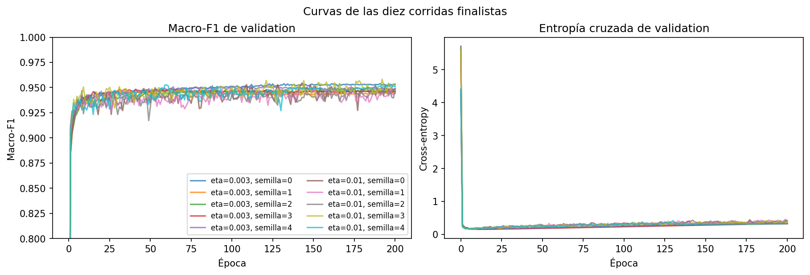

Las mejores épocas varían entre 59 y 192 y la entropía cruzada de validation
tiende a aumentar después de su mínimo. Esto vuelve a mostrar sobreconfianza y
una brecha de generalización, pero no respalda una paciencia corta universal:
algunas semillas alcanzan su mejor macro-F1 tarde. El próximo cambio debe
evaluarse de manera controlada y con las cinco semillas.

La configuración está en `04-softmax-finalists-five-seeds.json`; los datos
consolidados y figuras están en `results/analysis-04/`. El test permaneció
cerrado.

### Implementación y búsqueda inicial de L2

Se implementó regularización L2 como parte del objetivo de entrenamiento:

\[
L_{\mathrm{total}} = L_{\mathrm{datos}} +
\frac{\lambda}{2}\sum_l \lVert W_l \rVert_2^2.
\]

La penalización se aplica a los pesos de todas las capas, pero no a los bias.
Por lo tanto, el gradiente que recibe Adam para cada matriz es
`gradiente_datos + λ·W`. Esta es L2 acoplada al gradiente, no el weight decay
desacoplado de AdamW.

Para no contaminar el diagnóstico, el historial separa tres cantidades:

- `data_loss`: entropía cruzada de training;
- `regularization_loss`: penalización L2;
- `loss`: suma de las dos, que es el objetivo efectivamente optimizado.

`validation_loss` conserva únicamente la entropía cruzada sobre validation:
agregarle la penalización no mediría mejor el ajuste a datos no vistos, porque
ese término depende de los pesos y no de las muestras de validation.

La implementación valida que `λ` sea finito y no negativo, persiste su valor al
guardar el modelo y mantiene compatibilidad exacta con las corridas anteriores
cuando `λ=0`. Las pruebas por diferencias finitas incluyen todos los pesos y
bias y confirman el gradiente analítico regularizado.

La búsqueda corta mantuvo fija la configuración seleccionada —softmax,
entropía cruzada, Adam con learning rate `0,01`, arquitectura `[784,128,10]`,
batch 128, split y semilla 0— y sólo modificó `λ`:

| λ | Mejor época | Accuracy | Macro-F1 | F1 del 5 | F1 del 8 |
|---:|---:|---:|---:|---:|---:|
| 0 | 143 | **0,9653** | 0,9545 | 0,9221 | 0,8722 |
| 10⁻⁶ | 124 | 0,9616 | 0,9528 | 0,9205 | 0,8908 |
| 10⁻⁵ | 82 | 0,9618 | 0,9524 | 0,8994 | **0,9030** |
| **10⁻⁴** | 142 | 0,9643 | **0,9554** | **0,9267** | 0,8898 |
| 10⁻³ | 34 | 0,9606 | 0,9500 | 0,9226 | 0,8661 |

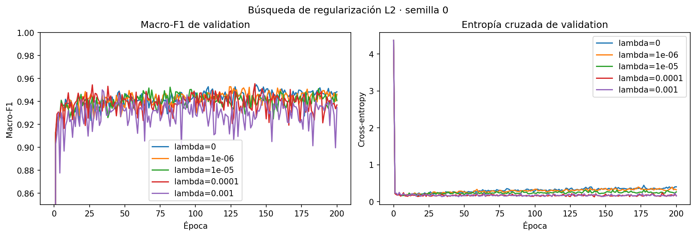

`λ=10⁻³` ya regulariza demasiado y empeora las métricas. Los valores pequeños
mejoran el F1 del 8, pero `10⁻⁶` y `10⁻⁵` pierden demasiado en accuracy y
macro-F1. `λ=10⁻⁴` ofrece el compromiso más interesante: supera al control en
macro-F1 y en las dos clases minoritarias, reduce la entropía cruzada de
validation, y pierde sólo 0,10 puntos porcentuales de accuracy en esta semilla.

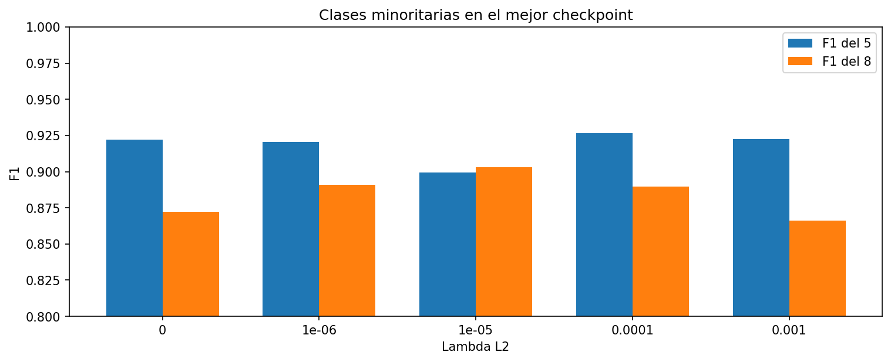

Una sola semilla no permite afirmar que L2 mejora el modelo. La decisión
correcta es comparar `λ=10⁻⁴` con el control `λ=0` usando las mismas cinco
semillas. La configuración reproducible está en `05-l2-search.json` y los
resultados consolidados en `results/analysis-05/`. El test permaneció cerrado.

### Confirmación de L2 con cinco semillas

Se ejecutó `λ=10⁻⁴` con las semillas 0 a 4 y se comparó de forma pareada con
las cinco corridas ya disponibles de `λ=0`. Ambos candidatos usan exactamente
el mismo split, arquitectura, optimizador, learning rate y semillas.

| Configuración | Accuracy media ± sd | Macro-F1 medio ± sd | F1 del 5 medio ± sd | F1 del 8 medio ± sd |
|---|---:|---:|---:|---:|
| **Sin L2** | **0,9642 ± 0,0022** | **0,9538 ± 0,0027** | **0,9131 ± 0,0124** | 0,8835 ± 0,0113 |
| `λ=10⁻⁴` | 0,9633 ± 0,0008 | 0,9526 ± 0,0017 | 0,9037 ± 0,0203 | **0,8857 ± 0,0088** |

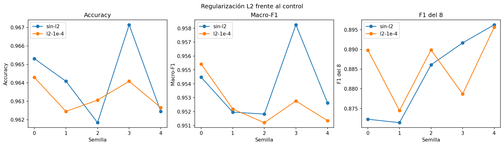

L2 reduce claramente la entropía cruzada media de validation, de 0,3028 a
0,1413, y también reduce la dispersión. Eso significa que produce
probabilidades menos extremas y más estables. Sin embargo, esa mejora de
calibración no se convierte en más clasificaciones correctas:

- la accuracy media baja 0,086 puntos porcentuales;
- el macro-F1 medio baja 0,0012;
- el F1 medio del 5 baja 0,0094;
- el F1 medio del 8 sube sólo 0,0022.

La comparación pareada tampoco muestra una ventaja consistente: L2 mejora la
accuracy únicamente en dos de las cinco semillas y empeora macro-F1 en tres.
Por lo tanto, **se descarta L2 para la configuración final**. El resultado es
útil aunque sea negativo: confirma que reducir la sobreconfianza no basta para
cerrar la brecha hasta 98 % de accuracy.

La configuración de confirmación está en `06-l2-five-seeds.json`; las tablas,
diferencias pareadas y figura están en `results/analysis-06/`. El test siguió
cerrado.

### Augmentation por traslaciones

Se implementó augmentation online para imágenes de 28×28. Durante el
entrenamiento, cada imagen seleccionada se desplaza horizontal y/o verticalmente
y los píxeles que quedan fuera del cuadro se descartan; las posiciones nuevas
se rellenan con cero. No se usa desplazamiento circular, por lo que ningún píxel
reaparece por el borde opuesto.

La transformación se aplica sólo al mini-batch utilizado para actualizar los
pesos. Las métricas de training se calculan sobre las imágenes originales y
validation nunca se modifica. Un generador aleatorio separado evita que el
augmentation altere la secuencia de shuffle y permite reproducir cada corrida.
Las etiquetas y la cantidad de actualizaciones por época no cambian.

Las pruebas automatizadas comprobaron desplazamientos y padding exactos,
ausencia de wrap-around, reproducibilidad, preservación de los datos originales,
validación de parámetros y equivalencia exacta con el entrenamiento anterior
cuando la probabilidad es cero.

#### Búsqueda inicial

Se mantuvieron fijos softmax + entropía cruzada, Adam con learning rate `0,01`,
`λ=0`, arquitectura `[784,128,10]`, batch 128, split y semilla 0. Cada fila
corresponde al checkpoint de mayor macro-F1 de validation:

| Variante | Mejor época | Accuracy | Macro-F1 | F1 del 5 | F1 del 8 |
|---|---:|---:|---:|---:|---:|
| Sin augmentation | 143 | 0,9653 | 0,9545 | 0,9221 | 0,8722 |
| **1 píxel, p=0,5** | 196 | **0,9769** | **0,9716** | 0,9508 | **0,9356** |
| 1 píxel, p=0,75 | 98 | 0,9761 | 0,9696 | 0,9500 | 0,9185 |
| 2 píxeles, p=0,5 | 136 | 0,9759 | 0,9690 | **0,9682** | 0,8971 |

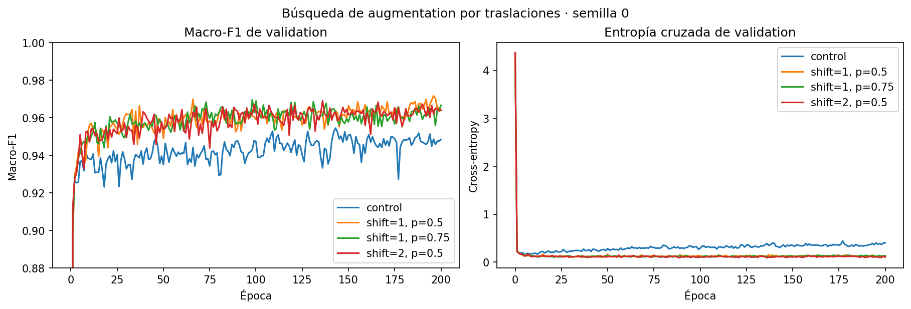

Las tres variantes superan ampliamente al control. Un desplazamiento máximo de
dos píxeles favorece especialmente al 5, pero perjudica al 8. La variante de un
píxel con probabilidad 0,5 presenta el mejor equilibrio general y se seleccionó
para la confirmación entre semillas.

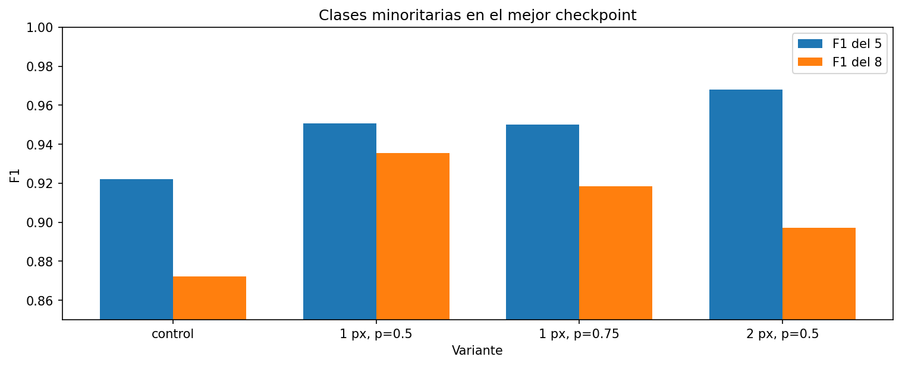

#### Confirmación con cinco semillas

| Configuración | Accuracy media ± sd | Peor accuracy | Macro-F1 medio ± sd | F1 del 5 medio ± sd | F1 del 8 medio ± sd |
|---|---:|---:|---:|---:|---:|
| Sin augmentation | 0,9642 ± 0,0022 | 0,9618 | 0,9538 ± 0,0027 | 0,9131 ± 0,0124 | 0,8835 ± 0,0113 |
| **1 píxel, p=0,5** | **0,9754 ± 0,0011** | **0,9741** | **0,9695 ± 0,0014** | **0,9516 ± 0,0020** | **0,9246 ± 0,0090** |

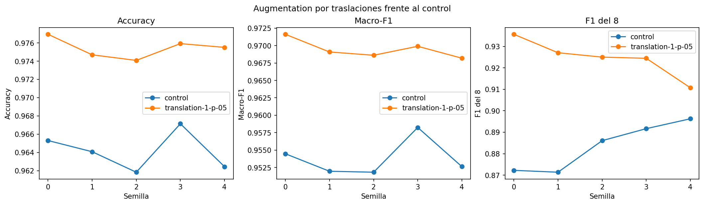

La mejora es consistente en las cinco comparaciones pareadas. Según la semilla,
augmentation agrega entre 0,88 y 1,31 puntos porcentuales de accuracy. En media,
la ganancia es de 1,13 puntos, macro-F1 aumenta 0,0157, F1 del 5 aumenta 0,0384
y F1 del 8 aumenta 0,0410. También reduce aproximadamente a la mitad la
dispersión de accuracy y macro-F1.

La mejor corrida alcanza 97,69 % y la peor 97,41 %. Ninguna llega todavía al
98 %, por lo que el umbral del cliente no puede considerarse alcanzado en
validation. Aun así, las traslaciones constituyen la mejora técnica más grande
y estable evaluada hasta ahora y quedan incorporadas al candidato actual.

Las configuraciones están en `07-translation-augmentation-search.json` y
`08-translation-five-seeds.json`; las tablas y figuras consolidadas, en
`results/analysis-07/` y `results/analysis-08/`. El test permaneció cerrado.

#### Extensión hasta 300 épocas

Como dos corridas habían encontrado su mejor checkpoint cerca del límite de
200 épocas, se repitieron las cinco semillas con un máximo de 300. Las semillas
y el generador de augmentation se conservaron: el análisis verificó que cada
métrica de las primeras 200 épocas coincide exactamente con la ejecución
anterior. La única diferencia experimental es disponer de 100 épocas más.

La fila “300” informa el mejor checkpoint encontrado dentro de las 300 épocas,
no necesariamente el estado de la época 300.

| Máximo de épocas | Mejores épocas | Accuracy media ± sd | Mejor accuracy | Macro-F1 medio ± sd | F1 del 8 medio ± sd |
|---:|---|---:|---:|---:|---:|
| 200 | 196, 164, 159, 119, 200 | 0,9754 ± 0,0011 | 0,9769 | 0,9695 ± 0,0014 | 0,9246 ± 0,0090 |
| **300** | 196, 212, 225, 119, 208 | **0,9764 ± 0,0010** | **0,9773** | **0,9707 ± 0,0007** | **0,9296 ± 0,0087** |

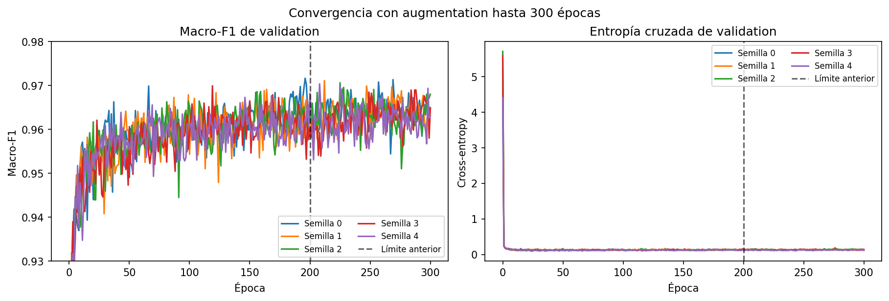

Tres semillas encontraron un checkpoint nuevo después de 200; dos conservaron
exactamente el anterior. La extensión mejora la accuracy media sólo 0,10 puntos
porcentuales y la mejor corrida pasa de 97,69 % a 97,73 %. Ninguna alcanza 98 %.
Además, ningún mejor checkpoint aparece después de la época 225. Por lo tanto,
el límite de 200 cortaba levemente algunas corridas, pero **la falta de épocas
no explica la brecha restante** y no se justifica continuar aumentando el
máximo sin otro cambio técnico.

La configuración está en `09-translation-300-epochs.json`; la comparación
pareada y las curvas están en `results/analysis-09/`. El test siguió cerrado.

### Reducción programada del learning rate

Las curvas crudas mostraron que Adam con learning rate constante no converge a
un punto fijo: continúa recorriendo una región de buen desempeño y produce
oscilaciones visibles. Además, seleccionar el máximo entre 300 valores puede
favorecer un pico afortunado. Para atacar ambos problemas se implementó un
schedule por tramos:

| Épocas | Learning rate |
|---:|---:|
| 1–150 | 0,01 |
| 151–220 | 0,003 |
| 221–300 | 0,001 |

El cambio de tasa no reinicia los momentos acumulados por Adam. El historial
registra el learning rate efectivo de cada época. La configuración conserva
arquitectura, split, semillas, batch y augmentation; las primeras 150 épocas
coinciden exactamente con el control de tasa constante.

Para evitar depender de máximos aislados, la comparación principal utiliza el
modelo de la **época 300 fija** en las cinco semillas. También se mide la
fluctuación dentro de las últimas 50 épocas. Los mejores checkpoints se
conservan sólo como diagnóstico secundario.

| Configuración | Accuracy en época 300 | Macro-F1 en época 300 | Entropía cruzada en época 300 |
|---|---:|---:|---:|
| Tasa constante `0,01` | 0,9735 ± 0,0013 | 0,9651 ± 0,0018 | 0,1307 ± 0,0108 |
| **Step decay** | **0,9782 ± 0,0008** | **0,9719 ± 0,0015** | **0,1072 ± 0,0058** |

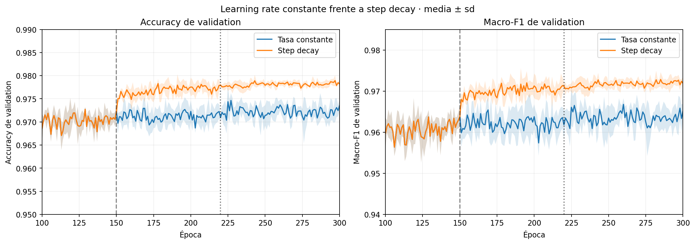

El schedule mejora 0,47 puntos porcentuales de accuracy media en el estado fijo
de época 300. También reduce sustancialmente el ruido de las últimas 50 épocas:

| Métrica | SD temporal media, tasa constante | SD temporal media, step decay |
|---|---:|---:|
| Accuracy | 0,00197 | **0,00068** |
| Macro-F1 | 0,00285 | **0,00093** |
| Entropía cruzada | 0,00970 | **0,00206** |

La reducción de fluctuación es aproximadamente 66 % para accuracy y macro-F1,
y 79 % para entropía cruzada. La media de accuracy de las últimas 50 épocas
coincide con la de la época 300 (`0,9782`), señal de que el resultado fijo es
representativo de la meseta y no un punto especialmente favorable.

Como diagnóstico, tres de cinco mejores checkpoints superan 98 %; el mayor
alcanza 98,06 %. Sin embargo, ninguna semilla supera 98 % en la época 300 fija
y la media estable queda en 97,82 %. Por eso todavía no se declara cumplido el
objetivo basándose en picos individuales.

El schedule se implementó de manera configurable y fue validado con pruebas de
cambio de tasa, configuración y compatibilidad con las corridas sin schedule.
Las configuraciones están en `10-learning-rate-schedule.json` y
`11-learning-rate-schedule-five-seeds.json`; las tablas de época fija,
estabilidad temporal y checkpoints diagnósticos están en
`results/analysis-11/`. El test permaneció cerrado.

### Rotaciones pequeñas

El siguiente cambio agrega una invariancia distinta de la traslación. Durante
el entrenamiento, cada imagen sigue teniendo probabilidad 0,5 de trasladarse
como máximo un píxel y, de manera independiente, probabilidad 0,5 de rotarse
un ángulo uniforme. La rotación se realiza alrededor del centro, con
interpolación bilineal y relleno negro; no se envuelven píxeles en los bordes.
Validation permanece sin transformar.

Primero se compararon `±2°`, `±4°` y `±6°` con una semilla, manteniendo la
arquitectura, el schedule y las 300 épocas. Se incluyó un control nuevo con el
mismo mecanismo y probabilidad de rotación cero para no atribuir a la rotación
una diferencia en la secuencia aleatoria.

| Rotación, semilla 0 | Accuracy época 300 | Macro-F1 época 300 | Entropía cruzada época 300 |
|---|---:|---:|---:|
| Sin rotación | 0,9776 | 0,9722 | 0,1128 |
| `±2°`, `p=0,5` | 0,9773 | 0,9697 | 0,1049 |
| **`±4°`, `p=0,5`** | **0,9808** | **0,9773** | 0,0925 |
| `±6°`, `p=0,5` | 0,9790 | 0,9700 | **0,0838** |

`±4°` fue el candidato más equilibrado: fue el único que superó 98 % y tuvo
el mayor macro-F1 en la época fija. El menor loss de `±6°` no se tradujo en la
mejor clasificación, por lo que no se lo eligió sólo por esa métrica.

Luego se repitió `±4°` con las mismas cinco semillas. La comparación principal
sigue siendo la época 300 fija:

| Configuración | Accuracy | Macro-F1 | Entropía cruzada | F1 del 5 | F1 del 8 |
|---|---:|---:|---:|---:|---:|
| Sólo traslación + schedule | 0,9782 ± 0,0008 | 0,9719 ± 0,0015 | 0,1072 ± 0,0058 | 0,9568 ± 0,0054 | 0,9197 ± 0,0143 |
| **Traslación + rotación `±4°`** | **0,9793 ± 0,0016** | **0,9736 ± 0,0029** | **0,0934 ± 0,0079** | **0,9603 ± 0,0102** | **0,9256 ± 0,0126** |

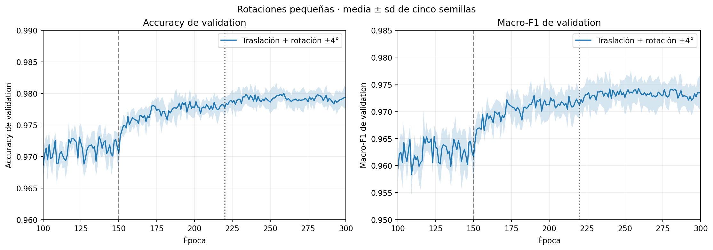

La rotación mejora la accuracy media en 0,11 puntos porcentuales, y también
mejora macro-F1, loss y los F1 de las clases 5 y 8. Dos de las cinco semillas
superan 98 % en la época 300. Sin embargo, la media queda en 97,93 % y la
dispersión entre semillas aumenta; por lo tanto, se conserva como el nuevo
candidato provisional, pero todavía no demuestra un 98 % estable.

El ruido temporal sigue siendo pequeño: en las últimas 50 épocas, la SD media
dentro de cada semilla es 0,00083 para accuracy, 0,00132 para macro-F1 y
0,00213 para entropía cruzada. Es ligeramente mayor que con sólo traslación,
pero las curvas mantienen una meseta clara después de la segunda reducción de
tasa.

La implementación, búsqueda y confirmación están en
`digit_augmentation.py`, `12-small-rotation-search.json` y
`13-small-rotation-five-seeds.json`. Las tablas y el gráfico reproducible están
en `results/analysis-13/`. El test permaneció cerrado durante toda esta etapa.

### Búsqueda de arquitectura

Para estudiar si faltaba capacidad se mantuvieron fijos el split, la semilla
0, batch `128`, las 300 épocas, el schedule y toda la augmentation. Se comparó
la capa oculta actual con dos capas más anchas y con una red de dos capas
ocultas. Nuevamente se usó la época 300 fija:

| Arquitectura | Parámetros | Accuracy | Macro-F1 | Entropía cruzada |
|---|---:|---:|---:|---:|
| **`[784,128,10]`** | 101.770 | **0,9808** | **0,9773** | **0,0925** |
| `[784,192,10]` | 152.650 | 0,9776 | 0,9699 | 0,1106 |
| `[784,256,10]` | 203.530 | 0,9773 | 0,9707 | 0,1154 |
| `[784,128,64,10]` | 109.386 | 0,9737 | 0,9651 | 0,1020 |

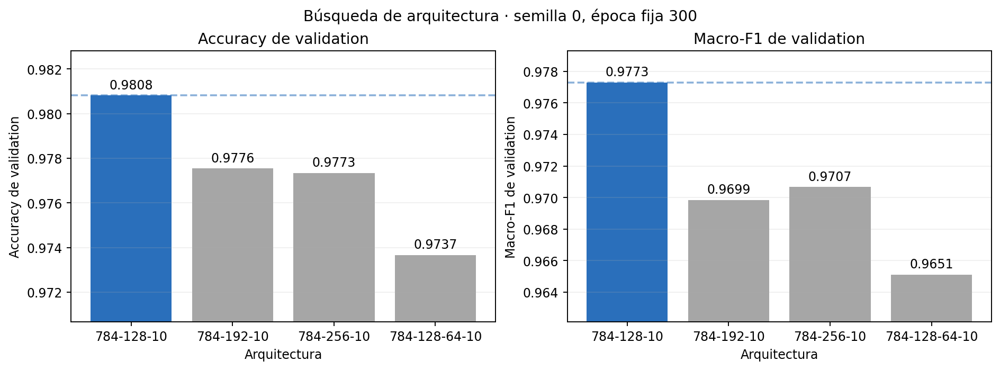

Ninguna alternativa supera al control en accuracy, macro-F1 o loss. Ampliar
la única capa oculta aumenta hasta el doble la cantidad de parámetros sin
mejorar validation. La red profunda también termina con mayor loss de training
que las redes de una capa, señal de que, con la inicialización y el schedule
controlados, además resulta más difícil de optimizar.

Por eso se conserva `[784,128,10]` y no se repiten cinco semillas para las
alternativas: la búsqueda inicial no produjo un candidato que justificara esa
confirmación. La configuración está en `14-architecture-search.json` y el
análisis reproducible en `results/analysis-14/`. El test permaneció cerrado.

### Búsqueda de tamaño de batch

Cambiar el batch también cambia la cantidad de actualizaciones de Adam por
época. Para la primera comparación se conservaron las 300 épocas y el mismo
schedule —tasas `0,01`, `0,003` y `0,001` desde las épocas 1, 151 y 221—. De
esta forma cada configuración ve la misma cantidad de pasadas completas por
los datos y sólo cambia el tamaño de cada estimación del gradiente.

| Batch | Actualizaciones por época | Actualizaciones totales | Accuracy | Macro-F1 | Loss de validation |
|---:|---:|---:|---:|---:|---:|
| 64 | 307 | 92.100 | 0,9771 | 0,9714 | 0,1031 |
| **128** | 154 | 46.200 | **0,9808** | **0,9773** | **0,0925** |
| 256 | 77 | 23.100 | 0,9771 | 0,9701 | 0,0987 |

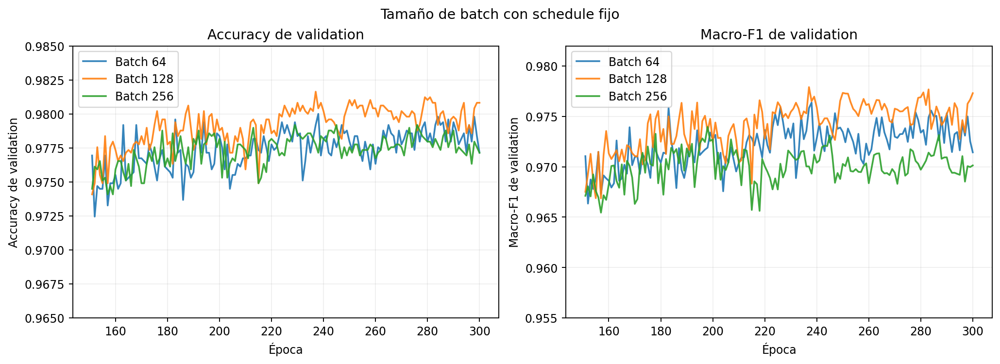

Batch `64` no mejora aun realizando el doble de actualizaciones. Batch `256`
tampoco está simplemente subentrenado: en la época 300 su loss de training es
`0,00045`, incluso menor que el `0,00059` del control, pero generaliza peor.
Además, su mejor zona aparece alrededor de la época 200 y luego pierde algo de
accuracy, de modo que extenderle el entrenamiento no está respaldado por el
diagnóstico.

Por estas razones no se modifica el schedule para rescatar retrospectivamente
una alternativa inferior. Hacerlo convertiría la prueba en una búsqueda
conjunta de batch y schedule; las curvas actuales no aportan evidencia de que
el problema sea falta de convergencia. Se conserva batch `128` con el schedule
actual y no se repiten cinco semillas para `64` o `256`.

La configuración está en `15-batch-size-search.json` y el análisis reproducible
en `results/analysis-15/`. El test permaneció cerrado.

### Auditoría 5-fold del posible sobreajuste a validation

Después de usar reiteradamente el mismo split para elegir hiperparámetros, se
congeló por completo el candidato y se ejecutó una confirmación 5-fold. Esta
etapa no se utilizó para buscar nuevos valores. Cada imagen integra validation
exactamente una vez y training en los otros cuatro folds. Los folds 0–4 se
emparejaron de antemano con las semillas 0–4, por lo que la dispersión combina
cambio de partición y aleatoriedad del entrenamiento.

Todos los resultados corresponden a la época 300 fija:

| Fold | Accuracy | Macro-F1 | F1 del 5 | F1 del 8 |
|---:|---:|---:|---:|---:|
| 0 | 0,9774 | 0,9688 | 0,9477 | 0,8987 |
| 1 | 0,9798 | 0,9736 | 0,9490 | 0,9298 |
| 2 | 0,9798 | 0,9750 | 0,9457 | 0,9532 |
| 3 | 0,9759 | 0,9690 | 0,9524 | 0,9115 |
| 4 | **0,9806** | 0,9724 | 0,9359 | 0,9211 |
| **Media ± SD** | **0,9787 ± 0,0020** | **0,9717 ± 0,0028** | **0,9461 ± 0,0062** | **0,9229 ± 0,0205** |


Al concatenar las predicciones out-of-fold, las 24.501 imágenes tienen una
predicción hecha por un modelo que no las usó para entrenar. Esa evaluación
global obtiene accuracy `0,97869`, macro-F1 `0,97177`, F1 del 5 `0,94615` y F1
del 8 `0,92308`. Los índices de validation son disjuntos y su unión contiene
las 24.501 imágenes únicas.

La media anterior sobre cinco semillas y un único split era `0,97935`; la
estimación 5-fold baja sólo 0,00065, es decir, aproximadamente 0,07 puntos
porcentuales. Esto no indica un sobreajuste fatal al split original: el nivel de
generalización se conserva. Sí confirma que 98 % no es todavía un resultado
robusto, porque sólo uno de los cinco folds supera ese umbral y el desempeño
del 8 varía más que el promedio global.

El protocolo congelado está en `16-kfold-confirmation.json`, su ejecutor en
`run_kfold_confirmation.py` y el análisis reproducible en
`results/analysis-16/`. `digits_test.csv` no se abrió ni se proporcionó a
ninguno de estos procesos.

## 5. Cómo separar las causas de la mejora

Sí. El cambio de rendimiento no puede atribuirse únicamente a las técnicas de
modelado. El factor externo más importante fue la disponibilidad de un conjunto
de datos mayor y más representativo. `digits.csv` contenía 12.449 imágenes y no
tenía ningún ejemplo del dígito 8, mientras que `more_digits.csv` aportó 15.741
filas, entre ellas 585 ochos y 542 cincos. Después de eliminar las 3.689
imágenes compartidas entre ambos archivos, el development creció hasta 24.501
imágenes únicas, casi el doble que en el ejercicio anterior.

La incorporación del 8 modificó cualitativamente el problema. El test contiene
243 imágenes de esa clase y el modelo del ejercicio 2, al no haberla observado
durante el entrenamiento, no predijo ningún 8 y obtuvo F1 igual a 0 para esa
clase. En el ejercicio 3, el modelo final reconoció correctamente 227 de esos
243 casos y obtuvo F1 `0,9578`. También aumentó la cantidad y variedad de
ejemplos del 5, cuyo F1 pasó de `0,8796` a `0,9545`. Por lo tanto, una parte
sustancial de la mejora de accuracy —de 86,54 % a 97,52 % sobre el mismo test—
se explica por una mejor cobertura de la distribución real, no sólo por
softmax, entropía cruzada, el schedule o data augmentation.

Además, el rendimiento observado depende de qué muestras quedan en cada
partición y de la inicialización aleatoria. La confirmación 5-fold produjo
`97,87 % ± 0,20` puntos de accuracy y el test final obtuvo `97,52 %`, mostrando
una variación esperable entre particiones aun con la configuración congelada.
Finalmente, fue necesario deduplicar los dos CSV: concatenarlos sin tratar las
3.689 coincidencias habría asignado peso extra a ciertas imágenes y podría
haber generado fuga entre training y validation. Al eliminarlas, la mejora
reportada refleja información nueva y no la repetición artificial de ejemplos.

En síntesis, las técnicas propias explican la mejora respecto del baseline del
ejercicio 3, pero la diferencia respecto del ejercicio 2 también está fuertemente
determinada por la mayor cantidad, diversidad y cobertura de clases de los
nuevos datos, además de la variabilidad inherente al muestreo y las semillas.

## 6. Evaluación final

Después de la auditoría 5-fold se congeló la configuración completa:

- arquitectura `[784,128,10]`, con `tanh` y `softmax`;
- entropía cruzada, sin L2 (`λ=0`);
- Adam, batch `128` y semilla 0;
- 300 épocas con tasas `0,01`, `0,003` y `0,001` desde las épocas 1, 151 y 221;
- traslaciones de un píxel y rotaciones `±4°`, ambas con probabilidad 0,5.

El modelo se entrenó desde cero con las 24.501 imágenes únicas de ambos CSV de
development, sin reservar validation. Primero se guardó `model-final.npz` y
recién después se cargó `digits_test.csv`. No se seleccionó ningún checkpoint:
se evaluó el estado fijo de la época 300 una sola vez.

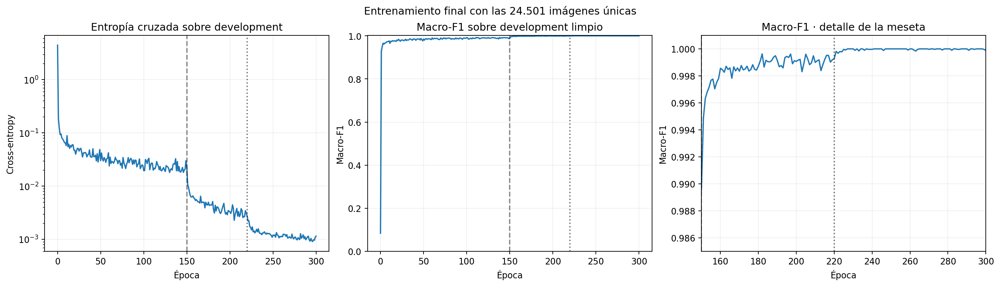

### Resultado externo

El test contiene 2.497 imágenes. El modelo clasificó correctamente 2.435 y se
equivocó en 62:

| Métrica final | Resultado |
|---|---:|
| Accuracy | **0,97517** |
| Macro-F1 | **0,97473** |
| Entropía cruzada | 0,12485 |
| MSE informativo | 0,00423 |
| F1 del 5 | **0,95455** |
| F1 del 8 | **0,95781** |

La accuracy final es 97,52 %, por lo que **no se alcanzó el objetivo de 98 %**.
La diferencia es 0,48 puntos porcentuales, equivalente a necesitar 13 aciertos
adicionales en este test. El resultado queda 0,35 puntos por debajo de la
estimación out-of-fold de 97,87 %, una diferencia plausible pero que confirma
que no debía declararse cumplido el umbral usando validation.


Las clases más débiles siguen siendo 5 y 8: el 5 tiene recall `0,9417` y el 8
recall `0,9342`. Sin embargo, el 8 dejó de ser una clase no aprendida: 227 de
sus 243 ejemplos se clasificaron correctamente y su F1 pasó de 0 en el modelo
final del ejercicio 2 a `0,9578`.

### Comparación con el ejercicio 2

| Evaluación sobre el mismo test | Accuracy | Macro-F1 | F1 del 5 | F1 del 8 |
|---|---:|---:|---:|---:|
| Ejercicio 2 | 0,86544 | 0,81928 | 0,87963 | 0,00000 |
| **Ejercicio 3** | **0,97517** | **0,97473** | **0,95455** | **0,95781** |

La mejora es de 10,97 puntos porcentuales de accuracy y 15,54 puntos de
macro-F1. Una parte sustancial se explica por los nuevos datos, especialmente
la incorporación de ejemplos del 8 y más ejemplos del 5. El resto corresponde
a decisiones controladas del modelado: softmax con entropía cruzada,
augmentation conservadora y el schedule de learning rate. L2, arquitecturas
más grandes y otros tamaños de batch se descartaron porque no mejoraron
validation de manera consistente.

La configuración final está en `17-final-evaluation.json`. Los artefactos de la
única ejecución están en `results/17-final-evaluation/`, donde
`data-source.json` registra `test_evaluations: 1` y los hashes de las tres
fuentes. Las tablas y figuras reproducibles están en `results/analysis-17/`.
El test queda cerrado para cualquier ajuste posterior: este resultado debe
informarse tal como se obtuvo.
