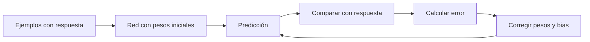
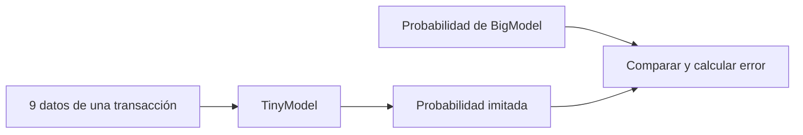
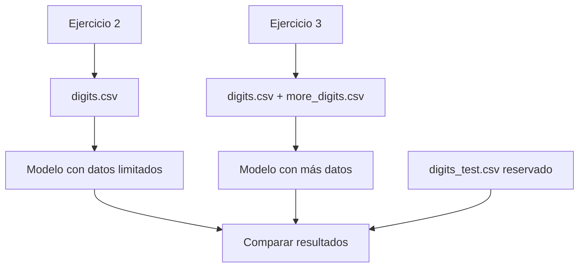
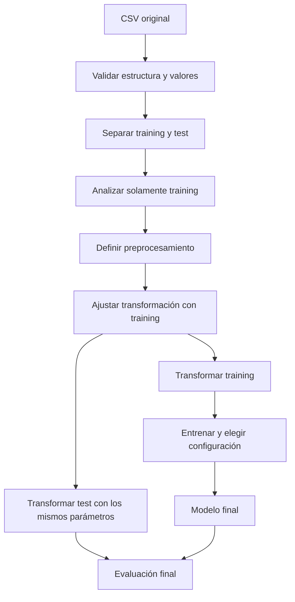
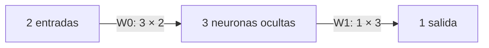
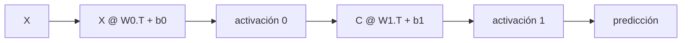
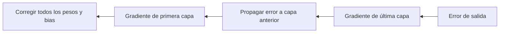
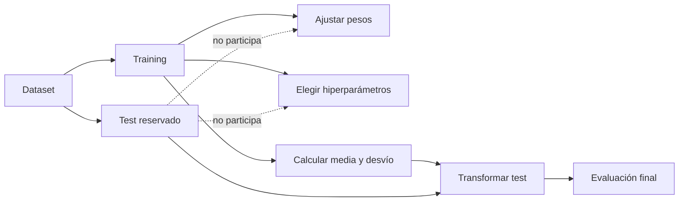
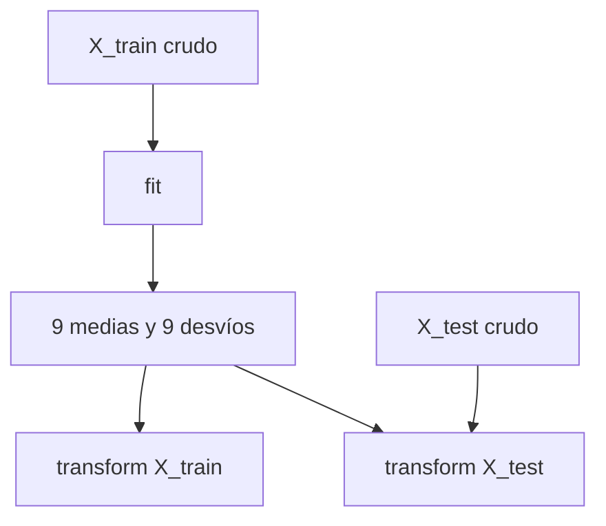
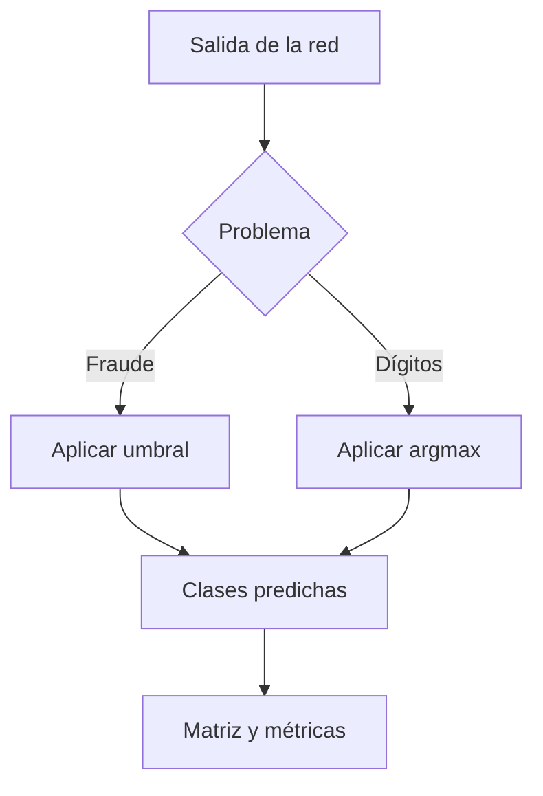

# TP3 desde cero: guía para no perderse

Esta guía explica **qué problema estamos resolviendo, qué hace el código que ya
existe y por qué tomamos cada decisión**. Está escrita para poder leerla sin
entender todavía redes neuronales, NumPy, matrices, métricas ni data leakage.

No reemplaza al enunciado ni a las clases. Su objetivo es que después puedas
abrir el código y reconocer qué está pasando, en lugar de ver una pared de
cuentas y nombres extraños.

## 1. La idea del TP en una oración

Tenemos datos con respuestas conocidas y queremos ajustar pesos de perceptrones
para que produzcan respuestas parecidas ante datos nuevos.



La repetición de este proceso es **entrenar**. La red “aprende” cuando las
correcciones hacen que su error disminuya y sus predicciones mejoren.

## 2. Qué está terminado y qué no

### Ya está implementado

1. El motor de perceptrón simple y perceptrón multicapa.
2. Las activaciones escalón, lineal, `tanh` y logística.
3. Forward propagation, backpropagation y actualización por lotes configurables.
4. La validación recomendada con AND, `y=x`, `y=tanh(x)` y XOR.
5. La carga y separación de los datasets en training y test.
6. El análisis exploratorio de los datos de training.
7. La comprobación de inputs repetidos entre training y test.
8. La estandarización de las nueve entradas de fraude.
9. La matriz de confusión y las métricas de clasificación.
10. Descenso básico, Momentum, eta adaptativo, RMSProp y Adam.
11. Entrenamiento configurable online, mini-batch o batch.

### Todavía no está resuelto

1. Entrenar y comparar los modelos obligatorios de fraude.
2. Elegir el umbral final de fraude.
3. Entrenar el clasificador de dígitos del ejercicio 2.
4. Incorporar `more_digits.csv` y resolver el ejercicio 3.
5. Comparar las variantes de optimización ya implementadas.
6. Realizar los experimentos de hiperparámetros, arquitectura, épocas y forma
   de actualización.
7. Diagnosticar underfitting, overfitting y generalización con las corridas
   reales.
8. Implementar la validation temporal ya acordada para seleccionar
   configuraciones sin mirar test repetidamente.

La distinción importante es esta:

> Tener el motor, los datos y las métricas no significa que los ejercicios
> obligatorios ya estén resueltos. Significa que ya tenemos las herramientas
> necesarias para empezar a resolverlos.

## 3. Diccionario mínimo

| Palabra | Traducción práctica |
|---|---|
| Muestra | Una fila del dataset; por ejemplo, una transacción o una imagen. |
| Entrada o feature | Un dato que recibe la red; por ejemplo, monto o intensidad de un píxel. |
| `X` | Matriz que contiene las entradas de muchas muestras. |
| Objetivo o `y` | Respuesta que queremos que aprenda a producir la red. |
| Peso | Número que determina cuánto influye una entrada. Se aprende. |
| Bias | Número adicional que desplaza la respuesta de una neurona. Se aprende. |
| Arquitectura | Cantidad de entradas y neuronas por capa; por ejemplo `[2, 3, 1]`. |
| Activación | Función aplicada a la suma ponderada de una neurona. |
| Predicción | Respuesta actual de la red. |
| Loss o pérdida | Número que mide qué tan lejos está la predicción del objetivo. |
| Gradiente | Indica en qué dirección cambia la pérdida cuando cambia un parámetro. |
| Learning rate | Tamaño de cada corrección de pesos y bias. |
| Época | Una pasada completa por todas las muestras de training. |
| Online | Actualizar después de cada muestra. Se elige con `batch_size=1`. |
| Batch | Acumular todas las muestras antes de actualizar. |
| Mini-batch | Actualizar usando grupos pequeños de muestras. |
| Hiperparámetro | Decisión que no aprende la red: épocas, learning rate, arquitectura, etc. |
| Training | Datos usados para ajustar pesos y tomar decisiones. |
| Test | Datos reservados para comprobar generalización al final. |
| Generalización | Que el modelo funcione con datos que no utilizó para aprender. |
| Data leakage | Darle directa o indirectamente información de test durante el desarrollo. |

## 4. Los tres ejercicios obligatorios

### Ejercicio 1: fraude

Tenemos transacciones con nueve entradas. `BigModel` ya produjo para cada una
una probabilidad de fraude y queremos construir un modelo más pequeño,
`TinyModel`, que la aproxime.



Hay dos columnas que no se deben confundir:

| Columna | Qué representa | Para qué se usa |
|---|---|---|
| `big_model_fraud_probability` | Probabilidad producida por BigModel. | Es el objetivo que TinyModel aprende a imitar. |
| `flagged_fraud` | Etiqueta real de fraude, obtenida de reportes. | Estratificar el split y evaluar al final; está prohibido usarla para entrenar. |

Por eso el aprendizaje inicial de fraude es una **regresión de probabilidad**,
no una clasificación directa. La clasificación aparece después, cuando
convertimos la probabilidad de TinyModel en fraude/no fraude mediante un umbral.

### Ejercicio 2: dígitos con pocos datos

Cada imagen tiene `28 × 28 = 784` píxeles. La red recibirá 784 entradas y deberá
elegir una de diez clases: los dígitos del 0 al 9.

El training recibido tiene un problema deliberadamente importante:

- tiene **0 ejemplos del dígito 8**;
- tiene solamente **271 ejemplos del dígito 5**;
- las demás clases tienen aproximadamente 1500 ejemplos cada una.

La red no puede aprender a reconocer el 8 si nunca ve un 8. Aumentar épocas o
neuronas no crea información que no existe.

### Ejercicio 3: dígitos con más datos

Se vuelve a entrenar agregando `more_digits.csv` únicamente a training. La idea
es comprobar si disponer de más ejemplos permite aprender mejor y alcanzar la
accuracy de al menos 98 % pedida por el enunciado.



No usamos `more_digits.csv` para “arreglar” el ejercicio 2 porque perderíamos
la comparación que busca la consigna.

## 5. El recorrido completo de los datos

Este es el mapa más importante de toda la guía:



Dos reglas salen de este diagrama:

1. **Test no enseña:** no ajusta pesos, hiperparámetros ni transformaciones.
2. **Test sí se prepara:** recibe la misma transformación aprendida con
   training para que el modelo reciba datos en la escala esperada.

El protocolo acordado mantiene los loaders con training/test y deriva una
validation temporal desde training al ejecutar los experimentos. Así se pueden
comparar hiperparámetros sin mirar test. La partición guardará semilla e índices
para ser reproducible. Los helpers ya están implementados en `experiments.py`;
falta integrarlos en los runners de los ejercicios.

## 6. Dónde está cada cosa en el repositorio

| Archivo | Qué conviene entender |
|---|---|
| [`models.py`](../src/sia_tp3/models.py) | Cómo se representan pesos, bias, activaciones, forward y backpropagation. |
| [`training.py`](../src/sia_tp3/training.py) | Cómo se recorren épocas y muestras para actualizar el modelo. |
| [`data.py`](../src/sia_tp3/data.py) | Cómo se cargan y separan fraude y dígitos. |
| [`preprocessing.py`](../src/sia_tp3/preprocessing.py) | Cómo se calculan y reutilizan media y desvío. |
| [`metrics.py`](../src/sia_tp3/metrics.py) | Cómo se construyen la matriz de confusión y las métricas. |
| [`experiments.py`](../src/sia_tp3/experiments.py) | Cómo se deriva validation temporal sin contaminar test. |
| [`validation.py`](../src/sia_tp3/validation.py) | Cómo se armaron los casos recomendados para validar el motor. |
| [`analyze_training.py`](../scripts/analyze_training.py) | Cómo se generó el EDA sin entrenar modelos. |
| [`decisiones.md`](decisiones.md) | Registro formal de qué elegimos, por qué y qué alternativa descartamos. |
| [`eda-training.md`](eda-training.md) | Resultados explicados del análisis de datos. |
| [`implementacion.md`](implementacion.md) | Contrato técnico completo del motor. |
| [`validacion.md`](validacion.md) | Fórmulas y ejemplos manuales de perceptrones. |
| [`plan-experimental.md`](plan-experimental.md) | Orden obligatorio, diagnóstico e iteraciones de los tres ejercicios. |

## 7. Qué hace una neurona

Una neurona realiza primero una suma ponderada:

\[
h = w_1x_1 + w_2x_2 + \dots + w_nx_n + b
\]

Después aplica una función de activación:

\[
\hat y = g(h)
\]

Ejemplo con dos entradas:

```text
x1 = 2       peso w1 = 0,5 ──┐
                              ├─ suma + bias ─ activación ─ predicción
x2 = 3       peso w2 = -0,2 ─┘
bias = 0,1

h = 0,5×2 + (-0,2)×3 + 0,1 = 0,5
```

El bias importa porque permite desplazar la respuesta. Sin bias, muchas
fronteras de decisión quedarían obligadas a pasar por el origen.

En nuestro código el bias **no se agrega como columna de unos**. Se guarda por
separado y NumPy lo suma a todas las muestras:

```python
outputs.append(
    self._activate(outputs[-1] @ w.T + b, name)
)
```

Eso es matemáticamente equivalente a agregar una columna de unos y un peso
extra, pero mantiene separados los pesos de entradas y el bias.

## 8. Por qué los pesos son matrices

Una neurona necesita un peso por cada entrada. Una capa con varias neuronas
necesita una fila de pesos por neurona.

Si una capa recibe 2 valores y tiene 3 neuronas:

```text
               entrada 1   entrada 2
neurona 1        w11         w12
neurona 2        w21         w22
neurona 3        w31         w32
```

La matriz tiene forma `(3, 2)`:

```python
weights.shape == (neuronas_destino, neuronas_origen)
```

La arquitectura `[2, 3, 1]` tiene dos matrices:



Los pesos sí se actualizan durante el entrenamiento; por lo tanto, las matrices
de pesos también se actualizan. “Actualizar la matriz” significa cambiar sus
números, no cambiar necesariamente su cantidad de filas o columnas.

En [`models.py`](../src/sia_tp3/models.py) se crean así:

```python
self.weights = [
    rng.uniform(-init_scale, init_scale, (out_size, in_size))
    for in_size, out_size
    in zip(self.architecture, self.architecture[1:])
]
```

Lectura en castellano:

1. Mirar cada par de capas consecutivas.
2. Crear una matriz con una fila por neurona destino.
3. Crear una columna por neurona o entrada de origen.
4. Inicializar cada peso con un valor aleatorio pequeño.

## 9. Activaciones implementadas

| Activación | Salida | Uso intuitivo |
|---|---|---|
| Escalón | `-1` o `+1` | Clasificación bipolar con perceptrón simple. |
| Lineal | Cualquier valor real | Regresión lineal. |
| `tanh` | Entre `-1` y `1` | Relación no lineal, centrada en cero. |
| Logística | Entre `0` y `1` | Salidas que se interpretan como probabilidad. |

El escalón no se usa en capas ocultas porque no tiene la derivada necesaria
para backpropagation. El código lo rechaza explícitamente para evitar una red
que no pueda aprender.

## 10. Forward propagation: cómo se produce una predicción

Forward propagation significa avanzar desde las entradas hasta la salida:



El código guarda la salida de cada capa porque backpropagation las necesitará:

```python
def _forward(self, X):
    outputs = [X]
    for w, b, name in zip(
        self.weights, self.biases, self.activations
    ):
        h = outputs[-1] @ w.T + b
        outputs.append(self._activate(h, name))
    return outputs
```

`predict(X)` devuelve solamente la última salida. No cambia pesos ni entrena.

## 11. Loss, gradientes y backpropagation

La loss responde: “¿qué tan lejos está la predicción del objetivo?”. El motor
usa la mitad del error cuadrático medio por muestra:

\[
L = \frac{1}{2N}\sum_{\mu=1}^{N}\sum_{j=1}^{K}
(\hat y_j^{(\mu)}-y_j^{(\mu)})^2
\]

Backpropagation aplica la regla de la cadena desde la salida hacia atrás para
calcular cuánto influyó cada peso en ese error.



La corrección actual es descenso por gradiente:

```python
w -= learning_rate * gradient_w
b -= learning_rate * gradient_b
```

El learning rate controla el tamaño del paso:

- demasiado pequeño: puede aprender muy lentamente;
- demasiado grande: puede saltar alrededor del mínimo o divergir;
- razonable: reduce el error de manera estable.

## 12. Qué significa entrenar en nuestro código

El entrenamiento puede actualizar **online, mini-batch o batch**. El tamaño de
lote no pertenece al optimizador: son dos decisiones independientes.

Versión simplificada de [`training.py`](../src/sia_tp3/training.py):

```python
for epoch in range(max_epochs + 1):
    if epoch:
        order = rng.permutation(len(X))
        for start in range(0, len(X), batch_size):
            indices = order[start:start + batch_size]
            dw, db = model._gradients(X[indices], y[indices])
            optimizer.step(model.weights + model.biases, dw + db)

    predictions = model.predict(X)
    mse = np.mean((predictions - y) ** 2)
```

Lectura paso a paso:

1. Empezar una época.
2. Elegir el orden de las muestras.
3. Tomar una muestra o un grupo, según `batch_size`.
4. Predecir ese lote, promediar sus gradientes y actualizar una vez.
5. Repetir hasta recorrer todas las muestras.
6. Con pesos ya fijos, predecir todo el conjunto y registrar el MSE.
7. Empezar otra época si todavía no se cumplió el criterio de corte.

Las épocas no son “intentos independientes”. Cada época continúa desde los
pesos que dejó la anterior.

La relación entre modalidad y `batch_size` es:

| Configuración | Nombre | Actualizaciones aproximadas por época |
|---|---|---|
| `batch_size=1` | Online | Una por muestra |
| `1 < batch_size < N` | Mini-batch | `N / batch_size` |
| `batch_size=N` o `None` | Batch | Una sola |

Esto **sí se deberá probar**. Online ofrece muchas correcciones ruidosas, batch
una corrección más estable y mini-batch un punto intermedio; no sabemos cuál
conviene en fraude o dígitos hasta medirlo de manera controlada.

## 12.1 Qué cambia un optimizador

El lote responde “¿con cuántas muestras calculo el gradiente?”. El optimizador
responde “¿cómo convierto ese gradiente en una corrección?”. Por eso cualquier
modelo diferenciable puede combinar, por ejemplo, Adam online, Adam mini-batch
o Adam batch sin reimplementar Adam.

| Optimizador | Idea práctica |
|---|---|
| Descenso básico | Restar siempre `eta * gradiente`. |
| Momentum | Recordar parte del cambio anterior para ganar inercia. |
| Eta adaptativo | Agrandar o achicar eta según la evolución consistente de la loss por época. |
| RMSProp | Ajustar el paso usando un promedio reciente de gradientes cuadrados. |
| Adam | Combinar primer y segundo momento y corregir su sesgo inicial. |

Ejemplo mini-batch con Adam:

```python
from sia_tp3 import Adam, fit

optimizer = Adam()  # eta=0.001, beta1=0.9, beta2=0.999, epsilon=1e-8
history = fit(model, X_train, y_train,
              optimizer=optimizer,
              batch_size=32,
              max_epochs=500,
              target_mse=1e-4,
              shuffle=True,
              seed=0)
```

`32` es sólo un ejemplo de uso, no una elección tomada para el TP. Tampoco se
pasa `learning_rate` por separado: cuando se entrega un optimizador, eta está
dentro de él. El escalón es la excepción y conserva Rosenblatt online porque
no tiene una derivada para estos optimizadores.

## 13. Para qué hicimos la validación recomendada

Antes de usar los datasets grandes se probaron problemas pequeños con respuesta
conocida:

| Prueba | Qué comprueba |
|---|---|
| AND bipolar | Que el perceptrón escalón y Rosenblatt actualicen correctamente. |
| `y=x` | Que el perceptrón lineal pueda ajustar una recta. |
| `y=tanh(x)` | Que una activación no lineal y su derivada funcionen. |
| XOR | Que la red multicapa y backpropagation resuelvan algo no separable linealmente. |

No presentamos estos ejercicios como solución final. Sirven como prueba del
motor: si XOR no aprende por un error en backpropagation, no tiene sentido
culpar después al dataset de dígitos.

## 14. Training y test: por qué no se mezclan

Una analogía útil:

- training es el material con el que estudiás;
- test es un examen que no viste antes;
- mirar las respuestas del examen mientras elegís cómo estudiar invalida la
  evaluación.



Transformar test no es data leakage si la transformación usa exclusivamente
parámetros aprendidos de training.

## 15. Cómo cargamos los datos

### Fraude

El CSV de fraude tiene **once columnas en total**. No inventamos nueve datos
nuevos: las columnas ya vienen en `fraud_dataset.csv` y su significado está en
la documentación entregada con el dataset. Lo que hicimos fue separar sus roles:

```text
11 columnas del CSV
├── 9 entradas que recibe TinyModel
├── 1 objetivo que TinyModel debe imitar
└── 1 etiqueta real que no se usa para entrenar
```

Las nueve entradas son:

| Entrada del CSV | Qué representa |
|---|---|
| `timestamp` | Momento de la transacción, expresado como tiempo Unix. |
| `amount_usd` | Monto de la compra en dólares. |
| `quantity_purchased` | Cantidad de unidades compradas. |
| `session_duration_seconds` | Duración de la sesión en segundos. |
| `days_since_last_purchase` | Días transcurridos desde la compra anterior. |
| `account_age_days` | Antigüedad de la cuenta en días. |
| `device_screen_resolution` | Cantidad de píxeles de la pantalla, ancho por alto. |
| `time_since_last_login_s` | Segundos transcurridos desde el último inicio de sesión. |
| `items_viewed_before_purchase` | Cantidad de productos vistos antes de comprar. |

Las otras dos columnas también vienen en el mismo CSV, pero no son entradas:

| Columna del CSV | Rol que le damos |
|---|---|
| `big_model_fraud_probability` | Es `y`: la probabilidad producida por BigModel que TinyModel debe aprender a aproximar. |
| `flagged_fraud` | Es la etiqueta real de fraude. La usamos para estratificar y, posteriormente, evaluar; no puede entrar a TinyModel durante el entrenamiento. |

Por lo tanto, **no hicimos una selección arbitraria de nueve variables**. La
documentación define cuál es la salida de BigModel y prohíbe entrenar con la
etiqueta real; al excluir esas dos columnas, quedan las nueve entradas. Después
del EDA decidimos conservar las nueve, en lugar de eliminar alguna por escala,
outliers o correlación baja.

En el código, `FRAUD_FEATURES` deja escrito el orden exacto:

```python
FRAUD_FEATURES = (
    "timestamp",
    "amount_usd",
    "quantity_purchased",
    "session_duration_seconds",
    "days_since_last_purchase",
    "account_age_days",
    "device_screen_resolution",
    "time_since_last_login_s",
    "items_viewed_before_purchase",
)
```

Ese orden importa: la primera columna de `X` siempre debe representar
`timestamp`, la segunda `amount_usd`, etc. Cada columna tiene su propio peso en
la red y su propia media y desvío en el estandarizador. `feature_names` se guarda
precisamente para no olvidar esa correspondencia al reutilizar el modelo.

[`load_fraud_train_test`](../src/sia_tp3/data.py) hace esto:

1. Comprueba encabezados y valores numéricos.
2. Separa las nueve entradas, la probabilidad BigModel y `flagged_fraud`.
3. Divide 80 % training y 20 % test.
4. Usa `flagged_fraud` sólo para mantener aproximadamente su proporción.
5. Ajusta el estandarizador con las entradas de training.
6. Transforma training y test con el mismo estandarizador.

Con la configuración predeterminada quedan:

```text
X_train: 6000 filas × 9 entradas
y_train: 6000 filas × 1 probabilidad
X_test:  1500 filas × 9 entradas
y_test:  1500 filas × 1 probabilidad
```

### Dígitos

[`load_digits_train_test`](../src/sia_tp3/data.py) mantiene archivos separados:

```text
ejercicio 2 training = digits.csv
ejercicio 3 training = digits.csv + more_digits.csv
test de ambos          = digits_test.csv
```

Cada imagen se transforma desde el texto del CSV a un vector `float32` de 784
posiciones. Los píxeles ya están entre 0 y 1.

## 16. Qué analizamos antes de transformar

El EDA es mirar los datos antes de decidir tratamientos. No entrena la red.

### Hallazgos de fraude

- 6000 transacciones de training.
- 695 casos con `flagged_fraud=1`, equivalentes a 11,58 %.
- No se encontraron faltantes, infinitos ni duplicados exactos.
- No hay inputs repetidos exactamente entre training y test.
- Las nueve variables tienen escalas muy diferentes.
- Los candidatos a outlier por IQR no son automáticamente errores.

### Hallazgos de dígitos

- 12449 imágenes de training.
- 784 píxeles por imagen.
- Clase 8 ausente.
- Clase 5 con sólo 271 muestras.
- 97 píxeles constantes en cero, principalmente en bordes.
- 81,27 % de todos los píxeles son cero.
- No hay imágenes exactamente repetidas entre training y test.

### Decisión de limpieza

No eliminamos:

- transacciones señaladas como posibles outliers;
- ninguna de las nueve variables de fraude;
- ninguno de los 784 píxeles;
- los 97 píxeles constantes.

Primero conservamos una referencia completa. Sólo revisaremos esta decisión si
un experimento aporta evidencia de que modificarla mejora el modelo.

## 17. Estandarización de fraude

Las escalas de fraude son muy distintas. Una entrada puede estar en millones y
otra entre 0 y 1. Eso puede hacer que algunas columnas dominen las correcciones.

Para cada columna calculamos usando sólo training:

\[
x_{estandarizado}=\frac{x-\text{media de training}}
{\text{desvío de training}}
\]

Ejemplo:

```text
media de amount_usd en training  = 100
desvío de amount_usd en training = 20

training con amount_usd=140  → (140-100)/20 =  2
test con amount_usd=80        →  (80-100)/20 = -1
```

Test usa `100` y `20`, los valores de training. No calcula otros.

El código separa `fit` de `transform`:

```python
standardizer = Standardizer.fit(X_train, FRAUD_FEATURES)
X_train_scaled = standardizer.transform(X_train)
X_test_scaled = standardizer.transform(X_test)
```



No estandarizamos:

- `big_model_fraud_probability`, porque es el objetivo y ya está en `[0,1]`;
- `flagged_fraud`, porque no es una entrada entrenable;
- los píxeles, porque ya están reescalados a `[0,1]`.

El estandarizador guarda medias, desvíos y orden de columnas. Debe guardarse
junto con el futuro modelo: los pesos solos no alcanzan para reproducir una
predicción si no sabemos cómo se preparó la entrada.

## 18. Duplicados entre training y test

Comparamos únicamente los vectores de entrada exactos:

```text
fraude: 9 features contra las mismas 9 features
dígitos: 784 píxeles contra los mismos 784 píxeles
```

No usamos etiquetas ni resultados de test para elegir un modelo. El control dio
cero coincidencias en ambos datasets.

Esto evita el caso en que el modelo “acierta” test porque ya memorizó esa misma
muestra durante training.

## 19. Matriz de confusión

Las métricas de clasificación no reciben probabilidades. Reciben clases reales
y clases predichas.

Ejemplo:

```python
y_true = [1, 0, 1, 0]
y_pred = [1, 1, 0, 0]
```

Convención tomada de clase:

- filas: clase real;
- columnas: clase predicha.

| Real \ Predicha | 0 | 1 |
|---|---:|---:|
| 0 | 1 | 1 |
| 1 | 1 | 1 |

Para considerar positiva la clase 1:

```text
TP = 1: era 1 y predijo 1
TN = 1: era 0 y predijo 0
FP = 1: era 0 y predijo 1
FN = 1: era 1 y predijo 0
```

## 20. Qué significa cada métrica

| Métrica | Fórmula | Pregunta que responde |
|---|---|---|
| Accuracy | `(TP+TN)/total` | ¿Qué proporción total acertó? |
| Precision | `TP/(TP+FP)` | De lo que declaró positivo, ¿cuánto era realmente positivo? |
| Recall | `TP/(TP+FN)` | De los positivos reales, ¿cuántos encontró? |
| TPR | `TP/(TP+FN)` | Es exactamente lo mismo que recall. |
| F1 | `2TP/(2TP+FP+FN)` | ¿Cómo equilibra precision y recall? |
| FPR | `FP/(FP+TN)` | De los negativos reales, ¿cuántos marcó erróneamente como positivos? |

Accuracy sola puede mentir cuando hay desbalance. Un modelo que predice siempre
la clase mayoritaria puede tener accuracy alta y recall igual a cero para la
clase importante.

Además, **accuracy y precision no son sinónimos**. En castellano a veces se dice
“precisión” informalmente para hablar de aciertos totales, pero `precision` es
la fórmula específica `TP/(TP+FP)` y el código conserva ese significado.

Para dígitos hacemos **one-vs-rest**:

```text
para medir la clase 5:
positivo = 5
negativo = cualquier dígito que no sea 5
```

Después repetimos para 0, 1, 2, ..., 9. El promedio macro da el mismo peso a
cada clase evaluable, aunque una tenga muchas más muestras que otra.

Si una métrica tiene denominador cero, el código devuelve `NaN`: significa “no
se puede calcular con estas muestras”, no “dio mal”. Esto permite mostrar
honestamente el problema de una clase ausente.

## 21. Por qué el umbral y `argmax` están fuera de las métricas

### Fraude

TinyModel devuelve una probabilidad:

```python
probabilities = np.array([0.80, 0.60, 0.40, 0.10])
predicted_classes = (probabilities >= threshold).astype(int)
report = classification_metrics(
    flagged_fraud,
    predicted_classes,
    labels=[0, 1],
)
```

Podemos repetir con umbral `0.5`, `0.7` u otro sin cambiar las fórmulas.

### Dígitos

La red devuelve diez salidas y elegimos la mayor:

```python
predicted_classes = outputs.argmax(axis=1)
report = classification_metrics(
    true_digits,
    predicted_classes,
    labels=range(10),
)
```



La función de métricas no esconde un umbral fijo. Esa elección queda visible y
se puede justificar por separado.

## 22. Decisiones tomadas hasta ahora

| Tema | Decisión actual | Por qué |
|---|---|---|
| Particiones | Loaders training/test y validation temporal en experimentos. | Permite seleccionar sin contaminar test y sin crear otro CSV. |
| Test | Reservarlo para evaluar generalización. | Evitar elegir un modelo que sólo funciona en ese conjunto. |
| Fraude: objetivo | Imitar `big_model_fraud_probability`. | Es lo requerido para TinyModel. |
| Fraude: etiqueta real | No usar `flagged_fraud` para entrenar. | La documentación lo prohíbe. |
| Balance de fraude | No remuestrear según `flagged_fraud`. | No es el objetivo entrenable. |
| Dígito 8 | No inventar ejemplos ni usar datos extra en ejercicio 2. | La ausencia es parte de la limitación a analizar. |
| Limpieza | No eliminar variables, outliers ni píxeles todavía. | No hay evidencia de mejora. |
| Escala de fraude | Estandarizar con estadísticas de training. | Hay diferencias grandes de escala. |
| Escala de dígitos | Mantener `[0,1]`. | Ya están reescalados. |
| Matriz | Filas reales y columnas predichas. | Convención de clase. |
| Multiclase | Métricas por clase one-vs-rest y macro. | No esconder clases minoritarias. |
| Métricas indefinidas | Informar `NaN`. | Ausencia de datos no equivale a rendimiento bueno o malo. |
| Umbral/argmax | Fuera del módulo de métricas. | Separar la decisión de clase de las fórmulas. |

El registro completo, con alternativas y estado, está en
[`decisiones.md`](decisiones.md).

## 23. Errores comunes que queremos evitar

### “Entrené más épocas, entonces seguro mejoró”

No necesariamente. Puede no alcanzar, converger o empezar a sobreajustar.
Necesitamos mirar curvas y métricas.

### “Test dio mal; cambio el modelo y vuelvo a mirarlo”

Repetir eso convierte test en un conjunto de selección disfrazado. Deja de ser
una evaluación realmente nueva.

### “Estandarizo test con su propia media”

Eso filtra información de test. Debe usarse la media de training.

### “El 8 no aparece; aumento neuronas”

Más capacidad no reemplaza muestras ausentes.

### “Un píxel es constante; lo borro”

Podría hacerse, pero todavía no tenemos evidencia de que ayude y obligaría a
mantener exactamente la misma selección en todos los conjuntos.

### “Accuracy alta significa modelo bueno”

No con clases desbalanceadas. Hay que mirar precision, recall, F1, FPR y la
matriz completa.

### “La red devuelve 0,8, así que la métrica ya sabe que es fraude”

No. Primero hay que decidir un umbral, convertir a clase y recién entonces
calcular métricas de clasificación.

### “Recall y TPR son dos métricas distintas”

No. Son dos nombres para `TP/(TP+FN)`. Se exponen ambos porque la consigna los
enumera por separado.

## 24. Cómo comprobar lo que ya existe

Desde `tp3/`:

```bash
python3 -m venv .venv
source .venv/bin/activate
pip install -e '.[dev,plot]'
pytest -q
```

Para ejecutar los casos de validación:

```bash
sia-tp3 \
  --config configs/validation.json \
  --output output/mi-validacion
```

Para regenerar el EDA en una carpeta nueva:

```bash
python scripts/analyze_training.py \
  --output output/eda-nueva
```

No hay todavía un comando final para entrenar fraude y dígitos porque esos
experimentos obligatorios son el próximo bloque de implementación.

## 25. Orden recomendado para leer el material

Si estás completamente perdido, leer en este orden:

1. Esta guía completa una vez, sin intentar memorizar fórmulas.
2. [`validacion.md`](validacion.md), especialmente neurona, bias y actualización.
3. [`eda-training.md`](eda-training.md), para entender los problemas reales de
   los datasets.
4. [`decisiones.md`](decisiones.md), puntos 3, 4 y 5.
5. [`implementacion.md`](implementacion.md), ya con el mapa mental anterior.
6. El código, en este orden: `data.py`, `preprocessing.py`, `metrics.py`,
   `models.py`, `optimizers.py`, `training.py`.

Material de clase relevante:

- Clase 10.1: perceptrón escalón, bias y Rosenblatt.
- Clase 10.2: perceptrón lineal/no lineal y activaciones.
- Clase 11: perceptrón multicapa y backpropagation.
- Clase 12.1: estrategias de optimización.
- Clase 12.2: particiones, métricas, sobreajuste y escalado; las páginas 10–16
  presentan matriz/accuracy y las páginas 19–30 continúan con las otras
  métricas y el análisis experimental.
- Clase 13: regularización.

El índice con páginas y aclaraciones está en
[`material-clases.md`](material-clases.md).

## 26. Qué debería poder explicar cada integrante ahora

Antes de seguir, cualquiera del grupo debería poder responder:

1. ¿Qué diferencia hay entre peso y bias?
2. ¿Por qué una capa tiene una matriz de pesos?
3. ¿Qué significa entrenar y qué ocurre en una época?
4. ¿Por qué training y test no se mezclan?
5. ¿Por qué test sí debe estandarizarse?
6. ¿Qué objetivo aprende fraude y para qué queda `flagged_fraud`?
7. ¿Por qué el ejercicio 2 no puede aprender correctamente el 8?
8. ¿Por qué accuracy sola no alcanza?
9. ¿Cuál es la orientación de nuestra matriz de confusión?
10. ¿Por qué las métricas no eligen el umbral ni hacen `argmax`?
11. ¿Qué decide `batch_size` y qué decide el optimizador?

Si alguna respuesta todavía no sale, el índice de esta guía indica exactamente
qué sección releer.

## 27. Resumen final en diez líneas

1. Una red transforma entradas en salidas mediante pesos, bias y activaciones.
2. Entrenar es corregir esos parámetros para reducir una pérdida.
3. Las matrices agrupan los pesos de todas las conexiones de una capa.
4. Training enseña; test evalúa generalización.
5. Fraude aprende la probabilidad de BigModel, no `flagged_fraud`.
6. Fraude se estandariza con media y desvío calculados sólo en training.
7. Dígitos ya está en `[0,1]`; el ejercicio 2 no tiene ejemplos del 8.
8. No eliminamos datos ni variables sin evidencia experimental.
9. Las métricas reciben clases ya decididas y no probabilidades.
10. El motor y sus optimizadores están verificados, pero todavía falta comparar
    configuraciones y analizar los ejercicios obligatorios completos.
