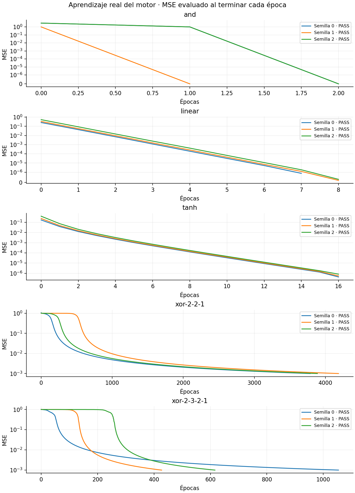
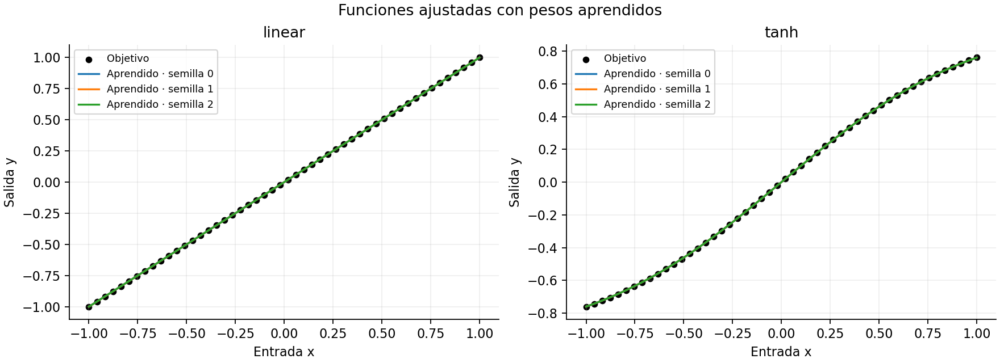
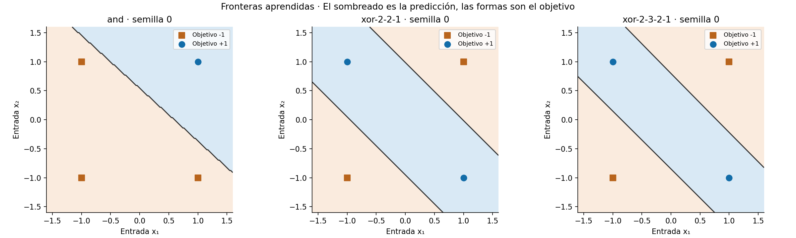

# Resultados de validación del motor

Corrida local del 21 de septiembre de 2026. Configuración final:
[`configs/validation.json`](../configs/validation.json). Semillas: 0, 1 y 2.

**15 de 15 corridas cumplieron los criterios de aceptación.**
Los pesos se aprendieron desde inicialización aleatoria; no se reutilizaron
las soluciones manuales de los gráficos explicativos.

| Caso | Semilla | Épocas | MSE final | Accuracy bipolar | Estado |
|---|---:|---:|---:|---:|---|
| and | 0 | 2 | 0 | 100% | PASS |
| and | 1 | 1 | 0 | 100% | PASS |
| and | 2 | 2 | 0 | 100% | PASS |
| linear | 0 | 7 | 8.9050087e-07 | — | PASS |
| linear | 1 | 8 | 1.9770855e-07 | — | PASS |
| linear | 2 | 8 | 3.0362431e-07 | — | PASS |
| tanh | 0 | 16 | 6.7108506e-07 | — | PASS |
| tanh | 1 | 16 | 7.6591945e-07 | — | PASS |
| tanh | 2 | 16 | 9.2042337e-07 | — | PASS |
| xor-2-2-1 | 0 | 3786 | 0.00099971743 | 100% | PASS |
| xor-2-2-1 | 1 | 4184 | 0.00099984111 | 100% | PASS |
| xor-2-2-1 | 2 | 3887 | 0.00099992952 | 100% | PASS |
| xor-2-3-2-1 | 0 | 1054 | 0.0009998657 | 100% | PASS |
| xor-2-3-2-1 | 1 | 427 | 0.00099835797 | 100% | PASS |
| xor-2-3-2-1 | 2 | 616 | 0.00099874601 | 100% | PASS |

## Curvas de aprendizaje

Se usa escala symlog para incluir el MSE cero de AND sin ocultarlo.
La época cero muestra el estado inicial. Cada punto usa los pesos fijos de
fin de época; las curvas terminan cuando se alcanza la tolerancia.

## Funciones y fronteras aprendidas

Las fronteras muestran la semilla 0, elegida de antemano como referencia.
El sombreado fuera de las cuatro muestras booleanas muestra la predicción
de la red, no una comprobación de generalización sobre nuevos datos etiquetados.

## La primera configuración no pasó todos los casos

Con tasa 0.1 en XOR `[2,2,1]`, la semilla 0 llegó a la tolerancia, pero las
semillas 1 y 2 quedaron cerca de MSE 1 y accuracy 50% al cumplir 10000 épocas.
La primera corrida quedó preservada: 13/15 aprobaciones.

Se compararon tasas 0.01, 0.03 y 0.05 manteniendo arquitectura, inicialización,
semillas, orden y criterios de corte:

| Tasa XOR [2,2,1] | Corridas que cumplieron MSE ≤ 0.001 y 100% accuracy |
|---|---:|
| 0.10, configuración inicial | 1/3 |
| 0.01 | 0/3; las tres clasificaron correctamente, pero no alcanzaron el MSE en 10000 épocas |
| 0.03, seleccionada | 3/3 |
| 0.05 | 2/3 |

Se eligió 0.03 por cumplir ambos criterios en las tres semillas, sin relajar
la tolerancia ni aumentar el límite. Esto no demuestra que sea óptima ni
garantiza convergencia para cualquier semilla. La causa específica del
estancamiento no se atribuye a un mínimo particular: se observó sensibilidad
a la tasa e inicialización. Los gradientes pasaron la comprobación numérica.

## Verificación independiente del aprendizaje

- 31 tests aprobados.
- Una actualización manual de escalón, lineal y tanh.
- Forward de XOR y una actualización manual de la red `[2,2,1]`.
- Diferencias finitas para todos los pesos y bias: lineal, tanh, logística,
  las dos arquitecturas de XOR y una red con múltiples salidas.
- Gradientes sin mutaciones; comparación con tolerancias absolutas 1e-8 y relativas 1e-5.
- Reproducibilidad con semillas, serialización, reanudación de parámetros,
  rechazo de dimensiones inválidas y logística con excitaciones extremas.
- Control negativo: el perceptrón escalón no resuelve XOR ni informa convergencia falsa.
- CLI: devuelve fallo cuando no converge y rechaza sobrescribir una corrida.

## Evidencia y reproducción

- [Resumen final en CSV](resultados-validacion/summary.csv).
- [Primera corrida, incluidos fallos](resultados-validacion/baseline-summary.csv).
- [Comparación de tasas de XOR](resultados-validacion/xor-learning-rate-study.csv).
- [Versiones del entorno](resultados-validacion/environment.json).

Las corridas completas están localmente en `tp3/output/validation-baseline/`
y `tp3/output/validation-verified/`; `output/` está excluido de Git por la
regla existente del repositorio. Cada corrida incluye modelos iniciales y
finales, datasets sintéticos, métricas por época y predicciones. Los CSV y
gráficos de este informe están fuera de `output/` para conservar la evidencia
junto al código. Ver comandos en el [README](../README.md).

No se entrenó aún sobre los datasets de fraude o dígitos. Esta validación
comprueba los componentes base; no demuestra rendimiento sobre esos problemas.

## Revalidación del punto 1 (28 de septiembre de 2026)

Se ejecutó nuevamente la configuración completa, sin modificar modelos,
tasas, semillas ni criterios de aceptación. Entorno: Python 3.14.3 y NumPy 2.4.2.

- **38 tests aprobados** (31 del motor/validación y 7 de los loaders).
- **15/15 corridas aprobadas**, con las mismas épocas y MSE de la tabla anterior
  (comparación numérica con tolerancias `rtol=1e-12`, `atol=1e-15`).
- AND alcanzó MSE cero; lineal y tanh, MSE menor que `1e-6`; ambas redes XOR,
  MSE menor que `0.001` y 100 % de accuracy bipolar para las tres semillas.
- Se recargaron los 15 modelos guardados: sus predicciones reprodujeron
  exactamente el MSE y la accuracy registrados en esta nueva corrida.

Los tests mantienen los controles de actualizaciones manuales, gradientes
por diferencias finitas y el caso negativo de XOR con perceptrón escalón.
Para repetir la comprobación, usar los comandos de instalación y ejecución
del [README](../README.md), eligiendo una carpeta de salida nueva.

El punto 1 queda verificado para estos casos y semillas. En ese momento, la
inspección del punto 2 confirmó que los loaders separaban training/test sin una
partición fija de validation, y con ese alcance se continuó al EDA del punto 3.
Posteriormente se decidió mantener intacto ese contrato y agregar en
`experiments.py` una validation temporal derivada de training para seleccionar
configuraciones sin consultar test. Esta revisión histórica no entrenó ni
evaluó modelos sobre el test final de fraude o dígitos.
