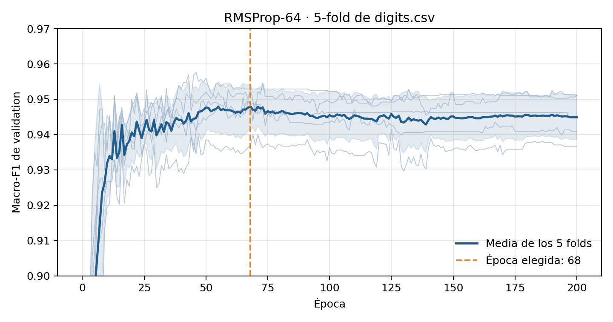
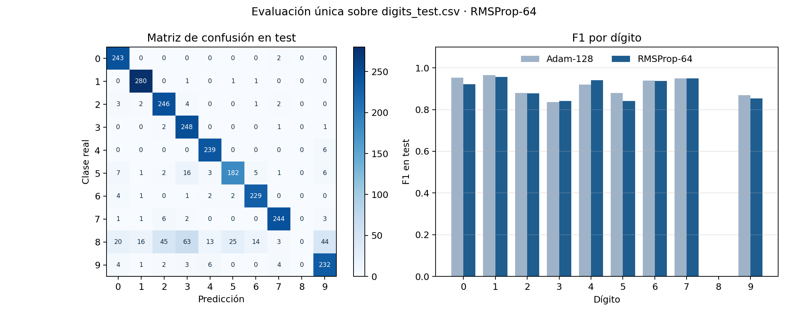
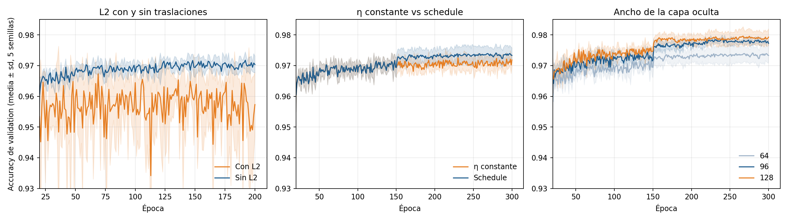
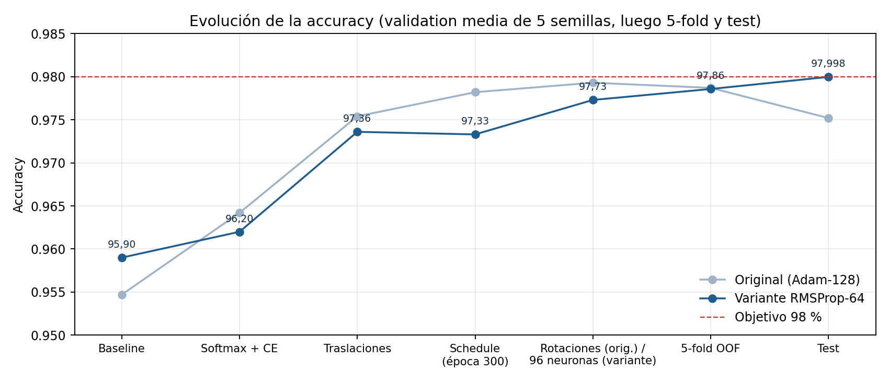

# Variante: RMSProp-64 como modelo del ejercicio 2

Esta carpeta repite la evaluación final del ejercicio 2 y todo el ejercicio 3
eligiendo **`[784,64,10]` + RMSProp** en lugar de `[784,128,10]` + Adam. Cada
etapa replica la del ejercicio 3 original (mismo split, semillas, grillas
análogas y criterios de decisión); sólo cambia el punto de partida. Los
documentos originales (`ejercicio2/`, `ejercicio3/`) no se modificaron.

## Advertencia metodológica

El test de `digits_test.csv` ya se había abierto con Adam-128 (86,54 %). Elegir
otro modelo después de conocer ese número reabre test. La elección de
RMSProp-64 sólo es defendible con argumentos previos a test, que ya figuraban
en el ejercicio 2:

- en 5-fold la diferencia de macro-F1 con Adam-128 (0,0032) tiene un IC95 que
  incluye cero (`[-0,0033; 0,0097]`);
- el F1 del 5 es equivalente (diferencia −0,0003);
- usa la mitad de parámetros (50.890 vs 101.770) y tarda menos.

El resultado de test de esta variante **no** debe usarse para decir que
RMSProp-64 "era mejor": en el ejercicio 2 rinde levemente peor que Adam-128.

## Ejercicio 2: evaluación final de RMSProp-64

### Cantidad de épocas

Para Adam-128 se usaron 200 épocas porque la media de los cinco folds no se
deterioraba al final. Se aplicó la misma lógica a RMSProp-64 volviendo a correr
sus cinco folds: el resultado reproduce exactamente el registro original
(mejores épocas 67, 125, 43, 46 y 65).

La media de macro-F1 entre folds alcanza su máximo en la **época 68** (0,9479,
media móvil de 11 épocas) y luego desciende levemente hasta 0,9449 en la 200.
La diferencia es menor que el desvío entre folds (~0,006), así que se prefiere
el horizonte más corto y barato: **68 épocas**.



### Resultado en test (evaluación única)

| Métrica | Adam-128 (original) | **RMSProp-64** |
|---|---:|---:|
| Accuracy | 86,54 % | **85,82 %** |
| Macro-F1 (10 dígitos) | 0,8193 | **0,8118** |
| F1 del 5 | 0,8796 | **0,8406** |
| F1 del 8 | 0 | **0** |
| MSE | 0,01998 | 0,02252 |
| Accuracy sin el 8 (diagnóstico) | 95,87 % | 95,08 % |
| Parámetros | 101.770 | **50.890** |
| Tiempo de entrenamiento final | 13,5 s | **3,5 s** |

El límite sigue siendo la ausencia del 8: sus 243 ejemplos se reparten sobre
todo entre 3 (63), 2 (45), 9 (44) y 5 (25). RMSProp-64 queda 0,72 pp por debajo
de Adam-128, consistente con la pequeña ventaja que Adam ya mostraba en 5-fold.



## Ejercicio 3 partiendo de RMSProp-64

Todas las decisiones usan development (unión deduplicada de 24.501 imágenes,
split 80/20 semilla 0, cinco semillas para candidatos). Test se abrió una sola
vez al final.

### Recorrido y decisiones

| Etapa | Candidato | Accuracy val. (media 5 semillas) | Macro-F1 | Decisión |
|---|---|---:|---:|---|
| 1. Baseline | Receta del ej. 2 con datos nuevos | 95,90 % | 0,9459 | Las 5 semillas aprenden el 8 (con Adam-128 fallaban 3 de 5) |
| 2. Softmax + CE | η = 0,01 | 96,20 % | 0,9492 | Se conserva; mejora accuracy en 5/5 semillas |
| 3. L2 | λ = 10⁻⁴ | 96,47 % | 0,9558 | Se conserva; macro-F1 mejora en 5/5 |
| 4. Traslaciones | 1 px, p = 0,5 (con L2) | 97,18 % | 0,9646 | Mejora 5/5 frente al control con L2 |
| 4b. Revalidar L2 | 1 px, p = 0,5 **sin L2** | **97,36 %** | 0,9667 | **Se retira L2**: con traslaciones empeora macro-F1 en 4/5 |
| 5. 300 épocas | η constante | 97,40 % (mejor) | 0,9676 | Más épocas solas casi no aportan |
| 6. Schedule | 0,01 → 0,003 → 0,001, época 300 | 97,33 % | 0,9653 | Se conserva; +0,15 pp y −61 % de fluctuación |
| 7. Rotaciones | ±4°, época 300 | 97,31 % | 0,9647 | **Se descarta**: no mejora (3/5 semillas) |
| 8. Ancho | **[784, 96, 10]**, época 300 | **97,73 %** | 0,9699 | **Se adopta**: +0,40 pp, mejora 5/5, IC95 excluye 0 |
| 8. Ancho | [784, 128, 10], época 300 | 97,93 % | 0,9730 | Empate con 96 (IC95 incluye 0): se prefiere el más barato |
| 9. Batch | 64 y 256 con 96 neuronas | — | — | Sin ventaja sobre 128; se mantiene 128 |

Diferencias entre la variante y el original:

- **L2** mejoraba sin augmentation, pero las dos regularizaciones se
  superponen: con traslaciones, L2 baja el macro-F1 y vuelve muy ruidosa la
  validation en época fija (una semilla cae a 94,08 %). Se retiró al
  incorporar las traslaciones, como en el original.
- **Rotaciones**: aportaban +0,11 pp a Adam-128; con RMSProp-64 no mejoran.
- **Ancho**: en el original ensanchar empeoraba; acá 64 neuronas quedaban
  cortas para el doble de datos con augmentation. 128 obtuvo la mayor media,
  pero no se separa de 96 con cinco semillas; se aplicó el mismo criterio de
  costo que motivó elegir RMSProp-64.
- Entre p = 0,5 y p = 0,75 en traslaciones hubo empate con y sin L2; se
  conservó p = 0,5.



Tablas: `ejercicio3/analysis/candidates.csv`, `paired-decisions.csv` (diferencias
pareadas con IC95), `single-seed-searches.csv` y `schedule-stability.csv`.

### Modelo congelado

```text
arquitectura       [784, 96, 10]
activaciones       tanh + softmax
loss               entropía cruzada, sin L2
optimizador        RMSProp (gamma 0,9, epsilon 1e-8)
learning rate      0,01 → 0,003 (época 151) → 0,001 (época 221)
batch              128
épocas             300
augmentation       traslación de 1 px con p = 0,5, sólo en training
semilla final      0
```

### Confirmación 5-fold

| | Original (Adam-128 + rotación) | **Variante** |
|---|---:|---:|
| Accuracy out-of-fold | 97,87 % | **97,86 %** |
| Desvío entre folds | ±0,20 pp | **±0,09 pp** |
| Macro-F1 out-of-fold | 0,9718 | 0,9718 |
| Folds con accuracy ≥ 98 % | 1 | 0 |

Igual que en el original, el 5-fold anticipaba que el 98 % no era un resultado
robusto.

### Resultado final en test (evaluación única)

| Métrica | Ej. 2 RMSProp-64 | Ej. 3 original | **Ej. 3 variante** |
|---|---:|---:|---:|
| Accuracy | 85,82 % | 97,52 % | **97,998 %** |
| Aciertos / 2.497 | 2.143 | 2.435 | **2.447** |
| Macro-F1 | 0,8118 | 0,9747 | **0,9797** |
| F1 del 5 | 0,8406 | 0,9545 | **0,9730** |
| F1 del 8 | 0 | 0,9578 | **0,9644** |
| Parámetros | 50.890 | 101.770 | **76.330** |

**El objetivo de 98 % no se alcanzó por un acierto**: hacen falta 2.448
aciertos (98 % de 2.497 = 2.447,06) y el modelo obtuvo 2.447. Redondeado a dos
decimales se lee "98,00 %", pero el valor es 97,998 %. Como en el original, no
se ajustó nada después de mirar test.



## Reproducción

Desde `tp3/`, con el entorno del TP:

```bash
# Ejercicio 2: folds de RMSProp-64 y evaluación final
for k in 0 1 2 3 4; do l=$(echo abcde | cut -c$((k+1)))
  python docs/ejercicio2/run_experiment.py \
    --config docs/rmsprop64/ejercicio2/01$l-cross-validation-fold-$k.json \
    --data data/digits.csv \
    --output docs/rmsprop64/ejercicio2/results/01$l-cross-validation-fold-$k
done
python docs/ejercicio2/run_final_evaluation.py \
  --config docs/rmsprop64/ejercicio2/02-final-rmsprop-64.json \
  --development data/digits.csv --test data/digits_test.csv \
  --output docs/rmsprop64/ejercicio2/results/02-final-rmsprop-64
python docs/rmsprop64/ejercicio2/analyze.py

# Ejercicio 3: cada etapa NN-*.json, en orden
python docs/rmsprop64/run_parallel.py --config docs/rmsprop64/ejercicio3/NN-etapa.json \
  --data data/digits.csv --additional-data data/more_digits.csv \
  --output docs/rmsprop64/ejercicio3/results/NN-etapa
```

La confirmación 5-fold (`16-kfold-confirmation.json`) usa el mismo formato que
`docs/ejercicio3/run_kfold_confirmation.py`, y la evaluación final
(`17-final-evaluation.json`) se ejecuta con `run_final_evaluation.py` agregando
`--additional-development data/more_digits.csv --deduplicate-inputs`. Los
análisis se regeneran con `docs/ejercicio3/analyze_kfold_confirmation.py`,
`docs/ejercicio3/analyze_final_evaluation.py` y
`PYTHONPATH=docs/rmsprop64/ejercicio3 python docs/rmsprop64/ejercicio3/analyze.py`.

`run_parallel.py` corre una corrida por proceso con las mismas semillas, por lo
que produce exactamente los mismos resultados que `run_experiment.py`. Las
carpetas de corridas (`*/results/`) no se versionan; sí las tablas y figuras de
`*/analysis/`.
