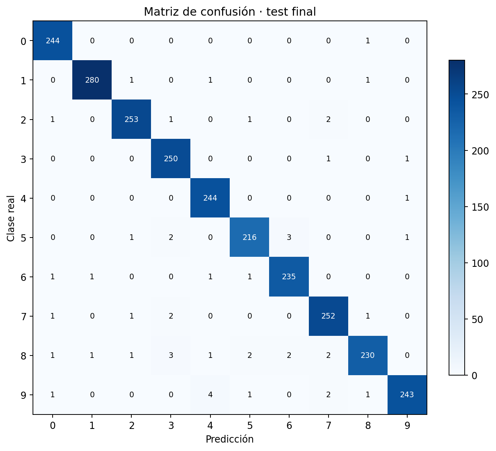

# Ejercicios 2 y 3 con RMSProp-64: resultados y decisiones para discutir

Este documento reúne los resultados de rehacer el final del ejercicio 2 y todo
el ejercicio 3 tomando **`[784,64,10]` + RMSProp** como modelo del ejercicio 2,
en lugar de `[784,128,10]` + Adam. Está pensado para discutir en grupo: las
decisiones que todavía no tomamos quedan **abiertas** en la última sección, con
la evidencia a favor y en contra de cada opción.

Los documentos originales (`ejercicio2/`, `ejercicio3/`) no se modificaron. El
detalle técnico y los comandos para reproducir están en [`README.md`](README.md).

## Resumen

| | Ej. 2 en test | Ej. 3 en test | Aciertos ej. 3 |
|---|---:|---:|---:|
| Original (Adam-128 → Adam-128 + rotación) | 86,54 % | 97,52 % | 2.435 / 2.497 |
| **Variante (RMSProp-64 → RMSProp-96)** | **85,82 %** | **97,998 %** | **2.447 / 2.497** |

- En el ejercicio 2, RMSProp-64 queda 0,72 pp por debajo de Adam-128. Ambos
  fallan por la misma causa: no hay ningún 8 en `digits.csv`.
- En el ejercicio 3, la variante queda **a un acierto del 98 %**: hacían falta
  2.448 (98 % de 2.497 = 2.447,06). Redondeado a dos decimales se lee
  "98,00 %", pero el valor es 97,998 % y **no alcanza el objetivo**.
- El 5-fold de ambos candidatos finales es prácticamente igual (97,86 % y
  97,87 %). La diferencia en test está dentro de lo que puede variar un único
  conjunto de 2.497 imágenes.

## Ejercicio 2

### Por qué RMSProp-64 era una alternativa

Ya en el ejercicio 2, antes de abrir test, el 5-fold mostraba:

| Candidato | Macro-F1 (media ± sd) | F1 del 5 | Parámetros | Tiempo por fold |
|---|---:|---:|---:|---:|
| Adam-128, η = 0,003 | 0,9544 ± 0,0080 | 0,8657 | 101.770 | 11,6 s |
| RMSProp-64, η = 0,01 | 0,9512 ± 0,0066 | 0,8660 | 50.890 | 7,3 s |

La diferencia de macro-F1 (0,0032 a favor de Adam) tiene un IC95 de
`[-0,0033; 0,0097]`, que incluye cero. El F1 del 5 es equivalente. En el
documento original se eligió Adam-128 por tener la mayor media; esta variante
aplica en cambio el criterio "ante un empate estadístico, el más barato".

### Cantidad de épocas del modelo final

Para Adam-128 se usaron 200 épocas porque la media de validation de los cinco
folds no se deterioraba al final. Con la misma lógica, se volvieron a correr los
cinco folds de RMSProp-64. Reprodujeron exactamente el registro original
(mejores épocas 67, 125, 43, 46 y 65).

La media de macro-F1 alcanza su máximo en la **época 68** (0,9479) y después
baja levemente hasta 0,9449 en la 200. Esa caída es menor que el desvío entre
folds (≈ 0,006), así que se eligió el horizonte más corto: **68 épocas**.


### Configuración congelada

```text
arquitectura       [784, 64, 10], tanh + logística, MSE
optimizador        RMSProp (gamma 0,9, epsilon 1e-8), η = 0,01
batch              128
épocas             68
semilla            0
datos              las 12.449 imágenes de digits.csv
```

### Resultado en test

| Métrica | Adam-128 | **RMSProp-64** |
|---|---:|---:|
| Accuracy | 86,54 % | **85,82 %** |
| Macro-F1 (10 dígitos) | 0,8193 | 0,8118 |
| F1 del 5 | 0,8796 | 0,8406 |
| F1 del 8 | 0 | 0 |
| MSE | 0,01998 | 0,02252 |
| Accuracy sin el 8 (sólo diagnóstico) | 95,87 % | 95,08 % |

Los 243 ochos del test se reparten sobre todo entre 3 (63), 2 (45), 9 (44) y
5 (25). Ni más neuronas ni otro optimizador pueden aprender una clase que no
aparece en development.


## Ejercicio 3

Se repitieron las etapas del ejercicio 3 original, con el mismo development
(24.501 imágenes únicas, split 80/20 con semilla 0), cinco semillas para cada
candidato y el mismo criterio: **un cambio por etapa, y se conserva sólo si
mejora de forma consistente**. Test se abrió una única vez, al final.

### Recorrido

Accuracy y macro-F1 de validation, media de cinco semillas. Hasta la etapa 5 se
usa el mejor checkpoint; desde el schedule, la época 300 fija (igual que en el
original).

| Etapa | Candidato | Accuracy | Macro-F1 | Resultado |
|---|---|---:|---:|---|
| 1. Baseline | Receta del ej. 2 con datos nuevos | 95,90 % | 0,9459 | Las 5 semillas aprenden el 8 |
| 2. Softmax + entropía cruzada | η = 0,01 | 96,20 % | 0,9492 | Se conserva: mejora la accuracy en 5/5 semillas |
| 3. L2 | λ = 10⁻⁴ | 96,47 % | 0,9558 | Se conserva: macro-F1 mejora en 5/5 |
| 4. Traslaciones (con L2) | 1 px, p = 0,5 | 97,18 % | 0,9646 | Mejora 5/5 frente al control |
| 4b. Revalidar L2 | 1 px, p = 0,5, **sin L2** | 97,36 % | 0,9667 | **Se retira L2** |
| 5. Más épocas | 300 épocas, η constante | 97,40 % | 0,9676 | Casi no aporta (+0,04 pp) |
| 6. Schedule | 0,01 → 0,003 → 0,001 | 97,33 % | 0,9653 | Se conserva |
| 7. Rotaciones | ±4°, p = 0,5 | 97,31 % | 0,9647 | **Se descarta** |
| 8. Ancho | **[784, 96, 10]** | **97,73 %** | 0,9699 | Mejora 5/5 frente a 64 |
| 8. Ancho | [784, 128, 10] | 97,93 % | 0,9730 | Empate con 96 → **decisión abierta** |
| 9. Batch | 64 y 256 (con 96 neuronas) | — | — | Sin ventaja sobre 128 |


### Comparaciones pareadas que sostienen cada decisión

Diferencia media entre las cinco semillas (mismo split, mismas semillas). IC95
con t de Student para cinco observaciones.

| Comparación | Δ accuracy | IC95 | Semillas que mejoran | Δ macro-F1 | IC95 | Decisión |
|---|---:|---|---:|---:|---|---|
| Softmax vs baseline | +0,30 pp | [−0,12; +0,72] | 5/5 | +0,0033 | [−0,0009; +0,0074] | Se conserva |
| L2 vs sin L2 | +0,27 pp | [−0,06; +0,60] | 4/5 | +0,0066 | [+0,0036; +0,0096] | Se conserva |
| Traslación vs control (con L2) | +0,71 pp | [+0,57; +0,85] | 5/5 | +0,0089 | [+0,0055; +0,0122] | Se conserva |
| Con L2 vs sin L2 (ambos con traslación) | −0,18 pp | [−0,50; +0,14] | 1/5 | −0,0021 | [−0,0044; +0,0002] | Se retira L2 |
| Schedule vs η constante | +0,15 pp | [−0,14; +0,44] | 4/5 | +0,0015 | [−0,0019; +0,0050] | Se conserva |
| Rotación ±4° vs sin rotación | −0,02 pp | [−0,46; +0,42] | 3/5 | −0,0006 | [−0,0068; +0,0056] | Se descarta |
| 96 vs 64 neuronas | +0,40 pp | [+0,18; +0,61] | 5/5 | +0,0046 | [+0,0021; +0,0071] | Se adopta 96 |
| 128 vs 96 neuronas | +0,20 pp | [−0,25; +0,65] | 3/5 | +0,0031 | [−0,0030; +0,0091] | **Abierta** |

Además, el schedule redujo la fluctuación de las últimas 50 épocas: 61 % en
accuracy, 59 % en macro-F1 y 74 % en entropía cruzada.

### En qué se diferencia del recorrido original

- **Baseline:** con Adam-128, tres de cinco semillas nunca aprendían el 8. Con
  RMSProp-64 las cinco lo aprenden desde el principio. Softmax sigue mejorando,
  pero ya no "rescata" una clase perdida.
- **L2:** en el original se descartó enseguida. Acá mejoraba mientras no había
  augmentation, pero las dos técnicas regularizan y se superponen: con
  traslaciones, L2 empeora el macro-F1 y vuelve muy inestable la validation en
  época fija (una semilla cae a 94,08 %). Terminamos en el mismo lugar que el
  original, sin L2, pero por otro camino.
- **Rotaciones:** al original le aportaban +0,11 pp; acá no mejoran.
- **Ancho:** en el original, ensanchar empeoraba. Acá 64 neuronas quedan cortas
  para el doble de datos con augmentation, y ensanchar mejora de forma clara.


### Configuración congelada

```text
arquitectura       [784, 96, 10], tanh + softmax
loss               entropía cruzada, sin L2
optimizador        RMSProp (gamma 0,9, epsilon 1e-8)
learning rate      0,01 → 0,003 (desde la época 151) → 0,001 (desde la 221)
batch              128
épocas             300
augmentation       traslación de 1 px con p = 0,5, sólo en training
semilla            0
datos              las 24.501 imágenes únicas de development
```

### Confirmación 5-fold (antes de abrir test)

| | Original | **Variante** |
|---|---:|---:|
| Accuracy out-of-fold | 97,87 % | **97,86 %** |
| Desvío entre folds | ±0,20 pp | **±0,09 pp** |
| Macro-F1 out-of-fold | 0,9718 | 0,9718 |
| Folds con accuracy ≥ 98 % | 1 de 5 | 0 de 5 |

Igual que en el original, el 5-fold anticipaba que el 98 % no estaba
garantizado.

### Resultado en test

| Métrica | Ej. 3 original | **Ej. 3 variante** |
|---|---:|---:|
| Accuracy | 97,52 % | **97,998 %** |
| Aciertos / errores | 2.435 / 62 | **2.447 / 50** |
| Macro-F1 | 0,9747 | **0,9797** |
| F1 del 5 | 0,9545 | **0,9730** |
| F1 del 8 | 0,9578 | **0,9644** |
| Parámetros | 101.770 | **76.330** |
| Test − 5-fold | −0,35 pp | +0,14 pp |

Frente al ejercicio 2 de esta misma variante, la accuracy sube de 85,82 % a
97,998 % (+12,18 pp) y el F1 del 8 pasa de 0 a 0,9644.

El modelo de la variante rinde en test **por encima** de su estimación de
5-fold, y el original **por debajo**. Las dos estimaciones de 5-fold eran
iguales: la diferencia en test no prueba que un modelo sea mejor que el otro.



## Decisiones abiertas para discutir en grupo

### 1. ¿Adoptamos RMSProp-64 como modelo del ejercicio 2?

**El problema:** el test del ejercicio 2 ya se abrió con Adam-128. Cambiar de
modelo después significa que el test participó, al menos indirectamente, de la
decisión. Es justo lo que la presentación dice que no hicimos.

| Opción | A favor | En contra |
|---|---|---|
| **A.** Mantener Adam-128 y usar todo esto como análisis complementario | Coherente con "test se abre una sola vez". El recorrido original queda intacto | El ej. 3 original no llega al 98 % y queda a 13 aciertos |
| **B.** Adoptar RMSProp-64 y declarar que el cambio fue posterior a test | Los argumentos (empate estadístico, mitad de parámetros) existían antes de test | Hay que explicar en el informe y en la exposición que test ya se había abierto con otro modelo |
| **C.** Presentar los dos recorridos lado a lado | Muestra que la conclusión (cobertura de datos > optimizador) no depende de la elección | Más material para explicar en el mismo tiempo |

Dato a tener en cuenta: en el ejercicio 2, RMSProp-64 rinde **peor** en test
que Adam-128. El argumento para cambiar no puede ser el desempeño, sólo el costo.

### 2. ¿96 o 128 neuronas en el ejercicio 3?

| | 96 neuronas | 128 neuronas |
|---|---:|---:|
| Accuracy (media 5 semillas, época 300) | 97,73 % ± 0,12 | 97,93 % ± 0,27 |
| Macro-F1 | 0,9699 | 0,9730 |
| Mejora frente a 64 | 5/5 semillas, IC95 excluye 0 | 4/5 semillas |
| Mejora frente a la otra | — | +0,20 pp, IC95 [−0,25; +0,65], 3/5 semillas |
| Parámetros | 76.330 | 101.770 |

- **Para 96:** es el criterio de costo que justifica elegir RMSProp-64 en el
  ej. 2. 128 no se separa de 96 con cinco semillas, y 96 es más estable.
- **Para 128:** es el criterio de "mayor media" que usó el ej. 2 original para
  elegir Adam-128. Por coherencia con ese documento, correspondería 128.

**Consecuencia práctica:** el test ya se evaluó con 96. Si elegimos 128, hay
que correr su 5-fold y su evaluación final, y eso abriría test una segunda vez
en el ejercicio 3. Si se decide 128, conviene hacerlo antes de mirar cualquier
otro número y declararlo así en el informe.

Esta decisión está atada a la anterior: el criterio que elijamos (costo o mayor
media) debería ser el mismo en los dos ejercicios.

### 3. ¿Cómo informamos el 97,998 %?

| Opción | Comentario |
|---|---|
| "97,998 %, a un acierto del 98 %; el objetivo no se alcanzó" | Exacto y honesto. Recomendado |
| "98,00 %" | Redondeado es correcto como número, pero sugiere que se cumplió el objetivo, y no se cumplió |
| "Entre 97,86 % (5-fold) y 98 % (test)" | Pone el foco en la estimación robusta y no en un único test |

También hay que decidir si se menciona que el 5-fold (97,86 %) es la mejor
estimación del rendimiento esperado y que el test quedó 0,14 pp por encima por
variación de muestra.

### 4. ¿Qué actualizamos si adoptamos la variante?

- `ejercicio2/ejercicio2.md` y `ejercicio2-extenso.md`: etapa 15 (modelo
  congelado) y conclusiones.
- `ejercicio3/ejercicio3.md` y `ejercicio3-resumen.md`: todo el recorrido
  desde el baseline.
- `decisiones.md`: registrar el cambio, el motivo y que fue posterior a test.
- Diapositivas 38 a 41 (ejercicio 2) y 43 a 55 (ejercicio 3). En particular, la
  45 (secuencia de etapas), la 49 (rotaciones, que acá se descartan) y la 51
  (modelo congelado).

## Decisiones tomadas con desempate (se pueden revisar)

Estas no cambian el resultado de forma apreciable, pero conviene que el grupo
las conozca.

| Decisión | Evidencia | Por qué se eligió así |
|---|---|---|
| 68 épocas para el final del ej. 2 | Máximo de la media de folds; caída posterior de 0,003, menor que el desvío | Más barato ante un empate |
| Horizonte de búsqueda del baseline del ej. 3: 200 épocas, no 68 | El original usó 200 en todas las búsquedas | Que todas las etapas sean comparables |
| η = 0,01 en lugar de 0,03 para softmax | 96,20 % vs 96,02 %, mejor macro-F1 medio y mejor peor caso | Mejor en todas las medias principales |
| Traslación con p = 0,5 en lugar de 0,75 | Sin L2: Δ macro-F1 = +0,0015 a favor de 0,75, IC95 [−0,0022; +0,0052] | Empate; se elige la variante que perturba menos (igual que el original) |
| Batch 128 en lugar de 64 | Con 96 neuronas y semilla 0: 97,80 % vs 97,82 % | Empate; 128 hace la mitad de actualizaciones |

## Archivos

- Configuraciones: `ejercicio2/*.json` y `ejercicio3/NN-*.json`, numeradas en
  el orden en que se corrieron.
- Tablas: `ejercicio2/analysis/` y `ejercicio3/analysis/` (`candidates.csv`,
  `paired-decisions.csv`, `single-seed-searches.csv`, `schedule-stability.csv`,
  `16-kfold/`, `17-final/`).
- Las corridas crudas (`*/results/`) no se versionan; se regeneran con los
  comandos del [`README.md`](README.md).
